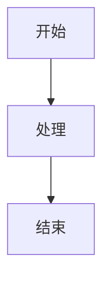

# AI 学习与面试大全 🤖

> 专注 AI 领域的知识库和面试准备，助你系统性掌握 AI 技术，轻松应对技术面试

[](https://opensource.org/licenses/MIT)
[](https://nextjs.org)
[](https://vercel.com)

---

## 🎯 项目定位

**从零开始，打造最优质的 AI 技术学习与面试准备平台**

- 📚 **系统化知识库** - 结构化组织 AI 核心技术知识点
- 💼 **面试题库** - 精选高频面试题，助你轻松应对技术面试
- 🗺️ **学习路径** - 从入门到精通，循序渐进的学习路线
- ⚡ **持续更新** - ISR 增量更新，内容持续优化

---

## 📖 技术领域

### 9 大技术分类

| 分类 | 图标 | 描述 |
|------|------|------|
| **ML** | 📊 | 机器学习基础 - 监督学习、无监督学习、模型评估 |
| **DL** | 🧠 | 深度学习 - 神经网络、CNN、RNN、Transformer |
| **NLP** | 📝 | 自然语言处理 - 词向量、语言模型、文本生成 |
| **CV** | 👁️ | 计算机视觉 - 图像分类、目标检测、分割 |
| **LLM** | 🤖 | 大语言模型 - Prompt、RAG、Fine-tuning、Agent |
| **RecSys** | 🎯 | 推荐系统 - 召回排序、协同过滤、深度学习 |
| **RL** | 🎮 | 强化学习 - MDP、Q-Learning、Policy Gradient |
| **System** | ⚙️ | AI 工程化 - 模型部署、MLOps、系统设计 |
| **AI-Engineering** | 🛠️ | AI 工程与实践 - Agent 开发、方法论、工具链 |

---

## 🚀 快速开始

### 开发环境

```bash
# 克隆项目
git clone https://github.com/xueshuai1/ai-interview-questions.git
cd ai-interview-questions

# 安装依赖
npm install

# 启动开发服务器
npm run dev

# 访问 http://localhost:3000
```

### 构建

```bash
# 生产构建
npm run build

# 本地预览
npm start
```

---

## 📁 项目结构

```
ai-interview-questions/
├── content/
│   ├── knowledge/          # 知识库文章 (MDX 格式)
│   │   ├── ML/            # 机器学习
│   │   ├── DL/            # 深度学习
│   │   ├── NLP/           # 自然语言处理
│   │   ├── CV/            # 计算机视觉
│   │   ├── LLM/           # 大语言模型 ⭐
│   │   ├── RecSys/        # 推荐系统
│   │   ├── RL/            # 强化学习
│   │   ├── System/        # AI 工程化
│   │   └── AI-Engineering/# AI 工程与实践
│   └── questions/          # 面试题库 (MDX 格式)
│       └── [category]/     # 按分类组织
├── templates/              # 文章模板 ⭐
│   ├── knowledge-template.mdx
│   └── question-template.mdx
├── docs/                   # 文档规范 ⭐
│   ├── 写作规范.md
│   └── MDX 规范.md
├── src/
│   ├── app/               # Next.js App Router
│   │   ├── page.tsx       # 首页
│   │   ├── knowledge/     # 知识库页面
│   │   ├── interview/     # 面试题库
│   │   └── layout.tsx     # 根布局
│   └── components/        # React 组件
│       └── mdx/           # MDX 组件
├── public/                # 静态资源
└── package.json
```

---

## 📝 内容创作

### 文档类型

本项目包含两种文档类型：

| 类型 | 目的 | 模板 | 示例 |
|------|------|------|------|
| **知识库文章** | 系统性学习知识点 | `templates/knowledge-template.mdx` | `content/knowledge/LLM/001_Transformer 架构详解.mdx` |
| **面试题解析** | 解决具体面试问题 | `templates/question-template.mdx` | `content/questions/LLM/xxx.mdx` |

### 写作规范

**详细规范请查看：** [`docs/写作规范.md`](docs/写作规范.md)

**核心要点：**
- ✅ 所有文章使用 **MDX 格式** (`.mdx` 扩展名)
- ✅ 遵循 **维基百科式结构**（知识库）或 **问题驱动式结构**（面试题）
- ✅ 使用 **MDX 组件** 增强可读性（Callout/Collapsible/Quiz/Step/Comparison/Mermaid）
- ✅ 通过 **15 项质量检查清单** 才能发布

### 快速开始写作

```bash
# 1. 复制模板
cp templates/knowledge-template.mdx content/knowledge/LLM/006_新文章标题.mdx

# 2. 编辑内容
code content/knowledge/LLM/006_新文章标题.mdx

# 3. 本地测试
npm run dev

# 4. 提交发布
git add .
git commit -m "feat: 添加 006_新文章标题"
git push
```

### 示例文章

**知识库文章示例：**
- [`001_Transformer 架构详解.mdx`](content/knowledge/LLM/001_Transformer 架构详解.mdx) - 维基百科式结构
- [`002_LLM 位置编码详解.mdx`](content/knowledge/LLM/002_LLM 位置编码详解.mdx) - 技术原理详解
- [`005_LLM 应用开发实战.mdx`](content/knowledge/LLM/005_LLM 应用开发实战.mdx) - MDX 组件使用示例

**写作时参考：**
1. 对照 `templates/knowledge-template.mdx` 结构
2. 参考已有示例文章的写作风格
3. 使用 `docs/写作规范.md` 检查清单

---

## 🎨 MDX 组件

本项目提供丰富的 MDX 组件，增强文章可读性：

### Callout（信息框）

```mdx
<Callout type="info" title="💡 核心概念">
这是重要概念说明
</Callout>
```

**类型：** `info` | `warning` | `success` | `error` | `tip` | `note`

### Collapsible（折叠框）

```mdx
<Collapsible title="📦 点击查看：代码示例">

```python
def hello():
    print("Hello")
```

</Collapsible>
```

### Quiz（测验题）

```mdx
<Quiz question="以下哪项是正确的？">
<Answer correct="True">正确答案</Answer>
<Answer correct="False">错误答案</Answer>
</Quiz>
```

### Step（步骤说明）

```mdx
<Step number="1" title="第一步">
步骤内容...
</Step>
```

### Comparison（对比表格）

```mdx
<Comparison
  items={[
    { title: "方案 A", items: ["特点 1"], pros: ["优势"], cons: ["劣势"] },
    { title: "方案 B", items: ["特点 1"], pros: ["优势"], cons: ["劣势"] }
  ]}
/>
```

### Mermaid（图表）

```mdx

```

**更多组件用法：** [`docs/写作规范.md`](docs/写作规范.md)

---

## 📊 质量检查

发布前必须通过以下检查：

### 内容检查
- [ ] Frontmatter 完整
- [ ] 摘要清晰（200 字以内）
- [ ] 目录结构完整
- [ ] 至少使用 2 个 Callout
- [ ] 至少 1 个图表（Mermaid/Comparison）
- [ ] 代码示例完整可运行
- [ ] 参考资料完整

### MDX 检查
- [ ] 组件语法正确（属性用引号）
- [ ] 没有 JSX 花括号（`number={1}` → `number="1"`）
- [ ] 代码块没有 title 属性
- [ ] Callout 内没有三重引号

### 技术检查
- [ ] 代码可运行
- [ ] 公式正确
- [ ] 链接有效
- [ ] 本地构建成功 (`npm run build`)

**评分标准：** 80 分以上才能发布

---

## 🛠️ 技术栈

| 技术 | 版本 | 用途 |
|------|------|------|
| **Next.js** | 16 | React 框架 |
| **MDX** | Latest | Markdown + JSX |
| **Tailwind CSS** | 4 | 样式 |
| **TypeScript** | 5 | 类型安全 |
| **Vercel** | - | 部署 |

---

## 📄 许可证

MIT License - 详见 [LICENSE](LICENSE) 文件

---

## 📬 贡献指南

欢迎贡献内容！请遵循以下步骤：

1. Fork 本仓库
2. 创建新分支 (`git checkout -b feature/new-article`)
3. 按照写作规范创作内容
4. 通过质量检查清单
5. 提交更改 (`git commit -m "feat: 添加 XXX 文章"`)
6. 推送到分支 (`git push origin feature/new-article`)
7. 创建 Pull Request

**贡献前必读：** [`docs/写作规范.md`](docs/写作规范.md)

---

## 🙏 致谢

感谢所有为本项目贡献内容的作者！

---

**最后更新：** 2026-03-31  
**维护者：** AI 学习与面试大全团队
