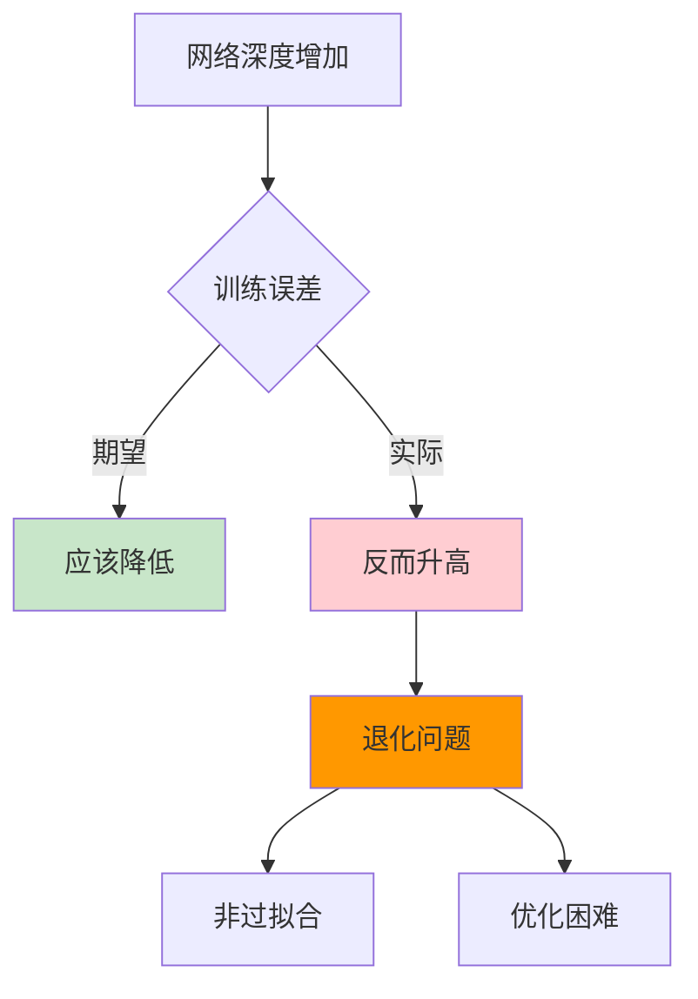
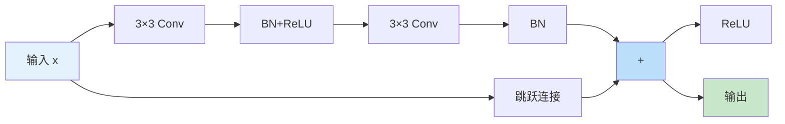
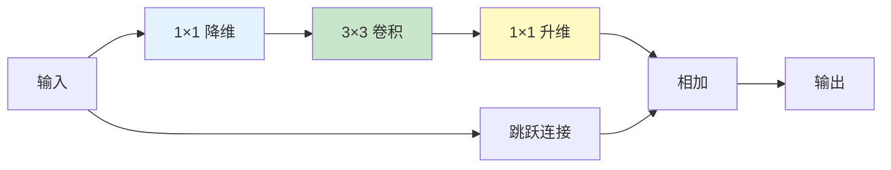
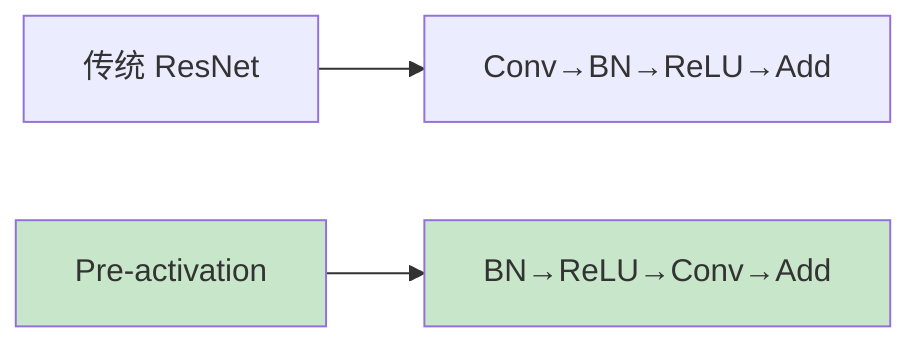
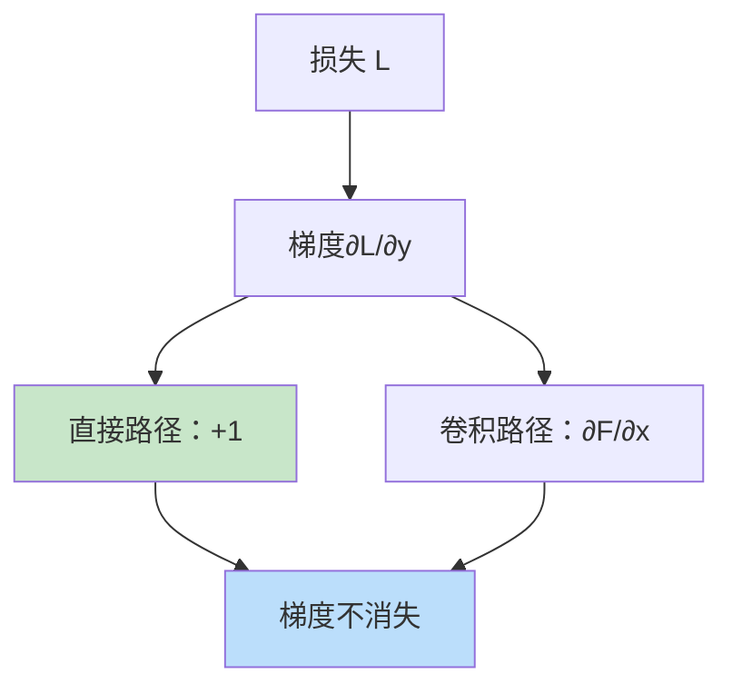

# ResNet（残差网络）
> **分类**: 经典架构（计算机视觉） | **编号**: CV-15 | **更新时间**: 2026-04-01 | **难度**: ⭐⭐⭐

`CNN` `经典网络` `ResNet` `VGG` `计算机视觉` `残差网络`

**摘要**: ResNet（Residual Network）是由何恺明等人于 2015 年提出的深度残差学习网络，在 ILSVRC 2015 中以 3.57% 的 Top-5 错误率获得冠军。

---
## 概述

ResNet（Residual Network）是由何恺明等人于 2015 年提出的深度残差学习网络，在 ILSVRC 2015 中以 3.57% 的 Top-5 错误率获得冠军。ResNet 通过引入残差连接（跳跃连接），成功解决了深度网络的退化问题，使训练数百甚至上千层的网络成为可能，成为深度学习发展史上的里程碑。

## 核心问题：网络退化

### 退化现象



**关键发现：** 深层网络的训练误差反而比浅层网络高，这不是过拟合，而是优化困难导致的退化。

### 解决方案：残差学习

**传统层：** 学习完整映射 $H(x)$

**残差层：** 学习残差 $F(x) = H(x) - x$

输出：$H(x) = F(x) + x$

**优势：** 如果最优解是恒等映射，将 $F(x)$ 推向 0 比学习 $H(x) = x$ 更容易。

## ResNet 架构

### 残差块类型

#### BasicBlock（用于 ResNet-18/34）



```python
import torch
import torch.nn as nn
import torch.nn.functional as F

class BasicBlock(nn.Module):
    expansion = 1
    
    def __init__(self, in_channels, out_channels, stride=1, downsample=None):
        super().__init__()
        self.conv1 = nn.Conv2d(in_channels, out_channels, 3, stride, 1, bias=False)
        self.bn1 = nn.BatchNorm2d(out_channels)
        self.conv2 = nn.Conv2d(out_channels, out_channels, 3, 1, 1, bias=False)
        self.bn2 = nn.BatchNorm2d(out_channels)
        self.downsample = downsample
        self.stride = stride
    
    def forward(self, x):
        identity = x
        
        out = self.conv1(x)
        out = self.bn1(out)
        out = F.relu(out)
        
        out = self.conv2(out)
        out = self.bn2(out)
        
        if self.downsample is not None:
            identity = self.downsample(x)
        
        out += identity
        out = F.relu(out)
        
        return out
```

#### Bottleneck（用于 ResNet-50/101/152）



```python
class Bottleneck(nn.Module):
    expansion = 4
    
    def __init__(self, in_channels, out_channels, stride=1, downsample=None):
        super().__init__()
        # 1x1 降维
        self.conv1 = nn.Conv2d(in_channels, out_channels, 1, bias=False)
        self.bn1 = nn.BatchNorm2d(out_channels)
        
        # 3x3 卷积
        self.conv2 = nn.Conv2d(out_channels, out_channels, 3, stride, 1, bias=False)
        self.bn2 = nn.BatchNorm2d(out_channels)
        
        # 1x1 升维 (4 倍)
        self.conv3 = nn.Conv2d(out_channels, out_channels * self.expansion, 1, bias=False)
        self.bn3 = nn.BatchNorm2d(out_channels * self.expansion)
        
        self.downsample = downsample
        self.stride = stride
    
    def forward(self, x):
        identity = x
        
        out = self.conv1(x)
        out = self.bn1(out)
        out = F.relu(out)
        
        out = self.conv2(out)
        out = self.bn2(out)
        out = F.relu(out)
        
        out = self.conv3(out)
        out = self.bn3(out)
        
        if self.downsample is not None:
            identity = self.downsample(x)
        
        out += identity
        out = F.relu(out)
        
        return out
```

### ResNet 变体

| 模型 | 层数 | 块类型 | 结构 | 参数量 |
|-----|------|--------|------|--------|
| ResNet-18 | 18 | Basic | [2,2,2,2] | 11.7M |
| ResNet-34 | 34 | Basic | [3,4,6,3] | 21.8M |
| ResNet-50 | 50 | Bottleneck | [3,4,6,3] | 25.6M |
| ResNet-101 | 101 | Bottleneck | [3,4,23,3] | 44.5M |
| ResNet-152 | 152 | Bottleneck | [3,8,36,3] | 60.2M |

### 完整实现

```python
class ResNet(nn.Module):
    def __init__(self, block, layers, num_classes=1000):
        super().__init__()
        self.in_channels = 64
        
        # 初始卷积
        self.conv1 = nn.Conv2d(3, 64, 7, 2, 3, bias=False)
        self.bn1 = nn.BatchNorm2d(64)
        self.relu = nn.ReLU(inplace=True)
        self.maxpool = nn.MaxPool2d(3, 2, 1)
        
        # 4 个残差层
        self.layer1 = self._make_layer(block, 64, layers[0])
        self.layer2 = self._make_layer(block, 128, layers[1], stride=2)
        self.layer3 = self._make_layer(block, 256, layers[2], stride=2)
        self.layer4 = self._make_layer(block, 512, layers[3], stride=2)
        
        # 分类头
        self.avgpool = nn.AdaptiveAvgPool2d(1)
        self.fc = nn.Linear(512 * block.expansion, num_classes)
    
    def _make_layer(self, block, out_channels, blocks, stride=1):
        downsample = None
        if stride != 1 or self.in_channels != out_channels * block.expansion:
            downsample = nn.Sequential(
                nn.Conv2d(self.in_channels, out_channels * block.expansion, 1, stride, bias=False),
                nn.BatchNorm2d(out_channels * block.expansion)
            )
        
        layers = []
        layers.append(block(self.in_channels, out_channels, stride, downsample))
        self.in_channels = out_channels * block.expansion
        
        for _ in range(1, blocks):
            layers.append(block(self.in_channels, out_channels))
        
        return nn.Sequential(*layers)
    
    def forward(self, x):
        x = self.conv1(x)
        x = self.bn1(x)
        x = self.relu(x)
        x = self.maxpool(x)
        
        x = self.layer1(x)
        x = self.layer2(x)
        x = self.layer3(x)
        x = self.layer4(x)
        
        x = self.avgpool(x)
        x = torch.flatten(x, 1)
        x = self.fc(x)
        
        return x

# 创建不同深度的 ResNet
def resnet18(): return ResNet(BasicBlock, [2, 2, 2, 2])
def resnet34(): return ResNet(BasicBlock, [3, 4, 6, 3])
def resnet50(): return ResNet(Bottleneck, [3, 4, 6, 3])
def resnet101(): return ResNet(Bottleneck, [3, 4, 23, 3])
def resnet152(): return ResNet(Bottleneck, [3, 8, 36, 3])

# 测试
model = resnet50()
x = torch.randn(1, 3, 224, 224)
output = model(x)
print(f"ResNet-50: {x.shape} -> {output.shape}")
print(f"参数量：{sum(p.numel() for p in model.parameters()):,}")
```

## 关键设计

### 1. 恒等映射

当输入输出维度相同时，直接使用恒等映射（无需参数）。

### 2. 投影匹配

当维度不同时，使用 1×1 卷积进行线性投影：
```python
if stride != 1 or in_channels != out_channels:
    self.downsample = nn.Sequential(
        nn.Conv2d(in_channels, out_channels, 1, stride, bias=False),
        nn.BatchNorm2d(out_channels)
    )
```

### 3. 预激活（Pre-activation）



Pre-activation 版本梯度流动更好，适合超深网络。

## 为什么 ResNet 有效

### 1. 梯度高速公路



$$\frac{\partial y}{\partial x} = \frac{\partial F(x)}{\partial x} + 1$$

即使 $\frac{\partial F}{\partial x}$ 很小，梯度也不会完全消失。

### 2. 隐式集成

多条路径相当于集成多个子网络。

### 3. 易于优化

从浅层网络开始，逐步学习残差。

## ResNet 变体

### ResNeXt

引入分组卷积：
```python
class ResNeXtBlock(nn.Module):
    def __init__(self, in_channels, out_channels, cardinality=32):
        # cardinality: 分组数
        self.conv = nn.Conv2d(
            in_channels, out_channels, 3, 
            groups=cardinality  # 分组卷积
        )
```

### SE-ResNet

添加注意力机制：
```python
class SEBlock(nn.Module):
    def __init__(self, channels, reduction=16):
        self.avg_pool = nn.AdaptiveAvgPool2d(1)
        self.fc = nn.Sequential(
            nn.Linear(channels, channels // reduction),
            nn.ReLU(),
            nn.Linear(channels // reduction, channels),
            nn.Sigmoid()
        )
    
    def forward(self, x):
        b, c, _, _ = x.size()
        y = self.fc(self.avg_pool(x).view(b, c)).view(b, c, 1, 1)
        return x * y
```

### ResNet-D/E

改进下采样和卷积设计。

## 应用与影响

### 1. Backbone 网络

ResNet 成为目标检测、分割等任务的标准 backbone。

### 2. 迁移学习

预训练 ResNet 广泛用于各种视觉任务。

### 3. 架构启发

启发了 DenseNet、ResNeXt 等后续架构。

## 总结

ResNet 通过残差连接解决了深度网络的退化问题，使训练超深网络成为可能。其简洁有效的设计使其成为计算机视觉领域最基础和重要的架构之一。
