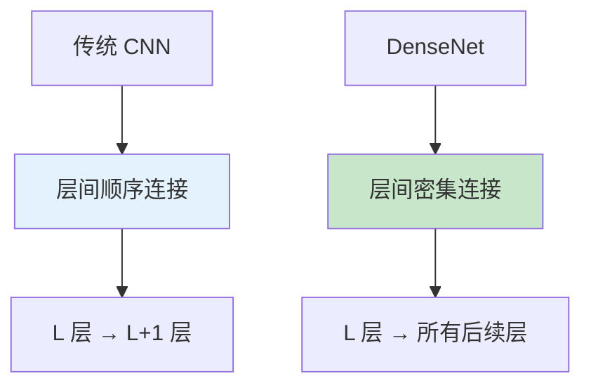
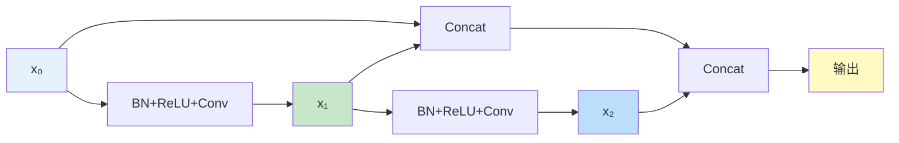
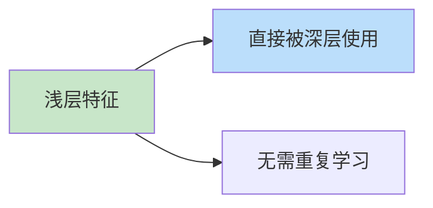

# DenseNet（密集连接网络）
> **分类**: 经典架构（计算机视觉） | **编号**: CV-16 | **更新时间**: 2026-04-01 | **难度**: ⭐⭐⭐

`CNN` `经典网络` `ResNet` `VGG` `计算机视觉`

**摘要**: DenseNet（Densely Connected Convolutional Networks）是由 Gao Huang 等人于 2017 年提出的卷积神经网络架构。

---
## 概述

DenseNet（Densely Connected Convolutional Networks）是由 Gao Huang 等人于 2017 年提出的卷积神经网络架构。DenseNet 通过将每一层与所有后续层直接连接，实现了特征的最大化复用，在减少参数量的同时提升了性能，成为 CNN 架构设计的又一重要创新。

## 核心思想：密集连接

### 与传统网络对比



### 连接方式

**传统网络（L 层）：**
- 连接数：L
- 信息流：单一路径

**DenseNet（L 层）：**
- 连接数：L(L+1)/2
- 信息流：密集路径

### 数学表达

传统网络：
$$x_l = H_l(x_{l-1})$$

DenseNet：
$$x_l = H_l([x_0, x_1, ..., x_{l-1}])$$

其中 $[x_0, x_1, ..., x_{l-1}]$ 表示通道维度上的拼接。

## DenseNet 架构

### Dense Block



每个层接收所有前驱层的特征图作为输入。

### Transition Layer

用于减少特征图数量和尺寸：
- 1×1 卷积：减少通道数
- 平均池化：减小空间尺寸

### 完整架构

```python
import torch
import torch.nn as nn
import torch.nn.functional as F
from collections import OrderedDict

class Bottleneck(nn.Module):
    def __init__(self, in_channels, growth_rate):
        super().__init__()
        inter_channels = 4 * growth_rate
        
        self.bn1 = nn.BatchNorm2d(in_channels)
        self.conv1 = nn.Conv2d(in_channels, inter_channels, 1, bias=False)
        
        self.bn2 = nn.BatchNorm2d(inter_channels)
        self.conv2 = nn.Conv2d(inter_channels, growth_rate, 3, padding=1, bias=False)
    
    def forward(self, x):
        out = self.conv1(F.relu(self.bn1(x)))
        out = self.conv2(F.relu(self.bn2(out)))
        out = torch.cat([x, out], 1)
        return out

class DenseBlock(nn.Module):
    def __init__(self, num_layers, in_channels, growth_rate):
        super().__init__()
        self.layers = nn.ModuleList()
        
        for i in range(num_layers):
            layer = Bottleneck(in_channels + i * growth_rate, growth_rate)
            self.layers.append(layer)
    
    def forward(self, x):
        for layer in self.layers:
            x = layer(x)
        return x

class Transition(nn.Module):
    def __init__(self, in_channels, out_channels):
        super().__init__()
        self.bn = nn.BatchNorm2d(in_channels)
        self.conv = nn.Conv2d(in_channels, out_channels, 1, bias=False)
        self.pool = nn.AvgPool2d(2, 2)
    
    def forward(self, x):
        x = self.conv(F.relu(self.bn(x)))
        x = self.pool(x)
        return x

class DenseNet(nn.Module):
    def __init__(self, growth_rate=32, block_config=(6, 12, 24, 16), num_classes=1000):
        super().__init__()
        
        # 初始卷积
        self.features = nn.Sequential(OrderedDict([
            ('conv0', nn.Conv2d(3, 64, 7, 2, 3, bias=False)),
            ('bn0', nn.BatchNorm2d(64)),
            ('relu0', nn.ReLU(inplace=True)),
            ('pool0', nn.MaxPool2d(3, 2, 1))
        ]))
        
        num_features = 64
        for i, num_layers in enumerate(block_config):
            block = DenseBlock(num_layers, num_features, growth_rate)
            num_features += num_layers * growth_rate
            
            if i != len(block_config) - 1:
                trans = Transition(num_features, num_features // 2)
                self.features.add_module(f'denseblock{i+1}', block)
                self.features.add_module(f'transition{i}', trans)
                num_features = num_features // 2
            else:
                self.features.add_module(f'denseblock{len(block_config)}', block)
        
        # 分类头
        self.bn = nn.BatchNorm2d(num_features)
        self.fc = nn.Linear(num_features, num_classes)
    
    def forward(self, x):
        x = self.features(x)
        x = F.relu(self.bn(x))
        x = F.adaptive_avg_pool2d(x, 1)
        x = torch.flatten(x, 1)
        x = self.fc(x)
        return x

# 创建不同 DenseNet 变体
def densenet121(): return DenseNet(growth_rate=32, block_config=(6, 12, 24, 16))
def densenet169(): return DenseNet(growth_rate=32, block_config=(6, 12, 32, 32))
def densenet201(): return DenseNet(growth_rate=32, block_config=(6, 12, 48, 32))
def densenet264(): return DenseNet(growth_rate=32, block_config=(6, 12, 64, 48))

# 测试
model = densenet121()
x = torch.randn(1, 3, 224, 224)
output = model(x)
print(f"DenseNet-121: {x.shape} -> {output.shape}")
print(f"参数量：{sum(p.numel() for p in model.parameters()):,}")
```

## DenseNet 变体

| 模型 | 层数 | growth_rate | 参数量 |
|-----|------|-------------|--------|
| DenseNet-121 | 121 | 32 | 8M |
| DenseNet-169 | 169 | 32 | 14M |
| DenseNet-201 | 201 | 32 | 20M |
| DenseNet-264 | 264 | 32 | 34M |

## 关键优势

### 1. 特征复用



- 减少冗余特征学习
- 参数效率更高

### 2. 梯度流动

密集连接提供多条梯度传播路径，缓解梯度消失。

### 3. 隐式深度监督

每一层都接收来自所有前驱层的梯度信号。

## 与 ResNet 对比

| 特性 | ResNet | DenseNet |
|-----|--------|----------|
| 连接方式 | 相加 | 拼接 |
| 特征复用 | 有限 | 最大化 |
| 参数量 | 较多 | 较少 |
| 内存占用 | 较低 | 较高 |
| 计算效率 | 高 | 中等 |

### 连接对比

**ResNet：**
```python
out = conv(x) + x  # 相加
```

**DenseNet：**
```python
out = torch.cat([x, conv(x)], dim=1)  # 拼接
```

## 内存优化

### 问题

DenseNet 需要保存所有前驱层的特征图，内存占用大。

### 解决方案

```python
# 使用 checkpoint 节省内存
from torch.utils.checkpoint import checkpoint

class DenseBlockCheckpoint(nn.Module):
    def forward(self, x):
        for layer in self.layers:
            x = checkpoint(layer, x)
        return x
```

## 实际应用

### 迁移学习

```python
from torchvision import models

# 预训练 DenseNet
densenet = models.densenet121(weights=models.DenseNet121_Weights.IMAGENET1K_V1)

# 修改分类头
densenet.classifier = nn.Linear(1024, 10)
```

### 特征提取

```python
# 提取密集块特征
def extract_dense_features(model, x):
    features = []
    for name, module in model.features.named_children():
        x = module(x)
        if 'denseblock' in name:
            features.append(x)
    return features
```

## 总结

DenseNet 通过密集连接实现了特征的最大化复用，在减少参数量的同时提升了性能。尽管内存占用较高，但其设计思想（特征复用、密集连接）深刻影响了后续网络架构的发展。
