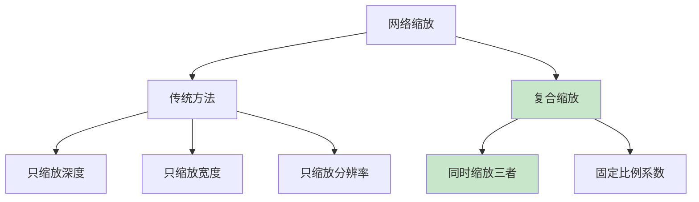
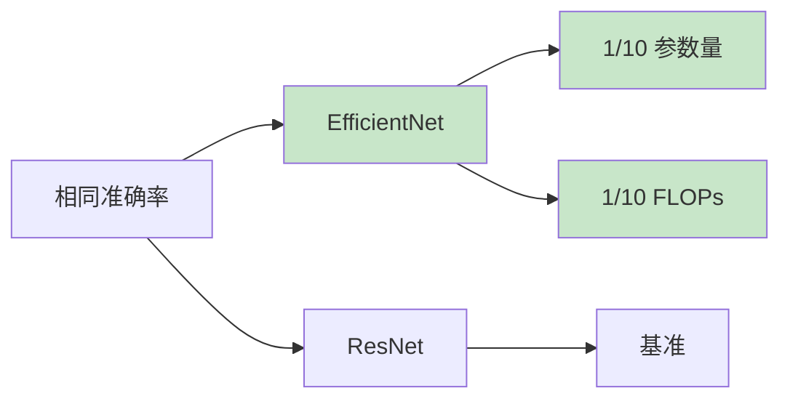

# EfficientNet
> **分类**: 经典架构（计算机视觉） | **编号**: CV-17 | **更新时间**: 2026-04-01 | **难度**: ⭐⭐⭐

`CNN` `经典网络` `ResNet` `VGG` `计算机视觉` `神经架构搜索`

**摘要**: EfficientNet 是由 Google 的 Mingxing Tan 和 Quoc Le 于 2019 年提出的卷积神经网络架构，通过神经架构搜索（NAS）和复合缩放方法，在大幅减少参数量...

---
## 概述

EfficientNet 是由 Google 的 Mingxing Tan 和 Quoc Le 于 2019 年提出的卷积神经网络架构，通过神经架构搜索（NAS）和复合缩放方法，在大幅减少参数量的同时实现了 SOTA 性能。EfficientNet 系列（B0-B7）展示了如何在计算资源受限的情况下优化网络设计。

## 核心创新

### 1. 复合缩放（Compound Scaling）



**传统方法：** 独立缩放深度、宽度或分辨率

**复合缩放：** 使用固定比例系数同时缩放三者

### 缩放公式

$$depth: d = \alpha^\phi$$
$$width: w = \beta^\phi$$
$$resolution: r = \gamma^\phi$$

其中：
- $\alpha \cdot \beta^2 \cdot \gamma^2 \approx 2$
- $\phi$ 是用户指定的系数
- $\alpha, \beta, \gamma$ 通过 NAS 搜索确定

对于 EfficientNet：$\alpha=1.2, \beta=1.1, \gamma=1.15$

### 2. MBConv 模块

```python
import torch
import torch.nn as nn

class MBConv(nn.Module):
    def __init__(self, in_channels, out_channels, expand_ratio, stride, kernel_size):
        super().__init__()
        hidden_dim = in_channels * expand_ratio
        self.use_res_connect = stride == 1 and in_channels == out_channels
        
        layers = []
        
        # 逐点卷积升维
        if expand_ratio != 1:
            layers.extend([
                nn.Conv2d(in_channels, hidden_dim, 1, bias=False),
                nn.BatchNorm2d(hidden_dim),
                nn.SiLU()  # Swish 激活
            ])
        
        # 深度卷积
        layers.extend([
            nn.Conv2d(hidden_dim, hidden_dim, kernel_size, stride, 
                     kernel_size//2, groups=hidden_dim, bias=False),
            nn.BatchNorm2d(hidden_dim),
            nn.SiLU()
        ])
        
        # SE 注意力
        layers.append(SEBlock(hidden_dim))
        
        # 逐点卷积降维
        layers.extend([
            nn.Conv2d(hidden_dim, out_channels, 1, bias=False),
            nn.BatchNorm2d(out_channels)
        ])
        
        self.conv = nn.Sequential(*layers)
    
    def forward(self, x):
        if self.use_res_connect:
            return x + self.conv(x)
        return self.conv(x)

class SEBlock(nn.Module):
    def __init__(self, channels, reduction=4):
        super().__init__()
        self.avg_pool = nn.AdaptiveAvgPool2d(1)
        self.fc = nn.Sequential(
            nn.Linear(channels, channels // reduction),
            nn.SiLU(),
            nn.Linear(channels // reduction, channels),
            nn.Sigmoid()
        )
    
    def forward(self, x):
        b, c, _, _ = x.size()
        y = self.fc(self.avg_pool(x).view(b, c)).view(b, c, 1, 1)
        return x * y
```

## EfficientNet 变体

| 模型 | 深度 | 宽度 | 分辨率 | 参数量 | FLOPs | Top-1 |
|-----|------|------|--------|--------|-------|-------|
| B0 | 1.0 | 1.0 | 224 | 5.3M | 0.39G | 77.1% |
| B1 | 1.2 | 1.0 | 240 | 7.8M | 0.70G | 79.1% |
| B2 | 1.4 | 1.1 | 260 | 9.1M | 1.0G | 80.1% |
| B3 | 1.8 | 1.2 | 300 | 12M | 1.8G | 81.6% |
| B4 | 2.2 | 1.4 | 380 | 19M | 4.2G | 83.0% |
| B5 | 3.0 | 1.6 | 456 | 30M | 10.3G | 83.6% |
| B6 | 3.4 | 1.8 | 528 | 43M | 19G | 84.0% |
| B7 | 4.3 | 2.0 | 600 | 66M | 37G | 84.4% |

### 完整实现

```python
class EfficientNet(nn.Module):
    def __init__(self, width_coeff=1.0, depth_coeff=1.0, resolution=224, num_classes=1000):
        super().__init__()
        
        # MBConv 配置：[kernel, stride, in_ch, out_ch, num_repeat, expand_ratio]
        self.cfgs = [
            [3, 1, 32, 16, 1, 1],
            [3, 2, 16, 24, 2, 6],
            [5, 2, 24, 40, 2, 6],
            [3, 2, 40, 80, 3, 6],
            [5, 1, 80, 112, 3, 6],
            [5, 2, 112, 192, 4, 6],
            [3, 1, 192, 320, 1, 6],
        ]
        
        # Stem
        self.stem = nn.Sequential(
            nn.Conv2d(3, 32, 3, 2, 1, bias=False),
            nn.BatchNorm2d(32),
            nn.SiLU()
        )
        
        # MBConv 层
        self.layers = nn.ModuleList()
        in_channels = 32
        
        for kernel, stride, in_ch, out_ch, num_repeat, expand_ratio in self.cfgs:
            out_channels = int(out_channels * width_coeff)
            for i in range(int(num_repeat * depth_coeff)):
                self.layers.append(
                    MBConv(
                        in_channels if i == 0 else out_channels,
                        out_channels,
                        expand_ratio,
                        stride if i == 0 else 1,
                        kernel
                    )
                )
                in_channels = out_channels
        
        # Head
        self.head = nn.Sequential(
            nn.Conv2d(in_channels, 1280, 1, bias=False),
            nn.BatchNorm2d(1280),
            nn.SiLU(),
            nn.AdaptiveAvgPool2d(1),
            nn.Flatten(),
            nn.Dropout(0.2),
            nn.Linear(1280, num_classes)
        )
    
    def forward(self, x):
        x = self.stem(x)
        for layer in self.layers:
            x = layer(x)
        x = self.head(x)
        return x

# 创建 EfficientNet-B0
model = EfficientNet(width_coeff=1.0, depth_coeff=1.0)
x = torch.randn(1, 3, 224, 224)
output = model(x)
print(f"EfficientNet-B0: {x.shape} -> {output.shape}")
print(f"参数量：{sum(p.numel() for p in model.parameters()):,}")
```

## 性能对比

### ImageNet 分类

| 模型 | 参数量 | FLOPs | Top-1 | Top-5 |
|-----|--------|-------|-------|-------|
| ResNet-50 | 26M | 4.1G | 76.0% | 93.0% |
| EfficientNet-B0 | 5.3M | 0.39G | 77.1% | 93.3% |
| EfficientNet-B3 | 12M | 1.8G | 81.6% | 95.7% |
| EfficientNet-B7 | 66M | 37G | 84.4% | 97.1% |

### 效率优势



## 训练技巧

### 1. 数据增强

```python
from torchvision import transforms

train_transform = transforms.Compose([
    transforms.RandomResizedCrop(224, scale=(0.08, 1.0)),
    transforms.RandomHorizontalFlip(),
    transforms.ColorJitter(brightness=0.4, contrast=0.4, saturation=0.4),
    transforms.ToTensor(),
    transforms.Normalize(mean=[0.485, 0.456, 0.406], 
                         std=[0.229, 0.224, 0.225]),
    transforms.RandomErasing(),
])
```

### 2. 优化器配置

```python
optimizer = torch.optim.AdamW(
    model.parameters(),
    lr=0.016,
    weight_decay=1e-5,
    betas=(0.9, 0.999)
)

scheduler = torch.optim.lr_scheduler.CosineAnnealingLR(
    optimizer,
    T_max=350,
    eta_min=0
)
```

### 3. 标签平滑

```python
criterion = nn.CrossEntropyLoss(label_smoothing=0.1)
```

## 实际应用

### 迁移学习

```python
from torchvision import models

# 预训练 EfficientNet
efficientnet = models.efficientnet_b0(
    weights=models.EfficientNet_B0_Weights.IMAGENET1K_V1
)

# 修改分类头
efficientnet.classifier[1] = nn.Linear(1280, 10)
```

### 特征提取

```python
# 提取中间层特征
def extract_features(model, x, layer_idx=5):
    x = model.features(x)
    features = []
    for i, layer in enumerate(x):
        if i == layer_idx:
            return layer
    return x
```

## 总结

EfficientNet 通过复合缩放和神经架构搜索，在计算效率和模型性能之间取得了优秀平衡。其设计原则（MBConv、SE 注意力、复合缩放）为资源受限场景下的模型设计提供了重要指导。
