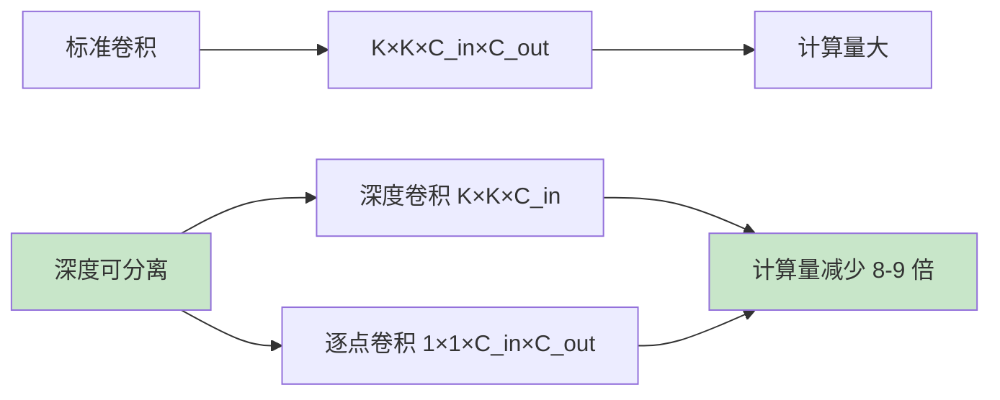
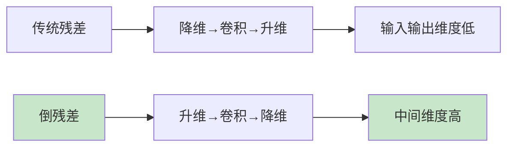

# MobileNet 系列
> **分类**: 经典架构（计算机视觉） | **编号**: CV-18 | **更新时间**: 2026-04-01 | **难度**: ⭐⭐⭐

`CNN` `经典网络` `ResNet` `VGG` `计算机视觉` `轻量级网络`

**摘要**: MobileNet 是 Google 提出的一系列轻量级卷积神经网络，专为移动和嵌入式设备设计。

---
## 概述

MobileNet 是 Google 提出的一系列轻量级卷积神经网络，专为移动和嵌入式设备设计。该系列通过深度可分离卷积、倒残差结构、神经架构搜索等技术，在保持较高准确率的同时大幅降低了计算成本和参数量。

## MobileNet V1

### 核心：深度可分离卷积



### 架构

```python
import torch
import torch.nn as nn

class DepthwiseSeparableConv(nn.Module):
    def __init__(self, in_channels, out_channels, stride=1):
        super().__init__()
        self.conv = nn.Sequential(
            # 深度卷积
            nn.Conv2d(in_channels, in_channels, 3, stride, 1, 
                     groups=in_channels, bias=False),
            nn.BatchNorm2d(in_channels),
            nn.ReLU6(inplace=True),
            
            # 逐点卷积
            nn.Conv2d(in_channels, out_channels, 1, bias=False),
            nn.BatchNorm2d(out_channels),
            nn.ReLU6(inplace=True)
        )
    
    def forward(self, x):
        return self.conv(x)

class MobileNetV1(nn.Module):
    def __init__(self, num_classes=1000, width_mult=1.0):
        super().__init__()
        
        def conv_dw(inp, oup, stride):
            return nn.Sequential(
                nn.Conv2d(inp, inp, 3, stride, 1, groups=inp, bias=False),
                nn.BatchNorm2d(inp),
                nn.ReLU6(inplace=True),
                
                nn.Conv2d(inp, oup, 1, 1, 0, bias=False),
                nn.BatchNorm2d(oup),
                nn.ReLU6(inplace=True),
            )
        
        self.model = nn.Sequential(
            nn.Conv2d(3, int(32 * width_mult), 3, 2, 1, bias=False),
            nn.BatchNorm2d(int(32 * width_mult)),
            nn.ReLU6(inplace=True),
            
            conv_dw(int(32 * width_mult), int(64 * width_mult), 1),
            conv_dw(int(64 * width_mult), int(128 * width_mult), 2),
            conv_dw(int(128 * width_mult), int(128 * width_mult), 1),
            conv_dw(int(128 * width_mult), int(256 * width_mult), 2),
            conv_dw(int(256 * width_mult), int(256 * width_mult), 1),
            conv_dw(int(256 * width_mult), int(512 * width_mult), 2),
            conv_dw(int(512 * width_mult), int(512 * width_mult), 1),
            conv_dw(int(512 * width_mult), int(512 * width_mult), 1),
            conv_dw(int(512 * width_mult), int(512 * width_mult), 1),
            conv_dw(int(512 * width_mult), int(512 * width_mult), 1),
            conv_dw(int(512 * width_mult), int(512 * width_mult), 1),
            conv_dw(int(512 * width_mult), int(1024 * width_mult), 2),
            conv_dw(int(1024 * width_mult), int(1024 * width_mult), 1),
            
            nn.AdaptiveAvgPool2d(1),
        )
        
        self.classifier = nn.Linear(int(1024 * width_mult), num_classes)
    
    def forward(self, x):
        x = self.model(x)
        x = x.view(-1, int(1024 * width_mult))
        x = self.classifier(x)
        return x
```

## MobileNet V2

### 核心创新：倒残差结构



**传统残差：** 瓶颈结构，中间维度低

**倒残差：** 中间维度高，保留更多信息

### MBConv 模块

```python
class InvertedResidual(nn.Module):
    def __init__(self, inp, oup, stride, expand_ratio):
        super().__init__()
        self.stride = stride
        self.use_res_connect = stride == 1 and inp == oup
        
        hidden_dim = int(round(inp * expand_ratio))
        
        layers = []
        if expand_ratio != 1:
            # 升维
            layers.extend([
                nn.Conv2d(inp, hidden_dim, 1, bias=False),
                nn.BatchNorm2d(hidden_dim),
                nn.ReLU6(inplace=True)
            ])
        
        # 深度卷积
        layers.extend([
            nn.Conv2d(hidden_dim, hidden_dim, 3, stride, 1, 
                     groups=hidden_dim, bias=False),
            nn.BatchNorm2d(hidden_dim),
            nn.ReLU6(inplace=True)
        ])
        
        # 降维（无激活）
        layers.extend([
            nn.Conv2d(hidden_dim, oup, 1, bias=False),
            nn.BatchNorm2d(oup)
        ])
        
        self.conv = nn.Sequential(*layers)
    
    def forward(self, x):
        if self.use_res_connect:
            return x + self.conv(x)
        return self.conv(x)
```

### 架构配置

```python
# MobileNetV2 配置
# t: expand_ratio, c: out_channels, n: num_repeats, s: stride
cfgs = [
    # t, c, n, s
    [1, 16, 1, 1],
    [6, 24, 2, 2],
    [6, 32, 3, 2],
    [6, 64, 4, 2],
    [6, 96, 3, 1],
    [6, 160, 3, 2],
    [6, 320, 1, 1],
]
```

## MobileNet V3

### 核心创新

1. **神经架构搜索（NAS）**
2. **h-Swish 激活函数**
3. **SE 注意力模块**

### h-Swish 激活

```python
class HSwish(nn.Module):
    def forward(self, x):
        return x * F.relu6(x + 3) / 6

# 对比
# Swish: x * sigmoid(x)
# h-Swish: x * ReLU6(x+3) / 6  (更高效)
```

### SE 模块

```python
class SEBlock(nn.Module):
    def __init__(self, channels, se_channels):
        super().__init__()
        self.fc = nn.Sequential(
            nn.AdaptiveAvgPool2d(1),
            nn.Conv2d(channels, se_channels, 1),
            nn.ReLU(inplace=True),
            nn.Conv2d(se_channels, channels, 1),
            nn.Hardsigmoid()
        )
    
    def forward(self, x):
        return x * self.fc(x)
```

## 性能对比

| 模型 | 参数量 | MAdds | Top-1 |
|-----|--------|-------|-------|
| MobileNetV1 | 4.2M | 569M | 70.6% |
| MobileNetV2 | 3.5M | 300M | 72.0% |
| MobileNetV3-Large | 5.4M | 219M | 75.2% |
| MobileNetV3-Small | 2.5M | 59M | 68.1% |
| ResNet-18 | 11.7M | 1.8G | 69.8% |

## 实际应用

### 模型选择

```python
from torchvision import models

# MobileNetV2
mobilenet_v2 = models.mobilenet_v2(
    weights=models.MobileNet_V2_Weights.IMAGENET1K_V1
)

# MobileNetV3
mobilenet_v3 = models.mobilenet_v3_large(
    weights=models.MobileNet_V3_Large_Weights.IMAGENET1K_V1
)
```

### 量化部署

```python
# 后训练量化
model.qconfig = torch.quantization.get_default_qconfig('fbgemm')
torch.quantization.prepare(model, inplace=True)
torch.quantization.convert(model, inplace=True)
```

## 总结

MobileNet 系列通过深度可分离卷积、倒残差结构和 NAS 等技术，为移动端和嵌入式设备提供了高效的深度学习解决方案。理解各版本的特点和适用场景，对于资源受限应用至关重要。
