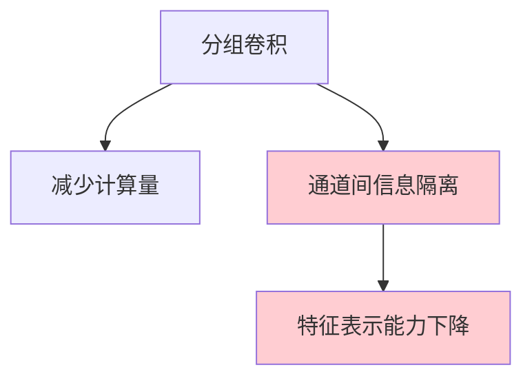

# ShuffleNet 系列
> **分类**: 经典架构（计算机视觉） | **编号**: CV-19 | **更新时间**: 2026-04-01 | **难度**: ⭐⭐⭐

`CNN` `经典网络` `ResNet` `VGG` `计算机视觉` `轻量级网络`

**摘要**: ShuffleNet 是 Face++（旷视科技）提出的一系列超轻量级卷积神经网络，专为移动端设备设计。

---
## 概述

ShuffleNet 是 Face++（旷视科技）提出的一系列超轻量级卷积神经网络，专为移动端设备设计。ShuffleNet 通过通道混洗（Channel Shuffle）和分组卷积的结合，在极低计算成本下实现了优秀的性能，成为移动端推理的热门选择。

## ShuffleNet V1

### 核心问题：分组卷积的局限



**问题：** 分组卷积虽然减少了计算量，但阻碍了通道间的信息流动。

**解决：** 通道混洗（Channel Shuffle）

### 通道混洗


```python
def channel_shuffle(x, groups):
    batchsize, num_channels, height, width = x.data.size()
    channels_per_group = num_channels // groups
    
    # reshape
    x = x.view(batchsize, groups, channels_per_group, height, width)
    
    # transpose
    x = torch.transpose(x, 1, 2).contiguous()
    
    # flatten
    x = x.view(batchsize, -1, height, width)
    
    return x
```

### ShuffleNet 单元

```python
import torch
import torch.nn as nn
import torch.nn.functional as F

class ShuffleBlock(nn.Module):
    def __init__(self, groups):
        super().__init__()
        self.groups = groups
    
    def forward(self, x):
        return channel_shuffle(x, self.groups)

class InvertedResidual(nn.Module):
    def __init__(self, in_channels, out_channels, stride, groups):
        super().__init__()
        self.stride = stride
        self.groups = groups
        
        mid_channels = out_channels // 2
        
        if stride == 2:
            self.out_channels = out_channels
        else:
            self.out_channels = out_channels - in_channels
        
        # 逐点卷积（分组）
        self.conv1 = nn.Sequential(
            nn.Conv2d(in_channels, mid_channels, 1, 1, 0, 
                     groups=groups, bias=False),
            nn.BatchNorm2d(mid_channels),
            nn.ReLU(inplace=True)
        )
        
        # 通道混洗
        self.shuffle = ShuffleBlock(groups=groups)
        
        # 深度卷积
        self.conv2 = nn.Sequential(
            nn.Conv2d(mid_channels, mid_channels, 3, stride, 1, 
                     groups=mid_channels, bias=False),
            nn.BatchNorm2d(mid_channels)
        )
        
        # 逐点卷积
        self.conv3 = nn.Sequential(
            nn.Conv2d(mid_channels, self.out_channels, 1, 1, 0, 
                     groups=groups, bias=False),
            nn.BatchNorm2d(self.out_channels),
            nn.ReLU(inplace=True)
        )
        
        self.relu = nn.ReLU(inplace=True)
        if stride == 2:
            self.shortcut = nn.AvgPool2d(3, stride=2, padding=1)
    
    def forward(self, x):
        if self.stride == 1:
            # 通道分割
            x1, x2 = x.chunk(2, dim=1)
            out = self.conv1(x2)
            out = self.shuffle(out)
            out = self.conv2(out)
            out = self.conv3(out)
            out = torch.cat([x1, out], dim=1)
        else:
            # stride=2 时无分割
            out = self.conv1(x)
            out = self.shuffle(out)
            out = self.conv2(out)
            out = self.conv3(out)
            
            # shortcut
            shortcut = self.shortcut(x)
            out = torch.cat([out, shortcut], dim=1)
        
        return self.relu(out)

class ShuffleNetV1(nn.Module):
    def __init__(self, groups=3, num_classes=1000):
        super().__init__()
        self.groups = groups
        
        # Stage 1
        self.conv1 = nn.Sequential(
            nn.Conv2d(3, 24, 3, 2, 1, bias=False),
            nn.BatchNorm2d(24),
            nn.ReLU(inplace=True)
        )
        
        self.maxpool = nn.MaxPool2d(3, 2, 1)
        
        # Stage 2
        self.stage2 = nn.Sequential(
            InvertedResidual(24, 240, 2, groups),
            InvertedResidual(240, 240, 1, groups),
            InvertedResidual(240, 240, 1, groups),
        )
        
        # Stage 3
        self.stage3 = nn.Sequential(
            InvertedResidual(240, 480, 2, groups),
            InvertedResidual(480, 480, 1, groups),
            InvertedResidual(480, 480, 1, groups),
            InvertedResidual(480, 480, 1, groups),
        )
        
        # Stage 4
        self.stage4 = nn.Sequential(
            InvertedResidual(480, 960, 2, groups),
            InvertedResidual(960, 960, 1, groups),
            InvertedResidual(960, 960, 1, groups),
        )
        
        self.conv_last = nn.Conv2d(960, 1024, 1)
        self.globalpool = nn.AdaptiveAvgPool2d(1)
        self.fc = nn.Linear(1024, num_classes)
    
    def forward(self, x):
        x = self.conv1(x)
        x = self.maxpool(x)
        x = self.stage2(x)
        x = self.stage3(x)
        x = self.stage4(x)
        x = self.conv_last(x)
        x = self.globalpool(x)
        x = x.view(-1, 1024)
        x = self.fc(x)
        return x
```

## ShuffleNet V2

### 设计准则

1. **输入输出通道相等**（避免分组卷积）
2. **避免过多逐点卷积**
3. **减少网络碎片化**
4. **避免元素级操作**

### 改进的单元

```python
class ShuffleNetV2Block(nn.Module):
    def __init__(self, in_channels, out_channels, stride):
        super().__init__()
        self.stride = stride
        
        mid_channels = out_channels - in_channels if stride == 1 else out_channels // 2
        
        if stride == 1:
            # 分支 1：恒等映射
            self.branch1 = nn.Identity()
            
            # 分支 2
            self.branch2 = nn.Sequential(
                nn.Conv2d(in_channels, mid_channels, 1, bias=False),
                nn.BatchNorm2d(mid_channels),
                nn.ReLU(inplace=True),
                
                nn.Conv2d(mid_channels, mid_channels, 3, stride, 1, 
                         groups=mid_channels, bias=False),
                nn.BatchNorm2d(mid_channels),
                
                nn.Conv2d(mid_channels, mid_channels, 1, bias=False),
                nn.BatchNorm2d(mid_channels),
                nn.ReLU(inplace=True)
            )
        else:
            # stride=2 时两个分支都处理
            self.branch1 = nn.Sequential(
                nn.Conv2d(in_channels, in_channels, 3, stride, 1, 
                         groups=in_channels, bias=False),
                nn.BatchNorm2d(in_channels),
                nn.Conv2d(in_channels, in_channels, 1, bias=False),
                nn.BatchNorm2d(in_channels),
                nn.ReLU(inplace=True)
            )
            
            self.branch2 = nn.Sequential(
                nn.Conv2d(in_channels, mid_channels, 1, bias=False),
                nn.BatchNorm2d(mid_channels),
                nn.ReLU(inplace=True),
                
                nn.Conv2d(mid_channels, mid_channels, 3, stride, 1, 
                         groups=mid_channels, bias=False),
                nn.BatchNorm2d(mid_channels),
                
                nn.Conv2d(mid_channels, mid_channels, 1, bias=False),
                nn.BatchNorm2d(mid_channels),
                nn.ReLU(inplace=True)
            )
        
        self.shuffle = ShuffleBlock(groups=2)
    
    def forward(self, x):
        if self.stride == 1:
            x1 = self.branch1(x)
            x2 = self.branch2(x)
            out = torch.cat([x1, x2], dim=1)
        else:
            out = torch.cat([self.branch1(x), self.branch2(x)], dim=1)
        
        out = self.shuffle(out)
        return out
```

## 性能对比

| 模型 | 参数量 | MAdds | Top-1 |
|-----|--------|-------|-------|
| ShuffleNetV1 1.5x | 3.4M | 292M | 71.5% |
| ShuffleNetV2 1.5x | 3.5M | 299M | 72.6% |
| MobileNetV2 1.0x | 3.5M | 300M | 72.0% |
| MobileNetV3-Small | 2.5M | 59M | 68.1% |

## 实际应用

```python
from torchvision import models

# ShuffleNetV2
shufflenet = models.shufflenet_v2_x1_0(
    weights=models.ShuffleNet_V2_X1_Weights.IMAGENET1K_V1
)
```

## 总结

ShuffleNet 通过通道混洗解决了分组卷积的信息隔离问题，在极低计算成本下实现了优秀性能。V2 版本的设计准则为轻量级网络设计提供了重要指导。
