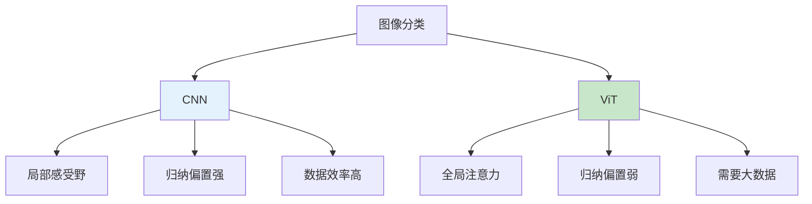

# Vision Transformer (ViT)
> **分类**: Vision Transformer（计算机视觉） | **编号**: CV-20 | **更新时间**: 2026-04-01 | **难度**: ⭐⭐⭐⭐

`ViT` `Transformer` `Attention` `计算机视觉` `Self-Attention`

**摘要**: Vision Transformer (ViT) 是由 Google 的 Alexey Dosovitskiy 等人于 2020 年提出的纯 Transformer 架构图像分类模型。

---
## 概述

Vision Transformer (ViT) 是由 Google 的 Alexey Dosovitskiy 等人于 2020 年提出的纯 Transformer 架构图像分类模型。ViT 将图像分割为固定大小的 patch，直接输入 Transformer Encoder，在大规模预训练下取得了 SOTA 性能，标志着 Transformer 从 NLP 向 CV 的成功迁移。

## 核心思想

### 从 CNN 到 Transformer



### Patch 嵌入


## ViT 架构

### 整体结构

```python
import torch
import torch.nn as nn
import torch.nn.functional as F
import math

class PatchEmbedding(nn.Module):
    def __init__(self, img_size=224, patch_size=16, in_channels=3, embed_dim=768):
        super().__init__()
        self.img_size = img_size
        self.patch_size = patch_size
        self.n_patches = (img_size // patch_size) ** 2
        
        self.projection = nn.Conv2d(
            in_channels, embed_dim, 
            kernel_size=patch_size, 
            stride=patch_size
        )
    
    def forward(self, x):
        # x: (batch, channels, height, width)
        x = self.projection(x)  # (batch, embed_dim, n_patches_h, n_patches_w)
        x = x.flatten(2)  # (batch, embed_dim, n_patches)
        x = x.transpose(1, 2)  # (batch, n_patches, embed_dim)
        return x

class PositionalEncoding(nn.Module):
    def __init__(self, embed_dim, max_len=5000):
        super().__init__()
        self.pos_encoding = nn.Parameter(torch.randn(1, max_len, embed_dim))
    
    def forward(self, x):
        # x: (batch, n_patches, embed_dim)
        return x + self.pos_encoding[:, :x.size(1)]

class MultiHeadAttention(nn.Module):
    def __init__(self, embed_dim, num_heads, dropout=0.0):
        super().__init__()
        self.num_heads = num_heads
        self.head_dim = embed_dim // num_heads
        
        self.qkv = nn.Linear(embed_dim, embed_dim * 3)
        self.projection = nn.Linear(embed_dim, embed_dim)
        self.dropout = nn.Dropout(dropout)
    
    def forward(self, x):
        batch, seq_len, embed_dim = x.shape
        
        # Q, K, V
        qkv = self.qkv(x)  # (batch, seq_len, 3 * embed_dim)
        qkv = qkv.reshape(batch, seq_len, 3, self.num_heads, self.head_dim)
        qkv = qkv.permute(2, 0, 3, 1, 4)  # (3, batch, heads, seq_len, head_dim)
        q, k, v = qkv[0], qkv[1], qkv[2]
        
        # 注意力
        energy = torch.matmul(q, k.transpose(-2, -1)) / math.sqrt(self.head_dim)
        attention = torch.softmax(energy, dim=-1)
        attention = self.dropout(attention)
        
        # 输出
        out = torch.matmul(attention, v)  # (batch, heads, seq_len, head_dim)
        out = out.transpose(1, 2)  # (batch, seq_len, heads, head_dim)
        out = out.reshape(batch, seq_len, embed_dim)
        out = self.projection(out)
        
        return out

class TransformerEncoderBlock(nn.Module):
    def __init__(self, embed_dim, num_heads, mlp_ratio=4.0, dropout=0.0):
        super().__init__()
        mlp_hidden_dim = int(embed_dim * mlp_ratio)
        
        self.norm1 = nn.LayerNorm(embed_dim)
        self.attention = MultiHeadAttention(embed_dim, num_heads, dropout)
        
        self.norm2 = nn.LayerNorm(embed_dim)
        self.mlp = nn.Sequential(
            nn.Linear(embed_dim, mlp_hidden_dim),
            nn.GELU(),
            nn.Dropout(dropout),
            nn.Linear(mlp_hidden_dim, embed_dim),
            nn.Dropout(dropout)
        )
    
    def forward(self, x):
        # 预归一化 + 残差
        x = x + self.attention(self.norm1(x))
        x = x + self.mlp(self.norm2(x))
        return x

class VisionTransformer(nn.Module):
    def __init__(self, img_size=224, patch_size=16, in_channels=3, num_classes=1000,
                 embed_dim=768, num_heads=12, num_layers=12, mlp_ratio=4.0, dropout=0.0):
        super().__init__()
        
        self.patch_embed = PatchEmbedding(img_size, patch_size, in_channels, embed_dim)
        self.pos_encoding = PositionalEncoding(embed_dim)
        
        # Class token
        self.cls_token = nn.Parameter(torch.randn(1, 1, embed_dim))
        
        # Transformer Encoder
        self.transformer = nn.Sequential(*[
            TransformerEncoderBlock(embed_dim, num_heads, mlp_ratio, dropout)
            for _ in range(num_layers)
        ])
        
        self.norm = nn.LayerNorm(embed_dim)
        self.head = nn.Linear(embed_dim, num_classes)
    
    def forward(self, x):
        batch = x.shape[0]
        
        # Patch 嵌入
        x = self.patch_embed(x)  # (batch, n_patches, embed_dim)
        
        # 添加 class token
        cls_tokens = self.cls_token.expand(batch, -1, -1)
        x = torch.cat([cls_tokens, x], dim=1)  # (batch, n_patches+1, embed_dim)
        
        # 位置编码
        x = self.pos_encoding(x)
        
        # Transformer
        x = self.transformer(x)
        x = self.norm(x)
        
        # 使用 class token 进行分类
        cls_output = x[:, 0]
        logits = self.head(cls_output)
        
        return logits

# 创建 ViT 模型
def vit_base():
    return VisionTransformer(
        img_size=224, patch_size=16, embed_dim=768,
        num_heads=12, num_layers=12, mlp_ratio=4
    )

def vit_large():
    return VisionTransformer(
        img_size=224, patch_size=16, embed_dim=1024,
        num_heads=16, num_layers=24, mlp_ratio=4
    )

# 测试
model = vit_base()
x = torch.randn(1, 3, 224, 224)
output = model(x)
print(f"ViT-B/16: {x.shape} -> {output.shape}")
print(f"参数量：{sum(p.numel() for p in model.parameters()):,}")
```

## ViT 变体

| 模型 | 层数 | 隐藏维度 | 注意力头数 | 参数量 |
|-----|------|---------|-----------|--------|
| ViT-Tiny | 12 | 192 | 3 | 5.7M |
| ViT-Small | 12 | 384 | 6 | 22M |
| ViT-Base | 12 | 768 | 12 | 86M |
| ViT-Large | 24 | 1024 | 16 | 307M |
| ViT-Huge | 32 | 1280 | 16 | 632M |

## 关键设计

### 1. Class Token


额外的可学习 token，用于聚合全局信息。

### 2. 位置编码

可学习的位置编码，保留空间信息。

### 3. 预归一化

LayerNorm 在注意力之前（Pre-Norm），稳定训练。

## 训练要点

### 1. 大规模预训练

ViT 需要大规模数据集（如 JFT-300M）才能发挥优势。

### 2. 数据增强

```python
from torchvision import transforms

train_transform = transforms.Compose([
    transforms.RandomResizedCrop(224, scale=(0.05, 1.0)),
    transforms.RandomHorizontalFlip(),
    transforms.ColorJitter(0.4, 0.4, 0.4),
    transforms.ToTensor(),
    transforms.Normalize([0.5, 0.5, 0.5], [0.5, 0.5, 0.5]),
    transforms.RandomErasing(p=0.25),
])
```

### 3. 优化器配置

```python
optimizer = torch.optim.AdamW(
    model.parameters(),
    lr=3e-4,
    weight_decay=0.3,
    betas=(0.9, 0.999)
)

scheduler = torch.optim.lr_scheduler.CosineAnnealingWarmRestarts(
    optimizer, T_0=10, T_mult=2
)
```

## CNN vs ViT

| 特性 | CNN | ViT |
|-----|-----|-----|
| 归纳偏置 | 强（局部性、平移不变） | 弱 |
| 数据需求 | 较少 | 大量 |
| 计算效率 | 高 | 中等 |
| 全局建模 | 有限 | 优秀 |
| 可解释性 | 中等 | 高（注意力图） |

## 实际应用

```python
from transformers import ViTForImageClassification

# 预训练 ViT
model = ViTForImageClassification.from_pretrained(
    'google/vit-base-patch16-224'
)
```

## 总结

ViT 证明了纯 Transformer 架构在视觉任务中的潜力，开启了 Vision Transformer 研究热潮。尽管需要大量数据预训练，但其强大的全局建模能力和可解释性使其成为现代视觉模型的重要选择。
