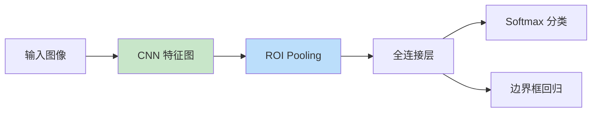
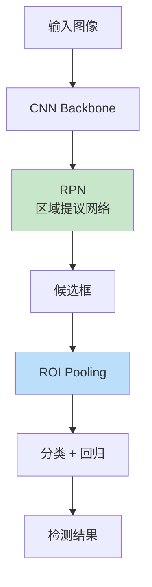
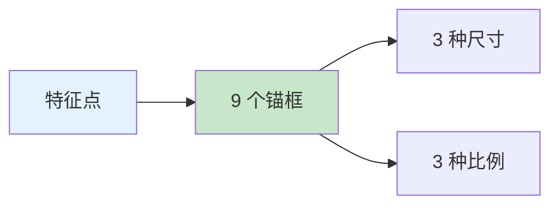

# R-CNN 系列目标检测
> **分类**: 目标检测（计算机视觉） | **编号**: CV-21 | **更新时间**: 2026-04-01 | **难度**: ⭐⭐⭐⭐

`目标检测` `YOLO` `R-CNN` `DETR` `计算机视觉` `两阶段检测`

**摘要**: R-CNN（Region-based Convolutional Neural Networks）系列是目标检测领域的里程碑工作，包括 R-CNN、Fast R-CNN、Faster R-CNN...

---
## 概述

R-CNN（Region-based Convolutional Neural Networks）系列是目标检测领域的里程碑工作，包括 R-CNN、Fast R-CNN、Faster R-CNN 和 Mask R-CNN。该系列通过结合区域提议和深度学习，实现了高精度的目标检测，奠定了现代目标检测的基础。

## R-CNN（2014）

### 核心思想


### 流程

1. **区域提议**：使用选择性搜索（Selective Search）生成约 2000 个候选框
2. **特征提取**：将每个候选框 resize 后输入 CNN（AlexNet）提取特征
3. **分类**：使用 SVM 对每个候选框分类
4. **回归**：使用边界框回归微调位置

### 局限性

- 多阶段训练复杂
- 速度慢（每图约 40 秒）
- 存储开销大

## Fast R-CNN（2015）

### 改进



**关键创新：**
1. 整图输入 CNN，共享卷积计算
2. ROI Pooling 提取固定尺寸特征
3. 多任务损失联合训练

### ROI Pooling

```python
import torch
import torch.nn as nn

class ROIPool(nn.Module):
    def __init__(self, output_size):
        super().__init__()
        self.output_size = output_size
    
    def forward(self, feature_map, rois):
        # feature_map: (batch, channels, h, w)
        # rois: (num_rois, 5) [batch_idx, x1, y1, x2, y2]
        
        batch, channels, h, w = feature_map.shape
        out_h, out_w = self.output_size
        
        output = []
        for roi in rois:
            batch_idx, x1, y1, x2, y2 = roi.int()
            roi_feat = feature_map[batch_idx:batch_idx+1, :, y1:y2, x1:x2]
            pooled = nn.functional.adaptive_avg_pool2d(roi_feat, (out_h, out_w))
            output.append(pooled)
        
        return torch.cat(output, dim=0)
```

### 多任务损失

$$Loss = L_{cls} + \lambda \cdot L_{reg}$$

## Faster R-CNN（2015）

### 核心创新：RPN



**RPN（Region Proposal Network）：**
- 全卷积网络
- 生成高质量候选框
- 与检测网络共享特征

### 锚框（Anchor Boxes）



每个特征点生成 9 个锚框（3 尺寸 × 3 比例）。

### 实现

```python
import torch
import torch.nn as nn

class AnchorGenerator(nn.Module):
    def __init__(self, sizes=(128, 256, 512), ratios=(0.5, 1, 2)):
        super().__init__()
        self.sizes = sizes
        self.ratios = ratios
    
    def generate_anchors(self, feature_map):
        batch, channels, h, w = feature_map.shape
        anchors = []
        
        for i in range(h):
            for j in range(w):
                cx = j
                cy = i
                
                for size in self.sizes:
                    for ratio in self.ratios:
                        w_anchor = size * (ratio ** 0.5)
                        h_anchor = size / (ratio ** 0.5)
                        
                        x1 = cx - w_anchor / 2
                        y1 = cy - h_anchor / 2
                        x2 = cx + w_anchor / 2
                        y2 = cy + h_anchor / 2
                        
                        anchors.append([x1, y1, x2, y2])
        
        return torch.tensor(anchors)

class RPN(nn.Module):
    def __init__(self, in_channels, num_anchors=9):
        super().__init__()
        self.conv = nn.Conv2d(in_channels, 512, 3, padding=1)
        self.cls_score = nn.Conv2d(512, num_anchors * 2, 1)
        self.bbox_pred = nn.Conv2d(512, num_anchors * 4, 1)
    
    def forward(self, x):
        x = self.conv(x)
        cls_logits = self.cls_score(x)
        bbox_pred = self.bbox_pred(x)
        return cls_logits, bbox_pred
```

## 性能对比

| 模型 | mAP (VOC) | 速度 |
|-----|----------|------|
| R-CNN | 66.0% | 40s/img |
| Fast R-CNN | 66.9% | 2s/img |
| Faster R-CNN | 73.2% | 0.2s/img |

## 总结

R-CNN 系列通过逐步优化，实现了从多阶段到端到端、从慢速到实时的演进，奠定了两阶段目标检测的基础。
