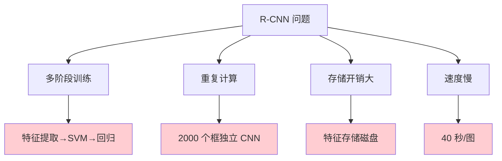

# Fast R-CNN
> **分类**: 目标检测（计算机视觉） | **编号**: CV-22 | **更新时间**: 2026-04-01 | **难度**: ⭐⭐⭐⭐

`目标检测` `YOLO` `R-CNN` `DETR` `计算机视觉` `两阶段检测`

**摘要**: Fast R-CNN 是由 Ross Girshick 于 2015 年提出的目标检测算法，是对 R-CNN 的重大改进。

---
## 概述

Fast R-CNN 是由 Ross Girshick 于 2015 年提出的目标检测算法，是对 R-CNN 的重大改进。Fast R-CNN 通过共享卷积计算、ROI Pooling 和多任务损失，将检测速度提升了近 200 倍，同时提高了检测精度。

## R-CNN 的局限



## Fast R-CNN 改进

### 1. 共享卷积计算


**R-CNN：** 2000 个候选框 × 2000 次 CNN 前向

**Fast R-CNN：** 1 次 CNN 前向 + ROI Pooling

### 2. ROI Pooling

```python
import torch
import torch.nn as nn
import torch.nn.functional as F

class ROIPool(nn.Module):
    def __init__(self, output_size):
        super().__init__()
        self.output_size = output_size
    
    def forward(self, feature_map, rois):
        """
        feature_map: (batch, channels, h, w)
        rois: (num_rois, 5) [batch_idx, x1, y1, x2, y2]
        """
        batch, channels, h, w = feature_map.shape
        out_h, out_w = self.output_size
        
        output = []
        for roi in rois:
            batch_idx = int(roi[0])
            x1, y1, x2, y2 = roi[1:].int()
            
            # 提取 ROI 特征
            roi_feat = feature_map[batch_idx:batch_idx+1, :, y1:y2+1, x1:x2+1]
            
            # 池化到固定尺寸
            pooled = F.adaptive_max_pool2d(roi_feat, (out_h, out_w))
            output.append(pooled)
        
        return torch.cat(output, dim=0)

# 测试
roi_pool = ROIPool(output_size=(7, 7))
feature_map = torch.randn(1, 512, 64, 64)
rois = torch.tensor([
    [0, 10, 10, 50, 50],
    [0, 20, 20, 60, 60],
])
output = roi_pool(feature_map, rois)
print(f"ROI Pooling: {feature_map.shape} -> {output.shape}")
```

### 3. 多任务损失

```python
class FastRCNNLoss(nn.Module):
    def __init__(self):
        super().__init__()
        self.cls_loss = nn.CrossEntropyLoss()
    
    def smooth_l1_loss(self, pred, target, beta=1.0):
        diff = torch.abs(pred - target)
        loss = torch.where(diff < beta, 0.5 * diff ** 2 / beta, diff - 0.5 * beta)
        return loss.mean()
    
    def forward(self, cls_score, bbox_pred, labels, bbox_targets):
        # 分类损失
        loss_cls = self.cls_loss(cls_score, labels)
        
        # 回归损失（仅正样本）
        pos_mask = labels > 0
        if pos_mask.sum() > 0:
            loss_bbox = self.smooth_l1_loss(
                bbox_pred[pos_mask], 
                bbox_targets[pos_mask]
            )
        else:
            loss_bbox = bbox_pred.sum() * 0
        
        return loss_cls + loss_bbox
```

## 网络架构

```python
class FastRCNN(nn.Module):
    def __init__(self, num_classes=21):
        super().__init__()
        # Backbone (如 VGG16)
        self.backbone = nn.Sequential(
            nn.Conv2d(3, 64, 3, padding=1),
            nn.ReLU(),
            nn.MaxPool2d(2, 2),
            # ... 更多层
        )
        
        # ROI Pooling
        self.roi_pool = ROIPool(output_size=(7, 7))
        
        # 分类头
        self.fc = nn.Sequential(
            nn.Linear(512 * 7 * 7, 4096),
            nn.ReLU(),
            nn.Dropout(),
            nn.Linear(4096, 4096),
            nn.ReLU(),
            nn.Dropout(),
        )
        
        self.cls_score = nn.Linear(4096, num_classes)
        self.bbox_pred = nn.Linear(4096, num_classes * 4)
    
    def forward(self, x, rois):
        # 特征提取
        features = self.backbone(x)
        
        # ROI Pooling
        roi_features = self.roi_pool(features, rois)
        roi_features = roi_features.view(roi_features.size(0), -1)
        
        # 全连接
        fc_features = self.fc(roi_features)
        
        # 输出
        cls_score = self.cls_score(fc_features)
        bbox_pred = self.bbox_pred(fc_features)
        
        return cls_score, bbox_pred
```

## 训练流程


## 性能提升

| 指标 | R-CNN | Fast R-CNN |
|-----|-------|-----------|
| mAP (VOC 2012) | 66.0% | 66.9% |
| 训练时间 | 多阶段 | 端到端 |
| 推理时间 | 40s | 2s |
| 存储 | 特征文件 | 无需存储 |

## 局限性

1. **选择性搜索慢**：候选框生成是瓶颈
2. **ROI Pooling 量化**：取整导致不对齐

这些局限在 Faster R-CNN 中得到解决。

## 总结

Fast R-CNN 通过共享卷积、ROI Pooling 和多任务损失，实现了端到端的目标检测训练，速度和精度大幅提升，为后续 Faster R-CNN 奠定了基础。
