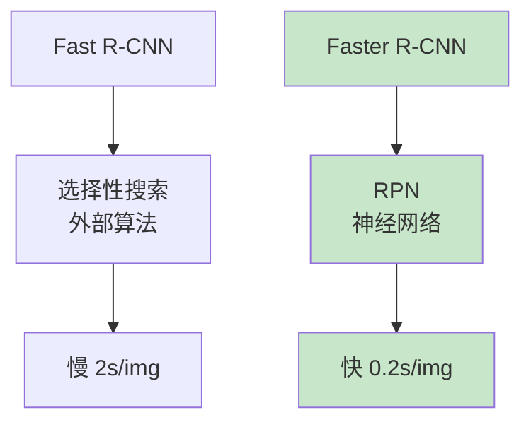

# Faster R-CNN
> **分类**: 目标检测（计算机视觉） | **编号**: CV-23 | **更新时间**: 2026-04-01 | **难度**: ⭐⭐⭐⭐

`目标检测` `YOLO` `R-CNN` `DETR` `计算机视觉` `两阶段检测`

**摘要**: Faster R-CNN 是由 Ren Shaoqing 等人于 2015 年提出的目标检测算法，通过引入区域提议网络（RPN），实现了端到端的快速目标检测。

---
## 概述

Faster R-CNN 是由 Ren Shaoqing 等人于 2015 年提出的目标检测算法，通过引入区域提议网络（RPN），实现了端到端的快速目标检测。Faster R-CNN 将候选框生成集成到网络中，消除了选择性搜索的瓶颈，成为两阶段检测的经典架构。

## 核心创新：RPN

### 从外部到内部



### RPN 结构

```python
import torch
import torch.nn as nn
import torch.nn.functional as F

class RPN(nn.Module):
    def __init__(self, in_channels=512, num_anchors=9):
        super().__init__()
        self.conv = nn.Conv2d(in_channels, 512, 3, padding=1)
        
        # 分类：每个锚框是前景/背景
        self.cls_score = nn.Conv2d(512, num_anchors * 2, 1)
        
        # 回归：每个锚框的 4 个坐标偏移
        self.bbox_pred = nn.Conv2d(512, num_anchors * 4, 1)
        
        self._init_weights()
    
    def _init_weights(self):
        for m in self.modules():
            if isinstance(m, nn.Conv2d):
                nn.init.normal_(m.weight, std=0.01)
    
    def forward(self, x):
        x = F.relu(self.conv(x))
        
        # cls: (batch, 2*anchors, h, w)
        cls_logits = self.cls_score(x)
        
        # bbox: (batch, 4*anchors, h, w)
        bbox_pred = self.bbox_pred(x)
        
        return cls_logits, bbox_pred
```

### 锚框机制

```python
class AnchorGenerator(nn.Module):
    def __init__(self, base_size=16, ratios=[0.5, 1, 2], scales=[2**0, 2**1, 2**2]):
        super().__init__()
        self.base_size = base_size
        self.ratios = ratios
        self.scales = scales
    
    def generate_anchors(self, stride, feature_size):
        """生成所有锚框"""
        anchors = []
        
        for i in range(feature_size):
            for j in range(feature_size):
                cx = (j + 0.5) * stride
                cy = (i + 0.5) * stride
                
                for ratio in self.ratios:
                    for scale in self.scales:
                        w = self.base_size * scale * (ratio ** 0.5)
                        h = self.base_size * scale / (ratio ** 0.5)
                        
                        x1 = cx - w / 2
                        y1 = cy - h / 2
                        x2 = cx + w / 2
                        y2 = cy + h / 2
                        
                        anchors.append([x1, y1, x2, y2])
        
        return torch.tensor(anchors)

# 测试
anchor_gen = AnchorGenerator()
anchors = anchor_gen.generate_anchors(stride=16, feature_size=32)
print(f"锚框数量：{len(anchors)} (32×32×9 = {32*32*9})")
print(f"单个特征点锚框：{len(anchor_gen.ratios) * len(anchor_gen.scales)}")
```

## 完整架构

```python
class FasterRCNN(nn.Module):
    def __init__(self, num_classes=21):
        super().__init__()
        # Backbone (ResNet-50)
        self.backbone = nn.Sequential(
            nn.Conv2d(3, 64, 7, 2, 3),
            nn.BatchNorm2d(64),
            nn.ReLU(),
            nn.MaxPool2d(3, 2, 1),
            # ResNet 层...
        )
        
        # RPN
        self.rpn = RPN(in_channels=1024)
        
        # ROI Pooling
        self.roi_pool = nn.AdaptiveMaxPool2d(7)
        
        # 检测头
        self.fc = nn.Linear(1024 * 7 * 7, 4096)
        self.cls_score = nn.Linear(4096, num_classes)
        self.bbox_pred = nn.Linear(4096, num_classes * 4)
    
    def forward(self, x, proposals=None):
        # 特征提取
        features = self.backbone(x)
        
        # RPN 生成提议
        if self.training or proposals is None:
            rpn_logits, rpn_bbox = self.rpn(features)
            proposals = self.generate_proposals(rpn_logits, rpn_bbox)
        
        # ROI Pooling
        roi_features = self.roi_pool(proposals)
        roi_features = roi_features.view(roi_features.size(0), -1)
        
        # 检测头
        x = F.relu(self.fc(roi_features))
        cls_score = self.cls_score(x)
        bbox_pred = self.bbox_pred(x)
        
        return cls_score, bbox_pred, proposals
    
    def generate_proposals(self, rpn_logits, rpn_bbox):
        # 解码锚框，应用 NMS
        # 简化实现
        return torch.randn(100, 5)  # (num_proposals, 5)
```

## 训练策略

### 交替训练


### 多任务损失

$$L = L_{rpn\_cls} + L_{rpn\_reg} + L_{det\_cls} + L_{det\_reg}$$

## 性能对比

| 模型 | mAP (VOC) | 速度 |
|-----|----------|------|
| Fast R-CNN | 66.9% | 2s |
| Faster R-CNN | 73.2% | 0.2s |
| Faster R-CNN (ResNet-101) | 76.4% | 0.3s |

## 实际应用

```python
from torchvision.models.detection import fasterrcnn_resnet50_fpn

# 预训练模型
model = fasterrcnn_resnet50_fpn(weights='DEFAULT')

# 推理
model.eval()
image = torch.randn(3, 800, 800)
predictions = model([image])
print(f"检测结果：{len(predictions[0]['boxes'])} 个目标")
```

## 总结

Faster R-CNN 通过 RPN 实现了端到端的快速目标检测，成为两阶段检测的基准架构。其设计思想（锚框、RPN、ROI Pooling）深刻影响了后续检测算法的发展。
