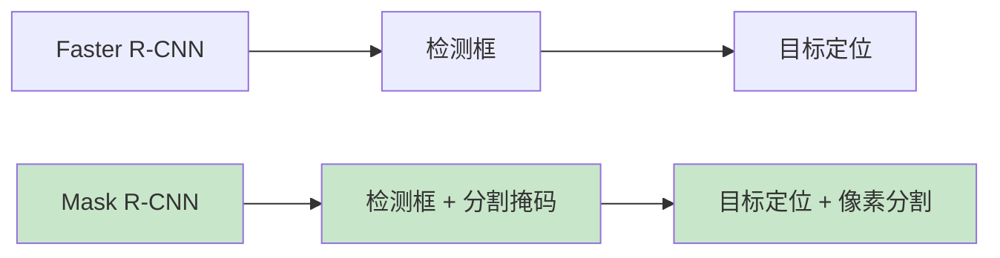
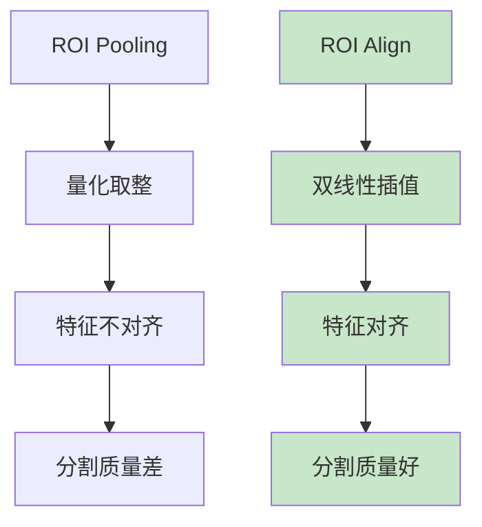

# Mask R-CNN

> **分类**: 计算机视觉 | **编号**: 024 | **更新时间**: 2026-03-30 | **难度**: ⭐⭐

`CV` `CNN` `卷积` `预训练`

**摘要**: Mask R-CNN 是由 He Kaiming 等人于 2017 年提出的实例分割算法，是 Faster R-CNN 的自然扩展。

---
## 概述

Mask R-CNN 是由 He Kaiming 等人于 2017 年提出的实例分割算法，是 Faster R-CNN 的自然扩展。Mask R-CNN 在目标检测的基础上增加了分割掩码预测分支，通过 ROI Align 解决了量化不对齐问题，实现了像素级的实例分割。

## 核心创新

### 1. 从检测到分割



### 2. ROI Align



**问题：** ROI Pooling 的量化操作导致特征不对齐

**解决：** ROI Align 使用双线性插值，避免量化

### ROI Align 实现

```python
import torch
import torch.nn as nn
import torch.nn.functional as F

def roi_align(feature_map, rois, output_size):
    """
    feature_map: (batch, channels, h, w)
    rois: (num_rois, 5) [batch_idx, x1, y1, x2, y2]
    """
    batch, channels, h, w = feature_map.shape
    out_h, out_w = output_size
    
    output = []
    for roi in rois:
        batch_idx = int(roi[0])
        x1, y1, x2, y2 = roi[1:]
        
        # 计算 ROI 尺寸
        roi_w = x2 - x1
        roi_h = y2 - y1
        
        # 采样点（避免量化）
        bin_w = roi_w / out_w
        bin_h = roi_h / out_h
        
        roi_features = []
        for i in range(out_h):
            for j in range(out_w):
                # 采样点中心
                y = y1 + (i + 0.5) * bin_h
                x = x1 + (j + 0.5) * bin_w
                
                # 双线性插值
                y0, y1_int = int(y), int(y) + 1
                x0, x1_int = int(x), int(x) + 1
                
                # 插值权重
                wy1 = y - y0
                wy0 = 1 - wy1
                wx1 = x - x0
                wx0 = 1 - wx1
                
                # 获取四个角的值
                feat = feature_map[batch_idx:batch_idx+1, :, :, :]
                val = (
                    wy0 * wx0 * feat[:, :, y0:y0+1, x0:x0+1] +
                    wy0 * wx1 * feat[:, :, y0:y0+1, x1_int:x1_int+1] +
                    wy1 * wx0 * feat[:, :, y1_int:y1_int+1, x0:x0+1] +
                    wy1 * wx1 * feat[:, :, y1_int:y1_int+1, x1_int:x1_int+1]
                )
                roi_features.append(val)
        
        pooled = torch.cat(roi_features, dim=-1).view(channels, out_h, out_w)
        output.append(pooled)
    
    return torch.stack(output)

class ROIAlign(nn.Module):
    def __init__(self, output_size):
        super().__init__()
        self.output_size = output_size
    
    def forward(self, feature_map, rois):
        return roi_align(feature_map, rois, self.output_size)
```

### 3. 并行分支

```python
import torch.nn as nn

class MaskRCNN(nn.Module):
    def __init__(self, num_classes=81):
        super().__init__()
        # Backbone + FPN
        self.backbone = nn.Sequential(
            # ResNet + FPN
        )
        
        # RPN
        self.rpn = nn.Sequential(
            nn.Conv2d(256, 512, 3, padding=1),
            nn.ReLU(),
            nn.Conv2d(512, 9 * 2, 1),  # cls
        )
        
        # ROI Align
        self.roi_align = ROIAlign(output_size=(7, 7))
        
        # 检测头
        self.detector = nn.Sequential(
            nn.Linear(256 * 7 * 7, 1024),
            nn.ReLU(),
            nn.Linear(1024, 1024),
            nn.ReLU(),
        )
        self.cls_score = nn.Linear(1024, num_classes)
        self.bbox_pred = nn.Linear(1024, num_classes * 4)
        
        # 分割头（独立分支）
        self.mask_roi_align = ROIAlign(output_size=(14, 14))
        self.mask_head = nn.Sequential(
            nn.Conv2d(256, 256, 3, padding=1),
            nn.ReLU(),
            nn.Conv2d(256, 256, 3, padding=1),
            nn.ReLU(),
            nn.Conv2d(256, 256, 3, padding=1),
            nn.ReLU(),
            nn.Conv2d(256, 256, 3, padding=1),
            nn.ReLU(),
            nn.ConvTranspose2d(256, 256, 2, 2),
            nn.ReLU(),
            nn.Conv2d(256, num_classes, 1),
        )
    
    def forward(self, x, proposals):
        # 特征提取
        features = self.backbone(x)
        
        # ROI Align
        roi_features = self.roi_align(features, proposals)
        roi_features = roi_features.view(roi_features.size(0), -1)
        
        # 检测
        det_features = self.detector(roi_features)
        cls_score = self.cls_score(det_features)
        bbox_pred = self.bbox_pred(det_features)
        
        # 分割
        mask_features = self.mask_roi_align(features, proposals)
        mask_pred = self.mask_head(mask_features)
        
        return cls_score, bbox_pred, mask_pred
```

## 多任务损失

$$L = L_{cls} + L_{bbox} + L_{mask}$$

```python
class MaskRCNNLoss(nn.Module):
    def __init__(self):
        super().__init__()
        self.cls_loss = nn.CrossEntropyLoss()
        self.bbox_loss = nn.SmoothL1Loss()
        self.mask_loss = nn.BCEWithLogitsLoss()
    
    def forward(self, cls_score, bbox_pred, mask_pred, 
                labels, bbox_targets, mask_targets):
        loss_cls = self.cls_loss(cls_score, labels)
        loss_bbox = self.bbox_loss(bbox_pred, bbox_targets)
        loss_mask = self.mask_loss(mask_pred, mask_targets)
        
        return loss_cls, loss_bbox, loss_mask
```

## 架构细节

### Backbone + FPN

```python
# 特征金字塔
fpn_out_channels = 256
# P2, P3, P4, P5, P6 多尺度特征
```

### 分割头

- 4 个 3×3 卷积（256 通道）
- 1 个转置卷积（上采样 2 倍）
- 1 个 1×1 卷积（输出 K 个类别的掩码）

### 输出

- 检测：类别 + 边界框
- 分割：K 个类别的掩码（14×14）

## 性能对比

| 模型 | 检测 mAP | 分割 mAP |
|-----|---------|---------|
| Faster R-CNN | 36.2 | - |
| Mask R-CNN | 37.6 | 32.5 |
| Mask R-CNN (ResNet-101) | 39.8 | 35.6 |

## 实际应用

```python
from torchvision.models.detection import maskrcnn_resnet50_fpn

# 预训练模型
model = maskrcnn_resnet50_fpn(weights='DEFAULT')

# 推理
model.eval()
image = torch.randn(3, 800, 800)
predictions = model([image])

print(f"检测：{len(predictions[0]['boxes'])} 个目标")
print(f"掩码：{predictions[0]['masks'].shape}")
```

## 总结

Mask R-CNN 通过 ROI Align 和并行分割分支，在保持检测性能的同时实现了高质量的实例分割，成为实例分割的基准算法。
