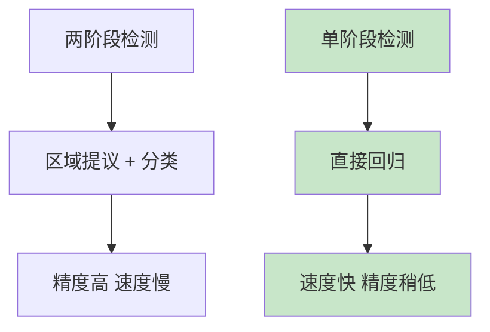
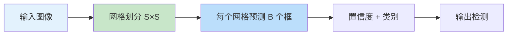

# YOLO 系列目标检测
> **分类**: 目标检测（计算机视觉） | **编号**: CV-25 | **更新时间**: 2026-04-01 | **难度**: ⭐⭐⭐⭐

`目标检测` `YOLO` `R-CNN` `DETR` `计算机视觉` `实时检测`

**摘要**: YOLO（You Only Look Once）系列是实时目标检测的代表算法，由 Joseph Redmon 等人提出。

---
## 概述

YOLO（You Only Look Once）系列是实时目标检测的代表算法，由 Joseph Redmon 等人提出。YOLO 将目标检测转化为单次回归问题，实现了极高的检测速度，成为单阶段检测的经典架构。从 YOLOv1 到 YOLOv8，该系列持续演进，在速度和精度之间取得了优秀平衡。

## YOLO 核心思想

### 从两阶段到单阶段



### YOLO 原理



**核心：** 将图像划分为 S×S 网格，每个网格预测 B 个边界框及其置信度和类别概率。

## YOLOv1

### 输出编码

```python
import torch
import torch.nn as nn

class YOLOv1(nn.Module):
    def __init__(self, num_classes=20, grid_size=7, num_boxes=2):
        super().__init__()
        # 输出：S×S×(B×5 + C)
        # 7×7×(2×5 + 20) = 7×7×30
        self.output_size = grid_size * grid_size * (num_boxes * 5 + num_classes)
        
        self.features = nn.Sequential(
            nn.Conv2d(3, 64, 7, 2, 3),
            nn.LeakyReLU(0.1),
            nn.MaxPool2d(2, 2),
            nn.Conv2d(64, 192, 3, padding=1),
            nn.LeakyReLU(0.1),
            nn.MaxPool2d(2, 2),
            # ... 更多层
            nn.Conv2d(1024, 512, 3, padding=1),
            nn.LeakyReLU(0.1),
            nn.Conv2d(512, self.output_size, 1),
        )
    
    def forward(self, x):
        return self.features(x)

# 测试
model = YOLOv1()
x = torch.randn(1, 3, 448, 448)
output = model(x)
print(f"YOLOv1: {x.shape} -> {output.shape}")
print(f"输出：7×7×30 = {7*7*30}")
```

### 损失函数

```python
class YOLOLoss(nn.Module):
    def __init__(self, lambda_coord=5.0, lambda_noobj=0.5):
        super().__init__()
        self.lambda_coord = lambda_coord  # 坐标损失权重
        self.lambda_noobj = lambda_noobj  # 无目标损失权重
    
    def forward(self, pred, target):
        # pred: (batch, S*S, B*5+C)
        # target: (batch, S*S, B*5+C)
        
        # 分离输出
        pred_boxes = pred[:, :, :10].view(-1, 7, 7, 2, 5)
        pred_conf = pred[:, :, 10:12].view(-1, 7, 7, 2, 1)
        pred_class = pred[:, :, 12:].view(-1, 7, 7, 20)
        
        # 计算损失
        loss_xy = self.lambda_coord * nn.functional.mse_loss(pred_boxes[..., :2], target[..., :2])
        loss_wh = self.lambda_coord * nn.functional.mse_loss(pred_boxes[..., 2:4], target[..., 2:4])
        loss_conf = nn.functional.mse_loss(pred_conf, target[..., 4:5])
        loss_class = nn.functional.mse_loss(pred_class, target[..., 5:])
        
        return loss_xy + loss_wh + loss_conf + loss_class
```

## YOLOv2 (YOLO9000)

### 改进点

1. **Batch Normalization**
2. **高分辨率分类器**
3. **锚框（Anchor Boxes）**
4. **多尺度训练**
5. **维度聚类（K-means）**

### 锚框改进

```python
# YOLOv2 使用 K-means 聚类确定锚框尺寸
def kmeans_iou(box, clusters):
    """计算 box 与聚类中心的 IoU"""
    x = np.minimum(clusters[:, 0], box[0])
    y = np.minimum(clusters[:, 1], box[1])
    intersection = x * y
    box_area = box[0] * box[1]
    cluster_area = clusters[:, 0] * clusters[:, 1]
    iou = intersection / (box_area + cluster_area - intersection)
    return iou
```

## YOLOv3

### 核心特性

1. **Darknet-53 Backbone**
2. **特征金字塔（FPN）**
3. **多尺度预测**
4. **逻辑回归分类**

### Darknet-53

```python
class DarknetBlock(nn.Module):
    def __init__(self, in_channels, out_channels):
        super().__init__()
        self.conv1 = nn.Conv2d(in_channels, out_channels, 1)
        self.bn1 = nn.BatchNorm2d(out_channels)
        self.conv2 = nn.Conv2d(out_channels, out_channels * 2, 3, padding=1)
        self.bn2 = nn.BatchNorm2d(out_channels * 2)
        self.leaky = nn.LeakyReLU(0.1)
    
    def forward(self, x):
        out = self.leaky(self.bn1(self.conv1(x)))
        out = self.leaky(self.bn2(self.conv2(out)))
        return x + out  # 残差连接

class YOLOv3(nn.Module):
    def __init__(self, num_classes=80):
        super().__init__()
        self.backbone = nn.Sequential(
            # Darknet-53
            nn.Conv2d(3, 32, 3, padding=1),
            DarknetBlock(32, 64),
            # ... 更多层
        )
        
        # 三个尺度的检测头
        self.detect1 = nn.Conv2d(512, 3 * (5 + num_classes), 1)  # 13×13
        self.detect2 = nn.Conv2d(256, 3 * (5 + num_classes), 1)  # 26×26
        self.detect3 = nn.Conv2d(128, 3 * (5 + num_classes), 1)  # 52×52
    
    def forward(self, x):
        features = self.backbone(x)
        
        # 多尺度输出
        out1 = self.detect1(features['layer1'])
        out2 = self.detect2(features['layer2'])
        out3 = self.detect3(features['layer3'])
        
        return out1, out2, out3
```

## YOLO 演进

| 版本 | 年份 | mAP | FPS | 特点 |
|-----|------|-----|-----|------|
| YOLOv1 | 2016 | 63.4 | 45 | 单次回归 |
| YOLOv2 | 2017 | 76.8 | 67 | 锚框+BN |
| YOLOv3 | 2018 | 79.4 | 55 | FPN+Darknet-53 |
| YOLOv4 | 2020 | 82.8 | 65 | CSP+Mosaic |
| YOLOv5 | 2020 | 83.2 | 140 | 工程优化 |
| YOLOv8 | 2023 | 84.0 | 180 | 无锚框 |

## 实际应用

```python
from ultralytics import YOLO

# 加载模型
model = YOLO('yolov8n.pt')

# 推理
results = model('image.jpg')

# 结果处理
for result in results:
    boxes = result.boxes  # 边界框
    masks = result.masks  # 掩码（分割模型）
    probs = result.probs  # 分类概率
```

## 总结

YOLO 系列通过单阶段检测实现了实时目标检测，持续演进在速度和精度之间取得了优秀平衡。理解 YOLO 的核心思想和各版本特点，对于实时检测应用至关重要。
