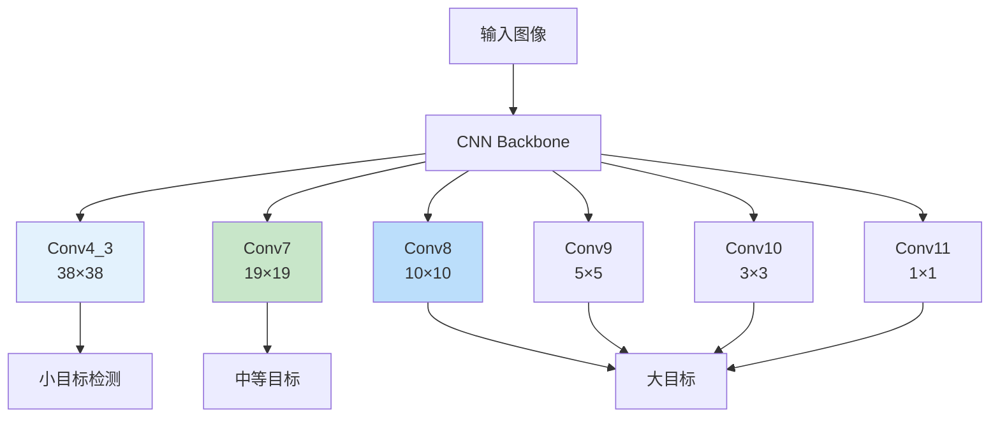

# SSD（Single Shot MultiBox Detector）
> **分类**: 目标检测（计算机视觉） | **编号**: CV-26 | **更新时间**: 2026-04-01 | **难度**: ⭐⭐⭐⭐

`目标检测` `YOLO` `R-CNN` `DETR` `计算机视觉`

**摘要**: SSD 是由 Wei Liu 等人于 2016 年提出的单阶段目标检测算法。

---
## 概述

SSD 是由 Wei Liu 等人于 2016 年提出的单阶段目标检测算法。SSD 通过在多个尺度的特征图上进行预测，结合锚框机制，在保持高速度的同时提升了小目标检测性能，成为单阶段检测的经典架构。

## 核心思想

### 多尺度特征图预测



**关键：** 在不同尺度的特征图上预测不同大小的目标。

### 默认框（Default Boxes）

```python
import torch
import torch.nn as nn
import math

class SSD(nn.Module):
    def __init__(self, num_classes=21):
        super().__init__()
        self.num_classes = num_classes
        
        # Backbone (VGG16 修改版)
        self.vgg = nn.Sequential(
            nn.Conv2d(3, 64, 3, padding=1),
            nn.ReLU(),
            nn.Conv2d(64, 64, 3, padding=1),
            nn.ReLU(),
            nn.MaxPool2d(2, 2),
            # ... 更多层
            nn.Conv2d(512, 512, 3, padding=3, dilation=3),  # Conv5_3
            nn.ReLU(),
        )
        
        # 额外特征层
        self.extra_layers = nn.ModuleList([
            nn.Conv2d(1024, 256, 1),
            nn.Conv2d(256, 512, 3, stride=2, padding=1),
            nn.Conv2d(512, 128, 1),
            nn.Conv2d(128, 256, 3, stride=2, padding=1),
            nn.Conv2d(256, 128, 1),
            nn.Conv2d(128, 256, 3),
            nn.Conv2d(256, 128, 1),
            nn.Conv2d(128, 256, 3),
        ])
        
        # 检测头
        self.loc_layers = nn.ModuleList([
            nn.Conv2d(512, 4 * 4, 3, padding=1),   # Conv4_3: 4 anchors
            nn.Conv2d(1024, 6 * 4, 3, padding=1),  # Conv7: 6 anchors
            nn.Conv2d(512, 6 * 4, 3, padding=1),   # Conv8: 6 anchors
            nn.Conv2d(256, 6 * 4, 3, padding=1),   # Conv9: 6 anchors
            nn.Conv2d(256, 4 * 4, 3, padding=1),   # Conv10: 4 anchors
            nn.Conv2d(256, 4 * 4, 3, padding=1),   # Conv11: 4 anchors
        ])
        
        self.conf_layers = nn.ModuleList([
            nn.Conv2d(512, 4 * num_classes, 3, padding=1),
            nn.Conv2d(1024, 6 * num_classes, 3, padding=1),
            nn.Conv2d(512, 6 * num_classes, 3, padding=1),
            nn.Conv2d(256, 6 * num_classes, 3, padding=1),
            nn.Conv2d(256, 4 * num_classes, 3, padding=1),
            nn.Conv2d(256, 4 * num_classes, 3, padding=1),
        ])
    
    def forward(self, x):
        # Backbone
        features = []
        for layer in self.vgg:
            x = layer(x)
        features.append(x)  # Conv7
        
        # 额外层
        for i, layer in enumerate(self.extra_layers):
            x = layer(x)
            if i % 2 == 1:
                features.append(x)
        
        # 多尺度预测
        loc_preds = []
        conf_preds = []
        
        for i, feature in enumerate(features):
            loc = self.loc_layers[i](feature)
            loc = loc.permute(0, 2, 3, 1).contiguous()
            loc = loc.view(loc.size(0), -1, 4)
            loc_preds.append(loc)
            
            conf = self.conf_layers[i](feature)
            conf = conf.permute(0, 2, 3, 1).contiguous()
            conf = conf.view(conf.size(0), -1, self.num_classes)
            conf_preds.append(conf)
        
        loc_preds = torch.cat(loc_preds, dim=1)
        conf_preds = torch.cat(conf_preds, dim=1)
        
        return loc_preds, conf_preds

# 测试
model = SSD()
x = torch.randn(1, 3, 300, 300)
loc, conf = model(x)
print(f"SSD: {x.shape} -> loc: {loc.shape}, conf: {conf.shape}")
print(f"总锚框数：{loc.shape[1]}")
```

### 锚框配置

```python
# SSD300 锚框配置
ssd_config = {
    '38×38': {'size': 30, 'aspect_ratios': [1]},  # 4 anchors
    '19×19': {'size': 60, 'aspect_ratios': [1, 2, 3, 1/2]},  # 6 anchors
    '10×10': {'size': 111, 'aspect_ratios': [1, 2, 3, 1/2]},  # 6 anchors
    '5×5': {'size': 162, 'aspect_ratios': [1, 2, 3, 1/2]},  # 6 anchors
    '3×3': {'size': 213, 'aspect_ratios': [1, 2]},  # 4 anchors
    '1×1': {'size': 264, 'aspect_ratios': [1, 2]},  # 4 anchors
}

# 总锚框数：38²×4 + 19²×6 + 10²×6 + 5²×6 + 3²×4 + 1²×4 = 8732
```

## 损失函数

```python
class SS DLoss(nn.Module):
    def __init__(self, num_classes=21, neg_pos_ratio=3):
        super().__init__()
        self.num_classes = num_classes
        self.neg_pos_ratio = neg_pos_ratio
        self.softmax = nn.Softmax(dim=-1)
    
    def forward(self, loc_preds, loc_targets, conf_preds, conf_targets):
        # 定位损失（Smooth L1）
        pos_mask = conf_targets > 0
        num_pos = pos_mask.sum()
        
        if num_pos > 0:
            loss_loc = nn.functional.smooth_l1_loss(
                loc_preds[pos_mask], 
                loc_targets[pos_mask],
                reduction='sum'
            ) / num_pos
        else:
            loss_loc = loc_preds.sum() * 0
        
        # 分类损失（Cross Entropy）
        conf_preds = conf_preds.view(-1, self.num_classes)
        conf_targets = conf_targets.view(-1)
        
        # 难例挖掘
        conf_loss = nn.functional.cross_entropy(conf_preds, conf_targets, reduction='none')
        pos_loss = conf_loss * pos_mask.view(-1)
        neg_loss = conf_loss * (1 - pos_mask.view(-1).float())
        
        # 选择负样本
        num_neg = (self.neg_pos_ratio * num_pos).int()
        _, neg_idx = neg_loss.sort(descending=True)
        neg_mask = torch.zeros_like(conf_targets, dtype=torch.bool)
        neg_mask[neg_idx[:num_neg]] = True
        
        loss_conf = (pos_loss.sum() + neg_loss[neg_mask].sum()) / num_pos
        
        return loss_loc, loss_conf
```

## 性能对比

| 模型 | 输入 | mAP | FPS |
|-----|------|-----|-----|
| Faster R-CNN | 1000×600 | 73.2 | 7 |
| SSD300 | 300×300 | 74.3 | 46 |
| SSD512 | 512×512 | 76.8 | 19 |
| YOLOv2 | 544×544 | 76.8 | 67 |

## 实际应用

```python
# 使用 torchvision
from torchvision.models.detection import ssd300_vgg16

model = ssd300_vgg16(weights='DEFAULT')
model.eval()

image = torch.randn(3, 300, 300)
predictions = model([image])
print(f"检测结果：{len(predictions[0]['boxes'])} 个目标")
```

## 总结

SSD 通过多尺度特征图预测和锚框机制，在单阶段检测中实现了速度和精度的优秀平衡。其设计思想（多尺度预测、默认框）深刻影响了后续检测算法的发展。
