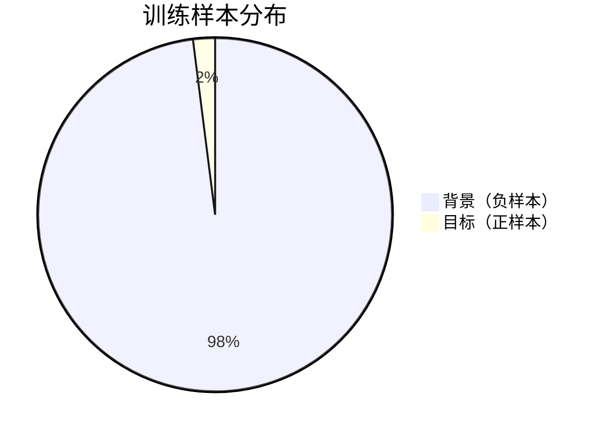
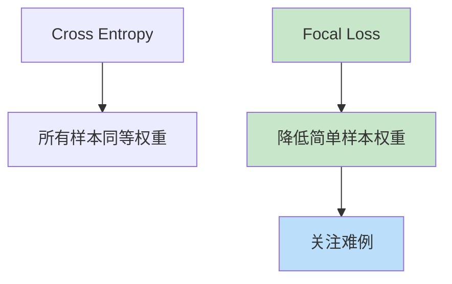

# RetinaNet
> **分类**: 目标检测（计算机视觉） | **编号**: CV-27 | **更新时间**: 2026-04-01 | **难度**: ⭐⭐⭐⭐

`目标检测` `YOLO` `R-CNN` `DETR` `计算机视觉`

**摘要**: RetinaNet 是由 Tsung-Yi Lin 等人于 2017 年提出的单阶段目标检测算法，通过引入 Focal Loss 解决了正负样本极度不平衡的问题，在单阶段检测中首次超越了两阶段检...

---
## 概述

RetinaNet 是由 Tsung-Yi Lin 等人于 2017 年提出的单阶段目标检测算法，通过引入 Focal Loss 解决了正负样本极度不平衡的问题，在单阶段检测中首次超越了两阶段检测的精度。

## 核心问题：样本不平衡

### 正负样本比例



**问题：** 单阶段检测中，99% 以上的锚框是背景，导致：
1. 大量简单负样本主导损失
2. 模型学习不到有用特征
3. 精度低于两阶段检测

### 解决方案：Focal Loss



## Focal Loss

### 公式

$$FL(p_t) = -\alpha_t (1 - p_t)^\gamma \log(p_t)$$

其中：
- $p_t$ 是预测概率
- $\alpha_t$ 是类别权重
- $\gamma$ 是聚焦参数（通常 2.0）

### 特性

```python
import torch
import torch.nn as nn
import torch.nn.functional as F

class FocalLoss(nn.Module):
    def __init__(self, alpha=0.25, gamma=2.0):
        super().__init__()
        self.alpha = alpha
        self.gamma = gamma
    
    def forward(self, inputs, targets):
        # inputs: (batch, num_anchors, num_classes)
        # targets: (batch, num_anchors, num_classes)
        
        bce_loss = F.binary_cross_entropy_with_logits(
            inputs, targets, reduction='none'
        )
        
        # 计算 p_t
        probs = torch.sigmoid(inputs)
        p_t = probs * targets + (1 - probs) * (1 - targets)
        
        # 计算权重
        alpha_t = self.alpha * targets + (1 - self.alpha) * (1 - targets)
        focal_weight = alpha_t * (1 - p_t) ** self.gamma
        
        # Focal Loss
        focal_loss = focal_weight * bce_loss
        
        return focal_loss.mean()

# 对比 Cross Entropy
ce_loss = nn.BCEWithLogitsLoss()
focal_loss = FocalLoss()

# 简单样本 (p_t = 0.9)
p_t = 0.9
ce = -torch.log(torch.tensor(p_t))
fl = -(1 - p_t) ** 2 * torch.log(torch.tensor(p_t))

print(f"简单样本 (p_t=0.9):")
print(f"  CE Loss: {ce:.4f}")
print(f"  Focal Loss: {fl:.4f} (降低 {ce/fl:.1f}x)")

# 难例 (p_t = 0.1)
p_t = 0.1
ce = -torch.log(torch.tensor(p_t))
fl = -(1 - p_t) ** 2 * torch.log(torch.tensor(p_t))

print(f"\n难例 (p_t=0.1):")
print(f"  CE Loss: {ce:.4f}")
print(f"  Focal Loss: {fl:.4f} (降低 {ce/fl:.1f}x)")
```

### 效果

| γ 值 | 简单样本权重 | 难例权重 |
|-----|------------|---------|
| 0 | 1.0 | 1.0 |
| 1 | 0.1 | 0.9 |
| 2 | 0.01 | 0.81 |

γ=2 时，简单样本权重降至 1%，难例权重保持 81%。

## RetinaNet 架构

### 整体结构

```python
import torch.nn as nn

class RetinaNet(nn.Module):
    def __init__(self, num_classes=80):
        super().__init__()
        # Backbone (ResNet-50 + FPN)
        self.backbone = nn.Sequential(
            # ResNet-50
            # FPN: P3, P4, P5, P6, P7
        )
        
        # 分类子网
        self.cls_subnet = nn.Sequential(
            nn.Conv2d(256, 256, 3, padding=1),
            nn.ReLU(),
            nn.Conv2d(256, 256, 3, padding=1),
            nn.ReLU(),
            nn.Conv2d(256, 256, 3, padding=1),
            nn.ReLU(),
            nn.Conv2d(256, 256, 3, padding=1),
            nn.ReLU(),
            nn.Conv2d(256, 9 * num_classes, 3, padding=1),
        )
        
        # 回归子网
        self.reg_subnet = nn.Sequential(
            nn.Conv2d(256, 256, 3, padding=1),
            nn.ReLU(),
            nn.Conv2d(256, 256, 3, padding=1),
            nn.ReLU(),
            nn.Conv2d(256, 256, 3, padding=1),
            nn.ReLU(),
            nn.Conv2d(256, 256, 3, padding=1),
            nn.ReLU(),
            nn.Conv2d(256, 9 * 4, 3, padding=1),
        )
    
    def forward(self, x):
        # FPN 特征
        features = self.backbone(x)
        
        # 多尺度预测
        cls_preds = []
        reg_preds = []
        
        for feat in features:
            cls_pred = self.cls_subnet(feat)
            cls_pred = cls_pred.permute(0, 2, 3, 1).contiguous()
            cls_pred = cls_pred.view(cls_pred.size(0), -1, self.num_classes)
            cls_preds.append(cls_pred)
            
            reg_pred = self.reg_subnet(feat)
            reg_pred = reg_pred.permute(0, 2, 3, 1).contiguous()
            reg_pred = reg_pred.view(reg_pred.size(0), -1, 4)
            reg_preds.append(reg_pred)
        
        cls_preds = torch.cat(cls_preds, dim=1)
        reg_preds = torch.cat(reg_preds, dim=1)
        
        return cls_preds, reg_preds
```

### 特征金字塔（FPN）

```python
class FPN(nn.Module):
    def __init__(self, in_channels_list=[256, 512, 1024, 2048], out_channels=256):
        super().__init__()
        
        # 横向连接
        self.inner_layers = nn.ModuleList([
            nn.Conv2d(in_channels, out_channels, 1)
            for in_channels in in_channels_list
        ])
        
        # 输出层
        self.layer_blocks = nn.ModuleList([
            nn.Conv2d(out_channels, out_channels, 3, padding=1)
            for _ in range(len(in_channels_list))
        ])
    
    def forward(self, features):
        # 自顶向下
        last_inner = self.inner_layers[-1](features[-1])
        results = [self.layer_blocks[-1](last_inner)]
        
        for i in range(len(features) - 2, -1, -1):
            inner = self.inner_layers[i](features[i])
            top_down = nn.functional.interpolate(
                last_inner, scale_factor=2, mode='nearest'
            )
            last_inner = inner + top_down
            results.insert(0, self.layer_blocks[i](last_inner))
        
        return results
```

## 训练技巧

### 1. 锚框匹配

```python
def match_anchors(anchors, gt_boxes, iou_threshold=0.5):
    """将锚框匹配到真实框"""
    num_anchors = len(anchors)
    num_gts = len(gt_boxes)
    
    # 计算 IoU
    ious = compute_iou(anchors, gt_boxes)
    
    # 匹配
    matched_gt = ious.argmax(dim=1)
    max_ious = ious.max(dim=1)[0]
    
    # 正负样本
    pos_mask = max_ious >= iou_threshold
    neg_mask = max_ious < iou_threshold
    
    return matched_gt, pos_mask, neg_mask
```

### 2. 数据增强

```python
from torchvision import transforms

train_transform = transforms.Compose([
    transforms.RandomHorizontalFlip(),
    transforms.ColorJitter(0.4, 0.4, 0.4),
    transforms.ToTensor(),
    transforms.Normalize([0.485, 0.456, 0.406], 
                         [0.229, 0.224, 0.225]),
])
```

## 性能对比

| 模型 | Backbone | mAP | FPS |
|-----|---------|-----|-----|
| Faster R-CNN | ResNet-101 | 36.2 | 7 |
| SSD512 | VGG16 | 31.2 | 19 |
| RetinaNet | ResNet-101 | 39.1 | 12 |
| RetinaNet | ResNeXt-101 | 40.8 | 10 |

## 实际应用

```python
from torchvision.models.detection import retinanet_resnet50_fpn

model = retinanet_resnet50_fpn(weights='DEFAULT')
model.eval()

image = torch.randn(3, 800, 800)
predictions = model([image])
print(f"检测结果：{len(predictions[0]['boxes'])} 个目标")
```

## 总结

RetinaNet 通过 Focal Loss 解决了正负样本不平衡问题，在单阶段检测中实现了 SOTA 精度。Focal Loss 的设计思想（关注难例）对不平衡学习问题具有广泛指导意义。
