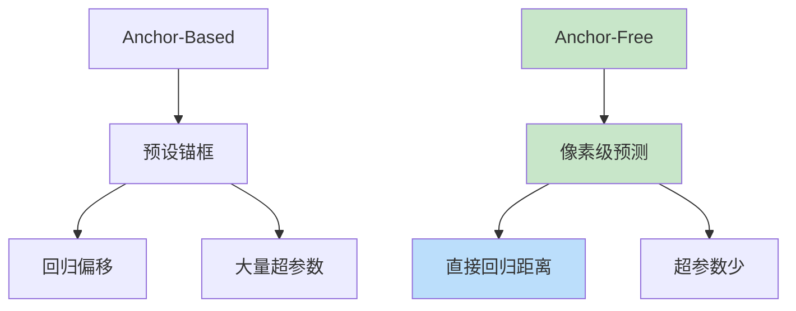
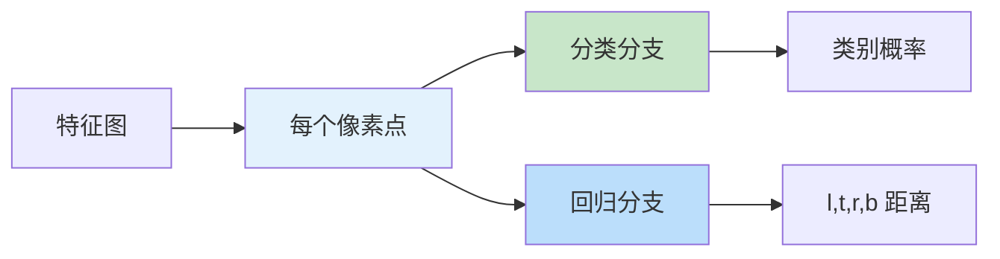

# FCOS（Fully Convolutional One-Stage）
> **分类**: 目标检测（计算机视觉） | **编号**: CV-28 | **更新时间**: 2026-04-01 | **难度**: ⭐⭐⭐⭐

`目标检测` `YOLO` `R-CNN` `DETR` `计算机视觉`

**摘要**: FCOS 是由 Tian Zhi 等人于 2019 年提出的无锚框（Anchor-Free）单阶段目标检测算法。

---
## 概述

FCOS 是由 Tian Zhi 等人于 2019 年提出的无锚框（Anchor-Free）单阶段目标检测算法。FCOS 摒弃了传统的锚框机制，采用像素级预测方式，简化了检测流程，在保持高精度的同时减少了超参数。

## 核心创新：无锚框检测

### 从 Anchor-Based 到 Anchor-Free



### FCOS 原理



**核心：** 每个像素点预测：
1. 类别概率
2. 到边界框四边的距离（left, top, right, bottom）

## FCOS 架构

### 网络结构

```python
import torch
import torch.nn as nn
import torch.nn.functional as F

class FCOSHead(nn.Module):
    def __init__(self, num_classes=80, in_channels=256):
        super().__init__()
        
        # 分类塔
        self.cls_tower = nn.Sequential(
            nn.Conv2d(in_channels, in_channels, 3, padding=1),
            nn.GroupNorm(32, in_channels),
            nn.ReLU(),
            nn.Conv2d(in_channels, in_channels, 3, padding=1),
            nn.GroupNorm(32, in_channels),
            nn.ReLU(),
            nn.Conv2d(in_channels, in_channels, 3, padding=1),
            nn.GroupNorm(32, in_channels),
            nn.ReLU(),
            nn.Conv2d(in_channels, in_channels, 3, padding=1),
            nn.GroupNorm(32, in_channels),
            nn.ReLU(),
        )
        
        # 回归塔
        self.reg_tower = nn.Sequential(
            nn.Conv2d(in_channels, in_channels, 3, padding=1),
            nn.GroupNorm(32, in_channels),
            nn.ReLU(),
            nn.Conv2d(in_channels, in_channels, 3, padding=1),
            nn.GroupNorm(32, in_channels),
            nn.ReLU(),
            nn.Conv2d(in_channels, in_channels, 3, padding=1),
            nn.GroupNorm(32, in_channels),
            nn.ReLU(),
            nn.Conv2d(in_channels, in_channels, 3, padding=1),
            nn.GroupNorm(32, in_channels),
            nn.ReLU(),
        )
        
        # 输出层
        self.cls_pred = nn.Conv2d(in_channels, num_classes, 3, padding=1)
        self.reg_pred = nn.Conv2d(in_channels, 4, 3, padding=1)
        self.centerness = nn.Conv2d(in_channels, 1, 3, padding=1)
    
    def forward(self, x):
        cls_feat = self.cls_tower(x)
        cls_pred = self.cls_pred(cls_feat)
        
        reg_feat = self.reg_tower(x)
        reg_pred = self.reg_pred(reg_feat)
        reg_pred = torch.exp(reg_pred)  # 确保正值
        
        centerness = self.centerness(reg_feat)
        
        return cls_pred, reg_pred, centerness

class FCOS(nn.Module):
    def __init__(self, num_classes=80):
        super().__init__()
        # Backbone + FPN
        self.backbone = nn.Sequential(
            # ResNet-50
            # FPN: P3, P4, P5, P6, P7
        )
        
        # 多尺度检测头
        self.fcos_head = FCOSHead(num_classes)
    
    def forward(self, x):
        features = self.backbone(x)
        
        cls_preds = []
        reg_preds = []
        center_preds = []
        
        for feat in features:
            cls_pred, reg_pred, center_pred = self.fcos_head(feat)
            
            # 展平
            cls_pred = cls_pred.permute(0, 2, 3, 1).contiguous()
            cls_pred = cls_pred.view(cls_pred.size(0), -1, cls_pred.size(1))
            
            reg_pred = reg_pred.permute(0, 2, 3, 1).contiguous()
            reg_pred = reg_pred.view(reg_pred.size(0), -1, 4)
            
            center_pred = center_pred.permute(0, 2, 3, 1).contiguous()
            center_pred = center_pred.view(center_pred.size(0), -1, 1)
            
            cls_preds.append(cls_pred)
            reg_preds.append(reg_pred)
            center_preds.append(center_pred)
        
        cls_preds = torch.cat(cls_preds, dim=1)
        reg_preds = torch.cat(reg_preds, dim=1)
        center_preds = torch.cat(center_preds, dim=1)
        
        return cls_preds, reg_preds, center_preds
```

### 中心度（Centerness）

```python
def centerness_loss(reg_pred, targets):
    """
    中心度损失：鼓励预测框中心接近目标中心
    """
    # targets: [l, t, r, b]
    l, t, r, b = targets.unbind(dim=-1)
    
    # 中心度 = sqrt((min(l,r) * min(t,b)) / (max(l,r) * max(t,b)))
    left_right = torch.stack([l, r], dim=-1).min(dim=-1)[0] / \
                 torch.stack([l, r], dim=-1).max(dim=-1)[0]
    top_bottom = torch.stack([t, b], dim=-1).min(dim=-1)[0] / \
                 torch.stack([t, b], dim=-1).max(dim=-1)[0]
    
    centerness_target = torch.sqrt(left_right * top_bottom)
    
    # BCE Loss
    loss = F.binary_cross_entropy_with_logits(
        reg_pred, centerness_target, reduction='none'
    )
    
    return loss.mean()
```

## 损失函数

```python
class FCOSLoss(nn.Module):
    def __init__(self, num_classes=80):
        super().__init__()
        self.num_classes = num_classes
    
    def forward(self, cls_preds, reg_preds, center_preds, 
                labels, reg_targets, centerness_targets):
        # 分类损失（Focal Loss）
        pos_mask = labels >= 0
        num_pos = pos_mask.sum()
        
        if num_pos > 0:
            # Focal Loss
            cls_loss = focal_loss(cls_preds[pos_mask], labels[pos_mask])
            
            # 回归损失（IoU Loss）
            reg_loss = iou_loss(reg_preds[pos_mask], reg_targets[pos_mask])
            
            # 中心度损失
            center_loss = F.binary_cross_entropy_with_logits(
                center_preds[pos_mask], 
                centerness_targets[pos_mask],
                reduction='sum'
            ) / num_pos
            
            return cls_loss, reg_loss, center_loss
        else:
            return cls_preds.sum() * 0, reg_preds.sum() * 0, center_preds.sum() * 0
```

## 训练技巧

### 1. 正负样本定义

```python
def compute_targets(anchors, gt_boxes, strides):
    """
    计算每个像素点的回归目标和标签
    """
    # 对于每个像素点，计算到 GT 框四边的距离
    # 如果点在 GT 框内，则为正样本
    # 否则为负样本
    
    # 多尺度限制：每个 GT 只匹配特定尺度的特征图
    # 避免歧义
    pass
```

### 2. 多尺度训练

```python
# 随机选择输入尺寸
sizes = [640, 672, 704, 736, 768, 800]
size = random.choice(sizes)
```

## 性能对比

| 模型 | Backbone | mAP | FPS |
|-----|---------|-----|-----|
| RetinaNet | ResNet-101 | 39.1 | 12 |
| FCOS | ResNet-101 | 40.5 | 13 |
| FCOS | ResNeXt-101 | 42.6 | 11 |
| Anchor-Free (CenterNet) | ResNet-101 | 42.1 | 14 |

## 实际应用

```python
# 使用 detectron2
from detectron2.config import get_cfg
from detectron2.engine import DefaultPredictor

cfg = get_cfg()
cfg.merge_from_file("configs/COCO-Detection/fcos_R_50_FPN_1x.yaml")
cfg.MODEL.WEIGHTS = "detectron2://COCO-Detection/fcos_R_50_FPN_1x/xxxx.pkl"

predictor = DefaultPredictor(cfg)
outputs = predictor(image)
```

## 总结

FCOS 通过无锚框设计简化了检测流程，采用像素级预测和中心度机制，在保持高精度的同时减少了超参数。Anchor-Free 的设计思想为后续检测算法（如 CenterNet、ATSS）提供了重要启发。
