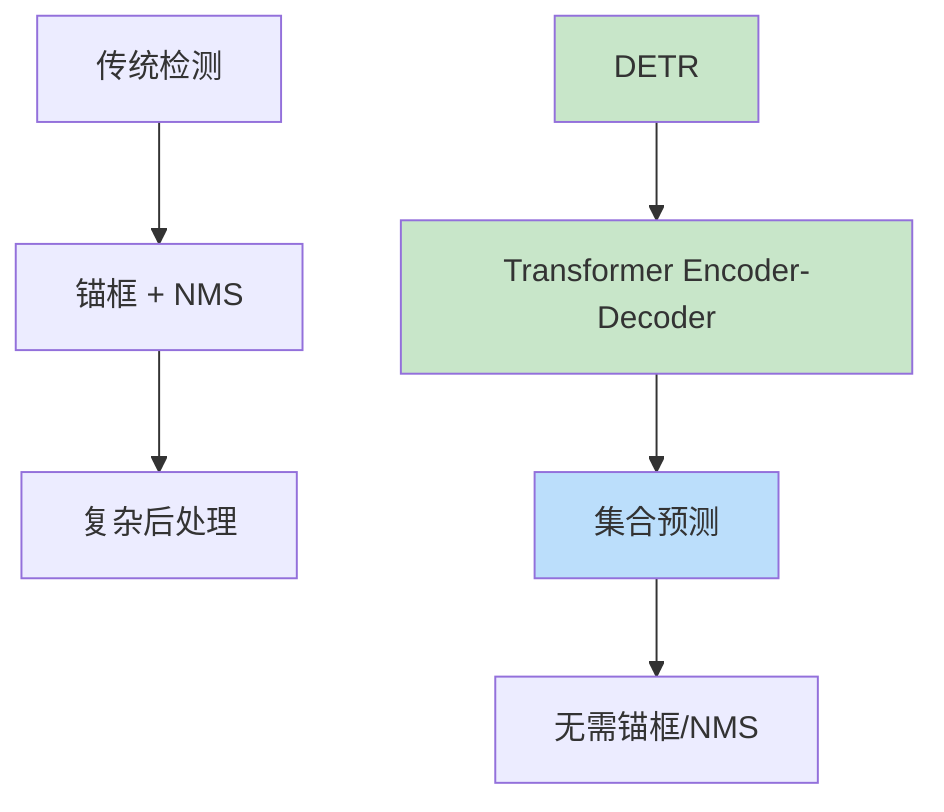

# DETR（DEtection TRansformer）

> **分类**: 计算机视觉 | **编号**: 029 | **更新时间**: 2026-03-30 | **难度**: ⭐⭐

`CV` `Transformer` `Attention` `CNN` `损失函数`

**摘要**: DETR 是由 Facebook AI Research 的 Nicolas Carion 等人于 2020 年提出的基于 Transformer 的目标检测算法。

---
## 概述

DETR 是由 Facebook AI Research 的 Nicolas Carion 等人于 2020 年提出的基于 Transformer 的目标检测算法。DETR 首次将 Transformer 成功应用于目标检测，通过集合预测和二分图匹配，实现了端到端的检测流程，无需锚框和非极大值抑制（NMS）。

## 核心创新

### 从 CNN 到 Transformer



### 整体架构


## DETR 架构详解

### 网络结构

```python
import torch
import torch.nn as nn
import torch.nn.functional as F
import math

class PositionalEncoding(nn.Module):
    def __init__(self, d_model, max_h=50, max_w=50):
        super().__init__()
        self.d_model = d_model
        
        # 2D 位置编码
        pe = torch.zeros(d_model, max_h, max_w)
        y_embed = torch.arange(max_h).float().unsqueeze(1)
        x_embed = torch.arange(max_w).float().unsqueeze(0)
        
        div_y = 2 * math.pi / d_model
        div_x = 2 * math.pi / d_model
        
        pe_y = y_embed * div_y
        pe_x = x_embed * div_x
        
        for i in range(d_model // 4):
            pe[2*i, :, :] = torch.sin(pe_y * (10000 ** (-4*i/d_model)))
            pe[2*i+1, :, :] = torch.cos(pe_y * (10000 ** (-4*i/d_model)))
            pe[d_model//2 + 2*i, :, :] = torch.sin(pe_x * (10000 ** (-4*i/d_model)))
            pe[d_model//2 + 2*i+1, :, :] = torch.cos(pe_x * (10000 ** (-4*i/d_model)))
        
        self.pe = pe.unsqueeze(0)
    
    def forward(self, x):
        return x + self.pe[:, :, :x.size(2), :x.size(3)]

class TransformerEncoderLayer(nn.Module):
    def __init__(self, d_model=256, nhead=8, dim_feedforward=2048):
        super().__init__()
        self.self_attn = nn.MultiheadAttention(d_model, nhead)
        self.linear1 = nn.Linear(d_model, dim_feedforward)
        self.linear2 = nn.Linear(dim_feedforward, d_model)
        
        self.norm1 = nn.LayerNorm(d_model)
        self.norm2 = nn.LayerNorm(d_model)
        
        self.dropout = nn.Dropout(0.1)
    
    def forward(self, src):
        # 自注意力
        src2 = self.self_attn(src, src, src)[0]
        src = src + self.dropout(src2)
        src = self.norm1(src)
        
        # FFN
        src2 = self.linear2(self.dropout(F.relu(self.linear1(src))))
        src = src + self.dropout(src2)
        src = self.norm2(src)
        
        return src

class TransformerDecoderLayer(nn.Module):
    def __init__(self, d_model=256, nhead=8, dim_feedforward=2048):
        super().__init__()
        self.self_attn = nn.MultiheadAttention(d_model, nhead)
        self.multihead_attn = nn.MultiheadAttention(d_model, nhead)
        self.linear1 = nn.Linear(d_model, dim_feedforward)
        self.linear2 = nn.Linear(dim_feedforward, d_model)
        
        self.norm1 = nn.LayerNorm(d_model)
        self.norm2 = nn.LayerNorm(d_model)
        self.norm3 = nn.LayerNorm(d_model)
        
        self.dropout = nn.Dropout(0.1)
    
    def forward(self, tgt, memory):
        # 自注意力
        tgt2 = self.self_attn(tgt, tgt, tgt)[0]
        tgt = tgt + self.dropout(tgt2)
        tgt = self.norm1(tgt)
        
        # 交叉注意力
        tgt2 = self.multihead_attn(tgt, memory, memory)[0]
        tgt = tgt + self.dropout(tgt2)
        tgt = self.norm2(tgt)
        
        # FFN
        tgt2 = self.linear2(self.dropout(F.relu(self.linear1(tgt))))
        tgt = tgt + self.dropout(tgt2)
        tgt = self.norm3(tgt)
        
        return tgt

class DETR(nn.Module):
    def __init__(self, num_classes=90, d_model=256, nhead=8, 
                 num_encoder_layers=6, num_decoder_layers=6,
                 num_queries=100):
        super().__init__()
        self.d_model = d_model
        self.num_queries = num_queries
        
        # Backbone (ResNet-50)
        self.backbone = nn.Sequential(
            nn.Conv2d(3, 64, 7, 2, 3),
            nn.BatchNorm2d(64),
            nn.ReLU(),
            nn.MaxPool2d(3, 2, 1),
            # ResNet 层...
        )
        
        # 输入投影
        self.input_proj = nn.Conv2d(2048, d_model, 1)
        
        # 位置编码
        self.pos_encoder = PositionalEncoding(d_model)
        
        # Transformer Encoder
        encoder_layer = TransformerEncoderLayer(d_model, nhead)
        self.transformer_encoder = nn.TransformerEncoder(
            encoder_layer, num_encoder_layers
        )
        
        # Transformer Decoder
        decoder_layer = TransformerDecoderLayer(d_model, nhead)
        self.transformer_decoder = nn.TransformerDecoder(
            decoder_layer, num_decoder_layers
        )
        
        # Object Queries
        self.query_embed = nn.Embedding(num_queries, d_model)
        
        # 预测头
        self.class_embed = nn.Linear(d_model, num_classes + 1)  # +1 为背景
        self.bbox_embed = nn.Sequential(
            nn.Linear(d_model, d_model),
            nn.ReLU(),
            nn.Linear(d_model, d_model),
            nn.ReLU(),
            nn.Linear(d_model, 4)
        )
    
    def forward(self, x):
        # Backbone
        features = self.backbone(x)
        
        # 投影 + 位置编码
        h = self.input_proj(features)
        b, c, h_size, w_size = h.shape
        
        # 展平
        h = h.flatten(2).permute(2, 0, 1)  # (hw, batch, dim)
        pos = self.pos_encoder(h)
        h = h + pos
        
        # Encoder
        memory = self.transformer_encoder(h)
        
        # Decoder
        queries = self.query_embed.weight.unsqueeze(1).repeat(1, b, 1)
        output = self.transformer_decoder(queries, memory)
        
        # 预测
        class_logits = self.class_embed(output.transpose(0, 1))
        boxes = self.bbox_embed(output.transpose(0, 1)).sigmoid()
        
        return class_logits, boxes

# 测试
model = DETR(num_classes=90, num_queries=100)
x = torch.randn(1, 3, 800, 800)
class_logits, boxes = model(x)
print(f"DETR: {x.shape} -> class: {class_logits.shape}, boxes: {boxes.shape}")
print(f"预测数量：{class_logits.shape[1]} (num_queries)")
```

### 二分图匹配

```python
from scipy.optimize import linear_sum_assignment

def hungarian_matching(pred_boxes, pred_logits, gt_boxes, gt_labels, 
                       cost_class=1, cost_bbox=5, cost_giou=2):
    """
    使用匈牙利算法进行一对一匹配
    """
    num_preds = len(pred_boxes)
    num_gts = len(gt_boxes)
    
    # 计算成本矩阵
    cost_matrix = torch.zeros(num_gts, num_preds)
    
    # 分类成本
    prob = F.softmax(pred_logits, dim=-1)
    cost_class = -prob[:, gt_labels].log()
    
    # 回归成本（L1 + GIoU）
    cost_bbox = torch.cdist(pred_boxes, gt_boxes, p=1)
    cost_giou = 1 - compute_giou(pred_boxes, gt_boxes)
    
    # 总成本
    cost_matrix = cost_class * cost_class + cost_bbox * cost_bbox + cost_giou * cost_giou
    
    # 匈牙利匹配
    row_ind, col_ind = linear_sum_assignment(cost_matrix.cpu())
    
    return row_ind, col_ind
```

## 损失函数

```python
class DETRLoss(nn.Module):
    def __init__(self, num_classes=90):
        super().__init__()
        self.num_classes = num_classes
    
    def forward(self, pred_logits, pred_boxes, gt_labels, gt_boxes):
        # 匈牙利匹配
        indices = hungarian_matching(pred_boxes, pred_logits, gt_boxes, gt_labels)
        
        # 分类损失
        target_classes = torch.full(pred_logits.shape[:2], self.num_classes, 
                                   dtype=torch.long, device=pred_logits.device)
        for batch_idx, (pred_idx, gt_idx) in enumerate(indices):
            target_classes[batch_idx, pred_idx] = gt_labels[gt_idx]
        
        loss_ce = F.cross_entropy(pred_logits.transpose(1, 2), target_classes)
        
        # 回归损失
        pos_indices = indices[0]
        pred_boxes_pos = pred_boxes[pos_indices]
        gt_boxes_pos = gt_boxes[indices[1]]
        
        loss_bbox = F.l1_loss(pred_boxes_pos, gt_boxes_pos)
        loss_giou = 1 - compute_giou(pred_boxes_pos, gt_boxes_pos).mean()
        
        return loss_ce, loss_bbox, loss_giou
```

## 训练技巧

### 1. 查询数量

```python
# 默认 100 个查询
# 对于密集场景可增加至 300+
num_queries = 100  # COCO
num_queries = 300  # 密集场景
```

### 2. 数据增强

```python
# DETR 使用强数据增强
train_transform = transforms.Compose([
    transforms.RandomHorizontalFlip(),
    transforms.RandomSelect(
        transforms.RandomResize([400, 500, 600]),
        transforms.Compose([
            transforms.RandomResize([400, 500, 600]),
            transforms.RandomSizeCrop(384, 600),
            transforms.RandomResize([400, 500, 600]),
        ])
    ),
    transforms.ColorJitter(0.4, 0.4, 0.4),
    transforms.ToTensor(),
    transforms.Normalize([0.485, 0.456, 0.406], 
                         [0.229, 0.224, 0.225]),
])
```

## 性能对比

| 模型 | Backbone | mAP | 训练时间 |
|-----|---------|-----|---------|
| Faster R-CNN | ResNet-50 | 36.9 | 12h |
| RetinaNet | ResNet-50 | 36.5 | 12h |
| DETR | ResNet-50 | 42.0 | 500 epochs |
| DETR | ResNet-101 | 43.5 | 500 epochs |

## 总结

DETR 通过 Transformer 实现了端到端的目标检测，无需锚框和 NMS，简化了检测流程。尽管训练收敛较慢，但其简洁的设计和优秀的性能为检测算法开辟了新方向。
