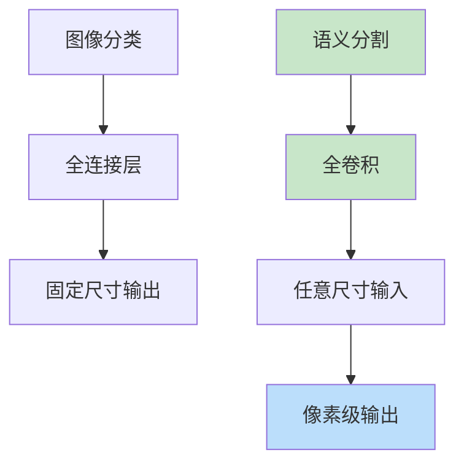
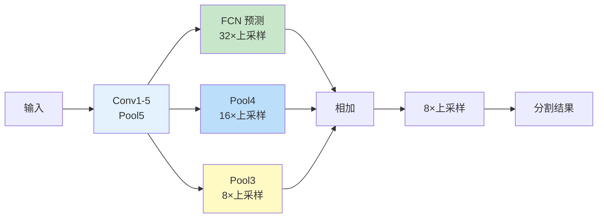

# FCN（Fully Convolutional Networks）
> **分类**: 图像分割（计算机视觉） | **编号**: CV-31 | **更新时间**: 2026-04-01 | **难度**: ⭐⭐⭐⭐

`图像分割` `语义分割` `实例分割` `计算机视觉`

**摘要**: FCN 是由 Jonathan Long 等人于 2015 年提出的全卷积网络，是语义分割领域的里程碑工作。

---
## 概述

FCN 是由 Jonathan Long 等人于 2015 年提出的全卷积网络，是语义分割领域的里程碑工作。FCN 通过将全连接层转换为卷积层，实现了端到端的像素级预测，开创了深度学习语义分割的新时代。

## 核心思想

### 从分类到分割



### 网络转换

```python
import torch
import torch.nn as nn
import torch.nn.functional as F

# 将全连接层转换为卷积层
def fc_to_conv(fc_layer):
    """将 Linear 层转换为 Conv2d 层"""
    weight = fc_layer.weight.data
    bias = fc_layer.bias.data
    
    # Reshape 权重
    in_features = fc_layer.in_features
    out_features = fc_layer.out_features
    
    # 转换为 1x1 卷积
    conv = nn.Conv2d(in_features, out_features, 1)
    conv.weight.data = weight.view(out_features, in_features, 1, 1)
    conv.bias.data = bias
    
    return conv

# 示例：VGG16 转换
class FCNVGG16(nn.Module):
    def __init__(self, num_classes=21):
        super().__init__()
        # 特征提取器（VGG16 前 13 层）
        self.features = nn.Sequential(
            nn.Conv2d(3, 64, 3, padding=1), nn.ReLU(),
            nn.Conv2d(64, 64, 3, padding=1), nn.ReLU(),
            nn.MaxPool2d(2, 2),
            nn.Conv2d(64, 128, 3, padding=1), nn.ReLU(),
            nn.Conv2d(128, 128, 3, padding=1), nn.ReLU(),
            nn.MaxPool2d(2, 2),
            nn.Conv2d(128, 256, 3, padding=1), nn.ReLU(),
            nn.Conv2d(256, 256, 3, padding=1), nn.ReLU(),
            nn.Conv2d(256, 256, 3, padding=1), nn.ReLU(),
            nn.MaxPool2d(2, 2),
            nn.Conv2d(256, 512, 3, padding=1), nn.ReLU(),
            nn.Conv2d(512, 512, 3, padding=1), nn.ReLU(),
            nn.Conv2d(512, 512, 3, padding=1), nn.ReLU(),
            nn.MaxPool2d(2, 2),
            nn.Conv2d(512, 512, 3, padding=1), nn.ReLU(),
            nn.Conv2d(512, 512, 3, padding=1), nn.ReLU(),
            nn.Conv2d(512, 512, 3, padding=1), nn.ReLU(),
            nn.MaxPool2d(2, 2),
        )
        
        # 分类器转换为卷积
        self.classifier = nn.Sequential(
            nn.Conv2d(512, 4096, 7), nn.ReLU(),
            nn.Dropout2d(0.5),
            nn.Conv2d(4096, 4096, 1), nn.ReLU(),
            nn.Dropout2d(0.5),
            nn.Conv2d(4096, num_classes, 1)
        )
    
    def forward(self, x):
        x = self.features(x)
        x = self.classifier(x)
        return x
```

## 跳跃连接

### FCN-8s 架构



```python
class FCN8s(nn.Module):
    def __init__(self, num_classes=21):
        super().__init__()
        self.features = nn.Sequential(
            # VGG16 features...
        )
        
        self.classifier = nn.Sequential(
            nn.Conv2d(512, 4096, 7), nn.ReLU(),
            nn.Dropout2d(0.5),
            nn.Conv2d(4096, 4096, 1), nn.ReLU(),
            nn.Dropout2d(0.5),
            nn.Conv2d(4096, num_classes, 1)
        )
        
        # 跳跃连接
        self.score_pool3 = nn.Conv2d(256, num_classes, 1)
        self.score_pool4 = nn.Conv2d(512, num_classes, 1)
    
    def forward(self, x):
        # 特征提取
        pool3 = self.features[:17](x)   # 1/8
        pool4 = self.features[17:24](pool3)  # 1/16
        pool5 = self.features[24:](pool4)    # 1/32
        
        # 主预测
        conv7 = self.classifier(pool5)
        
        # 上采样 + 跳跃连接
        upsample2 = F.interpolate(conv7, scale_factor=2, mode='bilinear', align_corners=True)
        score_pool4 = self.score_pool4(pool4)
        fused = upsample2 + score_pool4
        
        upsample4 = F.interpolate(fused, scale_factor=2, mode='bilinear', align_corners=True)
        score_pool3 = self.score_pool3(pool3)
        fused = upsample4 + score_pool3
        
        # 最终上采样 8 倍
        output = F.interpolate(fused, scale_factor=8, mode='bilinear', align_corners=True)
        
        return output
```

## 损失函数

```python
class CrossEntropyLoss2D(nn.Module):
    def __init__(self, weight=None, ignore_index=255):
        super().__init__()
        self.loss = nn.CrossEntropyLoss(weight=weight, ignore_index=ignore_index)
    
    def forward(self, pred, target):
        # pred: (batch, num_classes, h, w)
        # target: (batch, h, w)
        return self.loss(pred, target)
```

## 训练技巧

### 1. 数据增强

```python
from torchvision import transforms

train_transform = transforms.Compose([
    transforms.RandomHorizontalFlip(),
    transforms.RandomCrop(512, 512),
    transforms.ColorJitter(0.4, 0.4, 0.4),
    transforms.ToTensor(),
    transforms.Normalize([0.485, 0.456, 0.406], 
                         [0.229, 0.224, 0.225]),
])
```

### 2. 学习率调度

```python
optimizer = torch.optim.SGD(
    model.parameters(),
    lr=1e-7,
    momentum=0.9,
    weight_decay=1e-4
)

scheduler = torch.optim.lr_scheduler.PolynomialLR(
    optimizer, total_iters=100000, power=0.9
)
```

## 性能对比

| 模型 | mIoU (PASCAL) | 特点 |
|-----|--------------|------|
| FCN-32s | 62.2% | 基础版本 |
| FCN-16s | 62.8% | Pool4 跳跃 |
| FCN-8s | 65.5% | Pool3+Pool4 跳跃 |

## 总结

FCN 通过将全连接层转换为卷积层，实现了端到端的语义分割，开创了深度学习分割的新时代。其跳跃连接设计影响了后续 U-Net、DeepLab 等架构。
