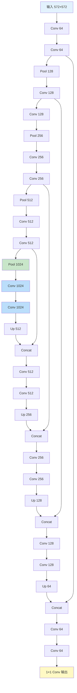
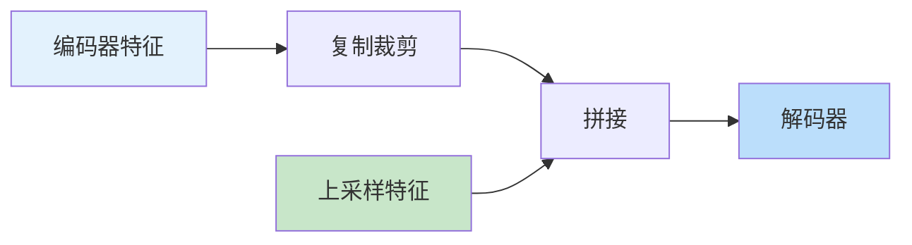

# U-Net

> **分类**: 计算机视觉 | **编号**: 032 | **更新时间**: 2026-03-30 | **难度**: ⭐⭐

`CV` `Attention` `神经网络` `卷积` `损失函数`

**摘要**: U-Net 是由 Olaf Ronneberger 等人于 2015 年提出的卷积神经网络架构，专为生物医学图像分割设计。

---
## 概述

U-Net 是由 Olaf Ronneberger 等人于 2015 年提出的卷积神经网络架构，专为生物医学图像分割设计。U-Net 通过编码器 - 解码器结构和跳跃连接，在少量训练数据下实现了优秀的分割性能，成为医学图像分割的标准架构。

## 网络架构

### U 型结构



### 实现

```python
import torch
import torch.nn as nn
import torch.nn.functional as F

class DoubleConv(nn.Module):
    def __init__(self, in_channels, out_channels):
        super().__init__()
        self.double_conv = nn.Sequential(
            nn.Conv2d(in_channels, out_channels, 3, padding=1),
            nn.BatchNorm2d(out_channels),
            nn.ReLU(inplace=True),
            nn.Conv2d(out_channels, out_channels, 3, padding=1),
            nn.BatchNorm2d(out_channels),
            nn.ReLU(inplace=True)
        )
    
    def forward(self, x):
        return self.double_conv(x)

class UNet(nn.Module):
    def __init__(self, n_channels=3, n_classes=1):
        super().__init__()
        
        # 编码器
        self.enc1 = DoubleConv(n_channels, 64)
        self.enc2 = DoubleConv(64, 128)
        self.enc3 = DoubleConv(128, 256)
        self.enc4 = DoubleConv(256, 512)
        
        # 瓶颈
        self.bottleneck = DoubleConv(512, 1024)
        
        # 解码器
        self.upconv4 = nn.ConvTranspose2d(1024, 512, 2, stride=2)
        self.dec4 = DoubleConv(1024, 512)
        
        self.upconv3 = nn.ConvTranspose2d(512, 256, 2, stride=2)
        self.dec3 = DoubleConv(512, 256)
        
        self.upconv2 = nn.ConvTranspose2d(256, 128, 2, stride=2)
        self.dec2 = DoubleConv(256, 128)
        
        self.upconv1 = nn.ConvTranspose2d(128, 64, 2, stride=2)
        self.dec1 = DoubleConv(128, 64)
        
        # 输出
        self.out_conv = nn.Conv2d(64, n_classes, 1)
        
        self.pool = nn.MaxPool2d(2)
    
    def forward(self, x):
        # 编码器
        enc1 = self.enc1(x)
        enc2 = self.enc2(self.pool(enc1))
        enc3 = self.enc3(self.pool(enc2))
        enc4 = self.enc4(self.pool(enc3))
        
        # 瓶颈
        bottleneck = self.bottleneck(self.pool(enc4))
        
        # 解码器（带跳跃连接）
        dec4 = self.upconv4(bottleneck)
        dec4 = torch.cat([dec4, enc4], dim=1)
        dec4 = self.dec4(dec4)
        
        dec3 = self.upconv3(dec4)
        dec3 = torch.cat([dec3, enc3], dim=1)
        dec3 = self.dec3(dec3)
        
        dec2 = self.upconv2(dec3)
        dec2 = torch.cat([dec2, enc2], dim=1)
        dec2 = self.dec2(dec2)
        
        dec1 = self.upconv1(dec2)
        dec1 = torch.cat([dec1, enc1], dim=1)
        dec1 = self.dec1(dec1)
        
        return self.out_conv(dec1)

# 测试
model = UNet(n_channels=1, n_classes=2)
x = torch.randn(1, 1, 572, 572)
output = model(x)
print(f"U-Net: {x.shape} -> {output.shape}")
print(f"参数量：{sum(p.numel() for p in model.parameters()):,}")
```

## 关键特性

### 1. 跳跃连接



**作用：**
- 保留空间信息
- 融合多尺度特征
- 改善梯度流动

### 2. 数据增强

```python
# U-Net 使用弹性形变增强
from scipy.ndimage import gaussian_filter, map_coordinates

def elastic_deform(image, alpha, sigma):
    """弹性形变数据增强"""
    shape = image.shape
    
    # 随机位移场
    dx = gaussian_filter(np.random.rand(*shape) * 2 - 1, sigma) * alpha
    dy = gaussian_filter(np.random.rand(*shape) * 2 - 1, sigma) * alpha
    
    # 网格
    x, y = np.meshgrid(np.arange(shape[1]), np.arange(shape[0]))
    
    # 变形
    indices = np.reshape(y + dy, (-1, 1)), np.reshape(x + dx, (-1, 1))
    deformed = map_coordinates(image, indices, order=1, mode='reflect')
    
    return deformed.reshape(shape)
```

### 3. 重叠推断

```python
def predict_overlap_tile(model, image, tile_size=572, overlap=114):
    """重叠瓦片预测，避免边界效应"""
    h, w = image.shape[:2]
    output = np.zeros((h, w), dtype=np.float32)
    count = np.zeros((h, w), dtype=np.float32)
    
    for i in range(0, h - tile_size + 1, tile_size - overlap):
        for j in range(0, w - tile_size + 1, tile_size - overlap):
            tile = image[i:i+tile_size, j:j+tile_size]
            pred = model(tile)
            
            # 加权平均（中心权重高）
            weight = np.ones_like(pred)
            margin = overlap // 2
            weight[:margin, :] *= np.linspace(0, 1, margin)[:, None]
            weight[-margin:, :] *= np.linspace(1, 0, margin)[:, None]
            weight[:, :margin] *= np.linspace(0, 1, margin)[None, :]
            weight[:, -margin:] *= np.linspace(1, 0, margin)[None, :]
            
            output[i:i+tile_size, j:j+tile_size] += pred * weight
            count[i:i+tile_size, j:j+tile_size] += weight
    
    return output / count
```

## 损失函数

```python
class DiceLoss(nn.Module):
    def __init__(self, smooth=1.0):
        super().__init__()
        self.smooth = smooth
    
    def forward(self, pred, target):
        pred = torch.sigmoid(pred)
        pred = pred.view(-1)
        target = target.view(-1)
        
        intersection = (pred * target).sum()
        dice = (2. * intersection + self.smooth) / \
               (pred.sum() + target.sum() + self.smooth)
        
        return 1 - dice

class CombinedLoss(nn.Module):
    def __init__(self):
        super().__init__()
        self.bce = nn.BCEWithLogitsLoss()
        self.dice = DiceLoss()
    
    def forward(self, pred, target):
        return self.bce(pred, target) + self.dice(pred, target)
```

## 变体

### 3D U-Net

```python
class UNet3D(nn.Module):
    def __init__(self, n_channels=1, n_classes=2):
        super().__init__()
        # 3D 卷积
        self.enc1 = nn.Sequential(
            nn.Conv3d(n_channels, 32, 3, padding=1),
            nn.BatchNorm3d(32),
            nn.ReLU(),
            nn.Conv3d(32, 32, 3, padding=1),
            nn.BatchNorm3d(32),
            nn.ReLU()
        )
        # ... 更多层
```

### Attention U-Net

```python
class AttentionBlock(nn.Module):
    def __init__(self, in_channels, gating_channels):
        super().__init__()
        self.conv1 = nn.Conv2d(in_channels, gating_channels, 1)
        self.conv2 = nn.Conv2d(gating_channels, gating_channels, 1)
        self.conv3 = nn.Conv2d(gating_channels, 1, 1)
        self.sigmoid = nn.Sigmoid()
    
    def forward(self, x, g):
        # x: 编码器特征
        # g: 解码器特征（gating）
        psi = F.relu(self.conv1(x) + self.conv2(g))
        psi = self.sigmoid(self.conv3(psi))
        return x * psi
```

## 应用

### 医学图像分割

```python
# 使用 U-Net 进行器官分割
model = UNet(n_channels=1, n_classes=2)  # CT 图像，前景/背景
model.load_state_dict(torch.load('unet_organ.pth'))

# 推理
image = load_ct_scan()
output = model(image)
segmentation = (output > 0.5).float()
```

## 总结

U-Net 通过编码器 - 解码器结构和跳跃连接，在少量数据下实现了优秀的分割性能。其简洁有效的设计使其成为医学图像分割的标准架构，并启发了众多变体。
