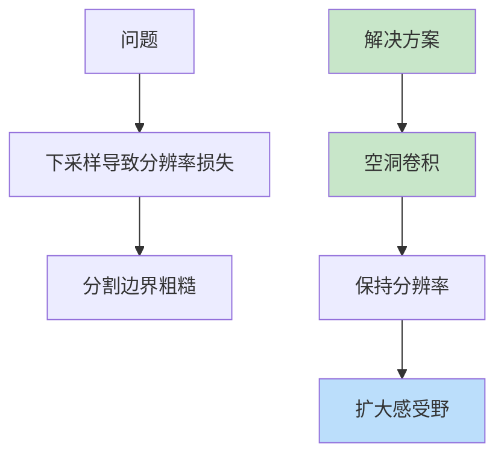
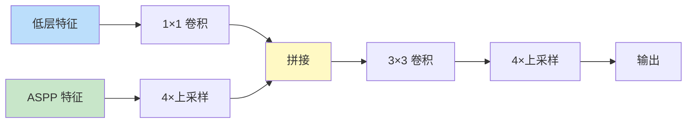

# DeepLab 系列
> **分类**: 图像分割（计算机视觉） | **编号**: CV-33 | **更新时间**: 2026-04-01 | **难度**: ⭐⭐⭐⭐

`图像分割` `语义分割` `实例分割` `计算机视觉`

**摘要**: DeepLab 是由 Google 提出的语义分割系列算法，包括 DeepLab v1/v2/v3/v3+。

---
## 概述

DeepLab 是由 Google 提出的语义分割系列算法，包括 DeepLab v1/v2/v3/v3+。该系列通过空洞卷积、空洞空间金字塔池化（ASPP）和解码器优化，在语义分割任务中取得了 SOTA 性能。

## DeepLab v1/v2

### 核心创新



### 空洞卷积

```python
import torch.nn as nn

# 空洞卷积
conv_dilated = nn.Conv2d(
    in_channels=512,
    out_channels=512,
    kernel_size=3,
    padding=6,      # padding = dilation
    dilation=6      # 空洞率
)
```

### ASPP（Atrous Spatial Pyramid Pooling）

```python
class ASPP(nn.Module):
    def __init__(self, in_channels, out_channels=256):
        super().__init__()
        
        # 多尺度空洞卷积
        self.conv1 = nn.Sequential(
            nn.Conv2d(in_channels, out_channels, 1),
            nn.BatchNorm2d(out_channels),
            nn.ReLU()
        )
        
        self.conv2 = nn.Sequential(
            nn.Conv2d(in_channels, out_channels, 3, padding=6, dilation=6),
            nn.BatchNorm2d(out_channels),
            nn.ReLU()
        )
        
        self.conv3 = nn.Sequential(
            nn.Conv2d(in_channels, out_channels, 3, padding=12, dilation=12),
            nn.BatchNorm2d(out_channels),
            nn.ReLU()
        )
        
        self.conv4 = nn.Sequential(
            nn.Conv2d(in_channels, out_channels, 3, padding=18, dilation=18),
            nn.BatchNorm2d(out_channels),
            nn.ReLU()
        )
        
        # 全局平均池化
        self.gap = nn.Sequential(
            nn.AdaptiveAvgPool2d(1),
            nn.Conv2d(in_channels, out_channels, 1),
            nn.BatchNorm2d(out_channels),
            nn.ReLU()
        )
        
        # 融合
        self.fusion = nn.Sequential(
            nn.Conv2d(out_channels * 5, out_channels, 1),
            nn.BatchNorm2d(out_channels),
            nn.ReLU()
        )
    
    def forward(self, x):
        feat1 = self.conv1(x)
        feat2 = self.conv2(x)
        feat3 = self.conv3(x)
        feat4 = self.conv4(x)
        feat5 = self.gap(x)
        feat5 = nn.functional.interpolate(feat5, size=x.shape[2:], mode='bilinear')
        
        out = torch.cat([feat1, feat2, feat3, feat4, feat5], dim=1)
        return self.fusion(out)
```

## DeepLab v3

### 改进

1. **串联 ASPP**：更好的多尺度特征
2. **Image-Level Feature**：全局上下文
3. **输出步长 16**：平衡精度和速度

### 架构

```python
class DeepLabV3(nn.Module):
    def __init__(self, num_classes=21, backbone='resnet50'):
        super().__init__()
        # Backbone
        self.backbone = nn.Sequential(
            # ResNet-50，output stride=16
        )
        
        # ASPP
        self.aspp = ASPP(in_channels=2048, out_channels=256)
        
        # 输出
        self.classifier = nn.Sequential(
            nn.Conv2d(256, 256, 3, padding=1),
            nn.BatchNorm2d(256),
            nn.ReLU(),
            nn.Dropout2d(0.1),
            nn.Conv2d(256, num_classes, 1)
        )
    
    def forward(self, x):
        features = self.backbone(x)
        aspp_features = self.aspp(features)
        output = self.classifier(aspp_features)
        output = nn.functional.interpolate(output, size=x.shape[2:], mode='bilinear')
        return output
```

## DeepLab v3+

### 核心创新：解码器



### 实现

```python
class DeepLabV3Plus(nn.Module):
    def __init__(self, num_classes=21):
        super().__init__()
        # Backbone
        self.backbone = nn.Sequential(
            # ResNet-50
        )
        
        # ASPP
        self.aspp = ASPP(in_channels=2048, out_channels=256)
        
        # 低层特征投影
        self.low_level_conv = nn.Sequential(
            nn.Conv2d(256, 48, 1),
            nn.BatchNorm2d(48),
            nn.ReLU()
        )
        
        # 解码器
        self.decoder = nn.Sequential(
            nn.Conv2d(304, 256, 3, padding=1),
            nn.BatchNorm2d(256),
            nn.ReLU(),
            nn.Conv2d(256, 256, 3, padding=1),
            nn.BatchNorm2d(256),
            nn.ReLU(),
            nn.Dropout2d(0.1),
            nn.Conv2d(256, num_classes, 1)
        )
    
    def forward(self, x):
        # Backbone 输出
        low_level_feat = self.backbone[:4](x)  # 1/4
        high_level_feat = self.backbone[4:](x)  # 1/16
        
        # ASPP
        aspp_feat = self.aspp(high_level_feat)
        aspp_feat = nn.functional.interpolate(aspp_feat, scale_factor=4, mode='bilinear')
        
        # 低层特征
        low_level_feat = self.low_level_conv(low_level_feat)
        
        # 拼接 + 解码
        cat = torch.cat([aspp_feat, low_level_feat], dim=1)
        output = self.decoder(cat)
        output = nn.functional.interpolate(output, scale_factor=4, mode='bilinear')
        
        return output
```

## 性能对比

| 模型 | mIoU (PASCAL) | mIoU (Cityscapes) |
|-----|--------------|------------------|
| FCN-8s | 65.5% | - |
| DeepLab v2 | 79.7% | - |
| DeepLab v3 | 86.9% | 82.1% |
| DeepLab v3+ | 89.0% | 84.6% |

## 实际应用

```python
from torchvision.models.segmentation import deeplabv3_resnet50

model = deeplabv3_resnet50(weights='DEFAULT')
model.eval()

image = torch.randn(3, 512, 512)
output = model([image])
segmentation = output[0]['out'].argmax(0)
```

## 总结

DeepLab 系列通过空洞卷积、ASPP 和解码器优化，在语义分割中取得了 SOTA 性能。其设计思想（多尺度特征、保持分辨率）深刻影响了后续分割算法的发展。
