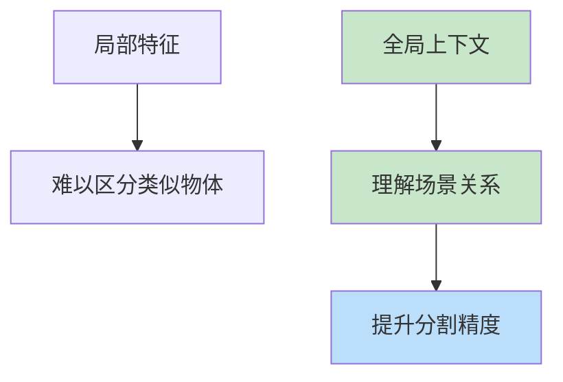
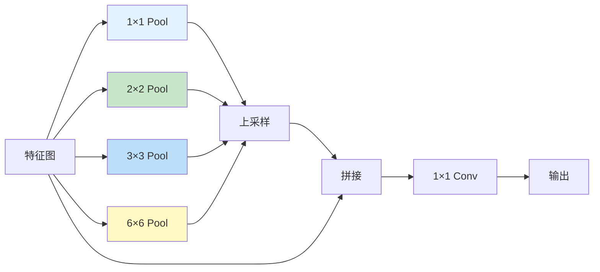

# PSPNet（Pyramid Scene Parsing Network）

> **分类**: 计算机视觉 | **编号**: 034 | **更新时间**: 2026-03-30 | **难度**: ⭐⭐

`CV` `卷积` `池化` `损失函数` `预训练`

**摘要**: PSPNet 是由 Hengshuang Zhao 等人于 2017 年提出的语义分割算法，通过金字塔池化模块（Pyramid Pooling Module）聚合不同区域的上下文信息，有效利用了...

---
## 概述

PSPNet 是由 Hengshuang Zhao 等人于 2017 年提出的语义分割算法，通过金字塔池化模块（Pyramid Pooling Module）聚合不同区域的上下文信息，有效利用了全局上下文，在场景解析任务中取得了 SOTA 性能。

## 核心思想

### 全局上下文的重要性



**问题：** 仅靠局部特征难以区分相似物体（如桌子 vs 床）

**解决：** 聚合全局上下文信息

### 金字塔池化模块



## 网络架构

### 完整实现

```python
import torch
import torch.nn as nn
import torch.nn.functional as F

class PyramidPoolingModule(nn.Module):
    def __init__(self, in_channels, out_channels, sizes=(1, 2, 3, 6)):
        super().__init__()
        self.stages = nn.ModuleList([
            nn.Sequential(
                nn.AdaptiveAvgPool2d(size),
                nn.Conv2d(in_channels, out_channels, 1, bias=False),
                nn.BatchNorm2d(out_channels),
                nn.ReLU(inplace=True)
            ) for size in sizes
        ])
    
    def forward(self, x):
        h, w = x.shape[2:]
        output = [x]
        
        for stage in self.stages:
            pooled = stage(x)
            # 上采样到原始尺寸
            pooled = F.interpolate(pooled, size=(h, w), mode='bilinear', align_corners=True)
            output.append(pooled)
        
        return torch.cat(output, dim=1)

class PSPNet(nn.Module):
    def __init__(self, num_classes=21, backbone='resnet50'):
        super().__init__()
        # Backbone (ResNet-50 with dilated convolution)
        self.backbone = nn.Sequential(
            nn.Conv2d(3, 64, 7, 2, 3, bias=False),
            nn.BatchNorm2d(64),
            nn.ReLU(inplace=True),
            nn.MaxPool2d(3, 2, 1),
            # ResNet layers with output stride=8
            # Layer1: stride=1
            # Layer2: stride=2
            # Layer3: stride=1 (dilated)
            # Layer4: stride=1 (dilated)
        )
        
        # 金字塔池化模块
        self.ppm = PyramidPoolingModule(
            in_channels=2048,
            out_channels=512,
            sizes=(1, 2, 3, 6)
        )
        
        # 分类头
        self.classifier = nn.Sequential(
            nn.Conv2d(4096, 512, 3, padding=1, bias=False),
            nn.BatchNorm2d(512),
            nn.ReLU(inplace=True),
            nn.Dropout2d(0.1),
            nn.Conv2d(512, num_classes, 1)
        )
        
        # 辅助损失（深层监督）
        self.aux_classifier = nn.Sequential(
            nn.Conv2d(1024, 256, 3, padding=1, bias=False),
            nn.BatchNorm2d(256),
            nn.ReLU(inplace=True),
            nn.Dropout2d(0.1),
            nn.Conv2d(256, num_classes, 1)
        )
    
    def forward(self, x):
        # Backbone
        features = self.backbone(x)
        
        # 辅助输出（Layer3 输出）
        aux_feat = features['layer3']
        aux_output = self.aux_classifier(aux_feat)
        aux_output = F.interpolate(aux_output, size=x.shape[2:], mode='bilinear', align_corners=True)
        
        # 金字塔池化
        ppm_output = self.ppm(features['layer4'])
        
        # 分类
        output = self.classifier(ppm_output)
        output = F.interpolate(output, size=x.shape[2:], mode='bilinear', align_corners=True)
        
        if self.training:
            return output, aux_output
        return output

# 测试
model = PSPNet(num_classes=21)
x = torch.randn(1, 3, 473, 473)
output = model(x)
print(f"PSPNet: {x.shape} -> {output.shape}")
print(f"参数量：{sum(p.numel() for p in model.parameters()):,}")
```

### 金字塔池化效果

```python
# 可视化金字塔池化
def visualize_ppm(ppm, x):
    """可视化不同尺度的池化特征"""
    h, w = x.shape[2:]
    
    for i, stage in enumerate(ppm.stages):
        pooled = stage[0](x)  # 池化
        print(f"Pool size {i+1}: {pooled.shape}")
        
        upsampled = F.interpolate(pooled, size=(h, w), mode='bilinear')
        print(f"Upsampled: {upsampled.shape}")
```

## 损失函数

```python
class PSPNetLoss(nn.Module):
    def __init__(self, aux_weight=0.4):
        super().__init__()
        self.aux_weight = aux_weight
        self.criterion = nn.CrossEntropyLoss(ignore_index=255)
    
    def forward(self, output, aux_output, target):
        # 主损失
        loss_main = self.criterion(output, target)
        
        # 辅助损失
        loss_aux = self.criterion(aux_output, target)
        
        return loss_main + self.aux_weight * loss_aux
```

## 训练技巧

### 1. 预训练 Backbone

```python
# 使用 ImageNet 预训练的 ResNet
from torchvision.models import resnet50, ResNet50_Weights

backbone = resnet50(weights=ResNet50_Weights.IMAGENET1K_V1)

# 修改 Layer3/Layer4 为空洞卷积
for module in backbone.layer3.modules():
    if isinstance(module, nn.Conv2d):
        module.stride = (1, 1)
        module.dilation = (2, 2)
        module.padding = (2, 2)

for module in backbone.layer4.modules():
    if isinstance(module, nn.Conv2d):
        module.stride = (1, 1)
        module.dilation = (4, 4)
        module.padding = (4, 4)
```

### 2. 多尺度训练

```python
from torchvision import transforms

train_transform = transforms.Compose([
    transforms.RandomResizedCrop(473, scale=(0.5, 2.0)),
    transforms.RandomHorizontalFlip(),
    transforms.ColorJitter(0.4, 0.4, 0.4),
    transforms.ToTensor(),
    transforms.Normalize([0.485, 0.456, 0.406], 
                         [0.229, 0.224, 0.225]),
])
```

### 3. 测试时增强

```python
def test_time_augmentation(model, image, scales=[0.5, 0.75, 1.0, 1.25, 1.5, 1.75, 2.0]):
    """多尺度测试 + 翻转增强"""
    predictions = []
    
    for scale in scales:
        # 缩放
        resized = F.interpolate(image, scale_factor=scale, mode='bilinear')
        
        # 原始
        pred = model(resized)
        pred = F.interpolate(pred, size=image.shape[2:], mode='bilinear')
        predictions.append(pred)
        
        # 翻转
        flipped = torch.flip(resized, dims=[3])
        pred_flip = model(flipped)
        pred_flip = torch.flip(pred_flip, dims=[3])
        pred_flip = F.interpolate(pred_flip, size=image.shape[2:], mode='bilinear')
        predictions.append(pred_flip)
    
    # 平均
    output = torch.stack(predictions).mean(dim=0)
    return output
```

## 性能对比

| 模型 | mIoU (PASCAL) | mIoU (Cityscapes) |
|-----|--------------|------------------|
| FCN-8s | 65.5% | - |
| DeepLab v2 | 79.7% | - |
| PSPNet | 85.4% | 80.2% |
| DeepLab v3+ | 89.0% | 84.6% |

## 实际应用

```python
from mmseg.models import PSPNet

# 使用 MMSegmentation
model = PSPNet(
    backbone=dict(
        type='ResNetV1c',
        depth=50,
        num_stages=4,
        out_indices=(0, 1, 2, 3),
        dilated=(1, 1, 2, 4),
        strides=(1, 2, 1, 1)
    ),
    psp_pool_scales=(1, 2, 3, 6),
    channels=512,
    num_classes=19
)
```

## 总结

PSPNet 通过金字塔池化模块有效聚合了全局上下文信息，在场景解析任务中取得了优秀性能。其设计思想（多尺度池化、全局上下文）对后续分割算法产生了重要影响。
