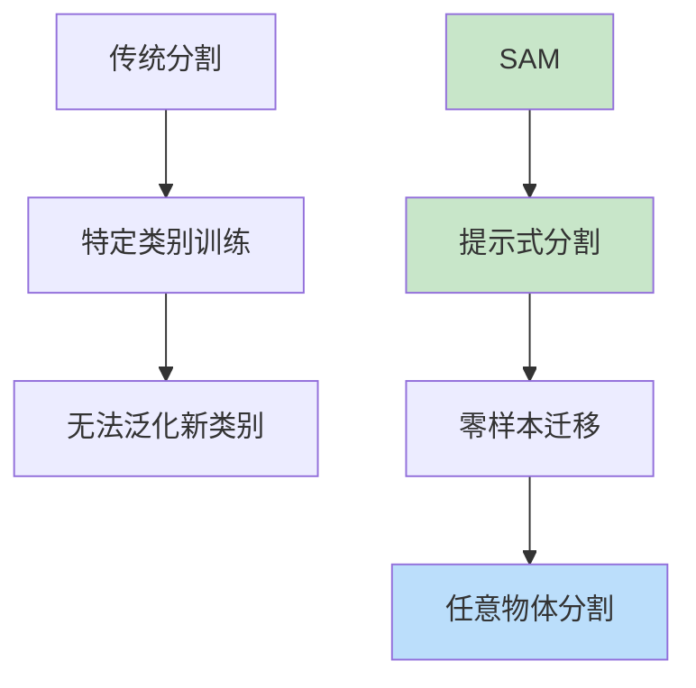
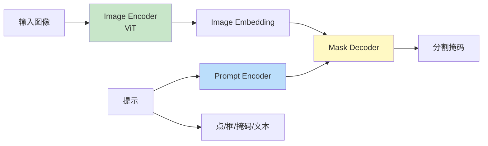
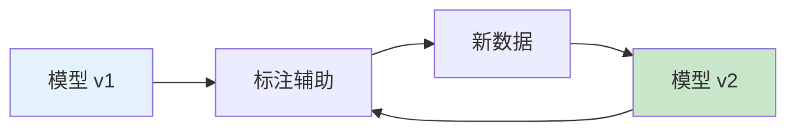

# SAM（Segment Anything Model）

> **分类**: 计算机视觉 | **编号**: 035 | **更新时间**: 2026-03-30 | **难度**: ⭐⭐

`CV` `Transformer` `损失函数`

**摘要**: SAM（Segment Anything Model）是由 Meta AI 于 2023 年提出的基础分割模型。

---
## 概述

SAM（Segment Anything Model）是由 Meta AI 于 2023 年提出的基础分割模型。SAM 通过大规模训练和提示式分割，实现了零样本迁移能力，能够分割任意图像中的任意物体，开创了分割基础模型的新范式。

## 核心创新

### 从专用到通用



### 三要素

1. **任务**：提示式分割
2. **数据**：SA-1B 数据集（1100 万图像，11 亿掩码）
3. **模型**：可扩展的架构

## 模型架构

### 整体结构



### 实现

```python
import torch
import torch.nn as nn
import torch.nn.functional as F
from typing import Optional, Tuple

class ImageEncoderViT(nn.Module):
    def __init__(self, img_size=1024, patch_size=16, embed_dim=768, 
                 depth=12, num_heads=12, mlp_ratio=4.0):
        super().__init__()
        self.img_size = img_size
        
        # Patch 嵌入
        self.patch_embed = nn.Conv2d(3, embed_dim, patch_size, patch_size)
        
        # 位置编码
        self.pos_embed = nn.Parameter(torch.zeros(1, (img_size//patch_size)**2, embed_dim))
        
        # Transformer 块
        self.transformer = nn.ModuleList([
            nn.TransformerEncoderLayer(
                d_model=embed_dim,
                nhead=num_heads,
                dim_feedforward=int(embed_dim * mlp_ratio),
                batch_first=True
            ) for _ in range(depth)
        ])
        
        self.neck = nn.Sequential(
            nn.Conv2d(embed_dim, 256, 1),
            nn.Conv2d(256, 256, 3, padding=1),
        )
    
    def forward(self, x):
        # Patch 嵌入
        x = self.patch_embed(x)
        B, C, H, W = x.shape
        x = x.flatten(2).transpose(1, 2)
        
        # 位置编码
        x = x + self.pos_embed
        
        # Transformer
        for layer in self.transformer:
            x = layer(x)
        
        # 恢复空间维度
        x = x.transpose(1, 2).view(B, C, H, W)
        x = self.neck(x)
        
        return x

class PromptEncoder(nn.Module):
    def __init__(self, embed_dim=256, image_embedding_size=(64, 64)):
        super().__init__()
        self.embed_dim = embed_dim
        self.image_embedding_size = image_embedding_size
        
        # 点提示编码
        self.not_a_point_embed = nn.Embedding(1, embed_dim)
        self.point_embeddings = nn.ModuleList([
            nn.Embedding(1, embed_dim) for _ in range(2)  # 前景/背景点
        ])
        
        # 框提示编码
        self.box_embed = nn.Embedding(2, embed_dim)
        
        # 掩码提示编码
        self.mask_downscaling = nn.Sequential(
            nn.Conv2d(1, 16, 3, padding=1),
            nn.ReLU(),
            nn.Conv2d(16, 32, 3, padding=1),
            nn.ReLU(),
            nn.Conv2d(32, embed_dim, 1)
        )
        
        # 位置编码
        self.pe_layer = nn.Parameter(torch.randn(1, embed_dim, *image_embedding_size))
    
    def forward(self, points: Optional[Tuple[torch.Tensor, torch.Tensor]] = None,
                boxes: Optional[torch.Tensor] = None,
                masks: Optional[torch.Tensor] = None):
        
        sparse_embeddings = []
        dense_embeddings = []
        
        # 点提示
        if points is not None:
            labels = points[1]
            points = points[0]
            
            for i, label in enumerate(labels.unique()):
                embed = self.point_embeddings[int(label)](torch.tensor([0]))
                sparse_embeddings.append(embed.expand(points.shape[0], -1))
            
            sparse_embeddings.append(
                self.not_a_point_embed.weight.expand(points.shape[0], -1)
            )
        
        # 框提示
        if boxes is not None:
            box_embed = self.box_embed.weight.unsqueeze(0).expand(boxes.shape[0], -1, -1)
            sparse_embeddings.append(box_embed.flatten(1))
        
        # 掩码提示
        if masks is not None:
            dense = self.mask_downscaling(masks)
            dense_embeddings.append(dense)
        
        # 拼接
        if sparse_embeddings:
            sparse_embeddings = torch.cat(sparse_embeddings, dim=1)
        else:
            sparse_embeddings = torch.zeros(1, 0, self.embed_dim)
        
        if dense_embeddings:
            dense_embeddings = torch.cat(dense_embeddings, dim=1)
        else:
            dense_embeddings = torch.zeros(1, self.embed_dim, *self.image_embedding_size)
        
        return sparse_embeddings, dense_embeddings

class MaskDecoder(nn.Module):
    def __init__(self, num_multimask_outputs=3, embed_dim=256):
        super().__init__()
        self.num_multimask_outputs = num_multimask_outputs
        
        # Transformer 块
        self.transformer = nn.TransformerDecoder(
            nn.TransformerDecoderLayer(d_model=embed_dim, nhead=8),
            num_layers=2
        )
        
        # 上采样
        self.upscale_conv1 = nn.ConvTranspose2d(embed_dim, embed_dim//4, 2, stride=2)
        self.upscale_conv2 = nn.ConvTranspose2d(embed_dim//4, embed_dim//8, 2, stride=2)
        
        # 输出头
        self.output_hypernetworks_mlps = nn.ModuleList([
            nn.Linear(embed_dim, embed_dim) for _ in range(num_multimask_outputs + 1)
        ])
        
        self.iou_prediction_head = nn.Linear(embed_dim, num_multimask_outputs + 1)
    
    def forward(self, image_embeddings, image_pe, sparse_prompt_embeddings, dense_prompt_embeddings):
        # 拼接提示
        prompts = torch.cat([sparse_prompt_embeddings, dense_prompt_embeddings.flatten(2).transpose(1, 2)], dim=1)
        
        # Transformer 解码
        queries = prompts
        for layer in self.transformer.layers:
            queries = layer(queries, image_embeddings.flatten(2).transpose(1, 2))
        
        # 上采样
        mask_tokens = queries[:, :-1, :]
        for i, mlp in enumerate(self.output_hypernetworks_mlps):
            mask_pred = mlp(mask_tokens)
        
        # IoU 预测
        iou_pred = self.iou_prediction_head(mask_tokens)
        
        return mask_pred, iou_pred

class SAM(nn.Module):
    def __init__(self):
        super().__init__()
        self.image_encoder = ImageEncoderViT()
        self.prompt_encoder = PromptEncoder()
        self.mask_decoder = MaskDecoder()
    
    def forward(self, images, prompts):
        # 图像编码
        image_embeddings = self.image_encoder(images)
        
        # 提示编码
        sparse_emb, dense_emb = self.prompt_encoder(**prompts)
        
        # 掩码解码
        masks, iou_pred = self.mask_decoder(
            image_embeddings=image_embeddings,
            image_pe=self.prompt_encoder.pe_layer,
            sparse_prompt_embeddings=sparse_emb,
            dense_prompt_embeddings=dense_emb
        )
        
        return masks, iou_pred
```

## 提示类型

### 1. 点提示

```python
# 单点提示
points = torch.tensor([[512, 512]])  # 点坐标
labels = torch.tensor([1])  # 1=前景，0=背景

prompts = {'points': (points, labels)}
```

### 2. 框提示

```python
# 边界框提示
boxes = torch.tensor([[100, 100, 400, 400]])  # [x1, y1, x2, y2]

prompts = {'boxes': boxes}
```

### 3. 掩码提示

```python
# 粗略掩码提示
masks = torch.zeros(1, 1, 1024, 1024)
masks[0, 0, 200:800, 200:800] = 1

prompts = {'masks': masks}
```

## 训练策略

### 数据引擎



**三阶段：**
1. 人工标注
2. 模型辅助标注
3. 全自动标注

### 损失函数

```python
class SAMLoss(nn.Module):
    def __init__(self):
        super().__init__()
        self.focal_loss = nn.BCEWithLogitsLoss(reduction='none')
        self.dice_loss = DiceLoss()
    
    def forward(self, masks, iou_pred, gt_masks, gt_iou):
        # 掩码损失
        focal_loss = self.focal_loss(masks, gt_masks).mean()
        dice_loss = self.dice_loss(masks.sigmoid(), gt_masks)
        
        # IoU 预测损失
        iou_loss = nn.functional.mse_loss(iou_pred, gt_iou)
        
        return focal_loss + dice_loss + iou_loss
```

## 实际应用

```python
from segment_anything import SamPredictor, sam_model_registry

# 加载模型
sam = sam_model_registry['vit_h'](checkpoint='sam_vit_h.pth')
predictor = SamPredictor(sam)

# 设置图像
image = load_image('photo.jpg')
predictor.set_image(image)

# 点提示
input_point = [[500, 375]]
input_label = [1]

# 预测
masks, scores, logits = predictor.predict(
    point_coords=input_point,
    point_labels=input_label,
    multimask_output=True
)

print(f"预测掩码：{masks.shape}, 置信度：{scores}")
```

## 总结

SAM 通过大规模训练和提示式分割，实现了零样本迁移的通用分割能力。其基础模型范式为计算机视觉开辟了新方向，推动了分割技术的发展。
