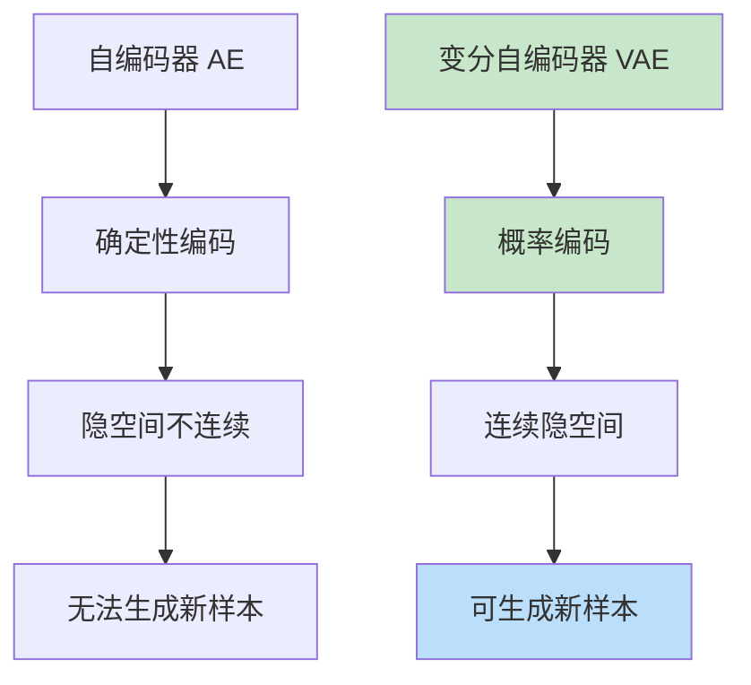
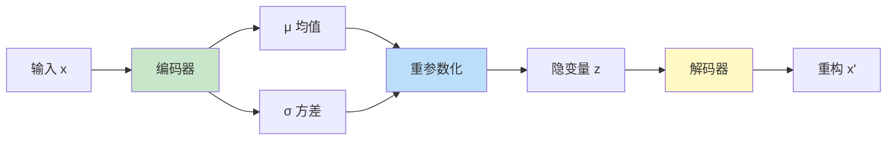
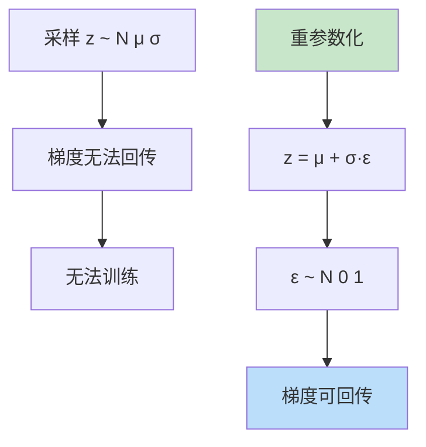

# VAE（变分自编码器）
> **分类**: 生成模型（计算机视觉） | **编号**: CV-36 | **更新时间**: 2026-04-01 | **难度**: ⭐⭐⭐⭐⭐

`生成模型` `GAN` `Diffusion` `VAE` `计算机视觉`

**摘要**: 变分自编码器（Variational Autoencoder，VAE）是由 Kingma 和 Welling 于 2013 年提出的生成模型。

---
## 概述

变分自编码器（Variational Autoencoder，VAE）是由 Kingma 和 Welling 于 2013 年提出的生成模型。VAE 通过引入概率编码和重参数化技巧，实现了连续隐空间的建模，能够生成多样化的新样本，成为深度生成模型的基础架构之一。

## 核心思想

### 从 AE 到 VAE



### 概率建模

**目标：** 学习数据分布 $p(x)$

**方法：** 引入隐变量 $z$，建模 $p(x|z)$ 和 $p(z)$

$$p(x) = \int p(x|z) p(z) dz$$

## VAE 架构

### 编码器 - 解码器



### 实现

```python
import torch
import torch.nn as nn
import torch.nn.functional as F

class VAE(nn.Module):
    def __init__(self, input_dim=784, hidden_dim=400, latent_dim=20):
        super().__init__()
        
        # 编码器
        self.encoder = nn.Sequential(
            nn.Linear(input_dim, hidden_dim),
            nn.ReLU(),
        )
        
        # 均值和方差
        self.fc_mu = nn.Linear(hidden_dim, latent_dim)
        self.fc_logvar = nn.Linear(hidden_dim, latent_dim)
        
        # 解码器
        self.decoder = nn.Sequential(
            nn.Linear(latent_dim, hidden_dim),
            nn.ReLU(),
            nn.Linear(hidden_dim, input_dim),
            nn.Sigmoid()  # 输出概率
        )
    
    def encode(self, x):
        h = self.encoder(x)
        mu = self.fc_mu(h)
        logvar = self.fc_logvar(h)
        return mu, logvar
    
    def reparameterize(self, mu, logvar):
        """重参数化技巧"""
        std = torch.exp(0.5 * logvar)
        eps = torch.randn_like(std)
        return mu + eps * std
    
    def decode(self, z):
        return self.decoder(z)
    
    def forward(self, x):
        mu, logvar = self.encode(x)
        z = self.reparameterize(mu, logvar)
        x_recon = self.decode(z)
        return x_recon, mu, logvar

# 测试
model = VAE(input_dim=784, latent_dim=20)
x = torch.randn(32, 784)
x_recon, mu, logvar = model(x)
print(f"VAE: {x.shape} -> {x_recon.shape}")
print(f"隐变量：{mu.shape}")
```

## 损失函数

### ELBO（Evidence Lower Bound）

$$\mathcal{L} = \underbrace{\mathbb{E}_{q(z|x)}[\log p(x|z)]}_{\text{重构损失}} - \underbrace{D_{KL}(q(z|x) || p(z))}_{\text{KL 散度}}$$

### 实现

```python
def vae_loss(x_recon, x, mu, logvar, beta=1.0):
    """VAE 损失 = 重构损失 + KL 散度"""
    # 重构损失（BCE）
    recon_loss = F.binary_cross_entropy(x_recon, x, reduction='sum')
    
    # KL 散度
    kl_loss = -0.5 * torch.sum(1 + logvar - mu.pow(2) - logvar.exp())
    
    return recon_loss + beta * kl_loss

# 训练循环
optimizer = torch.optim.Adam(model.parameters(), lr=1e-3)

for epoch in range(100):
    for x in dataloader:
        x = x.view(-1, 784)
        
        optimizer.zero_grad()
        x_recon, mu, logvar = model(x)
        
        loss = vae_loss(x_recon, x, mu, logvar)
        loss.backward()
        optimizer.step()
    
    print(f"Epoch {epoch}: Loss = {loss.item():.4f}")
```

## 重参数化技巧

### 问题



### 实现

```python
# 错误：直接采样
z = torch.randn_like(mu) * torch.exp(logvar) + mu  # 梯度断在 mu

# 正确：重参数化
eps = torch.randn_like(mu)  # 独立于网络参数
z = mu + torch.exp(0.5 * logvar) * eps  # 梯度可回传到 mu 和 logvar
```

## 生成样本

```python
@torch.no_grad()
def generate_samples(model, num_samples=10):
    """从先验分布采样生成新样本"""
    # 从标准正态分布采样
    z = torch.randn(num_samples, model.fc_mu.out_features)
    
    # 解码
    samples = model.decode(z)
    
    return samples

# 生成并可视化
samples = generate_samples(model, num_samples=10)
```

## β-VAE

### 解耦表示

```python
class BetaVAE(VAE):
    def __init__(self, input_dim=784, hidden_dim=400, latent_dim=20, beta=4.0):
        super().__init__(input_dim, hidden_dim, latent_dim)
        self.beta = beta
    
    def forward(self, x):
        x_recon, mu, logvar = super().forward(x)
        loss = vae_loss(x_recon, x, mu, logvar, beta=self.beta)
        return x_recon, loss
```

**β > 1：** 更强的解耦，但重构质量可能下降

## 应用

### 1. 图像生成

```python
# 生成人脸
vae = VAE(input_dim=64*64*3, latent_dim=100)
new_faces = generate_samples(vae, num_samples=16)
```

### 2. 异常检测

```python
# 重构误差大的为异常
recon_error = F.mse_loss(x_recon, x, reduction='none').mean(dim=1)
anomalies = recon_error > threshold
```

### 3. 插值

```python
# 隐空间插值
z1 = model.encode(x1)[0]
z2 = model.encode(x2)[0]

for alpha in torch.linspace(0, 1, 10):
    z_interp = alpha * z1 + (1 - alpha) * z2
    x_interp = model.decode(z_interp)
```

## 总结

VAE 通过概率编码和重参数化技巧，实现了连续隐空间的建模和多样化生成。其简洁的框架和理论基础使其成为深度生成模型的重要基础。
