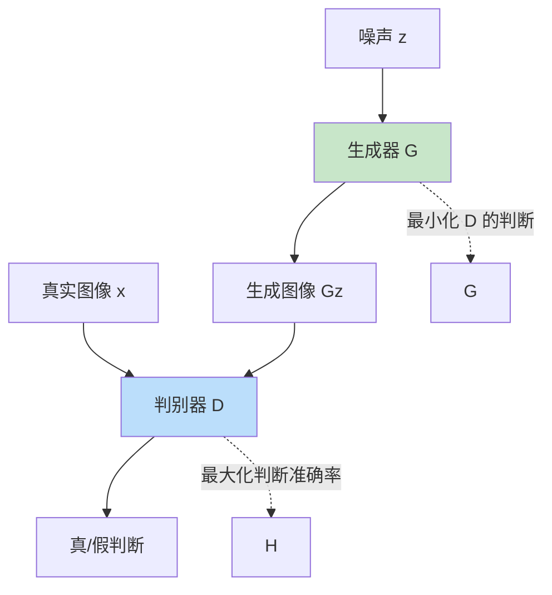

# GAN（生成对抗网络）

> **分类**: 计算机视觉 | **编号**: 037 | **更新时间**: 2026-03-30 | **难度**: ⭐⭐

`CV` `卷积` `损失函数` `优化器`

**摘要**: 生成对抗网络（Generative Adversarial Network，GAN）是由 Ian Goodfellow 于 2014 年提出的生成模型。

---
## 概述

生成对抗网络（Generative Adversarial Network，GAN）是由 Ian Goodfellow 于 2014 年提出的生成模型。GAN 通过生成器和判别器的对抗训练，能够生成高质量的逼真样本，在图像生成、风格迁移等任务中取得了突破性成果。

## 核心思想

### 对抗训练



**生成器 G：** 生成逼真样本，欺骗判别器

**判别器 D：** 区分真实样本和生成样本

### 博弈公式

$$\min_G \max_D V(D, G) = \mathbb{E}_{x \sim p_{data}}[\log D(x)] + \mathbb{E}_{z \sim p_z}[\log(1 - D(G(z)))]$$

## 基础 GAN 实现

```python
import torch
import torch.nn as nn
import torch.nn.functional as F

class Generator(nn.Module):
    def __init__(self, latent_dim=100, img_channels=3, img_size=64):
        super().__init__()
        
        self.model = nn.Sequential(
            # 输入：latent_dim × 1 × 1
            nn.ConvTranspose2d(latent_dim, 512, 4, 1, 0),
            nn.BatchNorm2d(512),
            nn.ReLU(True),
            
            nn.ConvTranspose2d(512, 256, 4, 2, 1),
            nn.BatchNorm2d(256),
            nn.ReLU(True),
            
            nn.ConvTranspose2d(256, 128, 4, 2, 1),
            nn.BatchNorm2d(128),
            nn.ReLU(True),
            
            nn.ConvTranspose2d(128, 64, 4, 2, 1),
            nn.BatchNorm2d(64),
            nn.ReLU(True),
            
            nn.ConvTranspose2d(64, img_channels, 4, 2, 1),
            nn.Tanh()  # 输出 [-1, 1]
        )
    
    def forward(self, z):
        z = z.view(-1, z.shape[1], 1, 1)
        return self.model(z)

class Discriminator(nn.Module):
    def __init__(self, img_channels=3, img_size=64):
        super().__init__()
        
        self.model = nn.Sequential(
            # 输入：img_channels × 64 × 64
            nn.Conv2d(img_channels, 64, 4, 2, 1),
            nn.LeakyReLU(0.2, inplace=True),
            
            nn.Conv2d(64, 128, 4, 2, 1),
            nn.BatchNorm2d(128),
            nn.LeakyReLU(0.2, inplace=True),
            
            nn.Conv2d(128, 256, 4, 2, 1),
            nn.BatchNorm2d(256),
            nn.LeakyReLU(0.2, inplace=True),
            
            nn.Conv2d(256, 512, 4, 2, 1),
            nn.BatchNorm2d(512),
            nn.LeakyReLU(0.2, inplace=True),
            
            nn.Conv2d(512, 1, 4, 1, 0),
            nn.Sigmoid()
        )
    
    def forward(self, img):
        return self.model(img).view(-1, 1)

class GAN(nn.Module):
    def __init__(self, latent_dim=100):
        super().__init__()
        self.generator = Generator(latent_dim=latent_dim)
        self.discriminator = Discriminator()
    
    def forward(self, z):
        return self.generator(z)

# 测试
gan = GAN(latent_dim=100)
z = torch.randn(32, 100)
fake_images = gan(z)
print(f"GAN: {z.shape} -> {fake_images.shape}")
```

## 训练策略

### 对抗训练循环

```python
def train_gan(gan, dataloader, num_epochs=100):
    generator = gan.generator
    discriminator = gan.discriminator
    
    # 优化器
    optimizer_G = torch.optim.Adam(generator.parameters(), lr=0.0002, betas=(0.5, 0.999))
    optimizer_D = torch.optim.Adam(discriminator.parameters(), lr=0.0002, betas=(0.5, 0.999))
    
    # 损失函数
    adversarial_loss = nn.BCELoss()
    
    for epoch in range(num_epochs):
        for i, (real_images, _) in enumerate(dataloader):
            batch_size = real_images.size(0)
            real_images = real_images * 2 - 1  # 归一化到 [-1, 1]
            
            # 标签
            real_label = torch.ones(batch_size, 1)
            fake_label = torch.zeros(batch_size, 1)
            
            # ========== 训练判别器 ==========
            optimizer_D.zero_grad()
            
            # 真实样本损失
            real_output = discriminator(real_images)
            d_loss_real = adversarial_loss(real_output, real_label)
            
            # 生成样本损失
            z = torch.randn(batch_size, 100)
            fake_images = generator(z)
            fake_output = discriminator(fake_images.detach())
            d_loss_fake = adversarial_loss(fake_output, fake_label)
            
            d_loss = (d_loss_real + d_loss_fake) / 2
            d_loss.backward()
            optimizer_D.step()
            
            # ========== 训练生成器 ==========
            optimizer_G.zero_grad()
            
            # 生成器希望判别器认为生成样本是真实的
            fake_output = discriminator(fake_images)
            g_loss = adversarial_loss(fake_output, real_label)
            g_loss.backward()
            optimizer_G.step()
            
            if i % 100 == 0:
                print(f"Epoch [{epoch}/{num_epochs}] "
                      f"D Loss: {d_loss.item():.4f} "
                      f"G Loss: {g_loss.item():.4f}")
```

## GAN 变体

### DCGAN

**改进：**
- 使用卷积层代替全连接
- BatchNorm
- ReLU/LeakyReLU 激活

### WGAN

**问题：** 传统 GAN 训练不稳定

**解决：** 使用 Wasserstein 距离

```python
class WGANLoss(nn.Module):
    def forward(self, real_output, fake_output):
        # D 最大化：E[D(x)] - E[D(G(z))]
        d_loss = -(real_output.mean() - fake_output.mean())
        
        # G 最小化：-E[D(G(z))]
        g_loss = -fake_output.mean()
        
        return d_loss, g_loss

# 权重裁剪
for p in discriminator.parameters():
    p.data.clamp_(-0.01, 0.01)
```

### WGAN-GP

**梯度惩罚：**

```python
def gradient_penalty(discriminator, real_images, fake_images, lambda_gp=10):
    batch_size = real_images.size(0)
    
    # 插值
    alpha = torch.rand(batch_size, 1, 1, 1)
    interpolates = (alpha * real_images + (1 - alpha) * fake_images).requires_grad_(True)
    
    d_interpolates = discriminator(interpolates)
    
    # 梯度
    gradients = torch.autograd.grad(
        outputs=d_interpolates,
        inputs=interpolates,
        grad_outputs=torch.ones_like(d_interpolates),
        create_graph=True
    )[0]
    
    gradients = gradients.view(batch_size, -1)
    gradient_norm = gradients.norm(2, dim=1)
    
    # 惩罚
    gp = lambda_gp * ((gradient_norm - 1) ** 2).mean()
    
    return gp
```

## 应用

### 1. 图像生成

```python
@torch.no_grad()
def generate_images(generator, num_images=16):
    z = torch.randn(num_images, 100)
    images = generator(z)
    images = (images + 1) / 2  # [-1, 1] -> [0, 1]
    return images
```

### 2. 图像到图像翻译

```python
# Pix2Pix: 条件 GAN
class Pix2PixGenerator(nn.Module):
    def __init__(self):
        super().__init__()
        # U-Net 架构
        self.unet = UNet()
    
    def forward(self, input_image):
        return self.unet(input_image)
```

### 3. 超分辨率

```python
# SRGAN
class SRResNet(nn.Module):
    def __init__(self):
        super().__init__()
        # 残差上采样网络
        pass
```

## 训练技巧

### 1. 标签平滑

```python
# 真实标签不是 1，而是 0.9
real_label = torch.ones(batch_size, 1) * 0.9
```

### 2. 训练比例

```python
# D 训练次数多于 G
for _ in range(5):
    train_discriminator()
train_generator()
```

### 3. 学习率衰减

```python
scheduler_G = torch.optim.lr_scheduler.LinearLR(optimizer_G, start_factor=1.0, end_factor=0.0, total_iters=100)
scheduler_D = torch.optim.lr_scheduler.LinearLR(optimizer_D, start_factor=1.0, end_factor=0.0, total_iters=100)
```

## 总结

GAN 通过对抗训练实现了高质量的生成，成为深度生成模型的重要分支。尽管训练不稳定，但其生成质量和应用广泛性使其在图像生成领域占据重要地位。
