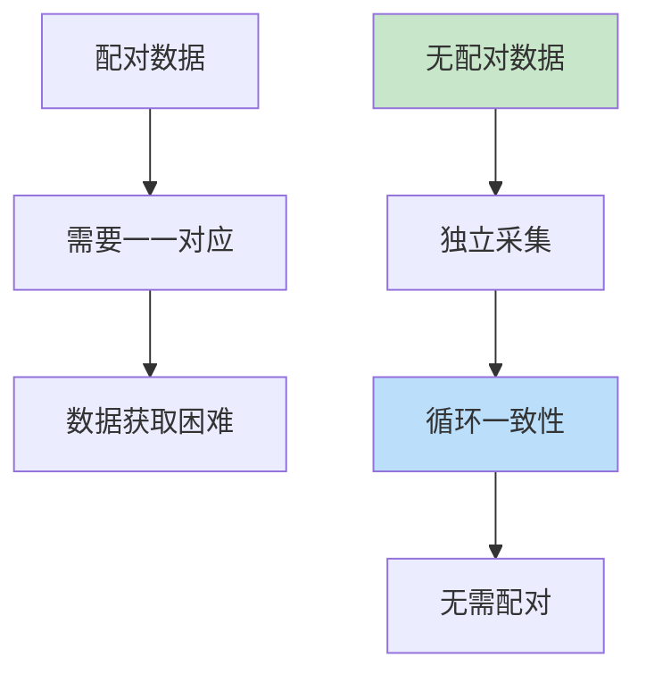
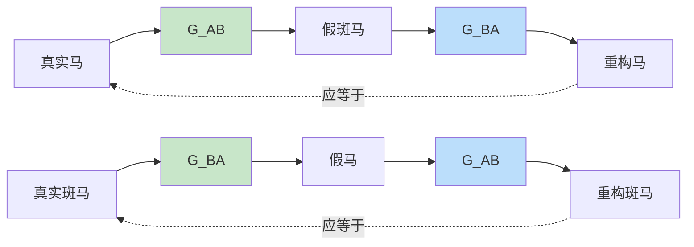

# CycleGAN
> **分类**: 生成模型（计算机视觉） | **编号**: CV-38 | **更新时间**: 2026-04-01 | **难度**: ⭐⭐⭐⭐⭐

`生成模型` `GAN` `Diffusion` `VAE` `计算机视觉` `图像生成`

**摘要**: CycleGAN 是由 Jun-Yan Zhu 等人于 2017 年提出的无配对图像到图像翻译模型。

---
## 概述

CycleGAN 是由 Jun-Yan Zhu 等人于 2017 年提出的无配对图像到图像翻译模型。CycleGAN 通过循环一致性损失，实现了无需配对训练数据的域间转换，如马→斑马、苹果→橙子、照片→油画等。

## 核心思想

### 无配对翻译



**问题：** 配对数据难以获取（如马和斑马的配对照片）

**解决：** 循环一致性约束

### 循环一致性



$$L_{cyc}(G, F) = \mathbb{E}_{x \sim p_{data}}[||F(G(x)) - x||_1] + \mathbb{E}_{y \sim p_{data}}[||G(F(y)) - y||_1]$$

## 网络架构

```python
import torch
import torch.nn as nn
import torch.nn.functional as F

class ResidualBlock(nn.Module):
    def __init__(self, channels):
        super().__init__()
        self.conv = nn.Sequential(
            nn.Conv2d(channels, channels, 3, 1, 1),
            nn.InstanceNorm2d(channels),
            nn.ReLU(inplace=True),
            nn.Conv2d(channels, channels, 3, 1, 1),
            nn.InstanceNorm2d(channels)
        )
    
    def forward(self, x):
        return x + self.conv(x)

class Generator(nn.Module):
    def __init__(self, img_channels=3, num_res_blocks=9):
        super().__init__()
        
        # 初始卷积
        model = [
            nn.Conv2d(img_channels, 64, 7, 1, 3),
            nn.InstanceNorm2d(64),
            nn.ReLU(inplace=True)
        ]
        
        # 下采样
        model.extend([
            nn.Conv2d(64, 128, 3, 2, 1),
            nn.InstanceNorm2d(128),
            nn.ReLU(inplace=True),
            nn.Conv2d(128, 256, 3, 2, 1),
            nn.InstanceNorm2d(256),
            nn.ReLU(inplace=True)
        ])
        
        # 残差块
        for _ in range(num_res_blocks):
            model.append(ResidualBlock(256))
        
        # 上采样
        model.extend([
            nn.ConvTranspose2d(256, 128, 3, 2, 1, output_padding=1),
            nn.InstanceNorm2d(128),
            nn.ReLU(inplace=True),
            nn.ConvTranspose2d(128, 64, 3, 2, 1, output_padding=1),
            nn.InstanceNorm2d(64),
            nn.ReLU(inplace=True),
            nn.Conv2d(64, img_channels, 7, 1, 3),
            nn.Tanh()
        ])
        
        self.model = nn.Sequential(*model)
    
    def forward(self, x):
        return self.model(x)

class Discriminator(nn.Module):
    def __init__(self, img_channels=3):
        super().__init__()
        
        # PatchGAN 判别器
        self.model = nn.Sequential(
            nn.Conv2d(img_channels, 64, 4, 2, 1),
            nn.LeakyReLU(0.2, inplace=True),
            nn.Conv2d(64, 128, 4, 2, 1),
            nn.InstanceNorm2d(128),
            nn.LeakyReLU(0.2, inplace=True),
            nn.Conv2d(128, 256, 4, 2, 1),
            nn.InstanceNorm2d(256),
            nn.LeakyReLU(0.2, inplace=True),
            nn.Conv2d(256, 512, 4, 1, 1),
            nn.InstanceNorm2d(512),
            nn.LeakyReLU(0.2, inplace=True),
            nn.Conv2d(512, 1, 4, 1, 1)
        )
    
    def forward(self, x):
        return self.model(x)

class CycleGAN(nn.Module):
    def __init__(self):
        super().__init__()
        self.G_AB = Generator()  # A -> B
        self.G_BA = Generator()  # B -> A
        self.D_A = Discriminator()
        self.D_B = Discriminator()
    
    def forward(self, x_A, x_B):
        # 生成
        fake_B = self.G_AB(x_A)
        fake_A = self.G_BA(x_B)
        
        # 循环
        recon_A = self.G_BA(fake_B)
        recon_B = self.G_AB(fake_A)
        
        return fake_A, fake_B, recon_A, recon_B
```

## 损失函数

```python
class CycleGANLoss(nn.Module):
    def __init__(self, lambda_cyc=10.0, lambda_idt=0.5):
        super().__init__()
        self.lambda_cyc = lambda_cyc
        self.lambda_idt = lambda_idt
        self.mse = nn.MSELoss()
        self.l1 = nn.L1Loss()
    
    def forward(self, fake_A, fake_B, recon_A, recon_B, 
                x_A, x_B, d_fake_A, d_fake_B, d_real_A, d_real_B):
        
        # 对抗损失
        g_loss = self.mse(d_fake_A, torch.ones_like(d_fake_A)) + \
                 self.mse(d_fake_B, torch.ones_like(d_fake_B))
        
        # 循环一致性损失
        cyc_loss = self.l1(recon_A, x_A) + self.l1(recon_B, x_B)
        
        # 身份损失（可选）
        idt_loss = self.l1(fake_A, x_B) + self.l1(fake_B, x_A)
        
        total_loss = g_loss + self.lambda_cyc * cyc_loss + self.lambda_idt * idt_loss
        
        return total_loss, g_loss, cyc_loss, idt_loss
```

## 训练策略

```python
def train_cyclegan(model, dataloader_A, dataloader_B, num_epochs=100):
    G_AB, G_BA = model.G_AB, model.G_BA
    D_A, D_B = model.D_A, model.D_B
    
    # 优化器
    optimizer_G = torch.optim.Adam(
        list(G_AB.parameters()) + list(G_BA.parameters()),
        lr=0.0002, betas=(0.5, 0.999)
    )
    optimizer_D = torch.optim.Adam(
        list(D_A.parameters()) + list(D_B.parameters()),
        lr=0.0002, betas=(0.5, 0.999)
    )
    
    criterion = CycleGANLoss()
    mse = nn.MSELoss()
    
    for epoch in range(num_epochs):
        for x_A, x_B in zip(dataloader_A, dataloader_B):
            batch_size = x_A.size(0)
            real_label = torch.ones(batch_size, 1)
            fake_label = torch.zeros(batch_size, 1)
            
            # ========== 训练判别器 ==========
            optimizer_D.zero_grad()
            
            fake_B = G_AB(x_A)
            fake_A = G_BA(x_B)
            
            d_real_A = D_A(x_A)
            d_fake_A = D_A(fake_A.detach())
            d_real_B = D_B(x_B)
            d_fake_B = D_B(fake_B.detach())
            
            d_loss_A = (mse(d_real_A, real_label) + mse(d_fake_A, fake_label)) / 2
            d_loss_B = (mse(d_real_B, real_label) + mse(d_fake_B, fake_label)) / 2
            d_loss = d_loss_A + d_loss_B
            
            d_loss.backward()
            optimizer_D.step()
            
            # ========== 训练生成器 ==========
            optimizer_G.zero_grad()
            
            fake_B = G_AB(x_A)
            fake_A = G_BA(x_B)
            
            recon_A = G_BA(fake_B)
            recon_B = G_AB(fake_A)
            
            d_fake_A = D_A(fake_A)
            d_fake_B = D_B(fake_B)
            
            total_loss, g_loss, cyc_loss, idt_loss = criterion(
                fake_A, fake_B, recon_A, recon_B,
                x_A, x_B, d_fake_A, d_fake_B, d_real_A, d_real_B
            )
            
            total_loss.backward()
            optimizer_G.step()
```

## 应用

### 1. 风格迁移

```python
# 照片→油画
photo = load_image('photo.jpg')
with torch.no_grad():
    painting = model.G_AB(photo.unsqueeze(0))
save_image(painting, 'painting.jpg')
```

### 2. 季节转换

```python
# 夏季→冬季
summer = load_image('summer.jpg')
with torch.no_grad():
    winter = model.G_AB(summer.unsqueeze(0))
```

### 3. 图像增强

```python
# 低光→正常
low_light = load_image('dark.jpg')
with torch.no_grad():
    enhanced = model.G_AB(low_light.unsqueeze(0))
```

## 总结

CycleGAN 通过循环一致性损失实现了无配对的图像翻译，在风格迁移、域适应等任务中取得了优秀成果。其设计思想（循环约束）对无监督学习产生了深远影响。
