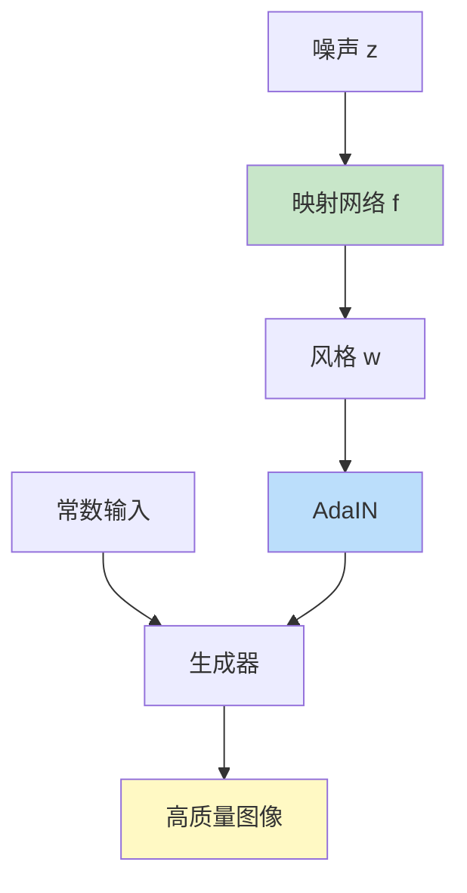
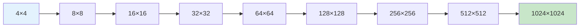

# StyleGAN 系列

> **分类**: 计算机视觉 | **编号**: 039 | **更新时间**: 2026-03-30 | **难度**: ⭐⭐

`CV` `卷积` `正则化`

**摘要**: StyleGAN 是由 NVIDIA 的 Tero Karras 等人于 2018 年提出的高质量人脸生成模型。

---
## 概述

StyleGAN 是由 NVIDIA 的 Tero Karras 等人于 2018 年提出的高质量人脸生成模型。StyleGAN 通过风格注入和映射网络，实现了生成图像的高质量和可控性，成为图像生成领域的里程碑工作。

## StyleGAN v1

### 核心创新



1. **映射网络：** z → w，解耦隐空间
2. **自适应实例归一化（AdaIN）：** 注入风格
3. **噪声注入：** 增加随机性

### 架构实现

```python
import torch
import torch.nn as nn
import torch.nn.functional as F
import math

class PixelNorm(nn.Module):
    def forward(self, x):
        return x / torch.sqrt(torch.mean(x ** 2, dim=1, keepdim=True) + 1e-8)

class MappingNetwork(nn.Module):
    def __init__(self, latent_dim=512, w_dim=512, num_layers=8):
        super().__init__()
        layers = [PixelNorm(), nn.Linear(latent_dim, w_dim), nn.LeakyReLU(0.2)]
        
        for _ in range(num_layers - 1):
            layers.extend([
                nn.Linear(w_dim, w_dim),
                nn.LeakyReLU(0.2)
            ])
        
        self.network = nn.Sequential(*layers)
    
    def forward(self, z):
        return self.network(z)

class AdaIN(nn.Module):
    def __init__(self, w_dim, channels):
        super().__init__()
        self.style = nn.Linear(w_dim, channels * 2)
    
    def forward(self, x, w):
        # 计算均值和方差
        mean = x.mean(dim=[2, 3], keepdim=True)
        std = x.std(dim=[2, 3], keepdim=True) + 1e-8
        
        # 风格参数
        style = self.style(w).view(-1, x.shape[1] * 2, 1, 1)
        gamma, beta = style.chunk(2, dim=1)
        
        # AdaIN
        return gamma * (x - mean) / std + beta

class StyledConv(nn.Module):
    def __init__(self, w_dim, in_channels, out_channels, upsample=True):
        super().__init__()
        self.upsample = upsample
        
        self.conv1 = nn.Sequential(
            nn.Conv2d(in_channels, out_channels, 3, 1, 1),
            AdaIN(w_dim, out_channels),
            nn.LeakyReLU(0.2)
        )
        
        self.conv2 = nn.Sequential(
            nn.Conv2d(out_channels, out_channels, 3, 1, 1),
            AdaIN(w_dim, out_channels),
            nn.LeakyReLU(0.2)
        )
        
        # 噪声注入
        self.noise_weight = nn.Parameter(torch.zeros(1))
        self.register_buffer('noise', torch.randn(1, 1, 1024, 1024))
    
    def forward(self, x, w):
        if self.upsample:
            x = F.interpolate(x, scale_factor=2, mode='bilinear', align_corners=False)
        
        x = self.conv1(x)
        
        # 添加噪声
        noise = self.noise[:, :, :x.shape[2], :x.shape[3]]
        x = x + self.noise_weight * noise
        
        x = self.conv2(x)
        return x

class Generator(nn.Module):
    def __init__(self, w_dim=512, img_channels=3):
        super().__init__()
        
        # 映射网络
        self.mapping = MappingNetwork()
        
        # 4×4 初始卷积
        self.initial = nn.Sequential(
            nn.ConvTranspose2d(512, 512, 4, 1, 0),
            AdaIN(w_dim, 512),
            nn.LeakyReLU(0.2)
        )
        
        # 上采样块
        self.layers = nn.ModuleList([
            StyledConv(w_dim, 512, 512),
            StyledConv(w_dim, 512, 512),
            StyledConv(w_dim, 512, 512),
            StyledConv(w_dim, 512, 512),
            StyledConv(w_dim, 512, 256),
            StyledConv(w_dim, 256, 128),
            StyledConv(w_dim, 128, 64),
            StyledConv(w_dim, 64, 32),
            StyledConv(w_dim, 32, 16),
        ])
        
        # 输出
        self.to_rgb = nn.Sequential(
            nn.Conv2d(16, img_channels, 1),
            nn.Tanh()
        )
    
    def forward(self, z):
        w = self.mapping(z)
        
        # 初始 4×4
        x = torch.ones(z.shape[0], 512, 4, 4, device=z.device)
        x = self.initial(x)
        
        # 上采样
        for layer in self.layers:
            x = layer(x, w)
        
        return self.to_rgb(x)

class Discriminator(nn.Module):
    def __init__(self, img_channels=3):
        super().__init__()
        # 从 1024×1024 逐步下采样到 4×4
        pass
    
    def forward(self, x):
        pass
```

### 渐进式增长



## StyleGAN v2

### 改进

1. **移除 AdaIN 的噪声注入**
2. **路径长度正则化**
3. **改进的架构**

### 路径长度正则化

```python
def path_length_regularizer(generator, z, w, images, gamma=2):
    """鼓励生成器对 w 的变化响应均匀"""
    noise = torch.randn_like(images)
    
    # 梯度
    grad_outputs = (images * noise).sum()
    gradients = torch.autograd.grad(
        outputs=grad_outputs,
        inputs=w,
        create_graph=True
    )[0]
    
    # 路径长度
    path_lengths = torch.sqrt((gradients ** 2).sum(dim=[1, 2]) + 1e-8)
    
    # 损失
    pl_loss = ((path_lengths - path_lengths.mean()) ** 2).mean()
    
    return pl_loss * gamma
```

## StyleGAN v3

### 改进

1. **消除纹理粘附**
2. **等变滤波器**

## 潜在空间操作

### 属性编辑

```python
@torch.no_grad()
def edit_attribute(generator, z, attribute_vector, alpha=1.0):
    """编辑生成图像的属性"""
    w = generator.mapping(z)
    w_edit = w + alpha * attribute_vector
    image = generator(w_edit)
    return image

# 发现属性方向
# 使用 SVM 在 w 空间训练分类器
```

### 插值

```python
@torch.no_grad()
def spherical_interpolation(w1, w2, num_steps=10):
    """球面插值"""
    w1 = w1 / w1.norm()
    w2 = w2 / w2.norm()
    
    interpolated = []
    for alpha in torch.linspace(0, 1, num_steps):
        angle = torch.acos((w1 * w2).sum()).clamp(-1, 1)
        w = (torch.sin((1 - alpha) * angle) * w1 + torch.sin(alpha * angle) * w2) / torch.sin(angle)
        interpolated.append(w)
    
    return torch.stack(interpolated)
```

## 应用

### 1. 人脸生成

```python
# 生成高质量人脸
generator = Generator()
z = torch.randn(1, 512)
face = generator(z)
save_image(face, 'face.png')
```

### 2. 属性编辑

```python
# 添加眼镜、改变年龄等
edited_face = edit_attribute(generator, z, glasses_vector, alpha=2.0)
```

### 3. 图像混合

```python
# 混合两张图像的风格
w1 = generator.mapping(z1)
w2 = generator.mapping(z2)
w_mix = torch.cat([w1[:, :4], w2[:, 4:]], dim=1)
mixed_image = generator(w_mix)
```

## 总结

StyleGAN 系列通过映射网络、AdaIN 和渐进式增长，实现了高质量、可控的图像生成。其潜在空间的可解释性为生成模型的可控性开辟了新方向。
