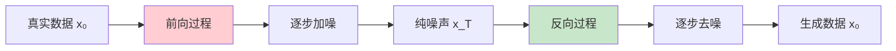

# Diffusion Models（扩散模型）
> **分类**: 生成模型（计算机视觉） | **编号**: CV-40 | **更新时间**: 2026-04-01 | **难度**: ⭐⭐⭐⭐⭐

`生成模型` `GAN` `Diffusion` `VAE` `计算机视觉` `图像生成`

**摘要**: 扩散模型（Diffusion Models）是一类受非平衡热力学启发的生成模型，通过逐步加噪和去噪过程学习数据分布。

---
## 概述

扩散模型（Diffusion Models）是一类受非平衡热力学启发的生成模型，通过逐步加噪和去噪过程学习数据分布。扩散模型在图像生成、音频合成等任务中取得了 SOTA 性能，成为当前最热门的生成模型之一。

## 核心思想

### 前向和反向过程



**前向过程：** 逐步添加高斯噪声，将数据变为纯噪声

**反向过程：** 学习去噪，从噪声恢复数据

## 数学原理

### 前向扩散过程

$$q(x_t | x_{t-1}) = \mathcal{N}(x_t; \sqrt{1 - \beta_t} x_{t-1}, \beta_t I)$$

其中 $\beta_t$ 是噪声调度。

**任意时刻采样：**
$$q(x_t | x_0) = \mathcal{N}(x_t; \sqrt{\bar{\alpha}_t} x_0, (1 - \bar{\alpha}_t) I)$$

其中 $\alpha_t = 1 - \beta_t$, $\bar{\alpha}_t = \prod_{s=1}^t \alpha_s$

### 反向去噪过程

$$p_\theta(x_{t-1} | x_t) = \mathcal{N}(x_{t-1}; \mu_\theta(x_t, t), \Sigma_\theta(x_t, t))$$

## 基础实现

```python
import torch
import torch.nn as nn
import torch.nn.functional as F
import math

class DiffusionModel(nn.Module):
    def __init__(self, img_size=32, timesteps=1000):
        super().__init__()
        self.img_size = img_size
        self.timesteps = timesteps
        
        # 噪声调度（线性）
        self.beta_start = 1e-4
        self.beta_end = 0.02
        self.betas = torch.linspace(self.beta_start, self.beta_end, timesteps)
        
        # 预计算
        self.alphas = 1 - self.betas
        self.alphas_cumprod = torch.cumprod(self.alphas, dim=0)
        self.sqrt_alphas_cumprod = torch.sqrt(self.alphas_cumprod)
        self.sqrt_one_minus_alphas_cumprod = torch.sqrt(1 - self.alphas_cumprod)
    
    def add_noise(self, x0, t, noise=None):
        """前向过程：添加噪声"""
        if noise is None:
            noise = torch.randn_like(x0)
        
        sqrt_alpha = self.sqrt_alphas_cumprod[t].view(-1, 1, 1, 1).to(x0.device)
        sqrt_one_minus_alpha = self.sqrt_one_minus_alphas_cumprod[t].view(-1, 1, 1, 1).to(x0.device)
        
        xt = sqrt_alpha * x0 + sqrt_one_minus_alpha * noise
        return xt, noise
    
    def sample_timestep(self, batch_size):
        """随机采样时间步"""
        return torch.randint(0, self.timesteps, (batch_size,), dtype=torch.long)

class UNetForDiffusion(nn.Module):
    def __init__(self, img_channels=3, base_channels=128):
        super().__init__()
        
        # 时间嵌入
        self.time_embed = nn.Sequential(
            nn.Linear(1, base_channels * 4),
            nn.SiLU(),
            nn.Linear(base_channels * 4, base_channels * 4)
        )
        
        # 编码器
        self.down1 = nn.Sequential(
            nn.Conv2d(img_channels, base_channels, 3, padding=1),
            nn.GroupNorm(8, base_channels),
            nn.SiLU(),
            nn.Conv2d(base_channels, base_channels, 3, padding=1),
            nn.GroupNorm(8, base_channels),
            nn.SiLU()
        )
        
        self.down2 = nn.Sequential(
            nn.Conv2d(base_channels, base_channels * 2, 3, padding=1),
            nn.GroupNorm(8, base_channels * 2),
            nn.SiLU(),
            nn.Conv2d(base_channels * 2, base_channels * 2, 3, padding=1),
            nn.GroupNorm(8, base_channels * 2),
            nn.SiLU()
        )
        
        # 中间层
        self.mid = nn.Sequential(
            nn.Conv2d(base_channels * 2, base_channels * 2, 3, padding=1),
            nn.GroupNorm(8, base_channels * 2),
            nn.SiLU(),
            nn.Conv2d(base_channels * 2, base_channels * 2, 3, padding=1),
            nn.GroupNorm(8, base_channels * 2),
            nn.SiLU()
        )
        
        # 解码器
        self.up2 = nn.Sequential(
            nn.ConvTranspose2d(base_channels * 4, base_channels, 2, stride=2),
            nn.GroupNorm(8, base_channels),
            nn.SiLU(),
            nn.Conv2d(base_channels, base_channels, 3, padding=1),
            nn.GroupNorm(8, base_channels),
            nn.SiLU()
        )
        
        self.up1 = nn.Sequential(
            nn.ConvTranspose2d(base_channels * 2, base_channels, 2, stride=2),
            nn.GroupNorm(8, base_channels),
            nn.SiLU(),
            nn.Conv2d(base_channels, img_channels, 3, padding=1),
            nn.Tanh()
        )
    
    def forward(self, x, t):
        # 时间嵌入
        t_emb = self.time_embed(t.float().unsqueeze(-1)).unsqueeze(-1).unsqueeze(-1)
        
        # 编码
        d1 = self.down1(x)
        d2 = self.down2(F.avg_pool2d(d1, 2))
        
        # 中间
        mid = self.mid(d2)
        mid = mid + t_emb
        
        # 解码
        u2 = self.up2(torch.cat([mid, d2], dim=1))
        u1 = self.up1(torch.cat([u2, d1], dim=1))
        
        return u1

class DiffusionTrainer(nn.Module):
    def __init__(self, unet, diffusion):
        super().__init__()
        self.unet = unet
        self.diffusion = diffusion
    
    def forward(self, x0):
        # 采样时间步
        t = self.diffusion.sample_timestep(x0.shape[0])
        
        # 添加噪声
        xt, noise = self.diffusion.add_noise(x0, t)
        
        # 预测噪声
        predicted_noise = self.unet(xt, t)
        
        # 损失：预测噪声 vs 真实噪声
        loss = F.mse_loss(predicted_noise, noise)
        
        return loss

# 测试
diffusion = DiffusionModel(timesteps=1000)
unet = UNetForDiffusion()
trainer = DiffusionTrainer(unet, diffusion)

x0 = torch.randn(4, 3, 32, 32)
loss = trainer(x0)
print(f"Diffusion Loss: {loss.item():.4f}")
```

## 采样算法

### DDPM 采样

```python
@torch.no_grad()
def sample_ddpm(model, diffusion, num_samples=1, steps=1000):
    """DDPM 采样"""
    device = next(model.parameters()).device
    img_size = diffusion.img_size
    
    # 从纯噪声开始
    x = torch.randn(num_samples, 3, img_size, img_size, device=device)
    
    for t in reversed(range(steps)):
        t_batch = torch.full((num_samples,), t, dtype=torch.long, device=device)
        
        # 预测噪声
        predicted_noise = model(x, t_batch)
        
        # 计算参数
        alpha = diffusion.alphas[t].item()
        alpha_cumprod = diffusion.alphas_cumprod[t].item()
        alpha_cumprod_prev = diffusion.alphas_cumprod[t-1].item() if t > 0 else 1.0
        
        # 去噪
        beta = 1 - alpha
        x0_pred = (x - torch.sqrt(torch.tensor(1 - alpha_cumprod)).to(device) * predicted_noise) / \
                  torch.sqrt(torch.tensor(alpha_cumprod)).to(device)
        x0_pred = x0_pred.clamp(-1, 1)
        
        direction = torch.sqrt(torch.tensor(beta)).to(device) * predicted_noise
        variance = torch.sqrt(torch.tensor(beta * (1 - alpha_cumprod_prev) / (1 - alpha_cumprod))).to(device)
        z = torch.randn_like(x) if t > 0 else 0
        
        x = torch.sqrt(torch.tensor(alpha_cumprod_prev)).to(device) * x0_pred + direction + variance * z
    
    return x
```

## 训练技巧

### 1. 噪声调度

```python
# 线性调度
betas = torch.linspace(1e-4, 0.02, 1000)

# 余弦调度（更好）
def cosine_beta_schedule(timesteps, s=0.008):
    steps = timesteps + 1
    x = torch.linspace(0, timesteps, steps)
    alphas_cumprod = torch.cos(((x / timesteps) + s) / (1 + s) * torch.pi * 0.5) ** 2
    alphas_cumprod = alphas_cumprod / alphas_cumprod[0]
    betas = 1 - (alphas_cumprod[1:] / alphas_cumprod[:-1])
    return betas.clamp(0, 0.999)
```

### 2. 分类器引导

```python
# 使用分类器引导提高生成质量
def classifier_guidance(x, t, classifier, guidance_scale=1.0):
    x.requires_grad_(True)
    class_logits = classifier(x, t)
    class_probs = F.softmax(class_logits, dim=-1)
    
    # 梯度引导
    grad = torch.autograd.grad(class_probs[:, target_class].sum(), x)[0]
    x = x + guidance_scale * grad
    
    return x.detach()
```

## 应用

### 1. 图像生成

```python
# 生成图像
model = UNetForDiffusion()
diffusion = DiffusionModel()

generated = sample_ddpm(model, diffusion, num_samples=16)
```

### 2. 图像修复

```python
# 修复缺失区域
def inpainting(model, diffusion, masked_image, mask):
    x = torch.randn_like(masked_image)
    
    for t in reversed(range(diffusion.timesteps)):
        x = diffusion.add_noise(x, t)[0]
        x[mask == 0] = masked_image[mask == 0]  # 保持已知区域
        
        # 去噪
        predicted_noise = model(x, torch.full((1,), t))
        # ... 更新 x
    
    return x
```

## 总结

扩散模型通过逐步去噪过程实现了高质量的生成，在图像、音频等任务中取得了 SOTA 性能。其理论基础和灵活性使其成为当前最热门的生成模型研究方向。
