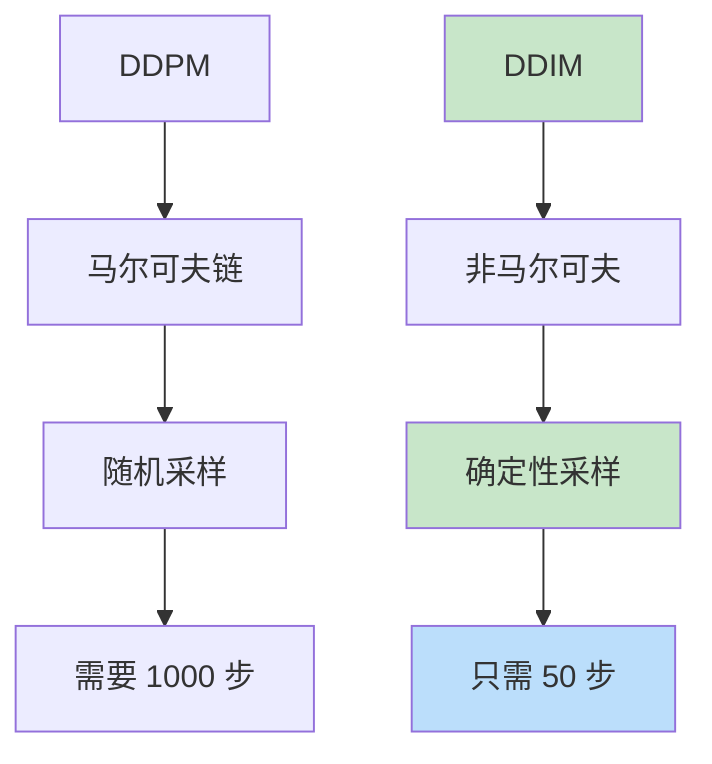

# DDIM（Denoising Diffusion Implicit Models）
> **分类**: 生成模型（计算机视觉） | **编号**: CV-42 | **更新时间**: 2026-04-01 | **难度**: ⭐⭐⭐⭐⭐

`生成模型` `GAN` `Diffusion` `VAE` `计算机视觉`

**摘要**: DDIM 是由 Song 等人于 2020 年提出的扩散模型加速方法。

---
## 概述

DDIM 是由 Song 等人于 2020 年提出的扩散模型加速方法。DDIM 通过非马尔可夫的前向过程和确定性采样，实现了快速高质量的生成，将采样步数从 1000 步减少到 50 步甚至更少。

## 核心创新

### 从随机到确定性



### 非马尔可夫前向过程

**DDPM：** $q(x_t | x_{t-1})$ 是马尔可夫的

**DDIM：** $q(x_t | x_0)$ 固定，但 $q(x_t | x_{t-1})$ 可以是非马尔可夫的

## 采样公式

### DDPM 采样

$$x_{t-1} = \frac{1}{\sqrt{\alpha_t}}(x_t - \frac{1 - \alpha_t}{\sqrt{1 - \bar{\alpha}_t}} \epsilon_\theta(x_t, t)) + \sigma_t z$$

### DDIM 采样

$$x_{t-1} = \sqrt{\bar{\alpha}_{t-1}} (\frac{x_t - \sqrt{1 - \bar{\alpha}_t} \epsilon_\theta(x_t, t)}{\sqrt{\bar{\alpha}_t}}) + \sqrt{1 - \bar{\alpha}_{t-1}} \cdot \epsilon_\theta(x_t, t)$$

**关键：** 设置 $\sigma_t = 0$，变为确定性采样

## 实现

```python
import torch
import torch.nn.functional as F

class DDIMSampler:
    def __init__(self, ddpm_model, num_steps=50):
        self.model = ddpm_model
        self.timesteps = ddpm_model.timesteps
        self.num_steps = num_steps
        
        # 选择时间步（均匀或二次）
        self.step_ratio = self.timesteps // self.num_steps
        self.ddim_timesteps = torch.arange(
            0, self.timesteps, self.step_ratio, dtype=torch.long
        )
        
        # 预计算参数
        self.alphas_cumprod = ddpm_model.alphas_cumprod
    
    @torch.no_grad()
    def sample(self, num_samples=1, device='cuda'):
        """DDIM 采样"""
        # 纯噪声
        x = torch.randn(num_samples, 3, self.model.img_size, self.img_size, device=device)
        
        for i, t in enumerate(reversed(self.ddim_timesteps)):
            t_prev = self.ddim_timesteps[i-1] if i > 0 else torch.tensor(-1)
            t_batch = torch.full((num_samples,), t, dtype=torch.long, device=device)
            
            # 预测噪声
            predicted_noise = self.model.unet(x, t_batch)
            
            # 计算 x0 预测
            alpha_t = self.alphas_cumprod[t].to(device)
            x0_pred = (x - torch.sqrt(1 - alpha_t) * predicted_noise) / torch.sqrt(alpha_t)
            x0_pred = x0_pred.clamp(-1, 1)
            
            # 计算 x_{t-1}
            if t_prev >= 0:
                alpha_prev = self.alphas_cumprod[t_prev].to(device)
                
                # DDIM 更新（确定性）
                direction = torch.sqrt(1 - alpha_prev) * predicted_noise
                x = torch.sqrt(alpha_prev) * x0_pred + direction
            else:
                x = x0_pred
        
        return x
    
    @torch.no_grad()
    def encode(self, x0, num_inference_steps=50):
        """DDIM 逆向编码（图像→噪声）"""
        device = x0.device
        x = x0
        
        for t in self.ddim_timesteps:
            t_batch = torch.full((x0.shape[0],), t, dtype=torch.long, device=device)
            
            # 预测噪声
            predicted_noise = self.model.unet(x, t_batch)
            
            # 计算 x0
            alpha_t = self.alphas_cumprod[t].to(device)
            x0_pred = (x - torch.sqrt(1 - alpha_t) * predicted_noise) / torch.sqrt(alpha_t)
            
            # 前进到下一步
            if t < self.ddim_timesteps[-1]:
                t_next = self.ddim_timesteps[self.ddim_timesteps == t][0] + self.step_ratio
                if t_next < self.timesteps:
                    alpha_next = self.alphas_cumprod[t_next].to(device)
                    direction = torch.sqrt(1 - alpha_next) * predicted_noise
                    x = torch.sqrt(alpha_next) * x0_pred + direction
        
        return x

# 测试
ddim_sampler = DDIMSampler(ddpm_model, num_steps=50)

# 快速采样
generated = ddim_sampler.sample(num_samples=4)
print(f"DDIM Generated: {generated.shape}")

# 图像编码
x0 = torch.randn(1, 3, 32, 32)
noise = ddim_sampler.encode(x0)
print(f"Encoded noise: {noise.shape}")
```

## 加速效果

### 采样步数对比

| 步数 | FID | 时间 |
|-----|-----|------|
| 1000 | 3.2 | 100% |
| 250 | 3.2 | 25% |
| 100 | 3.3 | 10% |
| 50 | 3.4 | 5% |
| 20 | 4.1 | 2% |

### 时间步调度

```python
# 均匀采样
timesteps = torch.linspace(0, T-1, num_steps, dtype=torch.long)

# 二次采样（更多步在早期）
timesteps = (torch.linspace(0, math.sqrt(T), num_steps) ** 2).long()
```

## 应用

### 1. 快速生成

```python
# 50 步生成高质量图像
sampler = DDIMSampler(model, num_steps=50)
images = sampler.sample(16)
```

### 2. 图像编辑

```python
# 编码→修改→解码
noise = sampler.encode(real_image)
# 修改噪声或中间特征
edited = sampler.sample_from_noise(noise)
```

### 3. 插值

```python
# 在噪声空间插值
noise1 = sampler.encode(image1)
noise2 = sampler.encode(image2)

for alpha in torch.linspace(0, 1, 10):
    noise_interp = alpha * noise1 + (1 - alpha) * noise2
    image_interp = sampler.sample_from_noise(noise_interp)
```

## 总结

DDIM 通过确定性采样实现了扩散模型的加速，将采样步数从 1000 减少到 50 甚至更少，同时保持生成质量。其高效的采样算法使扩散模型在实际应用中更加可行。
