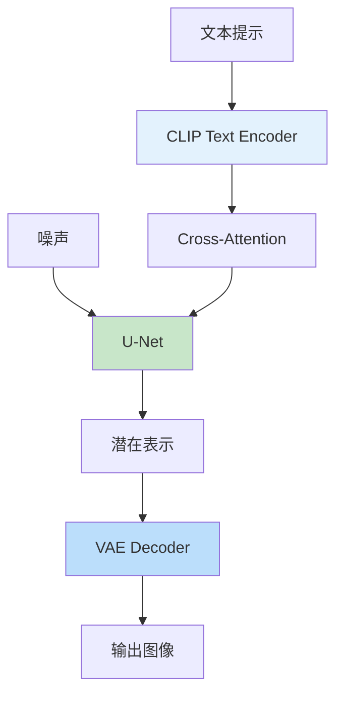

# Stable Diffusion
> **分类**: 生成模型（计算机视觉） | **编号**: CV-43 | **更新时间**: 2026-04-01 | **难度**: ⭐⭐⭐⭐⭐

`生成模型` `GAN` `Diffusion` `VAE` `计算机视觉` `图像生成`

**摘要**: Stable Diffusion 是由 Stability AI 于 2022 年提出的潜在扩散模型（Latent Diffusion Model）。

---
## 概述

Stable Diffusion 是由 Stability AI 于 2022 年提出的潜在扩散模型（Latent Diffusion Model）。Stable Diffusion 通过在潜在空间进行扩散，大幅降低了计算成本，实现了在消费级 GPU 上的高效运行，成为最流行的开源文生图模型。

## 核心创新

### 潜在空间扩散


**优势：**
- 计算量减少 48 倍（512×512 → 64×64）
- 可在消费级 GPU 运行
- 保持高质量生成

### 架构组件



## 实现

```python
import torch
import torch.nn as nn
from transformers import CLIPTextModel, CLIPTokenizer
from diffusers import AutoencoderKL, UNet2DConditionModel, DDIMScheduler

class StableDiffusion(nn.Module):
    def __init__(self, pretrained_path='runwayml/stable-diffusion-v1-5'):
        super().__init__()
        
        # 文本编码器
        self.tokenizer = CLIPTokenizer.from_pretrained(pretrained_path, subfolder='tokenizer')
        self.text_encoder = CLIPTextModel.from_pretrained(pretrained_path, subfolder='text_encoder')
        
        # VAE
        self.vae = AutoencoderKL.from_pretrained(pretrained_path, subfolder='vae')
        
        # U-Net
        self.unet = UNet2DConditionModel.from_pretrained(pretrained_path, subfolder='unet')
        
        # 调度器
        self.scheduler = DDIMScheduler.from_pretrained(pretrained_path, subfolder='scheduler')
        
        # 冻结 VAE 和文本编码器
        self.vae.requires_grad_(False)
        self.text_encoder.requires_grad_(False)
    
    @torch.no_grad()
    def encode_text(self, prompt, device='cuda'):
        """文本编码"""
        inputs = self.tokenizer(
            prompt,
            padding='max_length',
            truncation=True,
            max_length=77,
            return_tensors='pt'
        )
        
        text_embeddings = self.text_encoder(
            inputs.input_ids.to(device),
            attention_mask=inputs.attention_mask.to(device)
        )[0]
        
        return text_embeddings
    
    @torch.no_grad()
    def encode_image(self, image):
        """图像编码到潜在空间"""
        posterior = self.vae.encode(image).latent_dist
        latent = posterior.sample() * 0.18215  # 缩放因子
        return latent
    
    @torch.no_grad()
    def decode_image(self, latent):
        """从潜在空间解码图像"""
        latent = 1 / 0.18215 * latent
        image = self.vae.decode(latent).sample
        image = (image / 2 + 0.5).clamp(0, 1)
        return image
    
    @torch.no_grad()
    def generate(self, prompt, num_steps=50, guidance_scale=7.5, height=512, width=512):
        """文生图"""
        device = next(self.unet.parameters()).device
        
        # 文本编码
        text_embeddings = self.encode_text(prompt, device)
        
        # 无条件嵌入（用于引导）
        uncond_embeddings = self.encode_text([''], device)
        
        # 初始化噪声
        latent = torch.randn(1, 4, height // 8, width // 8, device=device)
        
        # 调度器设置
        self.scheduler.set_timesteps(num_steps)
        
        # 去噪循环
        for t in self.scheduler.timesteps:
            # 扩展为 2 倍（条件和无条件）
            latent_input = torch.cat([latent] * 2)
            t_batch = torch.tensor([t] * 2, dtype=torch.long, device=device)
            
            # 预测噪声
            noise_pred = self.unet(latent_input, t_batch, encoder_hidden_states=text_embeddings).sample
            
            # 分离条件和无条件预测
            noise_pred_uncond, noise_pred_text = noise_pred.chunk(2)
            
            # 分类器引导
            noise_pred = noise_pred_uncond + guidance_scale * (noise_pred_text - noise_pred_uncond)
            
            # 更新潜在
            latent = self.scheduler.step(noise_pred, t, latent).prev_sample
        
        # 解码
        image = self.decode_image(latent)
        
        return image

# 使用示例
sd = StableDiffusion()

# 文生图
prompt = "A beautiful sunset over mountains, photorealistic, 8k"
image = sd.generate(prompt, num_steps=50, guidance_scale=7.5)

# 保存
from PIL import Image
pil_image = Image.fromarray((image[0].permute(1, 2, 0).cpu().numpy() * 255).astype('uint8'))
pil_image.save('generated.png')
```

## 关键参数

### 1. 引导强度（Guidance Scale）

```python
# 低引导（7.5）：更自然，但可能偏离提示
# 高引导（15）：更符合提示，但可能过饱和
image = sd.generate(prompt, guidance_scale=7.5)
```

### 2. 采样步数

```python
# 更多步数 = 更高质量，但更慢
image = sd.generate(prompt, num_steps=50)  # 默认
image = sd.generate(prompt, num_steps=20)  # 快速
```

### 3. 随机种子

```python
# 固定种子实现可复现
torch.manual_seed(42)
latent = torch.randn(1, 4, 64, 64)
```

## 应用

### 1. 文生图

```python
prompt = "A cute cat wearing a hat, digital art"
image = sd.generate(prompt)
```

### 2. 图生图

```python
# 基于现有图像生成
init_image = load_image('input.jpg')
init_latent = sd.encode_image(init_image)

# 添加噪声
noise_strength = 0.8
noisy_latent = sd.scheduler.add_noise(init_latent, torch.randn_like(init_latent), start_timestep)

# 去噪
image = sd.generate(prompt, init_latent=noisy_latent)
```

### 3. 图像修复

```python
# 修复指定区域
mask = load_mask('mask.png')
inpaint_image = sd.inpaint(prompt, init_image, mask)
```

### 4. ControlNet

```python
# 使用边缘图控制生成
control_image = load_image('edges.png')
image = sd.generate(prompt, control_image=control_image, control_type='canny')
```

## 优化技术

### 1. xFormers 注意力

```python
# 减少显存使用
unet.enable_xformers_memory_efficient_attention()
```

### 2. 半精度推理

```python
# FP16 推理
sd.to(dtype=torch.float16)
```

### 3. 模型融合

```python
# 混合多个模型
model1 = load_model('model1')
model2 = load_model('model2')
merged = merge_models(model1, model2, alpha=0.5)
```

## 总结

Stable Diffusion 通过潜在空间扩散实现了高效的文生图，成为最流行的开源生成模型。其模块化设计和丰富的生态系统使其在创意应用、艺术创作等领域广泛应用。
