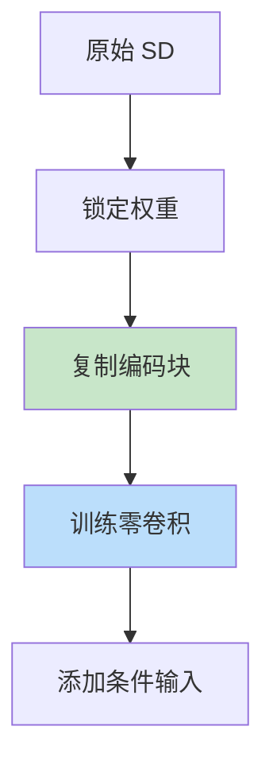

# ControlNet

> **分类**: 计算机视觉 | **编号**: 044 | **更新时间**: 2026-03-30 | **难度**: ⭐⭐

`CV` `卷积` `AI`

**摘要**: ControlNet 是由 Lvmin Zhang 等人于 2023 年提出的条件控制网络，通过在 Stable Diffusion 中添加空间条件输入，实现了对生成过程的精确控制，如边缘、深度...

---
## 概述

ControlNet 是由 Lvmin Zhang 等人于 2023 年提出的条件控制网络，通过在 Stable Diffusion 中添加空间条件输入，实现了对生成过程的精确控制，如边缘、深度、姿态等。

## 核心思想

### 锁定 + 复制



**关键：**
1. 锁定原始 SD 权重
2. 复制编码块用于条件
3. 零卷积初始化为 0，逐步学习

## 架构

```python
import torch
import torch.nn as nn

class ZeroConv(nn.Module):
    def __init__(self, channels):
        super().__init__()
        # 零初始化
        self.conv = nn.Conv2d(channels, channels, 3, padding=1)
        nn.init.zeros_(self.conv.weight)
        nn.init.zeros_(self.conv.bias)
    
    def forward(self, x):
        return self.conv(x)

class ControlNetBlock(nn.Module):
    def __init__(self, in_channels, condition_channels):
        super().__init__()
        
        # 条件编码器
        self.condition_encoder = nn.Sequential(
            nn.Conv2d(condition_channels, in_channels, 3, padding=1),
            nn.ReLU(),
            nn.Conv2d(in_channels, in_channels, 3, padding=1)
        )
        
        # 零卷积
        self.zero_conv = ZeroConv(in_channels)
    
    def forward(self, x, condition):
        # 编码条件
        cond_feat = self.condition_encoder(condition)
        
        # 零卷积输出
        zero_out = self.zero_conv(cond_feat)
        
        # 添加到原始特征
        return x + zero_out

class ControlNet(nn.Module):
    def __init__(self, unet, condition_type='canny'):
        super().__init__()
        self.unet = unet
        
        # 条件输入层
        if condition_type == 'canny':
            self.condition_input = nn.Conv2d(1, 320, 3, padding=1)
        elif condition_type == 'depth':
            self.condition_input = nn.Conv2d(1, 320, 3, padding=1)
        elif condition_type == 'pose':
            self.condition_input = nn.Conv2d(18, 320, 3, padding=1)
        
        # 控制块（对应 UNet 的每个下采样块）
        self.control_blocks = nn.ModuleList([
            ControlNetBlock(320, 320),
            ControlNetBlock(640, 640),
            ControlNetBlock(1280, 1280),
        ])
    
    def forward(self, x, t, condition, text_embeddings):
        # 编码条件
        cond_feat = self.condition_input(condition)
        
        # UNet 前向传播，注入条件
        # ...
        
        return noise_pred
```

## 训练策略

### 两阶段训练

```python
def train_controlnet(controlnet, dataloader, num_epochs=100):
    # 只训练 ControlNet 参数
    optimizer = torch.optim.AdamW(
        controlnet.control_blocks.parameters(),
        lr=1e-4
    )
    
    for epoch in range(num_epochs):
        for batch in dataloader:
            images, conditions, prompts = batch
            
            # 编码
            latents = vae.encode(images)
            text_emb = text_encoder(prompts)
            
            # 添加噪声
            t = torch.randint(0, 1000, (images.shape[0],))
            noisy_latents = add_noise(latents, t)
            
            # 预测噪声
            noise_pred = controlnet(noisy_latents, t, conditions, text_emb)
            
            # 损失
            loss = F.mse_loss(noise_pred, noise)
            
            loss.backward()
            optimizer.step()
```

## 条件类型

### 1. 边缘（Canny）

```python
import cv2

def canny_edge(image):
    edges = cv2.Canny(image, 100, 200)
    edges = edges[:, :, None]
    return edges
```

### 2. 深度图

```python
from midas import load_model

def depth_map(image):
    model = load_model('dpt_hybrid')
    depth = model(image)
    return depth
```

### 3. 姿态

```python
from openpose import Openpose

def pose_detection(image):
    openpose = Openpose()
    pose = openpose(image)
    return pose
```

### 4. 分割

```python
def segmentation_map(image):
    # 语义分割
    seg = segment_model.predict(image)
    return seg
```

## 应用

### 1. 边缘到图像

```python
# 草图生成
edge_image = canny_edge(input_image)
prompt = "A beautiful landscape"
generated = controlnet.generate(prompt, condition=edge_image, condition_type='canny')
```

### 2. 深度控制

```python
# 保持 3D 结构
depth = depth_map(input_image)
generated = controlnet.generate(prompt, condition=depth, condition_type='depth')
```

### 3. 姿态控制

```python
# 人物姿态控制
pose = pose_detection(input_image)
generated = controlnet.generate(prompt, condition=pose, condition_type='pose')
```

### 4. 多条件控制

```python
# 组合多个条件
conditions = {
    'canny': edge_image,
    'depth': depth_map,
    'pose': pose
}
generated = controlnet.generate(prompt, conditions=conditions)
```

## 实际使用

```python
from diffusers import ControlNetModel, StableDiffusionControlNetPipeline
from PIL import Image
import torch

# 加载模型
controlnet = ControlNetModel.from_pretrained(
    'lllyasviel/control_v11p_sd15_canny',
    torch_dtype=torch.float16
)

pipe = StableDiffusionControlNetPipeline.from_pretrained(
    'runwayml/stable-diffusion-v1-5',
    controlnet=controlnet,
    torch_dtype=torch.float16
)
pipe.to('cuda')

# 加载条件图像
condition_image = Image.open('condition.png')

# 生成
prompt = "A cute dog"
output = pipe(prompt, image=condition_image).images[0]
output.save('output.png')
```

## 总结

ControlNet 通过零卷积和条件注入，实现了对扩散模型的精确空间控制。其模块化设计支持多种条件类型，在艺术创作、设计辅助等领域具有广泛应用。
