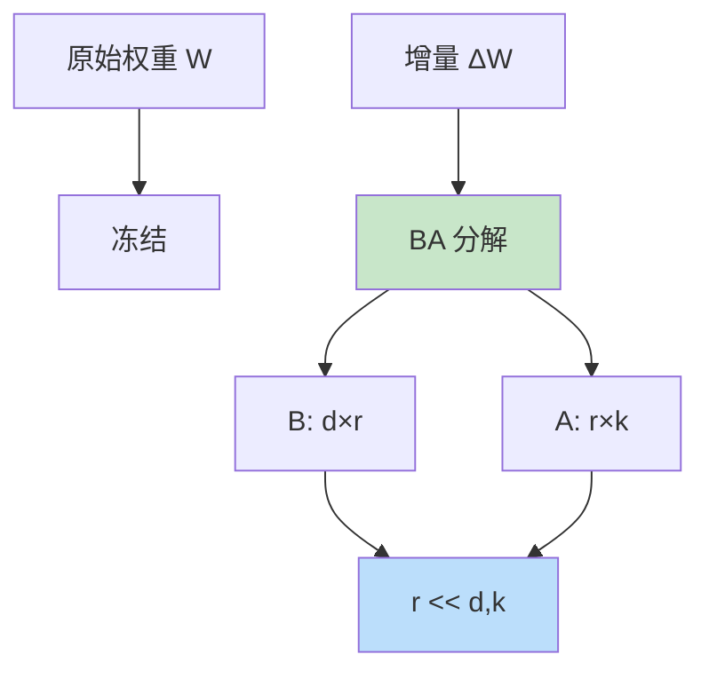

# LoRA for Diffusion

> **分类**: 计算机视觉 | **编号**: 045 | **更新时间**: 2026-03-30 | **难度**: ⭐⭐

`CV` `LLM` `微调`

**摘要**: LoRA（Low-Rank Adaptation）最初由 Hu 等人于 2021 年提出用于 LLM 微调，后被应用于扩散模型。

---
## 概述

LoRA（Low-Rank Adaptation）最初由 Hu 等人于 2021 年提出用于 LLM 微调，后被应用于扩散模型。LoRA 通过低秩分解大幅减少了微调参数量，实现了高效的模型定制和风格迁移。

## 核心思想

### 低秩分解



**公式：**
$$W' = W + \Delta W = W + BA$$

其中 $B \in \mathbb{R}^{d \times r}$, $A \in \mathbb{R}^{r \times k}$, $r \ll d, k$

### 参数量对比

| 方法 | 参数量 | 比例 |
|-----|--------|------|
| 全量微调 | 860M | 100% |
| LoRA (r=4) | 4.2M | 0.5% |
| LoRA (r=16) | 16.8M | 2% |

## 实现

```python
import torch
import torch.nn as nn
import torch.nn.functional as F

class LoRALinear(nn.Module):
    def __init__(self, in_features, out_features, rank=4, alpha=1.0):
        super().__init__()
        self.in_features = in_features
        self.out_features = out_features
        self.rank = rank
        self.alpha = alpha
        
        # 原始权重（冻结）
        self.original_weight = nn.Linear(in_features, out_features, bias=False)
        self.original_weight.requires_grad_(False)
        
        # LoRA 权重
        self.lora_A = nn.Parameter(torch.zeros(rank, in_features))
        self.lora_B = nn.Parameter(torch.zeros(out_features, rank))
        
        # 缩放因子
        self.scaling = alpha / rank
        
        # 初始化
        nn.init.kaiming_uniform_(self.lora_A, a=math.sqrt(5))
        nn.init.zeros_(self.lora_B)
    
    def forward(self, x):
        # 原始输出
        orig_out = self.original_weight(x)
        
        # LoRA 增量
        lora_out = F.linear(x, self.lora_B @ self.lora_A) * self.scaling
        
        return orig_out + lora_out

class LoRAConv2d(nn.Module):
    def __init__(self, in_channels, out_channels, kernel_size, rank=4, alpha=1.0):
        super().__init__()
        self.rank = rank
        self.alpha = alpha
        
        # 原始权重（冻结）
        self.original_conv = nn.Conv2d(in_channels, out_channels, kernel_size, padding=kernel_size//2, bias=False)
        self.original_conv.requires_grad_(False)
        
        # LoRA 权重
        self.lora_A = nn.Parameter(torch.zeros(rank, in_channels * kernel_size * kernel_size))
        self.lora_B = nn.Parameter(torch.zeros(out_channels * kernel_size * kernel_size, rank))
        
        self.scaling = alpha / rank
        
        # 初始化
        nn.init.kaiming_uniform_(self.lora_A, a=math.sqrt(5))
        nn.init.zeros_(self.lora_B)
    
    def forward(self, x):
        # 原始输出
        orig_out = self.original_conv(x)
        
        # LoRA 增量（通过展开实现）
        batch, channels, h, w = x.shape
        x_unfold = F.unfold(x, self.original_conv.kernel_size, 
                           padding=self.original_conv.padding,
                           stride=self.original_conv.stride)
        x_unfold = x_unfold.permute(0, 2, 1)  # (batch, hw, c*k*k)
        
        lora_out = F.linear(x_unfold, self.lora_B @ self.lora_A) * self.scaling
        lora_out = lora_out.permute(0, 2, 1).view(batch, -1, h, w)
        
        return orig_out + lora_out

def apply_lora_to_unet(unet, rank=4, alpha=1.0, target_modules=['to_q', 'to_k', 'to_v', 'to_out']):
    """将 LoRA 应用到 UNet 的注意力层"""
    lora_modules = []
    
    for name, module in unet.named_modules():
        if any(key in name for key in target_modules):
            if isinstance(module, nn.Linear):
                lora = LoRALinear(module.in_features, module.out_features, rank, alpha)
                lora.original_weight.weight.data = module.weight.data.clone()
                
                # 替换
                parent_name = '.'.join(name.split('.')[:-1])
                module_name = name.split('.')[-1]
                parent = dict(unet.named_modules())[parent_name] if parent_name else unet
                setattr(parent, module_name, lora)
                lora_modules.append(lora)
    
    return lora_modules
```

## 训练

```python
def train_lora(pipeline, train_dataloader, rank=4, num_epochs=100):
    # 应用 LoRA
    lora_modules = apply_lora_to_unet(pipeline.unet, rank=rank)
    
    # 只训练 LoRA 参数
    optimizer = torch.optim.AdamW(
        [param for module in lora_modules for param in module.parameters()],
        lr=1e-4
    )
    
    for epoch in range(num_epochs):
        for batch in train_dataloader:
            images, prompts = batch
            
            # 编码
            latents = vae.encode(images)
            text_emb = text_encoder(prompts)
            
            # 添加噪声
            t = torch.randint(0, 1000, (images.shape[0],))
            noisy_latents = add_noise(latents, t)
            
            # 预测噪声
            noise_pred = pipeline.unet(noisy_latents, t, text_emb).sample
            
            # 损失
            loss = F.mse_loss(noise_pred, noise)
            
            loss.backward()
            optimizer.step()
            optimizer.zero_grad()
        
        print(f"Epoch {epoch}: Loss = {loss.item():.4f}")
```

## 保存和加载

### 保存 LoRA 权重

```python
def save_lora(lora_modules, path):
    lora_state_dict = {}
    for i, module in enumerate(lora_modules):
        lora_state_dict[f'lora_{i}_A'] = module.lora_A.data
        lora_state_dict[f'lora_{i}_B'] = module.lora_B.data
    
    torch.save(lora_state_dict, path)
    print(f"LoRA saved to {path}")

# 保存
save_lora(lora_modules, 'lora_style.safetensors')
```

### 加载 LoRA 权重

```python
def load_lora(lora_modules, path):
    state_dict = torch.load(path)
    
    for i, module in enumerate(lora_modules):
        module.lora_A.data = state_dict[f'lora_{i}_A']
        module.lora_B.data = state_dict[f'lora_{i}_B']
    
    print(f"LoRA loaded from {path}")

# 加载
load_lora(lora_modules, 'lora_style.safetensors')
```

## 应用

### 1. 风格微调

```python
# 用少量图像微调特定风格
train_images = load_style_images('anime_style/')
train_lora(pipeline, train_images, rank=4, num_epochs=100)
save_lora(lora_modules, 'anime_style.safetensors')
```

### 2. 角色定制

```python
# 微调特定角色
character_images = load_character_images('my_character/')
train_lora(pipeline, character_images, rank=16)
save_lora(lora_modules, 'my_character.safetensors')
```

### 3. 多 LoRA 混合

```python
# 混合多个 LoRA
load_lora(lora_modules_1, 'style1.safetensors')
load_lora(lora_modules_2, 'style2.safetensors')

# 加权混合
for m1, m2 in zip(lora_modules_1, lora_modules_2):
    m1.lora_A.data = 0.7 * m1.lora_A.data + 0.3 * m2.lora_A.data
    m1.lora_B.data = 0.7 * m1.lora_B.data + 0.3 * m2.lora_B.data
```

### 4. 推理时使用

```python
from diffusers import StableDiffusionPipeline

pipe = StableDiffusionPipeline.from_pretrained('runwayml/stable-diffusion-v1-5')
pipe.load_lora_weights('my_lora.safetensors')

prompt = "A beautiful landscape in anime style"
image = pipe(prompt).images[0]
```

## 优势

| 特性 | 优势 |
|-----|------|
| 参数量 | 减少 100-1000 倍 |
| 显存 | 大幅降低 |
| 训练速度 | 更快收敛 |
| 存储 | 仅几 MB |
| 组合性 | 可混合多个 LoRA |

## 总结

LoRA 通过低秩分解实现了扩散模型的高效微调，大幅降低了定制成本。其小巧的体积和优秀的性能使其成为模型定制和风格迁移的首选方法。
