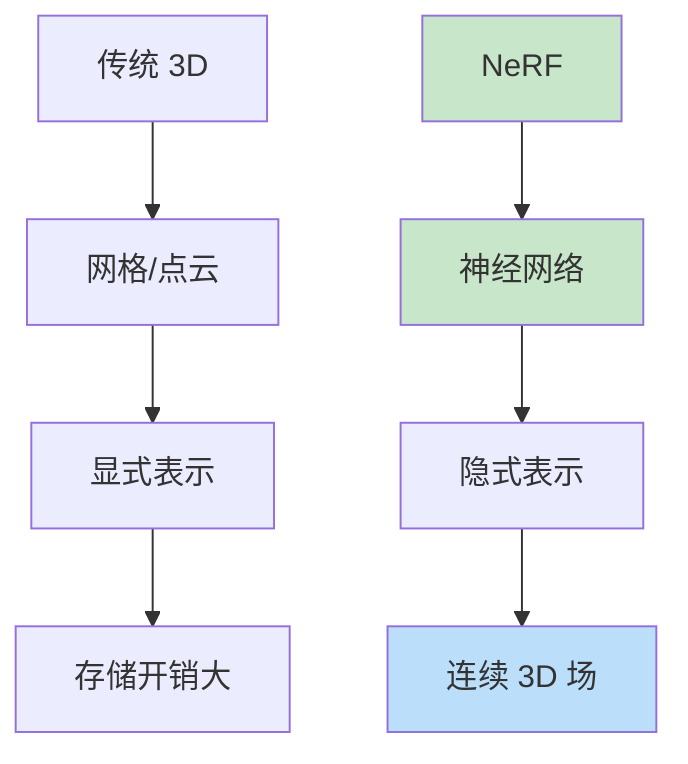

# NeRF（Neural Radiance Fields）

> **分类**: 计算机视觉 | **编号**: 046 | **更新时间**: 2026-03-30 | **难度**: ⭐⭐

`CV` `神经网络` `AI`

**摘要**: NeRF（神经辐射场）是由 Mildenhall 等人于 2020 年提出的隐式神经表示方法，通过神经网络学习场景的连续 3D 表示，实现了高质量的新视角合成，开创了神经渲染的新范式。

---
## 概述

NeRF（神经辐射场）是由 Mildenhall 等人于 2020 年提出的隐式神经表示方法，通过神经网络学习场景的连续 3D 表示，实现了高质量的新视角合成，开创了神经渲染的新范式。

## 核心思想

### 从显式到隐式



### 辐射场表示

**输入：** 3D 位置 $(x, y, z)$ + 观察方向 $(\theta, \phi)$

**输出：** 颜色 $(R, G, B)$ + 密度 $\sigma$

$$F_\Theta: (x, y, z, \theta, \phi) \rightarrow (R, G, B, \sigma)$$

## 网络架构

```python
import torch
import torch.nn as nn
import torch.nn.functional as F

class NeRF(nn.Module):
    def __init__(self, input_ch=3, input_ch_views=3, hidden_dim=256, num_layers=8):
        super().__init__()
        
        # 位置编码
        self.embed_fn = PositionalEncoding(input_ch, max_freq_log2=9)
        self.embeddirs_fn = PositionalEncoding(input_ch_views, max_freq_log2=3)
        
        # 密度网络（位置→密度+特征）
        self.density_net = nn.ModuleList()
        for i in range(num_layers):
            if i == 0:
                self.density_net.append(nn.Linear(self.embed_fn.out_dim, hidden_dim))
            else:
                self.density_net.append(nn.Linear(hidden_dim, hidden_dim))
        
        self.alpha_linear = nn.Linear(hidden_dim, 1)
        self.feature_linear = nn.Linear(hidden_dim, hidden_dim)
        
        # 颜色网络（特征 + 方向→颜色）
        self.color_net = nn.Sequential(
            nn.Linear(hidden_dim + self.embeddirs_fn.out_dim, hidden_dim // 2),
            nn.ReLU(),
            nn.Linear(hidden_dim // 2, 3),
            nn.Sigmoid()
        )
    
    def forward(self, x, view_dirs):
        # 位置编码
        embedded = self.embed_fn(x)
        embedded_dirs = self.embeddirs_fn(view_dirs)
        
        # 密度网络
        h = embedded
        for layer in self.density_net:
            h = layer(h)
            h = F.relu(h)
        
        # 输出密度和特征
        alpha = self.alpha_linear(h)
        feature = self.feature_linear(h)
        
        # 颜色网络
        h = torch.cat([feature, embedded_dirs], dim=-1)
        rgb = self.color_net(h)
        
        return rgb, alpha

class PositionalEncoding(nn.Module):
    def __init__(self, input_dim, max_freq_log2=9):
        super().__init__()
        self.input_dim = input_dim
        self.max_freq_log2 = max_freq_log2
        
        freqs = 2 ** torch.arange(max_freq_log2)
        self.register_buffer('freqs', freqs)
        
        self.out_dim = input_dim * max_freq_log2 * 2
    
    def forward(self, x):
        result = [x]
        for freq in self.freqs:
            result.append(torch.sin(freq * x))
            result.append(torch.cos(freq * x))
        return torch.cat(result, dim=-1)
```

## 体渲染

### 光线采样

```python
def sample_rays(origins, directions, near=2.0, far=6.0, num_samples=64):
    """沿光线采样点"""
    t_vals = torch.linspace(0, 1, num_samples)
    z_vals = near * (1 - t_vals) + far * t_vals
    z_vals = z_vals.expand(origins.shape[0], num_samples)
    
    # 3D 点
    pts = origins[..., None, :] + directions[..., None, :] * z_vals[..., None]
    
    return pts, z_vals
```

### 体渲染积分

$$C(r) = \int_{t_n}^{t_f} T(t) \sigma(r(t)) c(r(t), d) dt$$

其中 $T(t) = \exp(-\int_{t_n}^t \sigma(r(s)) ds)$

```python
def volume_rendering(rgb, sigma, z_vals, rays_d, raw_noise_std=0):
    """体渲染：从采样点合成像素颜色"""
    # 计算间隔
    dists = z_vals[..., 1:] - z_vals[..., :-1]
    dists = torch.cat([dists, torch.tensor([1e10]).expand(dists[..., :1].shape)], -1)
    dists = dists * torch.norm(rays_d[..., None, :], dim=-1)
    
    # 添加噪声
    if raw_noise_std > 0:
        noise = torch.randn(sigma.shape) * raw_noise_std
        sigma = sigma + noise
    
    # 透射率 T(t)
    alpha = 1 - torch.exp(-sigma * dists)
    T = torch.cumprod(torch.cat([torch.ones((alpha.shape[0], 1)), 1 - alpha + 1e-10], -1), -1)[:, :-1]
    
    # 权重
    weights = alpha * T
    
    # 合成颜色
    rgb_map = torch.sum(weights[..., None] * rgb, -2)
    
    # 深度图
    depth_map = torch.sum(weights * z_vals, -1)
    
    return rgb_map, depth_map, weights
```

## 训练

```python
def train_nerf(nerf, dataloader, num_iterations=200000):
    optimizer = torch.optim.Adam(nerf.parameters(), lr=5e-4)
    
    for step in range(num_iterations):
        # 采样光线
        rays_o, rays_d, target_rgb = next(dataloader)
        
        # 采样点
        pts, z_vals = sample_rays(rays_o, rays_d, num_samples=64)
        
        # 查询网络
        view_dirs = rays_d.expand(pts.shape)
        rgb, sigma = nerf(pts, view_dirs)
        
        # 体渲染
        rgb_map, _, _ = volume_rendering(rgb, sigma, z_vals, rays_d)
        
        # 损失
        loss = F.mse_loss(rgb_map, target_rgb)
        
        optimizer.zero_grad()
        loss.backward()
        optimizer.step()
        
        if step % 1000 == 0:
            print(f"Step {step}: Loss = {loss.item():.4f}")
```

## 优化技术

### 1. 层次化采样

```python
def hierarchical_sampling(z_vals, weights, num_samples=128):
    """基于权重的重要采样"""
    # 计算 PDF
    pdf = weights / (weights.sum() + 1e-5)
    cdf = torch.cumsum(pdf, -1)
    
    # 均匀采样
    u = torch.linspace(0, 1, num_samples).expand(pdf.shape[0], num_samples)
    
    # 逆采样
    z_samples = sample_pdf(cdf, z_vals, u)
    
    return z_samples
```

### 2. 位置编码优化

```python
# 可学习的位置编码
class LearnedPositionalEncoding(nn.Module):
    def __init__(self, num_freqs):
        super().__init__()
        self.freqs = nn.Parameter(torch.randn(num_freqs, 3))
    
    def forward(self, x):
        freqs = self.freqs.unsqueeze(0) * x.unsqueeze(-1)
        return torch.cat([torch.sin(freqs), torch.cos(freqs)], dim=-1).flatten(-2)
```

## 应用

### 1. 新视角合成

```python
@torch.no_grad()
def render_new_view(nerf, camera_pose, img_size=800):
    """渲染新视角"""
    # 生成光线
    rays_o, rays_d = generate_rays(camera_pose, img_size)
    
    # 渲染
    rgb_map, depth_map, _ = render_rays(nerf, rays_o, rays_d)
    
    return rgb_map, depth_map
```

### 2. 3D 重建

```python
# 提取网格
def extract_mesh(nerf, resolution=256):
    # 查询体素
    grid = query_grid(nerf, resolution)
    
    # Marching Cubes
    mesh = marching_cubes(grid.density, threshold=25)
    
    return mesh
```

## 变体

| 变体 | 改进 |
|-----|------|
| NeRF | 基础版本 |
| NeRF++ | 360°场景 |
| Mip-NeRF | 抗锯齿 |
| Instant-NGP | 即时训练 |
| NeRF-W | 无约束图像 |

## 总结

NeRF 通过隐式神经表示实现了高质量的新视角合成，开创了神经渲染的新方向。其连续 3D 表示和体渲染方法对 3D 视觉产生了深远影响。
