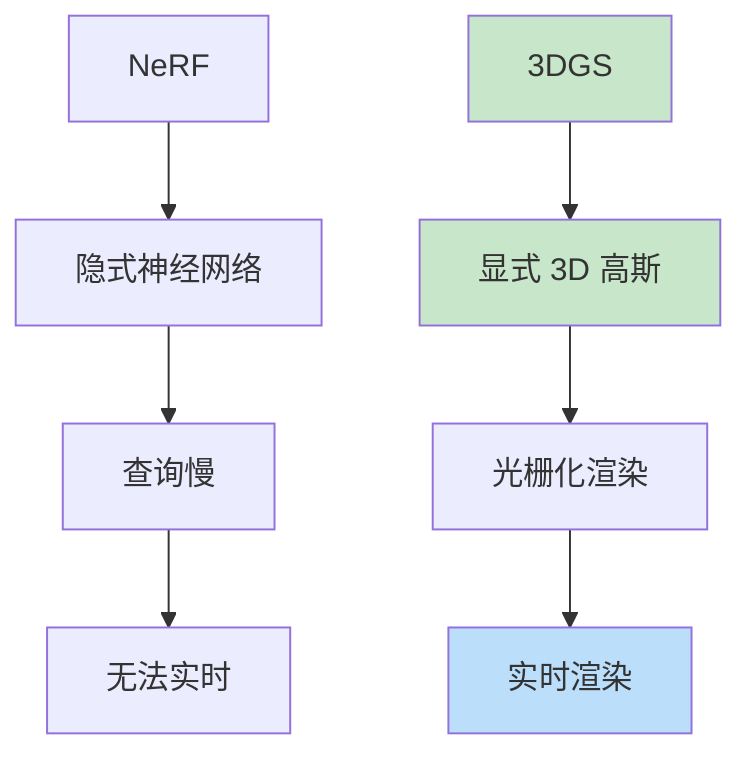

# 3D Gaussian Splatting
> **分类**: 3D 视觉（计算机视觉） | **编号**: CV-47 | **更新时间**: 2026-04-01 | **难度**: ⭐⭐⭐⭐⭐

`3D 视觉` `NeRF` `点云` `计算机视觉` `三维重建`

**摘要**: 3D Gaussian Splatting 是由 Kerbl 等人于 2023 年提出的实时辐射场渲染方法。

---
## 概述

3D Gaussian Splatting 是由 Kerbl 等人于 2023 年提出的实时辐射场渲染方法。3DGS 通过显式的 3D 高斯表示和可微分的光栅化，实现了实时高质量的新视角合成，在速度和质量的平衡上取得了突破。

## 核心思想

### 从隐式到显式



### 3D 高斯表示

每个高斯由以下参数定义：
- 位置 $\mu \in \mathbb{R}^3$
- 协方差 $\Sigma \in \mathbb{R}^{3 \times 3}$
- 不透明度 $\alpha \in [0, 1]$
- 球谐系数（颜色）

## 数学原理

### 3D 高斯函数

$$G(x) = e^{-\frac{1}{2}(x-\mu)^T \Sigma^{-1} (x-\mu)}$$

### 协方差分解

$$\Sigma = RSS^T R^T$$

其中：
- $R$：旋转矩阵
- $S$：缩放矩阵

### 投影到 2D

$$\Sigma' = JW \Sigma W^T J^T$$

其中 $J$ 是雅可比矩阵，$W$ 是观察变换。

## 实现

```python
import torch
import torch.nn as nn
import torch.nn.functional as F

class Gaussian3D:
    def __init__(self, num_gaussians=100000):
        self.num_gaussians = num_gaussians
        
        # 位置
        self.positions = nn.Parameter(torch.randn(num_gaussians, 3))
        
        # 缩放（对数空间）
        self.scales = nn.Parameter(torch.zeros(num_gaussians, 3))
        
        # 旋转（四元数）
        self.rotations = nn.Parameter(torch.zeros(num_gaussians, 4))
        self.rotations.data[:, 0] = 1  # 实部初始化为 1
        
        # 不透明度
        self.opacities = nn.Parameter(torch.zeros(num_gaussians, 1))
        
        # 球谐系数（颜色）
        self.sh_coeffs = nn.Parameter(torch.zeros(num_gaussians, 48))  # 16 阶
    
    def get_covariance(self):
        """计算 3D 协方差矩阵"""
        # 缩放
        scale = torch.exp(self.scales)
        
        # 旋转矩阵
        rotation = quaternion_to_matrix(self.rotations)
        
        # Σ = RSS^T R^T
        scale_matrix = torch.diag_embed(scale)
        covariance = rotation @ scale_matrix @ scale_matrix.transpose(-2, -1) @ rotation.transpose(-2, -1)
        
        return covariance
    
    def get_color(self, view_dir):
        """从球谐系数计算颜色"""
        # 评估球谐函数
        sh_color = evaluate_spherical_harmonics(self.sh_coeffs, view_dir)
        color = torch.sigmoid(sh_color)
        
        return color
    
    def get_opacity(self):
        return torch.sigmoid(self.opacities)

def quaternion_to_matrix(quaternions):
    """四元数转旋转矩阵"""
    r, i, j, k = quaternions.unbind(-1)
    
    R = torch.stack([
        1 - 2 * (j**2 + k**2), 2 * (i * j - r * k), 2 * (i * k + r * j),
        2 * (i * j + r * k), 1 - 2 * (i**2 + k**2), 2 * (j * k - r * i),
        2 * (i * k - r * j), 2 * (j * k + r * i), 1 - 2 * (i**2 + j**2)
    ], dim=-1)
    
    return R.view(-1, 3, 3)

class GaussianRasterizer:
    def __init__(self):
        pass
    
    def forward(self, gaussians, camera):
        """光栅化 3D 高斯"""
        # 1. 变换到相机空间
        positions_cam = transform_to_camera(gaussians.positions, camera)
        
        # 2. 投影到 2D
        positions_2d, cov_2d = project_to_2d(positions_cam, gaussians.get_covariance(), camera)
        
        # 3. 可见性剔除
        visible_mask = positions_2d[:, 2] > 0  # 在相机前方
        
        # 4. 排序（从后到前）
        depths = positions_2d[visible_mask, 2]
        sorted_indices = torch.argsort(depths, descending=True)
        
        # 5. 光栅化
        image = rasterize(
            positions_2d[visible_mask][sorted_indices],
            cov_2d[visible_mask][sorted_indices],
            gaussians.get_color()[visible_mask][sorted_indices],
            gaussians.get_opacity()[visible_mask][sorted_indices]
        )
        
        return image

def rasterize(positions_2d, cov_2d, colors, opacities, img_size=(800, 800)):
    """2D 高斯光栅化"""
    image = torch.zeros(3, img_size[0], img_size[1])
    
    for i in range(len(positions_2d)):
        # 2D 高斯
        x, y = positions_2d[i, :2]
        sigma = cov_2d[i]
        alpha = opacities[i]
        color = colors[i]
        
        # 渲染到像素
        for py in range(img_size[0]):
            for px in range(img_size[1]):
                # 高斯值
                diff = torch.tensor([px - x, py - y])
                g = torch.exp(-0.5 * diff @ torch.inverse(sigma) @ diff)
                
                # Alpha 混合
                weight = alpha * g
                image[:, py, px] = image[:, py, px] * (1 - weight) + color * weight
    
    return image
```

## 训练策略

### 自适应密度控制

```python
def adaptive_densification(gaussians, grads, threshold=0.0002):
    """根据梯度自适应增加/减少高斯"""
    # 克隆大的高斯
    large_gaussians = torch.exp(gaussians.scales).max(dim=1).values > 0.01
    high_grad = grads.norm(dim=1) > threshold
    
    clone_mask = large_gaussians & high_grad
    
    if clone_mask.any():
        # 克隆
        new_positions = gaussians.positions[clone_mask].clone()
        new_scales = gaussians.scales[clone_mask].clone()
        new_rotations = gaussians.rotations[clone_mask].clone()
        new_opacities = gaussians.opacities[clone_mask].clone()
        new_sh_coeffs = gaussians.sh_coeffs[clone_mask].clone()
        
        # 添加到高斯集合
        gaussians.add_gaussians(new_positions, new_scales, new_rotations, new_opacities, new_sh_coeffs)
    
    # 移除小的高斯
    small_mask = torch.exp(gaussians.scales).max(dim=1).values < 0.001
    gaussians.remove_gaussians(small_mask)
```

### 优化流程

```python
def train_3dgs(gaussians, images, cameras, num_iterations=30000):
    optimizer = torch.optim.Adam([
        {'params': gaussians.positions, 'lr': 0.00016},
        {'params': gaussians.scales, 'lr': 0.005},
        {'params': gaussians.rotations, 'lr': 0.001},
        {'params': gaussians.opacities, 'lr': 0.05},
        {'params': gaussians.sh_coeffs, 'lr': 0.0025},
    ])
    
    for step in range(num_iterations):
        # 采样视角
        camera = random.choice(cameras)
        image = images[cameras.index(camera)]
        
        # 渲染
        rendered = render(gaussians, camera)
        
        # 损失（L1 + SSIM）
        loss = 0.8 * F.l1_loss(rendered, image) + 0.2 * (1 - ssim(rendered, image))
        
        optimizer.zero_grad()
        loss.backward()
        
        # 自适应密度控制
        if step % 100 == 0:
            adaptive_densification(gaussians, gaussians.positions.grad)
        
        optimizer.step()
```

## 性能对比

| 方法 | FPS | PSNR | 显存 |
|-----|-----|------|------|
| NeRF | 0.03 | 31.2 | 2GB |
| Instant-NGP | 10 | 30.9 | 4GB |
| 3DGS | 100+ | 32.1 | 6GB |

## 应用

### 1. 实时新视角合成

```python
# 实时渲染
gs = Gaussian3D(num_gaussians=100000)
rasterizer = GaussianRasterizer()

while True:
    camera = get_current_camera()
    image = rasterizer.forward(gs, camera)
    display(image)  # 100+ FPS
```

### 2. SLAM

```python
# 在线建图
for frame in video_stream:
    camera_pose = estimate_pose(frame, gs)
    update_gaussians(gs, frame, camera_pose)
```

### 3. 动态场景

```python
# 4D Gaussian Splatting
class DynamicGaussian(Gaussian3D):
    def __init__(self):
        super().__init__()
        # 时间维度
        self.time_coeffs = nn.Parameter(torch.zeros(num_gaussians, 16))
```

## 总结

3D Gaussian Splatting 通过显式 3D 高斯表示和可微分光栅化，实现了实时高质量的新视角合成。其高效的渲染速度和优秀的质量使其成为神经渲染领域的重要突破。
