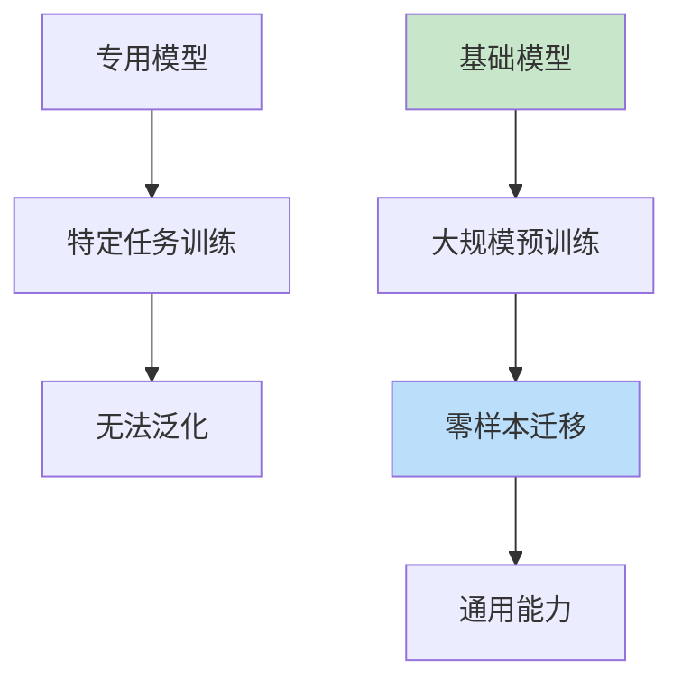
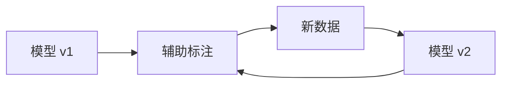

# SAM（前沿技术）

> **分类**: 计算机视觉 | **编号**: 048 | **更新时间**: 2026-03-30 | **难度**: ⭐⭐

`CV` `预训练` `AI`

**摘要**: SAM（Segment Anything Model）作为基础分割模型，代表了计算机视觉向通用模型发展的趋势。

---
## 概述

SAM（Segment Anything Model）作为基础分割模型，代表了计算机视觉向通用模型发展的趋势。SAM 通过大规模训练和提示式交互，实现了零样本迁移的通用分割能力。

## 核心特性

### 基础模型范式



### 三要素

1. **任务**：提示式分割
2. **数据**：SA-1B（11 亿掩码）
3. **模型**：可扩展架构

## 技术细节

### 数据引擎



**三阶段：**
1. 人工标注（400K 掩码）
2. 模型辅助（600K 掩码）
3. 全自动标注（11M 掩码）

### 提示编码

```python
class PromptEncoder(nn.Module):
    def __init__(self, embed_dim=256):
        super().__init__()
        
        # 点提示
        self.point_embeddings = nn.Embedding(2, embed_dim)
        
        # 框提示
        self.box_embeddings = nn.Embedding(2, embed_dim)
        
        # 掩码提示
        self.mask_downscaling = nn.Sequential(
            nn.Conv2d(1, 16, 3, padding=1),
            nn.ReLU(),
            nn.Conv2d(16, 32, 3, padding=1),
            nn.ReLU(),
            nn.Conv2d(32, embed_dim, 1)
        )
    
    def forward(self, points=None, boxes=None, masks=None):
        embeddings = []
        
        if points is not None:
            labels, points = points
            embeddings.append(self.point_embeddings(labels)(points))
        
        if boxes is not None:
            embeddings.append(self.box_embeddings(boxes))
        
        if masks is not None:
            embeddings.append(self.mask_downscaling(masks))
        
        return torch.cat(embeddings, dim=1)
```

## 应用

### 1. 零样本分割

```python
from segment_anything import SamPredictor

predictor = SamPredictor(sam_model)
predictor.set_image(image)

# 点提示
masks, _, _ = predictor.predict(
    point_coords=[[500, 375]],
    point_labels=[1]
)
```

### 2. 自动掩码生成

```python
# 生成所有可能的掩码
from segment_anything import SamAutomaticMaskGenerator

mask_generator = SamAutomaticMaskGenerator(sam_model)
masks = mask_generator.generate(image)
```

### 3. 视频分割

```python
# SAM 2：视频分割
class SAM2Video:
    def __init__(self):
        self.memory = MemoryBank()
    
    def track(self, video, first_frame_mask):
        for frame in video:
            mask = self.predict_with_memory(frame, self.memory)
            self.memory.update(frame, mask)
        return masks
```

## 局限性

1. **小物体分割**：对小物体效果较差
2. **精细边界**：边界不够精确
3. **语义理解**：缺乏语义信息

## 未来方向

1. **视频理解**：时序一致性
2. **3D 分割**：扩展到 3D
3. **多模态**：结合语言理解

## 总结

SAM 代表了基础模型在视觉领域的发展方向，通过大规模训练实现了通用分割能力。其提示式交互和零样本迁移为视觉模型开辟了新范式。
