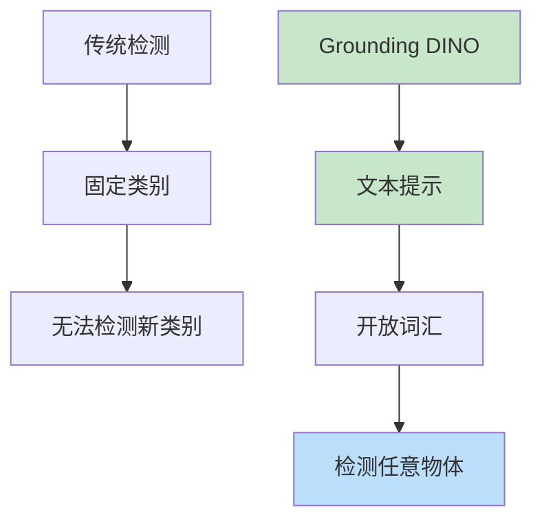

# Grounding DINO

> **分类**: 计算机视觉 | **编号**: 049 | **更新时间**: 2026-03-30 | **难度**: ⭐⭐

`CV` `Transformer` `Attention` `CNN` `BERT`

**摘要**: Grounding DINO 是由 Liu 等人于 2023 年提出的开放集目标检测模型，结合了 DINO 的检测能力和 Grounding 的语言理解能力，实现了基于文本提示的开放集检测。

---
## 概述

Grounding DINO 是由 Liu 等人于 2023 年提出的开放集目标检测模型，结合了 DINO 的检测能力和 Grounding 的语言理解能力，实现了基于文本提示的开放集检测。

## 核心思想

### 从闭集到开放集



### 跨模态融合

**视觉特征 + 语言特征 → 检测输出**

## 架构

```python
import torch
import torch.nn as nn
from transformers import BertModel

class GroundingDINO(nn.Module):
    def __init__(self, backbone='swin_T_224_1k', num_queries=900):
        super().__init__()
        
        # 视觉 backbone
        self.backbone = build_backbone(backbone)
        
        # 语言 backbone
        self.text_encoder = BertModel.from_pretrained('bert-base-uncased')
        
        # 特征融合
        self.feature_fusion = CrossModalFeatureFusion()
        
        # Transformer decoder
        self.transformer = nn.TransformerDecoder(
            nn.TransformerDecoderLayer(d_model=256, nhead=8),
            num_layers=6
        )
        
        # 检测头
        self.class_head = nn.Linear(256, 1)  # 二分类（是否匹配文本）
        self.box_head = MLP(256, 256, 4, 3)
        
        # 查询
        self.query_embed = nn.Embedding(num_queries, 256)
    
    def forward(self, images, text):
        # 视觉特征
        visual_features = self.backbone(images)
        
        # 语言特征
        text_features = self.text_encoder(text)
        
        # 跨模态融合
        fused_features = self.feature_fusion(visual_features, text_features)
        
        # Transformer 解码
        queries = self.query_embed.weight.unsqueeze(1).repeat(1, images.shape[0], 1)
        decoder_output = self.transformer(queries, fused_features)
        
        # 检测头
        logits = self.class_head(decoder_output)
        boxes = self.box_head(decoder_output)
        
        return logits, boxes

class CrossModalFeatureFusion(nn.Module):
    def __init__(self):
        super().__init__()
        # 视觉→语言注意力
        self.vision_to_text = nn.MultiheadAttention(256, 8)
        
        # 语言→视觉注意力
        self.text_to_vision = nn.MultiheadAttention(256, 8)
        
        # 前馈网络
        self.ffn = nn.Sequential(
            nn.Linear(256, 1024),
            nn.GELU(),
            nn.Linear(1024, 256)
        )
    
    def forward(self, visual_feat, text_feat):
        # 视觉特征查询文本
        visual_attended, _ = self.vision_to_text(
            visual_feat, text_feat, text_feat
        )
        
        # 文本特征查询视觉
        text_attended, _ = self.text_to_vision(
            text_feat, visual_feat, visual_feat
        )
        
        # 融合
        fused = visual_attended + text_attended
        fused = self.ffn(fused) + fused
        
        return fused
```

## 训练

### 对比学习

```python
def grounding_loss(logits, boxes, text_similarity, gt_boxes):
    """Grounding 损失"""
    # 分类损失（对比学习）
    pos_mask = text_similarity > 0.5
    neg_mask = text_similarity < 0.2
    
    pos_loss = F.binary_cross_entropy_with_logits(
        logits[pos_mask], 
        torch.ones_like(logits[pos_mask])
    )
    
    neg_loss = F.binary_cross_entropy_with_logits(
        logits[neg_mask],
        torch.zeros_like(logits[neg_mask])
    )
    
    # 回归损失
    if pos_mask.sum() > 0:
        box_loss = F.l1_loss(boxes[pos_mask], gt_boxes[pos_mask])
    else:
        box_loss = boxes.sum() * 0
    
    return pos_loss + neg_loss + box_loss
```

## 应用

### 1. 开放集检测

```python
from groundingdino.util.inference import load_model, predict

model = load_model('groundingdino_swint_ogc')
image = load_image('photo.jpg')
text_prompt = "person. bicycle. car."

boxes, logits, phrases = predict(
    model=model,
    image=image,
    caption=text_prompt,
    box_threshold=0.3,
    text_threshold=0.25
)
```

### 2. 零样本检测

```python
# 检测训练时未见过的类别
text_prompt = "rare animal species"
boxes = predict(model, image, text_prompt)
```

### 3. 视觉语言导航

```python
# "找到左边的红色椅子"
prompt = "red chair on the left"
target = predict(model, image, prompt)
```

## 性能

| 方法 | COCO mAP | LVIS mAP |
|-----|---------|---------|
| Faster R-CNN | 42.0 | - |
| DETR | 42.0 | - |
| Grounding DINO | 52.4 | 48.4 |

## 总结

Grounding DINO 通过跨模态融合实现了开放集目标检测，将视觉检测与语言理解结合，为通用视觉模型开辟了新方向。
