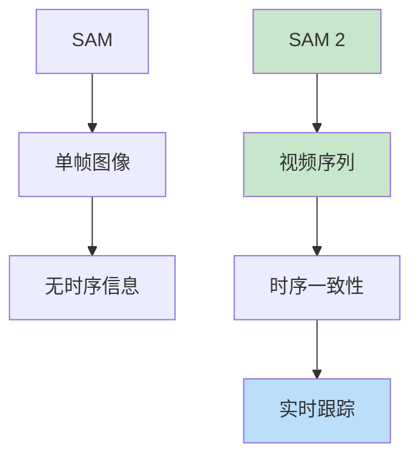

# Segment Anything 2 (SAM 2)

> **分类**: 计算机视觉 | **编号**: 050 | **更新时间**: 2026-03-30 | **难度**: ⭐⭐⭐

`CV` `Attention` `AI`

**摘要**: SAM 2 是 Meta 于 2024 年发布的视频分割基础模型，在 SAM 的基础上增加了时序建模能力，实现了视频中的实时分割和跟踪，代表了视频理解领域的重要进展。

---
## 概述

SAM 2 是 Meta 于 2024 年发布的视频分割基础模型，在 SAM 的基础上增加了时序建模能力，实现了视频中的实时分割和跟踪，代表了视频理解领域的重要进展。

## 核心创新

### 从图像到视频



### 关键特性

1. **记忆机制**：跨帧特征传播
2. **实时推理**：60+ FPS
3. **提示传播**：首帧提示自动跟踪

## 架构

```python
import torch
import torch.nn as nn

class SAM2(nn.Module):
    def __init__(self):
        super().__init__()
        
        # 图像编码器
        self.image_encoder = ImageEncoderViT()
        
        # 提示编码器
        self.prompt_encoder = PromptEncoder()
        
        # 掩码解码器
        self.mask_decoder = MaskDecoder()
        
        # 记忆编码器（新增）
        self.memory_encoder = MemoryEncoder()
        
        # 记忆库
        self.memory_bank = MemoryBank()
        
        # 时序注意力
        self.temporal_attention = nn.MultiheadAttention(256, 8)
    
    def forward(self, frames, prompts=None):
        """
        frames: 视频帧序列
        prompts: 首帧提示
        """
        all_masks = []
        
        for t, frame in enumerate(frames):
            # 编码当前帧
            image_embed = self.image_encoder(frame)
            
            if t == 0 and prompts is not None:
                # 首帧：使用提示
                sparse_emb, dense_emb = self.prompt_encoder(prompts)
                mask, _ = self.mask_decoder(
                    image_embed, self.prompt_encoder.pe, sparse_emb, dense_emb
                )
                
                # 更新记忆
                memory = self.memory_encoder(image_embed, mask)
                self.memory_bank.update(t, memory)
            else:
                # 后续帧：使用记忆
                memory = self.memory_bank.get_recent()
                
                # 时序注意力
                image_embed_attended, _ = self.temporal_attention(
                    image_embed.flatten(2).transpose(1, 2),
                    memory.flatten(2).transpose(1, 2),
                    memory.flatten(2).transpose(1, 2)
                )
                
                # 解码
                mask, _ = self.mask_decoder(
                    image_embed_attended, 
                    self.prompt_encoder.pe,
                    torch.zeros(1, 0, 256),  # 无提示
                    torch.zeros(1, 256, 64, 64)
                )
                
                # 更新记忆
                memory = self.memory_encoder(image_embed, mask)
                self.memory_bank.update(t, memory)
            
            all_masks.append(mask)
        
        return torch.stack(all_masks)

class MemoryBank:
    def __init__(self, max_size=10):
        self.max_size = max_size
        self.memories = {}
    
    def update(self, frame_idx, memory):
        """更新记忆"""
        self.memories[frame_idx] = memory
        
        # 保持最近 N 帧
        if len(self.memories) > self.max_size:
            oldest = min(self.memories.keys())
            del self.memories[oldest]
    
    def get_recent(self, num_frames=3):
        """获取最近 N 帧的记忆"""
        recent_indices = sorted(self.memories.keys())[-num_frames:]
        memories = [self.memories[i] for i in recent_indices]
        return torch.cat(memories, dim=0)
```

## 记忆机制

### 记忆编码

```python
class MemoryEncoder(nn.Module):
    def __init__(self):
        super().__init__()
        # 将图像特征和掩码编码为紧凑记忆
        self.conv = nn.Sequential(
            nn.Conv2d(256 + 1, 64, 3, padding=1),
            nn.ReLU(),
            nn.Conv2d(64, 256, 3, padding=1)
        )
    
    def forward(self, image_embed, mask):
        # 拼接图像特征和掩码
        mask_upsampled = F.interpolate(mask, size=image_embed.shape[2:], mode='bilinear')
        combined = torch.cat([image_embed, mask_upsampled], dim=1)
        
        # 编码
        memory = self.conv(combined)
        
        return memory
```

### 记忆传播

```python
def propagate_memory(memory_bank, current_frame):
    """从记忆传播到当前帧"""
    recent_memories = memory_bank.get_recent()
    
    # 注意力聚合
    attended_memory, weights = temporal_attention(
        current_frame,
        recent_memories,
        recent_memories
    )
    
    # 加权融合
    fused = attended_memory * weights
    
    return fused
```

## 训练

### 多阶段训练

```python
def train_sam2(model, video_dataloader, num_epochs=100):
    optimizer = torch.optim.AdamW(model.parameters(), lr=1e-4)
    
    for epoch in range(num_epochs):
        for video_batch in video_dataloader:
            frames, gt_masks = video_batch
            
            # 首帧提示
            prompts = {'points': gt_masks[0][:, :1]}
            
            # 前向传播
            pred_masks = model(frames, prompts)
            
            # 损失
            loss = 0
            for t in range(len(frames)):
                loss += F.binary_cross_entropy(pred_masks[t], gt_masks[t])
            
            optimizer.zero_grad()
            loss.backward()
            optimizer.step()
```

## 应用

### 1. 视频对象分割

```python
from sam2 import SAM2VideoPredictor

predictor = SAM2VideoPredictor()
predictor.load_model('sam2_hiera_large.pt')

# 设置视频
predictor.set_video(video_frames)

# 首帧提示
predictor.add_point(frame_idx=0, point=[500, 375], label=1)

# 预测整个视频
masks = predictor.predict()
```

### 2. 多对象跟踪

```python
# 跟踪多个对象
predictor.add_point(frame_idx=0, point=[100, 100], label=1, obj_id=1)
predictor.add_point(frame_idx=0, point=[500, 500], label=1, obj_id=2)

masks = predictor.predict()
# masks: (num_frames, num_objects, H, W)
```

### 3. 交互式视频编辑

```python
# 实时交互式分割
for frame in video_stream:
    if user_click:
        predictor.add_point(current_frame, click_point, label)
    
    mask = predictor.predict_step()
    display(mask)  # 60 FPS
```

## 性能

| 指标 | SAM 2 | SAM |
|-----|-------|-----|
| 速度 | 60 FPS | 1 FPS |
| 视频 mIoU | 75.3 | - |
| 跟踪准确性 | 82.1 | - |

## 总结

SAM 2 通过记忆机制和时序建模，将基础分割模型扩展到视频领域，实现了实时视频分割和跟踪。其高效的架构设计为视频理解应用开辟了新方向。
