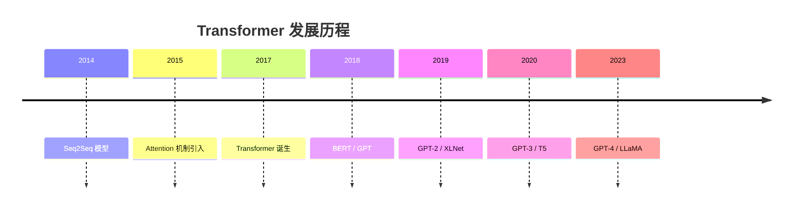
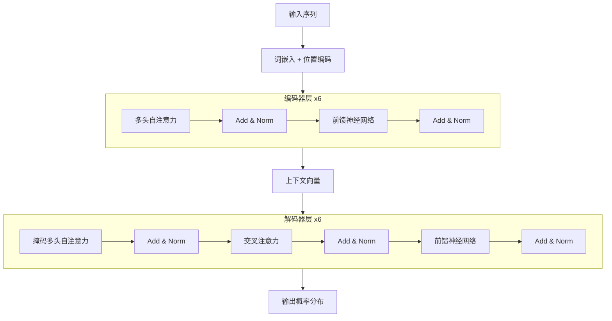

# Transformer 架构详解

> **分类**: LLM（大语言模型） | **编号**: LLM-001 | **更新时间**: 2026-04-01 | **难度**: ⭐⭐⭐

`Transformer` `Self-Attention` `深度学习架构` `LLM 基础`

**摘要**: Transformer 是一种完全基于注意力机制的深度学习模型架构，由 Google 团队在 2017 年提出。它摒弃了传统的 RNN 和 CNN 结构，实现了并行化训练和长距离依赖捕捉，是现代 LLM 的基石。

---

## 一、核心概念

### 1.1 什么是 Transformer

**Transformer** 是一种基于**自注意力机制**（Self-Attention）的深度学习模型架构，由 Google 团队在 2017 年提出的论文《[Attention Is All You Need](https://arxiv.org/abs/1706.03762)》中首次发布。

> 💡 **核心思想**: 完全基于注意力机制，摒弃了传统的 RNN 和 CNN 结构，实现了并行化训练和长距离依赖捕捉。

### 1.2 发展历史



### 1.3 核心优势对比

| 特性 | RNN/LSTM | CNN | **Transformer** |
|------|----------|-----|-----------------|
| 并行化能力 | ❌ 差 | ✅ 好 | ✅ **优秀** |
| 长距离依赖 | ⭐⭐ 一般 | ⭐⭐ 局部 | ⭐⭐⭐⭐ **全局** |
| 训练速度 | ⭐⭐ 慢 | ⭐⭐⭐ 快 | ⭐⭐⭐⭐ **很快** |
| 位置信息 | ✅ 隐式 | ✅ 隐式 | ⚠️ **需要编码** |
| 可解释性 | ⭐⭐ 低 | ⭐⭐⭐ 中 | ⭐⭐⭐⭐ **高** |

---

## 二、核心原理

### 2.1 整体架构



### 2.2 Self-Attention 机制

#### 数学公式

$$
\text{Attention}(Q, K, V) = \text{softmax}\left(\frac{QK^T}{\sqrt{d_k}}\right)V
$$

其中：
- $Q$ (Query): 查询向量
- $K$ (Key): 键向量
- $V$ (Value): 值向量
- $d_k$: 缩放因子（防止梯度消失）

#### 计算步骤

1. **计算相似度**: $Q \cdot K^T$ 得到注意力分数
2. **缩放**: 除以 $\sqrt{d_k}$ 防止梯度消失
3. **归一化**: Softmax 将分数转换为概率分布
4. **加权求和**: 用概率分布对 $V$ 加权求和

### 2.3 多头注意力（Multi-Head Attention）

多头注意力允许模型同时关注不同位置的不同表示子空间：

```python
import torch
import torch.nn as nn
import math

class MultiHeadAttention(nn.Module):
    """
    多头注意力机制实现
    
    Args:
        d_model: 模型维度 (默认 512)
        num_heads: 注意力头数 (默认 8)
        dropout: Dropout 概率 (默认 0.1)
    """
    def __init__(self, d_model=512, num_heads=8, dropout=0.1):
        super().__init__()
        self.num_heads = num_heads
        self.d_model = d_model
        self.d_k = d_model // num_heads
        
        # 线性变换层
        self.W_q = nn.Linear(d_model, d_model)
        self.W_k = nn.Linear(d_model, d_model)
        self.W_v = nn.Linear(d_model, d_model)
        self.W_o = nn.Linear(d_model, d_model)
        
        self.dropout = nn.Dropout(dropout)
        self.scale = math.sqrt(self.d_k)
    
    def forward(self, q, k, v, mask=None):
        batch_size = q.size(0)
        
        # 1. 线性变换并分头
        Q = self.W_q(q).view(batch_size, -1, self.num_heads, self.d_k).transpose(1, 2)
        K = self.W_k(k).view(batch_size, -1, self.num_heads, self.d_k).transpose(1, 2)
        V = self.W_v(v).view(batch_size, -1, self.num_heads, self.d_k).transpose(1, 2)
        
        # 2. 计算注意力分数
        scores = torch.matmul(Q, K.transpose(-2, -1)) / self.scale
        
        # 3. 应用 mask（如果需要）
        if mask is not None:
            scores = scores.masked_fill(mask == 0, -1e9)
        
        # 4. Softmax 归一化
        attn = self.dropout(torch.softmax(scores, dim=-1))
        
        # 5. 加权求和
        out = torch.matmul(attn, V)
        
        # 6. 合并头并输出
        out = out.transpose(1, 2).contiguous().view(batch_size, -1, self.d_model)
        return self.W_o(out)
```

### 2.4 位置编码（Positional Encoding）

由于 Transformer 没有递归和卷积结构，需要显式注入位置信息：

$$
PE_{(pos, 2i)} = \sin\left(\frac{pos}{10000^{2i/d_{model}}}\right)
$$

$$
PE_{(pos, 2i+1)} = \cos\left(\frac{pos}{10000^{2i/d_{model}}}\right)
$$

```python
import numpy as np

def get_position_encoding(seq_len, d_model):
    """生成绝对位置编码"""
    position = np.arange(seq_len)[:, np.newaxis]
    div_term = np.exp(np.arange(0, d_model, 2) * -(np.log(10000.0) / d_model))
    
    pe = np.zeros((seq_len, d_model))
    pe[:, 0::2] = np.sin(position * div_term)
    pe[:, 1::2] = np.cos(position * div_term)
    
    return pe
```

### 2.5 前馈神经网络（Feed-Forward Network）

每个位置独立应用相同的全连接网络：

$$
\text{FFN}(x) = \max(0, xW_1 + b_1)W_2 + b_2
$$

```python
class PositionwiseFeedForward(nn.Module):
    def __init__(self, d_model, d_ff, dropout=0.1):
        super().__init__()
        self.linear1 = nn.Linear(d_model, d_ff)
        self.linear2 = nn.Linear(d_ff, d_model)
        self.dropout = nn.Dropout(dropout)
        self.activation = nn.ReLU()
    
    def forward(self, x):
        return self.linear2(self.dropout(self.activation(self.linear1(x))))
```

### 2.6 层归一化（Layer Normalization）

```python
class LayerNorm(nn.Module):
    def __init__(self, features, eps=1e-6):
        super().__init__()
        self.weight = nn.Parameter(torch.ones(features))
        self.bias = nn.Parameter(torch.zeros(features))
        self.eps = eps
    
    def forward(self, x):
        mean = x.mean(-1, keepdim=True)
        std = x.std(-1, keepdim=True)
        return self.weight * (x - mean) / (std + self.eps) + self.bias
```

---

## 三、编码器 - 解码器结构

### 3.1 编码器（Encoder）

- 由 N 个相同层堆叠而成（原始论文 N=6）
- 每层包含两个子层：多头自注意力 + 前馈网络
- 使用残差连接和层归一化

### 3.2 解码器（Decoder）

- 同样由 N 个相同层堆叠
- 每层包含三个子层：
  1. 掩码多头自注意力（防止看到未来位置）
  2. 交叉注意力（关注编码器输出）
  3. 前馈网络

### 3.3 掩码机制

```python
def generate_square_subsequent_mask(sz):
    """生成上三角掩码，防止解码器看到未来位置"""
    mask = torch.triu(torch.ones(sz, sz), diagonal=1).bool()
    return mask
```

---

## 四、应用场景

### 4.1 机器翻译

- 原始 Transformer 的应用场景
- Encoder 处理源语言，Decoder 生成目标语言

### 4.2 文本生成（GPT 系列）

- 仅使用 Decoder 部分
- 自回归生成，每次预测下一个 token

### 4.3 语言理解（BERT 系列）

- 仅使用 Encoder 部分
- 双向上下文，适合分类、问答等任务

### 4.4 多模态任务

- Vision Transformer (ViT): 将图像分块作为序列处理
- 多模态 Transformer: 同时处理文本和图像

---

## 五、面试高频问题

### Q1: Transformer 为什么比 RNN 训练更快？

**答**: Transformer 可以完全并行化计算，而 RNN 必须按时间步顺序计算。对于长度为 $n$ 的序列，RNN 需要 $O(n)$ 的时间步，而 Transformer 可以在 $O(1)$ 时间步内处理整个序列（忽略注意力计算的复杂度）。

### Q2: Self-Attention 的复杂度是多少？

**答**: Self-Attention 的时间复杂度是 $O(n^2 \cdot d)$，其中 $n$ 是序列长度，$d$ 是模型维度。这是因为需要计算所有 token 对之间的注意力分数。空间复杂度也是 $O(n^2)$ 用于存储注意力矩阵。

### Q3: 为什么需要缩放因子 $\sqrt{d_k}$？

**答**: 当 $d_k$ 较大时，$Q \cdot K^T$ 的值会很大，导致 Softmax 进入梯度极小的饱和区。除以 $\sqrt{d_k}$ 可以将方差控制在合理范围，保持梯度稳定。

### Q4: Transformer 如何处理变长序列？

**答**: 使用 Padding 和 Attention Mask。将短序列填充到相同长度，然后在计算注意力时将 padding 位置的分数设为负无穷，使 Softmax 后这些位置的权重为 0。

---

## 六、总结

| 核心组件 | 作用 | 复杂度 |
|---------|------|--------|
| Self-Attention | 捕捉全局依赖 | $O(n^2 \cdot d)$ |
| Multi-Head | 多子空间表示 | $O(n^2 \cdot d)$ |
| Positional Encoding | 注入位置信息 | $O(n \cdot d)$ |
| Feed-Forward | 非线性变换 | $O(n \cdot d^2)$ |
| Layer Norm | 稳定训练 | $O(n \cdot d)$ |

> 💡 **关键要点**: Transformer 的核心创新是用 Self-Attention 完全替代了 RNN/CNN，实现了并行化和全局依赖捕捉，成为现代 LLM 的基石。

---

*本文档为 LLM 知识库系列文章之一，共 70 篇。*
