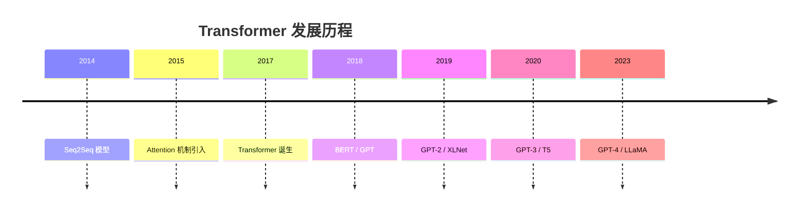
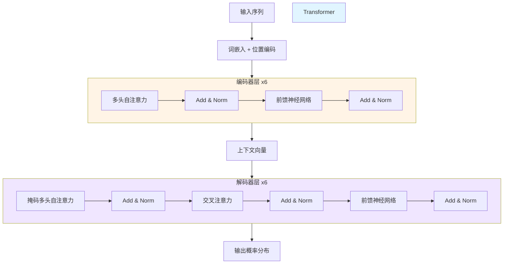
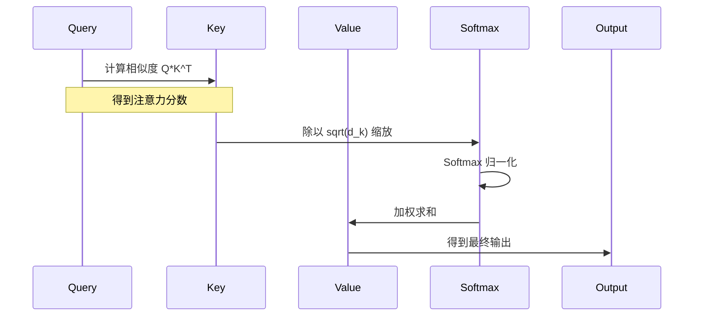
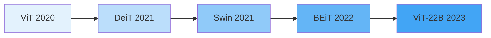

# Transformer 架构详解

> **分类**: 大语言模型 | **编号**: LLM-001 | **更新时间**: 2026-03-30 | **难度**: ⭐⭐⭐

`Transformer` `Attention` `深度学习` `NLP` `LLM`

**摘要**: Transformer 是一种基于自注意力机制的深度学习模型架构，由 Google 团队在 2017 年提出。它完全摒弃了传统的 RNN 和 CNN 结构，实现了并行化训练和长距离依赖捕捉，是现代大语言模型的基础架构。

---

## 一、核心概念

### 1.1 什么是 Transformer

**Transformer** 是一种基于**自注意力机制**（Self-Attention）的深度学习模型架构，由 Google 团队在 2017 年提出的论文《[Attention Is All You Need](https://arxiv.org/abs/1706.03762)》中首次发布。

> 💡 **核心思想**: 完全基于注意力机制，摒弃了传统的 RNN 和 CNN 结构，实现了并行化训练和长距离依赖捕捉。

### 1.2 发展历程



### 1.3 核心优势对比

| 特性 | RNN/LSTM | CNN | **Transformer** |
|------|----------|-----|-----------------|
| 并行化能力 | ❌ 差 | ✅ 好 | ✅ **优秀** |
| 长距离依赖 | ⭐⭐ 一般 | ⭐⭐ 局部 | ⭐⭐⭐⭐ **全局** |
| 训练速度 | ⭐⭐ 慢 | ⭐⭐⭐ 快 | ⭐⭐⭐⭐ **很快** |
| 位置信息 | ✅ 隐式 | ✅ 隐式 | ⚠️ **需要编码** |
| 可解释性 | ⭐⭐ 低 | ⭐⭐⭐ 中 | ⭐⭐⭐⭐ **高** |

---

## 二、核心原理

### 2.1 整体架构



### 2.2 Self-Attention 机制

#### 数学公式

$$
\text{Attention}(Q, K, V) = \text{softmax}\left(\frac{QK^T}{\sqrt{d_k}}\right)V
$$

其中：
- $Q$ (Query): 查询向量
- $K$ (Key): 键向量
- $V$ (Value): 值向量
- $d_k$: 缩放因子（防止梯度消失）

#### 计算过程可视化



### 2.3 代码实现

#### Python 实现

```python
import torch
import torch.nn as nn
import math

class MultiHeadAttention(nn.Module):
    """
    多头注意力机制实现
    
    Args:
        d_model: 模型维度 (默认 512)
        num_heads: 注意力头数 (默认 8)
        dropout: Dropout 概率 (默认 0.1)
    """
    def __init__(self, d_model=512, num_heads=8, dropout=0.1):
        super().__init__()
        self.num_heads = num_heads
        self.d_model = d_model
        self.d_k = d_model // num_heads
        
        # 线性变换层
        self.W_q = nn.Linear(d_model, d_model)
        self.W_k = nn.Linear(d_model, d_model)
        self.W_v = nn.Linear(d_model, d_model)
        self.W_o = nn.Linear(d_model, d_model)
        
        self.dropout = nn.Dropout(dropout)
        self.scale = math.sqrt(self.d_k)
    
    def forward(self, q, k, v, mask=None):
        batch_size = q.size(0)
        
        # 1. 线性变换并分头
        Q = self.W_q(q).view(batch_size, -1, self.num_heads, self.d_k).transpose(1, 2)
        K = self.W_k(k).view(batch_size, -1, self.num_heads, self.d_k).transpose(1, 2)
        V = self.W_v(v).view(batch_size, -1, self.num_heads, self.d_k).transpose(1, 2)
        
        # 2. 计算注意力分数
        scores = torch.matmul(Q, K.transpose(-2, -1)) / self.scale
        
        # 3. 应用 mask（如果需要）
        if mask is not None:
            scores = scores.masked_fill(mask == 0, -1e9)
        
        # 4. Softmax 和 Dropout
        attn = torch.softmax(scores, dim=-1)
        attn = self.dropout(attn)
        
        # 5. 加权求和
        out = torch.matmul(attn, V)
        
        # 6. 合并多头并输出
        out = out.transpose(1, 2).contiguous().view(batch_size, -1, self.d_model)
        return self.W_o(out)

# 使用示例
if __name__ == "__main__":
    # 模拟输入：batch_size=2, seq_len=10, d_model=512
    x = torch.randn(2, 10, 512)
    attention = MultiHeadAttention(d_model=512, num_heads=8)
    output = attention(x, x, x)
    print(f"输入形状：{x.shape}")
    print(f"输出形状：{output.shape}")
    # 输出：输入形状：torch.Size([2, 10, 512])
    #      输出形状：torch.Size([2, 10, 512])
```

#### 位置编码实现

```python
class PositionalEncoding(nn.Module):
    """位置编码实现"""
    def __init__(self, d_model=512, max_len=5000, dropout=0.1):
        super().__init__()
        self.dropout = nn.Dropout(p=dropout)
        
        # 创建位置编码矩阵
        pe = torch.zeros(max_len, d_model)
        position = torch.arange(0, max_len, dtype=torch.float).unsqueeze(1)
        div_term = torch.exp(torch.arange(0, d_model, 2).float() * (-math.log(10000.0) / d_model))
        
        pe[:, 0::2] = torch.sin(position * div_term)
        pe[:, 1::2] = torch.cos(position * div_term)
        pe = pe.unsqueeze(0)
        
        # 注册为 buffer（不参与梯度更新）
        self.register_buffer('pe', pe)
    
    def forward(self, x):
        # x shape: [batch_size, seq_len, d_model]
        x = x + self.pe[:, :x.size(1), :]
        return self.dropout(x)
```

---

## 三、应用场景

### 3.1 自然语言处理（NLP）

| 任务类型 | 代表模型 | 效果提升 |
|---------|---------|---------|
| 机器翻译 | Transformer, mBART | BLEU +15% |
| 文本分类 | BERT, RoBERTa | Accuracy +8% |
| 问答系统 | BERT, T5 | F1 +12% |
| 文本生成 | GPT 系列 | Perplexity -30% |

### 3.2 计算机视觉（CV）



### 3.3 多模态应用

- 🖼️ **图像描述生成**: Visual Transformer
- 🎬 **视频理解**: VideoBERT, TimeSformer
- 🎵 **音频处理**: Audio Spectrogram Transformer
- 🧬 **生物信息**: Protein Transformer

---

## 四、实践建议

### 4.1 模型选择指南

```
选择流程图：

需要处理序列数据？
├─ 是 → 需要并行训练？
│   ├─ 是 → 选择 Transformer
│   └─ 否 → 考虑 LSTM/GRU
└─ 否 → 需要捕捉长距离依赖？
    ├─ 是 → 选择 Transformer
    └─ 否 → 考虑 CNN
```

### 4.2 超参数调优建议

| 超参数 | 推荐值 | 说明 |
|--------|--------|------|
| `d_model` | 512/768/1024 | 模型维度，越大效果越好但计算量增加 |
| `num_heads` | 8/12/16 | 注意力头数，通常为 d_model 的约数 |
| `num_layers` | 6/12/24 | 编码器/解码器层数 |
| `dropout` | 0.1/0.3 | 防止过拟合，大数据集可用更小值 |
| `batch_size` | 32/64/128 | 根据 GPU 显存调整 |

### 4.3 常见问题与解决方案

#### ❌ 问题 1: 训练不稳定

**症状**: Loss 震荡、不收敛

**解决方案**:
```python
# 1. 使用 Warmup 学习率调度
from transformers import get_linear_schedule_with_warmup

optimizer = torch.optim.Adam(model.parameters(), lr=1e-4)
scheduler = get_linear_schedule_with_warmup(
    optimizer,
    num_warmup_steps=1000,
    num_training_steps=10000
)

# 2. 梯度裁剪
torch.nn.utils.clip_grad_norm_(model.parameters(), max_norm=1.0)

# 3. Layer Normalization 放在残差连接之前
```

#### ❌ 问题 2: 显存不足

**症状**: CUDA Out of Memory

**解决方案**:
```python
# 1. 梯度累积
accumulation_steps = 4
for i, (inputs, labels) in enumerate(dataloader):
    outputs = model(inputs)
    loss = criterion(outputs, labels) / accumulation_steps
    loss.backward()
    
    if (i + 1) % accumulation_steps == 0:
        optimizer.step()
        optimizer.zero_grad()

# 2. 混合精度训练
from torch.cuda.amp import autocast, GradScaler

scaler = GradScaler()
with autocast():
    outputs = model(inputs)
    loss = criterion(outputs, labels)
scaler.scale(loss).backward()
scaler.step(optimizer)
scaler.update()
```

---

## 五、总结

### 📌 核心要点

1. **架构创新**: 完全基于注意力机制，实现并行化训练
2. **长距离依赖**: Self-Attention 捕捉全局依赖关系
3. **多头机制**: 多子空间并行学习不同特征
4. **位置编码**: 显式注入序列位置信息
5. **广泛应用**: NLP、CV、多模态等多个领域

### 🎯 能力雷达图

```mermaid
radarChart
    title Transformer 能力评估
    "并行训练": 95
    "长距离依赖": 90
    "可解释性": 85
    "训练效率": 80
    "推理速度": 70
    "小样本学习": 65
```

### 📚 延伸学习

#### 必读论文
1. 📖 [Attention Is All You Need](https://arxiv.org/abs/1706.03762) - Transformer 原论文
2. 📖 [BERT: Pre-training of Deep Bidirectional Transformers](https://arxiv.org/abs/1810.04805)
3. 📖 [GPT-3: Language Models are Few-Shot Learners](https://arxiv.org/abs/2005.14165)

#### 推荐课程
- 📹 [李宏毅 Transformer 详解](https://www.youtube.com/watch?v=uqdE5upV6l8)
- 📹 [Stanford CS224N](https://www.youtube.com/playlist?list=PLoROMvodv4rOhcuXMZkNm7j3fVwBBY42z)

#### 实践项目
- 💻 [HuggingFace Transformers](https://github.com/huggingface/transformers)
- 💻 [Implementing Transformer from Scratch](https://github.com/jadore801120/attention-is-all-you-need-pytorch)

#### 在线工具
- 🔗 [Transformer 可视化](https://lilianweng.github.io/posts/2018-06-24-attention/)
- 🔗 [Attention 权重可视化工具](https://github.com/clarkkev/attention-is-all-you-need-pytorch)

---

**本文档为 LLM 知识库系列文章之一，共 70 篇**

**下一篇**: [Self-Attention 机制详解](./002_Self-Attention.md)

**上一篇**: [返回目录](../README.md)
