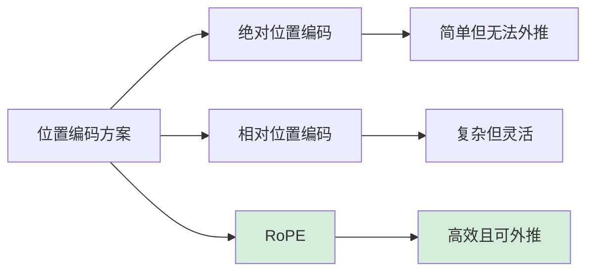

# LLM 位置编码详解

> **分类**: 大语言模型 | **编号**: LLM-002 | **更新时间**: 2026-03-31 | **难度**: ⭐⭐⭐⭐

`位置编码` `RoPE` `Transformer` `LLM`

**摘要**: 位置编码是 Transformer 架构中用于注入序列位置信息的关键技术。本文详细对比绝对位置编码、相对位置编码和 RoPE（旋转位置编码）的原理，并解释为什么现代 LLM（如 LLaMA）普遍采用 RoPE。

---

## 一、为什么需要位置编码

### 1.1 Transformer 的位置无关性

Transformer 的 Self-Attention 机制本质上是**位置无关**的：

$$Attention(Q, K, V) = softmax(\frac{QK^T}{\sqrt{d_k}})V$$

- Q、K、V 通过线性变换得到，不包含位置信息
- 交换输入序列中两个 token 的位置，输出也会相应交换
- 模型无法区分 "猫追老鼠" 和 "老鼠追猫"

### 1.2 解决方案

必须显式地将位置信息注入到模型中，主要有三种方案：

| 方案 | 代表模型 | 优点 | 缺点 |
|------|----------|------|------|
| 绝对位置编码 | Transformer、BERT | 简单直观 | 无法外推更长序列 |
| 相对位置编码 | T5、Shaw et al. | 支持长序列 | 实现复杂、计算开销大 |
| RoPE | LLaMA、PaLM | 高效、可外推 | 数学理解难度高 |

---

## 二、绝对位置编码

### 2.1 原理

为每个位置学习一个固定的向量，直接加到 token embedding 上：

$$h_i = token\_embedding_i + position\_encoding_i$$

### 2.2 Transformer 原始实现

```python
import numpy as np

def get_position_encoding(seq_len, d_model):
    """生成绝对位置编码"""
    position = np.arange(seq_len)[:, np.newaxis]
    div_term = np.exp(np.arange(0, d_model, 2) * -(np.log(10000.0) / d_model))
    
    pe = np.zeros((seq_len, d_model))
    pe[:, 0::2] = np.sin(position * div_term)
    pe[:, 1::2] = np.cos(position * div_term)
    
    return pe
```

### 2.3 局限性

- ❌ **无法外推**：训练时最大长度 512，推理时无法处理 1024 长度的序列
- ❌ **固定长度**：需要预先定义最大序列长度
- ❌ **泛化性差**：未见过的无法处理

---

## 三、RoPE 旋转位置编码

### 3.1 核心思想

RoPE（Rotary Position Embedding）通过**旋转矩阵**将位置信息编码到 Q、K 中，使得注意力分数只依赖于相对位置：

$$Q_m \cdot K_n = f(Q, K) \cdot g(m-n)$$

### 3.2 数学原理

对于位置 $m$ 的 token，RoPE 将其 Q、K 向量旋转角度 $m\theta$：

$$\tilde{Q}_m = R_{m\theta} Q_m$$

其中旋转矩阵：
$$R_{m\theta} = \begin{pmatrix} \cos m\theta & -\sin m\theta \\ \sin m\theta & \cos m\theta \end{pmatrix}$$

### 3.3 PyTorch 实现

```python
import torch

def apply_rope(q, k, freqs_cis):
    """
    应用 RoPE 位置编码
    q: (batch, seq_len, num_heads, head_dim)
    k: (batch, seq_len, num_heads, head_dim)
    freqs_cis: (seq_len, head_dim//2) 预计算的频率
    """
    # 分离实部虚部
    q_real, q_imag = q[..., ::2], q[..., 1::2]
    k_real, k_imag = k[..., ::2], k[..., 1::2]
    
    # 获取旋转角度
    cos = freqs_cis[..., 0::2]
    sin = freqs_cis[..., 1::2]
    
    # 应用旋转
    q_out = torch.stack([q_real * cos - q_imag * sin, 
                         q_real * sin + q_imag * cos], dim=-1).flatten(-2)
    k_out = torch.stack([k_real * cos - k_imag * sin, 
                         k_real * sin + k_imag * cos], dim=-1).flatten(-2)
    
    return q_out, k_out
```

### 3.4 RoPE 的优势

| 优势 | 说明 |
|------|------|
| ✅ **天然相对位置** | 注意力分数只依赖于 $m-n$ |
| ✅ **可外推性** | 训练 2048，推理可支持 4096+ |
| ✅ **计算高效** | 无需额外参数，只是旋转向量 |
| ✅ **无需学习** | 减少模型参数量 |

---

## 四、实际应用

### 4.1 LLaMA 的配置

```yaml
# LLaMA-7B 配置
hidden_size: 4096
num_attention_heads: 32
head_dim: 128
rope_theta: 10000  # 基频
max_position_embeddings: 2048
```

### 4.2 长文本外推技巧

当需要处理超过训练长度的文本时：

1. **线性插值**：缩放位置索引
2. **NTK-Aware**：动态调整 $\theta$ 基频
3. **YaRN**：结合插值和微调

---

## 五、总结对比



| 特性 | 绝对位置 | 相对位置 | RoPE |
|------|----------|----------|------|
| 实现难度 | ⭐ | ⭐⭐⭐ | ⭐⭐ |
| 计算开销 | ⭐ | ⭐⭐ | ⭐ |
| 外推能力 | ❌ | ✅ | ✅✅ |
| 现代 LLM 采用率 | 低 | 中 | 高 |

---

## 六、延伸思考

1. **为什么 RoPE 只应用于 Q、K 而不应用于 V？**
   - 因为注意力分数由 Q·K 计算，V 只是被加权求和

2. **RoPE 的 $\theta$ 基频如何选择？**
   - LLaMA 用 10000，LLaMA-2 用 1000000
   - 更大的 $\theta$ 有利于长文本但可能损害短文本质量

3. **未来方向？**
   - AliBi、NoPE 等无需位置编码的方案正在探索中

---

## 参考资料

- [RoPE 原论文](https://arxiv.org/abs/2104.09864)
- [LLaMA 技术报告](https://arxiv.org/abs/2302.13971)
- [图解 RoPE](https://blog.eleuther.ai/rotary-embeddings/)
