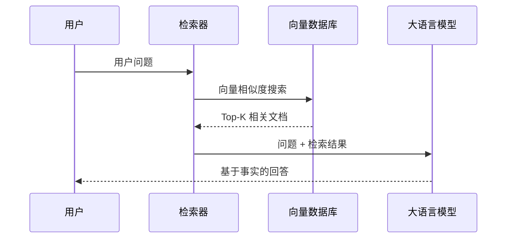
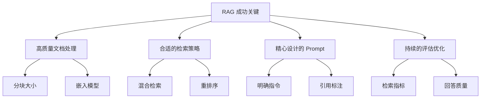

# RAG 检索增强生成

> **分类**: 大语言模型 | **编号**: LLM-003 | **更新时间**: 2026-03-31 | **难度**: ⭐⭐⭐

`RAG` `检索增强` `向量数据库` `LLM 应用`

**摘要**: RAG（Retrieval-Augmented Generation）是一种结合信息检索和文本生成的技术架构。通过从外部知识库检索相关文档，再让 LLM 基于检索结果生成回答，有效解决了 LLM 幻觉和知识过时问题。

---

## 一、RAG 的核心架构

### 1.1 整体流程



### 1.2 为什么需要 RAG？

| LLM 原生问题 | RAG 解决方案 |
|-------------|-------------|
| ❌ 幻觉（编造事实） | ✅ 基于检索的真实文档 |
| ❌ 知识截止训练日期 | ✅ 可连接最新知识库 |
| ❌ 无法访问私有数据 | ✅ 可检索企业内部文档 |
| ❌ 长上下文成本高 | ✅ 只检索相关内容 |

---

## 二、核心组件详解

### 2.1 文档处理 Pipeline

```python
from langchain.text_splitter import RecursiveCharacterTextSplitter
from langchain.embeddings import OpenAIEmbeddings
from langchain.vectorstores import Chroma

# 1. 文档分块
text_splitter = RecursiveCharacterTextSplitter(
    chunk_size=500,
    chunk_overlap=50,
    separators=["\n\n", "\n", "。", ""]
)
chunks = text_splitter.split_documents(documents)

# 2. 生成嵌入向量
embeddings = OpenAIEmbeddings(model="text-embedding-3-small")

# 3. 存储到向量数据库
vectorstore = Chroma.from_documents(
    documents=chunks,
    embedding=embeddings,
    persist_directory="./chroma_db"
)
```

### 2.2 检索策略

| 策略 | 说明 | 适用场景 |
|------|------|----------|
| **稠密检索** | 向量相似度搜索 | 语义匹配 |
| **稀疏检索** | BM25 关键词匹配 | 精确术语 |
| **混合检索** | 稠密 + 稀疏加权 | 综合场景 |
| **多跳检索** | 多次迭代检索 | 复杂推理 |

### 2.3 检索优化技巧

```python
# 混合检索示例
from langchain.retrievers import EnsembleRetriever
from langchain_community.retrievers import BM25Retriever
from langchain_community.vectorstores import FAISS

# BM25 检索器
bm25_retriever = BM25Retriever.from_documents(docs)
bm25_retriever.k = 5

# 向量检索器
faiss_retriever = FAISS.from_documents(docs, embeddings).as_retriever(
    search_kwargs={"k": 5}
)

# 混合检索
ensemble_retriever = EnsembleRetriever(
    retrievers=[bm25_retriever, faiss_retriever],
    weights=[0.3, 0.7]  # 向量检索权重更高
)
```

---

## 三、Prompt 设计

### 3.1 基础模板

```
你是一个专业的问答助手。请根据以下检索到的文档回答问题。

【检索结果】
{context}

【问题】
{question}

【要求】
1. 只基于检索结果回答，不要编造
2. 如果检索结果不包含答案，直接说"不知道"
3. 引用相关文档的编号
```

### 3.2 进阶模板（带引用）

```python
RAG_PROMPT = """
你是一个专业的研究助手。请基于提供的文档片段回答问题，并标注引用来源。

<documents>
{context}
</documents>

用户问题：{question}

请按照以下格式回答：
1. 先给出简洁的直接答案
2. 然后详细解释，每句话后标注引用 [文档 X]
3. 如果信息不足，明确说明

回答：
"""
```

---

## 四、完整实现示例

### 4.1 使用 LangChain

```python
from langchain.chains import RetrievalQA
from langchain.llms import OpenAI

# 创建检索 QA 链
qa_chain = RetrievalQA.from_chain_type(
    llm=OpenAI(model="gpt-4o-mini", temperature=0),
    chain_type="stuff",  # 或 "map_reduce", "refine"
    retriever=vectorstore.as_retriever(
        search_type="similarity_score_threshold",
        search_kwargs={"score_threshold": 0.7, "k": 5}
    ),
    return_source_documents=True
)

# 执行查询
result = qa_chain({"query": "什么是 RoPE 位置编码？"})

print(result["result"])
print("来源文档:", result["source_documents"])
```

### 4.2 评估指标

| 指标 | 说明 | 计算方法 |
|------|------|----------|
| **检索准确率** | 检索结果的相关性 | 人工标注 / NDCG |
| **回答忠实度** | 是否基于检索结果 | LLM 自评 / NLI 模型 |
| **回答相关性** | 是否回答问题 | 语义相似度 |
| **端到端准确率** | 最终答案正确性 | 人工评估 / 标准答案 |

---

## 五、常见问题与解决方案

### 5.1 检索不到相关内容

**原因：**
- 文档分块过大或过小
- 嵌入模型质量差
- 查询表述与文档差异大

**解决方案：**
- 调整 chunk_size（300-800 尝试）
- 使用更好的嵌入模型（text-embedding-3-large）
- 查询重写/扩展

### 5.2 LLM 忽略检索结果

**原因：**
- Prompt 指令不够明确
- 检索结果质量差
- LLM 过度依赖先验知识

**解决方案：**
```python
# 强化指令
prompt = """
 strictly answer ONLY based on the provided context.
 If the context doesn't contain the answer, say "根据提供的文档无法回答这个问题"。
 
 Context: {context}
 Question: {question}
"""
```

### 5.3 长文档处理

```python
# 分层检索策略
# 1. 先用小 chunk 检索定位相关段落
# 2. 再扩展上下文窗口
# 3. 最后用大窗口生成回答
```

---

## 六、总结



---

## 参考资料

- [RAG 原论文](https://arxiv.org/abs/2005.11401)
- [LangChain RAG 教程](https://python.langchain.com/docs/use_cases/question_answering/)
- [RAG 评估最佳实践](https://weaviate.io/blog/rag-evaluation)
