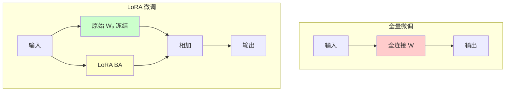
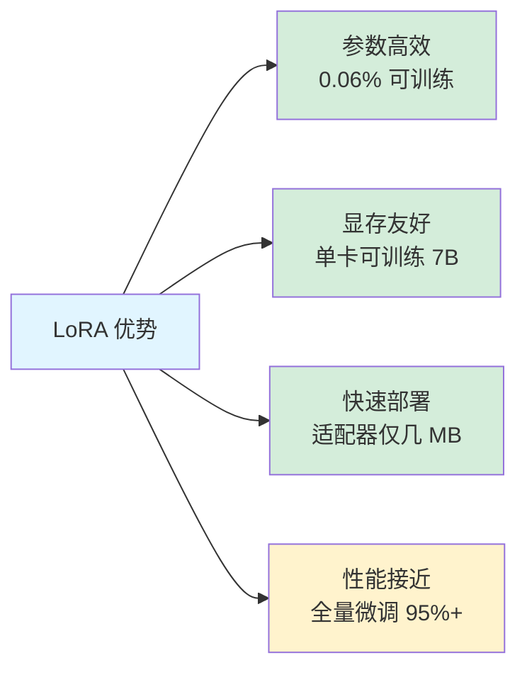

# LoRA 微调技术

> **分类**: 大语言模型 | **编号**: LLM-004 | **更新时间**: 2026-03-31 | **难度**: ⭐⭐⭐⭐

`LoRA` `参数高效微调` `PEFT` `模型适配`

**摘要**: LoRA（Low-Rank Adaptation）是一种参数高效的微调技术，通过在预训练模型旁添加低秩适配器来微调模型，只需训练极少量参数（通常<1%）即可达到与全量微调相当的效果。

---

## 一、LoRA 的核心思想

### 1.1 问题背景

全量微调大模型的问题：
- ❌ 需要存储每个任务的完整模型副本
- ❌ 显存占用巨大（7B 模型全量微调需要 80GB+）
- ❌ 训练时间长
- ❌ 灾难性遗忘风险

### 1.2 LoRA 解决方案

**核心洞察**：模型微调过程中的权重变化具有**低秩特性**

```
原始权重：W₀ ∈ ℝ^(d×k)

微调后：W = W₀ + ΔW

LoRA 假设：ΔW 可以用低秩矩阵表示
ΔW = BA  其中 B ∈ ℝ^(d×r), A ∈ ℝ^(r×k), r << min(d,k)
```

### 1.3 架构对比



---

## 二、LoRA 实现详解

### 2.1 核心代码

```python
import torch
import torch.nn as nn

class LoRALinear(nn.Module):
    """LoRA 包装的线性层"""
    
    def __init__(self, in_features, out_features, r=8, alpha=16):
        super().__init__()
        self.r = r
        self.alpha = alpha
        
        # 原始权重（冻结）
        self.weight = nn.Parameter(torch.randn(out_features, in_features), 
                                    requires_grad=False)
        
        # LoRA 适配器（可训练）
        self.lora_A = nn.Parameter(torch.randn(r, in_features))
        self.lora_B = nn.Parameter(torch.randn(out_features, r))
        
        # 缩放因子
        self.scaling = alpha / r
    
    def forward(self, x):
        # 原始前向传播
        original = torch.nn.functional.linear(x, self.weight)
        
        # LoRA 分支
        lora = torch.nn.functional.linear(x, self.lora_A)
        lora = torch.nn.functional.linear(lora, self.lora_B)
        lora = lora * self.scaling
        
        return original + lora
```

### 2.2 应用于 Transformer

```python
def apply_lora_to_model(model, r=8, alpha=16, target_modules=["q_proj", "v_proj"]):
    """
    对模型应用 LoRA
    
    Args:
        model: 预训练模型
        r: LoRA 秩
        alpha: 缩放系数
        target_modules: 要应用 LoRA 的模块
    """
    for name, module in model.named_modules():
        if any(target in name for target in target_modules):
            # 替换为 LoRALinear
            lora_module = LoRALinear(
                in_features=module.in_features,
                out_features=module.out_features,
                r=r,
                alpha=alpha
            )
            # 复制原始权重
            lora_module.weight.data = module.weight.data.clone()
            # 替换
            parent = get_parent_module(model, name)
            setattr(parent, name.split('.')[-1], lora_module)
    
    return model
```

### 2.3 参数量对比

| 模型 | 全量参数 | LoRA 参数 (r=8) | 比例 |
|------|----------|-----------------|------|
| LLaMA-7B | 7B | 4.2M | 0.06% |
| LLaMA-13B | 13B | 8.1M | 0.06% |
| LLaMA-70B | 70B | 41M | 0.06% |

---

## 三、使用 HuggingFace PEFT

### 3.1 快速开始

```python
from transformers import AutoModelForCausalLM, AutoTokenizer
from peft import LoraConfig, get_peft_model, TaskType

# 加载基础模型
model_name = "meta-llama/Llama-2-7b-hf"
model = AutoModelForCausalLM.from_pretrained(model_name)
tokenizer = AutoTokenizer.from_pretrained(model_name)

# 配置 LoRA
lora_config = LoraConfig(
    r=16,
    lora_alpha=32,
    target_modules=["q_proj", "k_proj", "v_proj", "o_proj"],
    lora_dropout=0.05,
    bias="none",
    task_type=TaskType.CAUSAL_LM
)

# 应用 LoRA
model = get_peft_model(model, lora_config)
model.print_trainable_parameters()
# 输出：trainable params: 4,194,304 || all params: 7,000,000,000 || trainable%: 0.06%
```

### 3.2 训练配置

```python
from transformers import TrainingArguments

training_args = TrainingArguments(
    output_dir="./lora-output",
    per_device_train_batch_size=4,
    gradient_accumulation_steps=4,
    learning_rate=2e-4,  # LoRA 可以用更大的学习率
    num_train_epochs=3,
    fp16=True,
    logging_steps=10,
    save_strategy="epoch",
    optim="adamw_torch"
)
```

### 3.3 保存和加载

```python
# 保存 LoRA 权重（只有几 MB）
model.save_pretrained("./lora-adapter")

# 加载 LoRA 权重
from peft import PeftModel

base_model = AutoModelForCausalLM.from_pretrained("meta-llama/Llama-2-7b-hf")
model = PeftModel.from_pretrained(base_model, "./lora-adapter")
```

---

## 四、LoRA 变体对比

| 变体 | 改进点 | 适用场景 |
|------|--------|----------|
| **LoRA** | 原始版本 | 通用微调 |
| **QLoRA** | 4bit 量化 + LoRA | 显存受限场景 |
| **AdaLoRA** | 自适应秩分配 | 多任务学习 |
| **LoRA+** | 分层学习率 | 需要更细粒度控制 |
| **DoRA** | 解耦权重和方向 | 需要更好性能 |

### 4.1 QLoRA 配置

```python
from transformers import BitsAndBytesConfig

# 4bit 量化配置
bnb_config = BitsAndBytesConfig(
    load_in_4bit=True,
    bnb_4bit_quant_type="nf4",
    bnb_4bit_compute_dtype=torch.float16,
    bnb_4bit_use_double_quant=True
)

# 加载量化模型
model = AutoModelForCausalLM.from_pretrained(
    "meta-llama/Llama-2-7b-hf",
    quantization_config=bnb_config,
    device_map="auto"
)

# 应用 LoRA（在量化基础上）
model = get_peft_model(model, lora_config)
```

---

## 五、最佳实践

### 5.1 超参数选择

| 参数 | 推荐值 | 说明 |
|------|--------|------|
| **r** | 8-64 | 秩越大，表达能力越强 |
| **alpha** | 16-32 | 通常是 r 的 2 倍 |
| **dropout** | 0.05-0.1 | 防止过拟合 |
| **learning_rate** | 1e-4 - 3e-4 | 比全量微调大 10 倍 |
| **target_modules** | q,v 或 q,k,v,o | 注意力层效果最好 |

### 5.2 何时选择 LoRA

✅ **适合 LoRA：**
- 资源有限（单卡训练）
- 需要快速迭代多个任务
- 基础模型已经很强，只需适配

❌ **不适合 LoRA：**
- 目标任务与预训练差异极大
- 需要学习全新知识领域
- 追求 SOTA 性能

---

## 六、总结



---

## 参考资料

- [LoRA 原论文](https://arxiv.org/abs/2106.09685)
- [QLoRA 论文](https://arxiv.org/abs/2305.14314)
- [PEFT 官方文档](https://huggingface.co/docs/peft)
- [LoRA 实战教程](https://github.com/cloneofsimo/lora)
