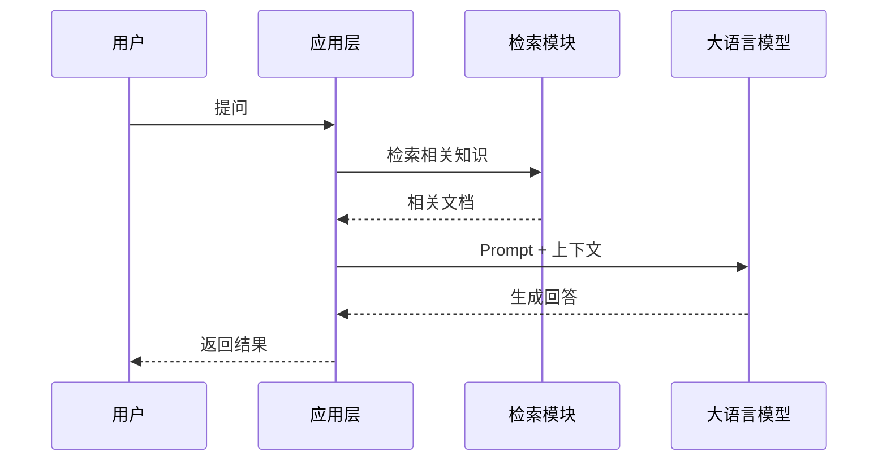

# LLM 应用开发实战

> **分类**: 大语言模型 | **编号**: LLM-005 | **更新时间**: 2026-03-31 | **难度**: ⭐⭐⭐

`LLM 应用` `Prompt Engineering` `RAG` `Agent`

**摘要**: 本文通过实际案例讲解如何开发一个基于 LLM 的应用，包括 Prompt 设计、RAG 架构、Agent 开发等核心技术。

---

## 一、核心架构

<Callout type="info" title="💡 关键概念">
LLM 应用开发的核心是**上下文管理**：如何把用户的请求、相关知识、历史对话等信息组织成有效的 Prompt，让 LLM 产生高质量的输出。
</Callout>

### 1.1 基本流程



---

## 二、Prompt 工程设计

<Callout type="tip" title="📝 最佳实践">
好的 Prompt 应该包含：**角色定义** + **任务描述** + **输出格式** + **示例**
</Callout>

```python
# 基础 Prompt 模板
PROMPT_TEMPLATE = """
你是一个专业的{role}助手。

## 任务
{task_description}

## 要求
1. {requirement_1}
2. {requirement_2}

## 用户问题
{question}
"""
```

<Collapsible title="📦 点击查看：Few-Shot Prompting 示例">

```python
few_shot_prompt = """
任务：将自然语言转换为 SQL 查询

示例 1:
输入：显示所有年龄大于 25 岁的用户
输出：SELECT * FROM users WHERE age > 25;

示例 2:
输入：统计每个部门的员工数量
输出：SELECT department, COUNT(*) FROM employees GROUP BY department;

现在请转换：
输入：找出订单金额最高的前 10 个客户
输出：
"""
```

</Collapsible>

---

## 三、RAG 实现

<Callout type="warning" title="⚠️ 注意事项">
生产环境需要注意：**向量数据库选择**、**分块策略**、**检索质量评估**
</Callout>

```python title="rag_app.py"
from langchain.document_loaders import DirectoryLoader
from langchain.text_splitter import RecursiveCharacterTextSplitter
from langchain.embeddings import OpenAIEmbeddings
from langchain.vectorstores import Chroma
from langchain.chains import RetrievalQA
from langchain.llms import OpenAI

# 1. 加载文档
loader = DirectoryLoader('./docs', glob='**/*.md')
documents = loader.load()

# 2. 分块
text_splitter = RecursiveCharacterTextSplitter(
    chunk_size=500,
    chunk_overlap=50
)
chunks = text_splitter.split_documents(documents)

# 3. 创建向量存储
embeddings = OpenAIEmbeddings(model="text-embedding-3-small")
vectorstore = Chroma.from_documents(
    documents=chunks,
    embedding=embeddings,
    persist_directory="./chroma_db"
)

# 4. 创建 QA 链
llm = OpenAI(model="gpt-4o-mini", temperature=0)
qa_chain = RetrievalQA.from_chain_type(
    llm=llm,
    retriever=vectorstore.as_retriever()
)

# 5. 执行查询
result = qa_chain({"query": "什么是 LoRA？"})
print(result["result"])
```

---

## 四、总结

<Callout type="success" title="✅ 恭喜你完成学习！">
现在你已经掌握了 LLM 应用开发的核心技术，可以开始构建自己的应用了！
</Callout>
