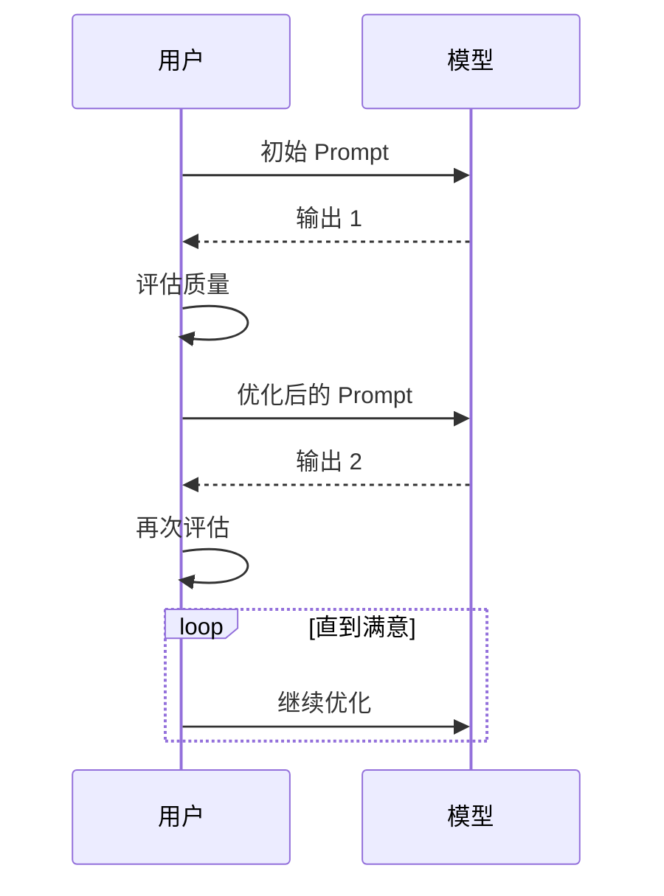

> **分类**: 大语言模型 | **编号**: LLM-006 | **难度**: ⭐⭐
>
> `Prompt` `LLM 应用` `最佳实践`
>
> **摘要**: Prompt Engineering 是与大语言模型交互的核心技能。本文系统讲解 Prompt 设计的原则、技巧和实战案例，助你写出高质量的 Prompt，获得更好的模型输出。

---

## 一、概述

Prompt Engineering（提示工程）是设计和优化输入给大语言模型的指令的艺术和科学。一个好的 Prompt 能让模型输出准确、有用、符合预期的回答。

<Callout type="info" title="💡 核心价值">
Prompt Engineering 不是"套路"模型，而是**清晰表达你的需求**，让模型更好地理解并帮助你。
</Callout>

### 为什么需要 Prompt Engineering？

- ✅ **提高输出质量** - 准确的需求 = 准确的回答
- ✅ **减少幻觉** - 明确的约束减少模型编造
- ✅ **节省成本** - 更少的试错 = 更少的 Token 消耗
- ✅ **可重复使用** - 好的 Prompt 可以标准化和复用

---

## 二、核心原则

### 2.1 CLEAR 原则

<Step number="1" title="Concise（简洁）">
用简洁清晰的语言，避免冗余和歧义
</Step>

<Step number="2" title="Logical（逻辑）">
按照逻辑顺序组织信息，先背景后任务
</Step>

<Step number="3" title="Explicit（明确）">
明确说明任务目标、输出格式、约束条件
</Step>

<Step number="4" title="Adaptive（适应）">
根据模型反馈调整和优化 Prompt
</Step>

<Step number="5" title="Reflective（反思）">
评估输出质量，持续改进 Prompt 设计
</Step>

---

## 三、Prompt 结构

### 3.1 标准结构

```
1. 角色定义（你是谁）
2. 任务描述（要做什么）
3. 背景信息（相关上下文）
4. 输出要求（格式、长度、风格）
5. 示例（可选，但强烈推荐）
6. 具体问题（实际输入）
```

### 3.2 示例对比

<Callout type="warning" title="❌ 糟糕的 Prompt">

```
帮我写个 Python 函数
```

**问题：**
- 没有说明函数功能
- 没有输入输出说明
- 没有约束条件

</Callout>

<Callout type="success" title="✅ 优秀的 Prompt">

```
你是一位资深 Python 工程师。

任务：编写一个函数，计算列表中所有数字的平均值。

要求：
1. 处理空列表情况，返回 0
2. 处理非数字元素，跳过并记录警告
3. 添加完整的 docstring 和类型注解
4. 包含 3 个测试用例

输出格式：Python 代码 + 简要说明
```

**优点：**
- 角色明确
- 任务清晰
- 约束具体
- 有输出要求

</Callout>

---

## 四、高级技巧

### 4.1 Few-Shot Prompting

提供示例让模型学习模式：

```
任务：将自然语言转换为 SQL 查询

示例 1:
输入：显示所有年龄大于 25 岁的用户
输出：SELECT * FROM users WHERE age > 25;

示例 2:
输入：统计每个部门的员工数量
输出：SELECT department, COUNT(*) FROM employees GROUP BY department;

现在请转换：
输入：找出订单金额最高的前 10 个客户
输出：
```

<Collapsible title="📦 点击查看：更多示例">

### 情感分析示例

```
任务：分析文本情感（正面/负面/中性）

示例：
文本：这个产品太好用了！
情感：正面

文本：完全不值这个价格。
情感：负面

文本：快递今天到了。
情感：中性

文本：[待分析文本]
情感：
```

### 代码审查示例

```
任务：审查代码并指出潜在问题

示例：
代码：for i in range(len(items)): print(items[i])
问题：使用了低效的索引遍历，建议改为直接迭代

代码：if x == True: return True
问题：冗余的布尔比较，建议改为 if x: return True

代码：[待审查代码]
问题：
```

</Collapsible>

### 4.2 Chain of Thought（思维链）

让模型展示推理过程：

```
问题：小明有 5 个苹果，他给了小红 2 个，又买了 3 个，现在有几个？

请逐步思考：
1. 初始数量：5 个
2. 给出 2 个：5 - 2 = 3 个
3. 又买 3 个：3 + 3 = 6 个
4. 最终答案：6 个

按照上面的步骤，解答：
问题：[新问题]
请逐步思考：
```

### 4.3 角色扮演

```
你是一位有 10 年经验的技术面试官，正在面试一位应聘后端开发岗位的候选人。

你的任务：
1. 评估候选人的技术能力
2. 提出有深度的追问
3. 给出建设性反馈

请用专业但友好的语气进行面试。

候选人简历：[简历内容]

第一个问题：
```

---

## 五、常见场景模板

### 5.1 代码生成

```mdx
你是一位资深 [语言] 工程师。

任务：[具体任务]

输入：[输入数据/需求]

要求：
1. [功能要求 1]
2. [功能要求 2]
3. [性能要求]
4. [代码规范]

输出格式：
- 完整代码
- 关键逻辑说明
- 使用示例
- 时间复杂度分析
```

### 5.2 文档写作

```mdx
你是一位技术文档工程师。

任务：为 [产品/功能] 编写用户文档

目标读者：[读者群体]

内容要求：
1. 功能概述（100 字）
2. 使用场景（3 个）
3. 快速开始（分步骤）
4. 常见问题（5 个）
5. 最佳实践

风格要求：
- 简洁清晰
- 避免术语堆砌
- 包含代码示例
```

### 5.3 数据分析

```mdx
你是一位数据分析师。

任务：分析以下数据并给出洞察

数据：[数据内容]

分析维度：
1. 趋势分析（同比/环比）
2. 异常检测
3. 相关性分析
4. 关键发现

输出格式：
- 执行摘要（3 个关键发现）
- 详细分析（每个维度）
- 可视化建议
- 行动建议
```

---

## 六、优化策略

### 6.1 迭代优化流程



### 6.2 常见问题与解决

<Comparison
  items={[
    { 
      title: "❌ 问题：输出太笼统", 
      items: ["模型回答泛泛而谈"], 
      pros: [], 
      cons: [] 
    },
    { 
      title: "✅ 解决：增加具体约束", 
      items: ["指定输出格式", "给出字数限制", "要求具体示例"], 
      pros: ["输出更精准"], 
      cons: [] 
    }
  ]}
/>

<Callout type="tip" title="📊 优化技巧">

**如果输出太长：**
- 添加"简洁回答，不超过 200 字"
- 使用"用 3 个要点总结"

**如果输出太短：**
- 添加"详细说明，包括..."
- 使用"请展开解释..."

**如果偏离主题：**
- 开头强调"请专注于..."
- 添加"不要涉及..."

</Callout>

---

## 七、实战案例

### 7.1 邮件写作

<Collapsible title="📧 查看完整 Prompt">

```
你是一位专业的商务沟通专家。

任务：帮我写一封跟进邮件

背景：
- 3 天前给客户发了产品方案
- 客户说"再考虑一下"
- 需要礼貌地跟进，但不显得急切

要求：
1. 语气：专业、友好、不卑不亢
2. 长度：150-200 字
3. 包含：问候、跟进目的、价值重申、下一步建议
4. 避免：催促、负面表达

输出：邮件正文（英文）
```

</Collapsible>

### 7.2 学习笔记整理

<Collapsible title="📝 查看完整 Prompt">

```
你是一位学习辅导专家。

任务：帮我整理这节课的学习笔记

原始内容：[粘贴课堂录音转文字]

要求：
1. 提取核心概念（5-8 个）
2. 整理知识框架（层级结构）
3. 标注重点和难点
4. 生成 5 道自测题
5. 推荐延伸阅读

输出格式：
- Markdown 格式
- 使用标题、列表、表格
- 关键术语加粗
```

</Collapsible>

---

## 八、工具与资源

### 8.1 Prompt 管理工具

| 工具 | 用途 | 链接 |
|------|------|------|
| PromptBase | Prompt 市场 | promptbase.com |
| FlowGPT | Prompt 分享 | flowgpt.com |
| ChatGPT Prompt Genius | Chrome 插件 | Chrome 商店 |

### 8.2 学习资源

- [OpenAI Prompt Engineering Guide](https://platform.openai.com/docs/guides/prompt-engineering)
- [Learn Prompting](https://learnprompting.org/)
- [Prompt Engineering Institute](https://www.promptengineering.org/)

---

## 九、常见问题

<Collapsible title="❓ FAQ">

**Q1: Prompt 越长越好吗？**

A: 不是。Prompt 应该**简洁但完整**。过长的 Prompt 可能：
- 增加 Token 成本
- 让模型困惑重点
- 包含冗余信息

**关键：** 用最少的字表达最清晰的意思。

---

**Q2: 为什么同样的 Prompt，输出不一样？**

A: 可能原因：
- 模型的随机性（temperature 设置）
- 上下文影响
- 模型版本更新

**解决：** 设置 `temperature=0` 获得确定性输出。

---

**Q3: 如何保存和管理 Prompt？**

A: 建议：
- 用版本控制（Git）管理 Prompt
- 建立分类目录
- 记录每个 Prompt 的效果
- 定期优化和更新

</Collapsible>

---

## 十、总结

<Callout type="success" title="✅ 核心要点">

**Prompt Engineering 的关键：**

1. **清晰表达** - 让模型理解你的真实意图
2. **提供上下文** - 给模型足够的背景信息
3. **明确约束** - 指定输出格式、长度、风格
4. **给出示例** - Few-shot 学习最有效
5. **持续优化** - 根据反馈迭代改进

**下一步：**
- 实践：用今天学的技巧重写你的常用 Prompt
- 积累：建立自己的 Prompt 库
- 分享：在社区交流最佳实践

</Callout>

---

## 十一、参考资源

### 11.1 原始论文
- Brown et al. (2020). "Language Models are Few-Shot Learners" [arXiv:2005.14165](https://arxiv.org/abs/2005.14165)

### 11.2 官方文档
- [OpenAI Prompt Engineering](https://platform.openai.com/docs/guides/prompt-engineering)
- [Anthropic Prompting Guide](https://docs.anthropic.com/claude/docs/introduction-to-prompt-engineering)

### 11.3 学习资源
- [Learn Prompting 课程](https://learnprompting.org/)
- [Prompt Engineering Institute](https://www.promptengineering.org/)

---

## 十二、更新历史

| 版本 | 日期 | 更新内容 | 作者 |
|------|------|---------|------|
| 1.0 | 2026-03-31 | 初始版本 | AI 学习与面试大全 |
