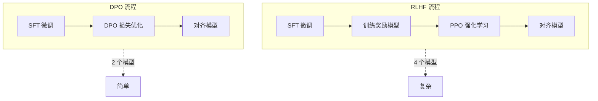

# DPO 直接偏好优化

> **分类**: LLM（大语言模型） | **编号**: LLM-035 | **更新时间**: 2026-04-01 | **难度**: ⭐⭐⭐⭐

`DPO` `直接偏好优化` `人类对齐` `RLHF 替代`

**摘要**: DPO（Direct Preference Optimization，直接偏好优化）是一种简化的人类对齐方法，通过直接优化偏好数据来替代复杂的 RLHF 流程，在保持效果的同时大幅降低了实现复杂度。

---

## 一、核心概念

### 1.1 什么是 DPO

**DPO（Direct Preference Optimization，直接偏好优化）** 是斯坦福大学在 2023 年提出的人类对齐方法。它将偏好学习重新表述为分类问题，直接优化策略模型，无需显式的奖励模型和强化学习。

> 💡 **核心思想**: 从人类偏好数据中直接学习最优策略，绕过奖励建模和 RL 优化的复杂流程。

### 1.2 为什么需要 DPO

| 问题 | RLHF | DPO |
|------|------|-----|
| 实现复杂度 | 高（需要训练奖励模型 + PPO） | 低（标准分类损失） |
| 训练稳定性 | 不稳定（RL 难以调参） | 稳定（监督学习） |
| 计算成本 | 高（需要多个模型） | 低（仅需策略模型） |
| 超参数 | 多 | 少 |
| 效果 | 好 | 相当或更好 |

### 1.3 RLHF vs DPO 流程对比



---

## 二、数学原理

### 2.1 偏好数据格式

DPO 使用三元组偏好数据：
$$
(x, y_w, y_l)
$$

其中：
- $x$: 输入提示（prompt）
- $y_w$: 人类偏好的回答（winner）
- $y_l$: 人类不偏好的回答（loser）

### 2.2 Bradley-Terry 模型

人类偏好可以用 Bradley-Terry 模型表示：
$$
P(y_w \succ y_l | x) = \frac{\exp(r(x, y_w))}{\exp(r(x, y_w)) + \exp(r(x, y_l))} = \sigma(r(x, y_w) - r(x, y_l))
$$

其中 $r(x, y)$ 是奖励函数。

### 2.3 从奖励到策略

关键洞察：最优策略 $\pi^*$ 与奖励函数 $r$ 有闭式关系：
$$
\pi^*(y|x) = \frac{1}{Z(x)} \pi_{ref}(y|x) \exp\left(\frac{1}{\beta} r(x, y)\right)
$$

反解奖励函数：
$$
r(x, y) = \beta \log \frac{\pi^*(y|x)}{\pi_{ref}(y|x)} + \beta \log Z(x)
$$

### 2.4 DPO 损失函数

将奖励函数代入 Bradley-Terry 模型，得到 DPO 损失：

$$
\mathcal{L}_{DPO}(\pi_\theta; \pi_{ref}) = -\mathbb{E}_{(x, y_w, y_l) \sim D} \left[ \log \sigma \left( \beta \log \frac{\pi_\theta(y_w|x)}{\pi_{ref}(y_w|x)} - \beta \log \frac{\pi_\theta(y_l|x)}{\pi_{ref}(y_l|x)} \right) \right]
$$

其中：
- $\pi_\theta$: 要优化的策略模型
- $\pi_{ref}$: 参考模型（通常是 SFT 后的模型，**冻结**）
- $\beta$: 温度参数（控制偏离参考模型的程度）
- $\sigma$: sigmoid 函数

### 2.5 直观理解

DPO 损失的目标：
- **增加** $y_w$ 的相对概率（相比 $\pi_{ref}$）
- **减少** $y_l$ 的相对概率（相比 $\pi_{ref}$）

```
logit(y_w) - logit(y_l) 越大越好
```

---

## 三、代码实现

### 3.1 基础实现

```python
import torch
import torch.nn as nn
import torch.nn.functional as F

def dpo_loss(policy_logps, reference_logps, beta=0.1):
    """
    计算 DPO 损失
    
    Args:
        policy_logps: 策略模型的对数概率 [batch_size,]
        reference_logps: 参考模型的对数概率 [batch_size,]
        beta: 温度参数
    
    Returns:
        loss: DPO 损失
        chosen_rewards: 选择回答的奖励
        rejected_rewards: 拒绝回答的奖励
    """
    # 计算策略与参考的差异
    policy_rewards = beta * (policy_logps[:, 0] - policy_logps[:, 1])
    reference_rewards = beta * (reference_logps[:, 0] - reference_logps[:, 1])
    
    # DPO 损失
    logits = policy_rewards - reference_rewards
    loss = -F.logsigmoid(logits).mean()
    
    # 计算奖励（用于监控）
    chosen_rewards = policy_rewards[:, 0].detach()
    rejected_rewards = policy_rewards[:, 1].detach()
    
    return loss, chosen_rewards, rejected_rewards
```

### 3.2 完整训练循环

```python
from transformers import AutoModelForCausalLM, AutoTokenizer
import torch.nn.functional as F

class DPOTrainer:
    def __init__(self, model, ref_model, tokenizer, beta=0.1, lr=5e-7):
        self.model = model
        self.ref_model = ref_model  # 冻结的参考模型
        self.tokenizer = tokenizer
        self.beta = beta
        self.optimizer = torch.optim.AdamW(model.parameters(), lr=lr)
    
    def get_batch_logps(self, logits, labels, average_log_prob=False):
        """计算序列的对数概率"""
        # 移动 labels 以计算下一个 token 的概率
        shift_logits = logits[:, :-1, :]
        shift_labels = labels[:, 1:]
        
        # 计算每个 token 的对数概率
        per_token_logps = torch.gather(
            shift_logits.log_softmax(-1), 
            dim=-1, 
            index=shift_labels.unsqueeze(-1)
        ).squeeze(-1)
        
        # 平均或求和
        if average_log_prob:
            return (per_token_logps * (shift_labels != -100)).sum(-1) / (shift_labels != -100).sum(-1)
        else:
            return (per_token_logps * (shift_labels != -100)).sum(-1)
    
    def train_step(self, batch):
        """
        单步训练
        
        Args:
            batch: 包含以下键的字典
                - prompt_input_ids: prompt 的 input_ids
                - chosen_input_ids: 偏好回答的 input_ids
                - rejected_input_ids: 非偏好回答的 input_ids
        """
        self.model.train()
        self.ref_model.eval()
        
        with torch.no_grad():
            # 参考模型的前向传播
            ref_chosen_logits = self.ref_model(batch['chosen_input_ids']).logits
            ref_rejected_logits = self.ref_model(batch['rejected_input_ids']).logits
            
            ref_chosen_logps = self.get_batch_logps(ref_chosen_logits, batch['chosen_input_ids'])
            ref_rejected_logps = self.get_batch_logps(ref_rejected_logits, batch['rejected_input_ids'])
        
        # 策略模型的前向传播
        policy_chosen_logits = self.model(batch['chosen_input_ids']).logits
        policy_rejected_logits = self.model(batch['rejected_input_ids']).logits
        
        policy_chosen_logps = self.get_batch_logps(policy_chosen_logits, batch['chosen_input_ids'])
        policy_rejected_logps = self.get_batch_logps(policy_rejected_logits, batch['rejected_input_ids'])
        
        # 计算 DPO 损失
        loss, chosen_rewards, rejected_rewards = dpo_loss(
            torch.stack([policy_chosen_logps, policy_rejected_logps], dim=1),
            torch.stack([ref_chosen_logps, ref_rejected_logps], dim=1),
            self.beta
        )
        
        # 反向传播
        self.optimizer.zero_grad()
        loss.backward()
        self.optimizer.step()
        
        return {
            'loss': loss.item(),
            'rewards/chosen': chosen_rewards.mean().item(),
            'rewards/rejected': rejected_rewards.mean().item(),
            'rewards/accuracies': (chosen_rewards > rejected_rewards).float().mean().item()
        }
```

### 3.3 使用 HuggingFace TRL

```python
from trl import DPOTrainer
from transformers import AutoModelForCausalLM, AutoTokenizer

# 加载模型
model = AutoModelForCausalLM.from_pretrained("mistral-7b")
ref_model = AutoModelForCausalLM.from_pretrained("mistral-7b")
tokenizer = AutoTokenizer.from_pretrained("mistral-7b")

# 创建 DPO Trainer
dpo_trainer = DPOTrainer(
    model=model,
    ref_model=ref_model,
    beta=0.1,
    train_dataset=preference_dataset,
    max_length=512,
    max_prompt_length=256,
    learning_rate=5e-7,
    per_device_train_batch_size=4,
    gradient_accumulation_steps=4,
)

# 训练
dpo_trainer.train()
```

---

## 四、数据准备

### 4.1 偏好数据格式

```python
dataset = [
    {
        "prompt": "如何学习编程？",
        "chosen": "学习编程需要循序渐进。首先选择一门语言...",
        "rejected": "编程很难，你不应该学习。"
    },
    # ...
]
```

### 4.2 数据来源

| 来源 | 描述 | 规模 |
|------|------|------|
| **Anthropic HH** | Helpful & Harmless | 170K |
| **UltraFeedback** | 多模型生成的偏好 | 64K |
| **Orca DPO** | GPT-4 生成的偏好 | 数十万 |
| **自定义** | 人工标注 | 灵活 |

### 4.3 数据质量要求

1. **明确偏好**: $y_w$ 应该明显优于 $y_l$
2. **多样性**: 覆盖多种场景和错误类型
3. **平衡性**: 不同类别的偏好应平衡
4. **长度控制**: 避免 $y_w$ 仅因更长而被偏好

---

## 五、最佳实践

### 5.1 超参数选择

| 参数 | 推荐值 | 说明 |
|------|--------|------|
| $\beta$ | 0.1-0.5 | 控制偏离参考模型的程度 |
| 学习率 | 5e-7 - 1e-6 | 比 SFT 小 |
| batch size | 4-16 | 受显存限制 |
| epochs | 1-3 | DPO 容易过拟合 |

### 5.2 参考模型选择

- **最佳**: SFT 后的同一模型
- **替代**: 原始预训练模型（效果稍差）
- **关键**: 参考模型应该与策略模型初始状态相同

### 5.3 训练技巧

```python
# 1. 梯度裁剪
torch.nn.utils.clip_grad_norm_(model.parameters(), max_norm=1.0)

# 2. 学习率调度
scheduler = get_cosine_schedule_with_warmup(
    optimizer, 
    num_warmup_steps=100, 
    num_training_steps=total_steps
)

# 3. 早停
# 监控 validation 上的偏好准确率
```

---

## 六、与 RLHF 对比

### 6.1 详细对比

| 方面 | RLHF | DPO |
|------|------|-----|
| **需要训练的模型** | 策略 + 奖励 + 价值 | 策略（参考模型冻结） |
| **优化算法** | PPO（强化学习） | 梯度下降（监督学习） |
| **稳定性** | 不稳定，需要仔细调参 | 稳定，类似 SFT |
| **计算成本** | 高（4 模型同时加载） | 低（2 模型） |
| **实现难度** | 高 | 低 |
| **效果** | 好 | 相当或更好 |
| **超参数敏感度** | 高 | 低 |

### 6.2 何时选择 DPO

✅ **适合 DPO**:
- 资源有限
- 需要快速迭代
- 偏好数据质量高
- 团队无 RL 经验

❌ **可能需要 RLHF**:
- 需要在线学习
- 偏好数据稀疏
- 需要复杂的奖励塑造

---

## 七、变体与改进

### 7.1 IPO（Identity Preference Optimization）

- 添加正则化项防止过拟合
- 更稳定的训练

### 7.2 KTO（Kahneman-Tversky Optimization）

- 不需要成对偏好数据
- 只需知道回答是好是坏

### 7.3 SimPO（Simple Preference Optimization）

- 简化 DPO，移除参考模型
- 直接用长度归一化的对数概率

---

## 八、面试高频问题

### Q1: DPO 相比 RLHF 的主要优势？

**答**: 
1. **简单**: 无需训练奖励模型和 PPO
2. **稳定**: 监督学习比 RL 稳定得多
3. **高效**: 计算成本降低 50% 以上
4. **效果**: 在多个基准上达到或超过 RLHF

### Q2: DPO 的$\beta$参数有什么作用？

**答**: $\beta$ 控制策略模型偏离参考模型的程度：
- $\beta$ 小：策略接近参考模型，更新保守
- $\beta$ 大：策略可以大幅偏离，可能过拟合

通常设为 0.1-0.5。

### Q3: 为什么 DPO 需要参考模型？

**答**: 参考模型提供基线，DPO 优化的是**相对概率**而非绝对概率。这样可以：
1. 保持模型的语言能力
2. 防止模式崩溃
3. 控制更新幅度

### Q4: DPO 数据如何收集？

**答**: 
1. **人工标注**: 标注员比较两个回答
2. **模型生成**: 用强模型（GPT-4）判断偏好
3. **用户反馈**: 收集真实用户的点赞/点踩

### Q5: DPO 的局限性？

**答**: 
1. **需要成对数据**: 比仅需要好坏标签的数据更昂贵
2. **静态优化**: 无法在线学习新偏好
3. **参考模型依赖**: 参考模型质量影响最终效果

---

## 九、总结

| 特性 | DPO |
|------|-----|
| **核心思想** | 直接优化偏好，绕过奖励建模 |
| **损失函数** | $\mathcal{L}_{DPO} = -\mathbb{E}[\log \sigma(\beta \log \frac{\pi_\theta(y_w)}{\pi_{ref}(y_w)} - \beta \log \frac{\pi_\theta(y_l)}{\pi_{ref}(y_l)})]$ |
| **需要模型** | 策略模型 + 参考模型（冻结） |
| **优化方式** | 标准梯度下降 |
| **效果** | 与 RLHF 相当 |
| **推荐场景** | 大多数人类对齐任务 |

> 💡 **关键要点**: DPO 通过将偏好学习重新表述为分类问题，大幅简化了人类对齐流程，是当前最实用的对齐方法。

---

*本文档为 LLM 知识库系列文章之一，共 70 篇。*
