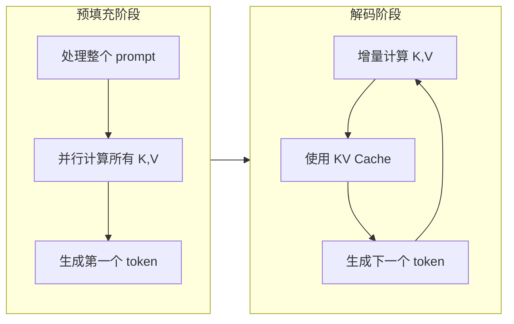

# KV Cache 键值缓存优化

> **分类**: LLM（大语言模型） | **编号**: LLM-041 | **更新时间**: 2026-04-01 | **难度**: ⭐⭐⭐⭐

`KV Cache` `推理优化` `显存管理` `自回归生成`

**摘要**: KV Cache 是自回归语言模型推理优化的核心技术，通过缓存历史 token 的 Key 和 Value 状态，避免重复计算，将推理复杂度从 $O(n^2)$ 降低到 $O(n)$。

---

## 一、核心概念

### 1.1 什么是 KV Cache

**KV Cache（键值缓存）** 是在自回归语言模型推理过程中，缓存历史 token 的 Key 和 Value 向量的技术。

> 💡 **核心思想**: 在生成第 $n$ 个 token 时，前 $n-1$ 个 token 的 K、V 向量不会改变，可以缓存起来重复使用，避免重复计算。

### 1.2 为什么需要 KV Cache

自回归生成的特点：
- 每次生成一个 token
- 新 token 依赖于所有历史 token
-  naive 实现：每次重新计算所有历史

| 方案 | 生成 100 tokens | 显存 | 速度 |
|------|---------------|------|------|
| 无缓存 | $100^2$ 次计算 | 低 | 极慢 |
| KV Cache | $100$ 次计算 | 高 | 快 100 倍 |

### 1.3 直观理解

```
生成过程：
Step 1: 输入 "The" → 输出 "cat"
Step 2: 输入 "The cat" → 输出 "sat"
Step 3: 输入 "The cat sat" → 输出 "on"

无缓存:
  Step 2 重新计算 "The" 的 K、V ❌
  Step 3 重新计算 "The cat" 的 K、V ❌

KV Cache:
  Step 2 复用 "The" 的 K、V ✅
  Step 3 复用 "The cat" 的 K、V ✅
```

---

## 二、数学原理

### 2.1 自回归注意力

标准注意力：
$$
\text{Attention}(Q, K, V) = \text{softmax}\left(\frac{QK^T}{\sqrt{d_k}}\right)V
$$

生成第 $t$ 个 token 时：
- $Q_t$: 当前 token 的 Query
- $K_{1:t}$: 所有历史 token 的 Key（包括当前）
- $V_{1:t}$: 所有历史 token 的 Value（包括当前）

### 2.2 缓存更新

```python
# 初始化
kv_cache = {
    'K': [],  # 空的 K 缓存
    'V': []   # 空的 V 缓存
}

# 生成第 t 个 token
def generate_step(x_t, kv_cache):
    # 计算当前 token 的 Q, K, V
    Q_t = W_q(x_t)
    K_t = W_k(x_t)
    V_t = W_v(x_t)
    
    # 追加到缓存
    kv_cache['K'].append(K_t)
    kv_cache['V'].append(V_t)
    
    # 拼接所有历史的 K, V
    K_all = concat(kv_cache['K'])  # K_{1:t}
    V_all = concat(kv_cache['V'])  # V_{1:t}
    
    # 计算注意力（只计算当前 Q）
    attn = softmax(Q_t @ K_all.T / sqrt(d_k)) @ V_all
    
    return attn, kv_cache
```

### 2.3 复杂度分析

| 指标 | 无缓存 | KV Cache |
|------|--------|----------|
| **计算复杂度** | $O(n^2 \cdot d)$ | $O(n \cdot d)$ |
| **显存占用** | $O(d)$ | $O(n \cdot d)$ |
| **延迟** | $O(n)$ 每 token | $O(1)$ 每 token |

> 💡 **权衡**: KV Cache 用显存换计算，对于长序列非常划算。

---

## 三、显存计算

### 3.1 KV Cache 大小

对于单个 layer：
$$
\text{KV Cache Size} = 2 \times \text{seq\_len} \times \text{num\_heads} \times \text{head\_dim} \times \text{bytes\_per\_param}
$$

### 3.2 实际计算示例

LLaMA-7B 配置：
- num_heads = 32
- head_dim = 128
- num_layers = 32
- FP16 = 2 bytes

```python
# 单 layer 的 KV Cache
seq_len = 4096
num_heads = 32
head_dim = 128
bytes_per_param = 2  # FP16

kv_per_layer = 2 * seq_len * num_heads * head_dim * bytes_per_param
# = 2 * 4096 * 32 * 128 * 2 = 64 MB

# 总 KV Cache (32 layers)
total_kv = kv_per_layer * 32  # = 2 GB
```

### 3.3 不同序列长度的显存占用

| 序列长度 | LLaMA-7B | LLaMA-13B | LLaMA-70B |
|---------|---------|-----------|-----------|
| 1K | 0.5 GB | 1 GB | 4 GB |
| 4K | 2 GB | 4 GB | 16 GB |
| 16K | 8 GB | 16 GB | 64 GB |
| 32K | 16 GB | 32 GB | 128 GB |

> 💡 **关键**: 长序列推理的显存瓶颈往往是 KV Cache，而非模型权重！

---

## 四、代码实现

### 4.1 基础实现

```python
import torch
import torch.nn as nn

class KVCache:
    """KV Cache 管理"""
    def __init__(self, batch_size, max_seq_len, num_heads, head_dim, device):
        self.batch_size = batch_size
        self.max_seq_len = max_seq_len
        self.num_heads = num_heads
        self.head_dim = head_dim
        self.device = device
        
        # 预分配缓存 [batch, seq, heads, dim]
        self.k_cache = torch.zeros(
            batch_size, max_seq_len, num_heads, head_dim, 
            device=device, dtype=torch.float16
        )
        self.v_cache = torch.zeros(
            batch_size, max_seq_len, num_heads, head_dim, 
            device=device, dtype=torch.float16
        )
        self.seq_len = 0  # 当前序列长度
    
    def update(self, k, v):
        """
        更新缓存
        
        Args:
            k: 当前 K [batch, 1, heads, dim]
            v: 当前 V [batch, 1, heads, dim]
        
        Returns:
            k_all: 所有 K [batch, seq+1, heads, dim]
            v_all: 所有 V [batch, seq+1, heads, dim]
        """
        # 写入缓存
        self.k_cache[:, self.seq_len:self.seq_len+1] = k
        self.v_cache[:, self.seq_len:self.seq_len+1] = v
        
        # 返回所有历史
        k_all = self.k_cache[:, :self.seq_len+1]
        v_all = self.v_cache[:, :self.seq_len+1]
        
        self.seq_len += 1
        return k_all, v_all
    
    def reset(self):
        """重置缓存"""
        self.seq_len = 0
        self.k_cache.zero_()
        self.v_cache.zero_()
```

### 4.2 集成到注意力层

```python
class CachedAttention(nn.Module):
    def __init__(self, d_model, num_heads):
        super().__init__()
        self.num_heads = num_heads
        self.d_k = d_model // num_heads
        
        self.W_q = nn.Linear(d_model, d_model)
        self.W_k = nn.Linear(d_model, d_model)
        self.W_v = nn.Linear(d_model, d_model)
        self.W_o = nn.Linear(d_model, d_model)
    
    def forward(self, x, kv_cache=None):
        """
        Args:
            x: 输入 [batch, seq_len, d_model]
            kv_cache: KVCache 对象或 None
        
        Returns:
            output: 输出 [batch, seq_len, d_model]
        """
        batch_size, seq_len, _ = x.shape
        
        # 计算 Q, K, V
        Q = self.W_q(x).view(batch_size, seq_len, self.num_heads, self.d_k)
        K = self.W_k(x).view(batch_size, seq_len, self.num_heads, self.d_k)
        V = self.W_v(x).view(batch_size, seq_len, self.num_heads, self.d_k)
        
        if kv_cache is not None:
            # 增量推理：只处理最后一个 token
            Q = Q[:, -1:]  # 只取最后一个 Q
            K = K[:, -1:]
            V = V[:, -1:]
            
            # 更新缓存
            K, V = kv_cache.update(K, V)
        
        # 计算注意力
        scores = torch.matmul(Q, K.transpose(-2, -1)) / (self.d_k ** 0.5)
        attn = torch.softmax(scores, dim=-1)
        out = torch.matmul(attn, V)
        
        # 合并头
        out = out.reshape(batch_size, -1, self.num_heads * self.d_k)
        return self.W_o(out)
```

### 4.3 生成循环

```python
def generate(model, input_ids, max_new_tokens, kv_cache):
    """自回归生成"""
    model.eval()
    
    # 预填充（prefill）
    with torch.no_grad():
        # 处理整个 prompt
        outputs = model(input_ids, use_cache=True)
        next_token = outputs.logits[:, -1].argmax(dim=-1, keepdim=True)
    
    generated = [next_token]
    
    # 解码（decode）
    for _ in range(max_new_tokens - 1):
        with torch.no_grad():
            # 只处理最后一个 token
            outputs = model(next_token, past_key_values=kv_cache, use_cache=True)
            next_token = outputs.logits[:, -1].argmax(dim=-1, keepdim=True)
            kv_cache = outputs.past_key_values  # 更新缓存
        
        generated.append(next_token)
        
        if next_token.item() == model.config.eos_token_id:
            break
    
    return torch.cat(generated, dim=1)
```

---

## 五、优化技术

### 5.1 Paged Attention（vLLM）

**问题**: KV Cache 显存碎片化

**解决**: 使用分页内存管理
- 将 KV Cache 分成固定大小的块（block）
- 动态分配和释放块
- 类似操作系统的虚拟内存

```python
# vLLM 的 Paged Attention
# 每个 block 存储固定数量的 token（如 16 个）
block_size = 16
num_blocks = total_memory // (block_size * kv_cache_per_token)

# 块表：逻辑块号 → 物理块号
block_table = {
    seq_id: [physical_block_0, physical_block_1, ...]
}
```

### 5.2 Multi-Query Attention (MQA)

**思想**: 所有 head 共享 K、V

| 方案 | K 头数 | V 头数 | 显存 | 效果 |
|------|--------|--------|------|------|
| MHA | 32 | 32 | 100% | 基准 |
| MQA | 1 | 1 | 6% | 略降 |
| GQA | 4 | 4 | 25% | 接近 MHA |

### 5.3 Grouped-Query Attention (GQA)

LLaMA-2/3 使用：
- Query: 32 heads
- Key/Value: 8 groups
- 折中方案和性能

### 5.4 KV Cache 量化

```python
# 8bit KV Cache
kv_cache_int8 = (kv_cache_fp16 / scale).to(torch.int8)

# 解码时反量化
kv_cache_fp16 = kv_cache_int8 * scale

# 节省 50% 显存，精度损失极小
```

---

## 六、Prefill vs Decode

### 6.1 两个阶段



### 6.2 性能特征

| 指标 | Prefill | Decode |
|------|---------|--------|
| **计算** | $O(n^2)$ | $O(1)$ 每 token |
| **显存** | 低 | 高（KV Cache 增长） |
| **延迟** | 高（一次性） | 低（每 token） |
| **吞吐** | 高 | 低 |

### 6.3 优化策略

```python
# Prefill 阶段：使用大 batch，最大化并行
prefill_batch_size = 32

# Decode 阶段：使用 Continuous Batching
# 不同请求在不同时间完成，动态插入新请求
```

---

## 七、面试高频问题

### Q1: KV Cache 为什么能加速推理？

**答**: 
1. **避免重复计算**: 历史 token 的 K、V 不变，无需重新计算
2. **复杂度降低**: 从 $O(n^2)$ 降到 $O(n)$
3. **增量计算**: 每步只计算当前 token 的 Q、K、V

### Q2: KV Cache 的显存占用如何计算？

**答**: 
$$
\text{显存} = 2 \times \text{layers} \times \text{seq\_len} \times \text{heads} \times \text{head\_dim} \times \text{bytes}
$$

对于 LLaMA-7B，4K 序列，FP16：
$$
2 \times 32 \times 4096 \times 32 \times 128 \times 2 \approx 2 \text{ GB}
$$

### Q3: Prefill 和 Decode 阶段有什么区别？

**答**: 
- **Prefill**: 处理整个 prompt，并行计算所有 K、V，计算密集
- **Decode**: 增量生成，每次只计算一个 token，显存密集（KV Cache 增长）

### Q4: 如何优化 KV Cache 的显存占用？

**答**: 
1. **量化**: 8bit/4bit KV Cache
2. **MQA/GQA**: 减少 K、V 的头数
3. **Paged Attention**: 减少碎片
4. **Offload**: 将部分缓存移到 CPU

### Q5: KV Cache 在哪些场景下不适用？

**答**: 
1. **训练**: 需要梯度，不能缓存
2. **双向注意力**: 如 BERT，所有 token 同时处理
3. **动态序列**: 频繁修改历史内容

---

## 八、总结

| 特性 | 无缓存 | KV Cache |
|------|--------|---------|
| **计算复杂度** | $O(n^2)$ | $O(n)$ |
| **显存复杂度** | $O(1)$ | $O(n)$ |
| **每 token 延迟** | $O(n)$ | $O(1)$ |
| **适用场景** | 训练 | 推理 |

> 💡 **关键要点**: KV Cache 是自回归推理的核心优化，通过空间换时间，将推理延迟从 $O(n)$ 降到 $O(1)$，是长序列生成的必备技术。

---

*本文档为 LLM 知识库系列文章之一，共 70 篇。*
