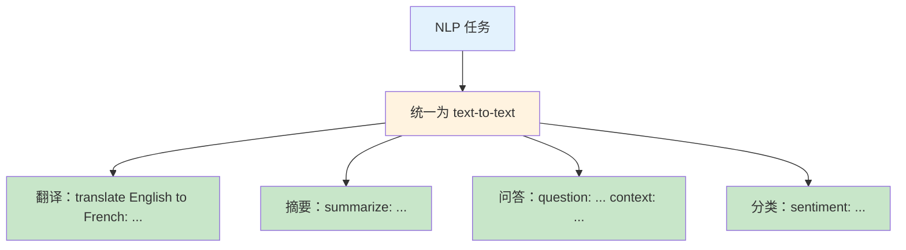
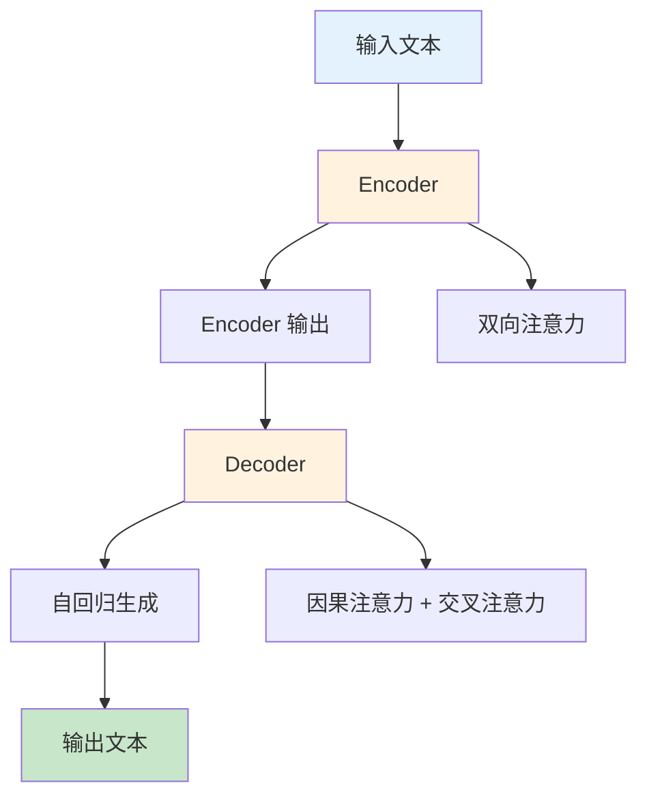
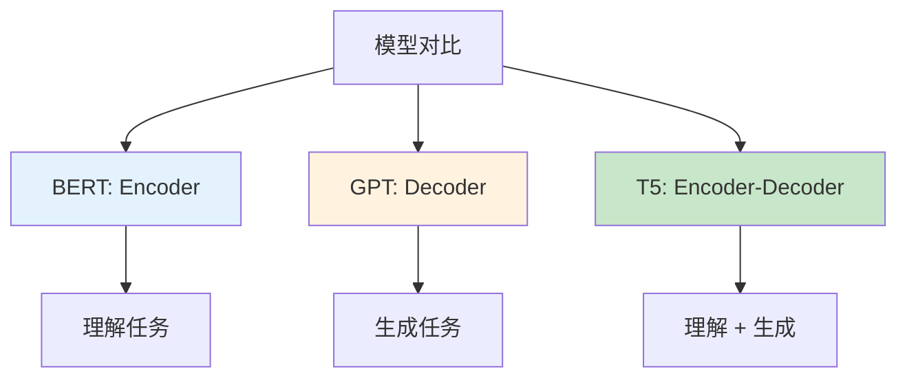

# T5（Text-to-Text Transfer Transformer）

> **分类**: 自然语言处理 | **编号**: 009 | **更新时间**: 2026-03-30 | **难度**: ⭐

`NLP` `Transformer` `Attention` `CNN` `BERT`

**摘要**: T5（Text-to-Text Transfer Transformer）是由 Google 的 Colin Raffel 等人于 2019 年提出的预训练模型。

---
## 1. 概述

T5（Text-to-Text Transfer Transformer）是由 Google 的 Colin Raffel 等人于 2019 年提出的预训练模型。T5 的核心理念是将所有 NLP 任务统一为"text-to-text"格式，即输入是文本，输出也是文本。这种统一框架使得单一模型可以处理多种 NLP 任务。

T5 的关键贡献：
1. **统一任务格式**：所有任务都转化为文本生成
2. **大规模对比研究**：系统比较了预训练目标、架构等设计选择
3. **开源生态**：发布了从 60M 到 11B 参数的多个模型

## 2. Text-to-Text 范式

### 2.1 统一的任务表示



```python
# T5 将所有任务统一为文本生成格式

# 翻译
translation_input = "translate English to German: That is good."
translation_output = "Das ist gut."

# 摘要
summarization_input = "summarize: The tower is 324 metres tall. It was built in 1889."
summarization_output = "The 324-metre tower was built in 1889."

# 问答
qa_input = "question: Who wrote Romeo and Juliet? context: Shakespeare wrote Romeo and Juliet."
qa_output = "Shakespeare"

# 情感分类
classification_input = "sentiment: I love this movie!"
classification_output = "positive"

# 语法纠错
grammar_input = "grammar: She go to school yesterday."
grammar_output = "She went to school yesterday."

# 所有任务使用相同的模型、相同的训练目标！
```

### 2.2 任务前缀设计

```python
# T5 使用前缀来区分不同任务
TASK_PREFIXES = {
    'translation_en_to_de': 'translate English to German: ',
    'translation_en_to_fr': 'translate English to French: ',
    'summarization': 'summarize: ',
    'question_answering': 'question: ',
    'sentiment': 'sentiment: ',
    'grammar_correction': 'grammar: ',
    'paraphrase': 'paraphrase: ',
    'fill_in_the_blank': 'fill in the blank: ',
}

def format_t5_input(text, task):
    """将输入格式化为 T5 格式"""
    prefix = TASK_PREFIXES.get(task, '')
    return prefix + text

# 示例
input_text = "I love this product!"
formatted = format_t5_input(input_text, 'sentiment')
print(formatted)  # "sentiment: I love this product!"
```

## 3. T5 架构

### 3.1 Encoder-Decoder 结构



```python
import torch
import torch.nn as nn
from transformers import T5Config, T5Model

# T5 配置
config = T5Config(
    vocab_size=32128,        # SentencePiece 词汇表
    d_model=512,             # 隐藏层维度（T5-small）
    d_kv=64,                 # 注意力头维度
    d_ff=2048,               # FFN 中间层
    num_layers=6,            # Encoder/Decoder 层数
    num_decoder_layers=6,
    num_heads=8,
    max_position_embeddings=512,
)

# T5 使用相对位置编码
# 而不是绝对位置编码

model = T5Model(config)
print(f"T5-small 参数量：{sum(p.numel() for p in model.parameters()) / 1e6:.1f}M")

# T5 变体
# T5-small: 60M
# T5-base: 220M
# T5-large: 770M
# T5-3B: 3B
# T5-11B: 11B
```

### 3.2 相对位置编码

```python
class T5RelativeAttention(nn.Module):
    """T5 的相对位置注意力"""
    
    def __init__(self, num_buckets=32, max_distance=128):
        super().__init__()
        self.num_buckets = num_buckets
        self.max_distance = max_distance
        self.relative_attention_bias = nn.Embedding(num_buckets, num_heads)
    
    def _relative_position_bucket(self, relative_position):
        """将相对位置映射到 bucket"""
        # 负距离和正距离分别处理
        # 使用对数间隔的 buckets
        pass
    
    def compute_bias(self, query_length, key_length):
        """计算相对位置偏置"""
        context_position = torch.arange(query_length)[:, None]
        memory_position = torch.arange(key_length)[None, :]
        relative_position = memory_position - context_position
        
        rp_bucket = self._relative_position_bucket(relative_position)
        values = self.relative_attention_bias(rp_bucket)
        
        # [query_length, key_length, num_heads]
        return values.permute(2, 0, 1).unsqueeze(0)

# T5 的相对位置编码优势：
# 1. 可以处理比训练时更长的序列
# 2. 更好地捕捉相对位置信息
# 3. 参数效率高
```

## 4. T5 预训练

### 4.1 去噪自编码器目标

```python
# T5 使用去噪自编码器作为预训练目标
# 输入：被噪声破坏的文本
# 输出：原始文本

def add_noise(text, tokenizer, noise_density=0.15, mean_span_length=3):
    """
    给文本添加噪声（用于 T5 预训练）
    
    噪声类型：
    1. Token 掩码（类似 BERT 的 MLM）
    2. Token 删除
    3. Token 替换
    4. 句子打乱
    """
    tokens = tokenizer.encode(text, add_special_tokens=False)
    
    # 随机选择一些 span 进行掩码
    noisy_tokens = tokens.copy()
    masked_tokens = tokens.copy()
    
    i = 0
    while i < len(tokens):
        if random.random() < noise_density:
            # 确定 span 长度
            span_length = max(1, int(random.gauss(mean_span_length, 1)))
            
            # 用一个 [MASK] token 替换整个 span
            masked_tokens[i:i+span_length] = [tokenizer.mask_token_id]
            i += span_length
        else:
            i += 1
    
    noisy_input = tokenizer.decode(noisy_tokens)
    target = tokenizer.decode(masked_tokens)
    
    return noisy_input, target

# 示例
# original: "The quick brown fox jumps over the lazy dog"
# noisy:    "The [MASK] brown [MASK] over the [MASK] dog"
# target:   "The quick brown fox jumps over the lazy dog"
```

### 4.2 C4 数据集

```python
# T5 在 C4（Colossal Clean Crawled Corpus）上预训练
# C4 是从 Common Crawl 清洗得到的数据集

# C4 特点：
# - 约 750GB 文本
# - 多种语言（主要是英语）
# - 经过严格清洗（移除低质量内容）

# T5 训练配置：
# - T5-base: 550B tokens
# - 训练时间：数周至数月
# - 使用 Cloud TPU
```

## 5. T5 微调

### 5.1 统一微调框架

```python
from transformers import T5ForConditionalGeneration, T5Tokenizer

tokenizer = T5Tokenizer.from_pretrained('t5-base')
model = T5ForConditionalGeneration.from_pretrained('t5-base')

# 翻译微调
def translate(text, src_lang='English', tgt_lang='German'):
    prefix = f"translate {src_lang} to {tgt_lang}: "
    inputs = tokenizer(prefix + text, return_tensors='pt', max_length=512, truncation=True)
    
    outputs = model.generate(
        **inputs,
        max_length=256,
        num_beams=4,
        early_stopping=True
    )
    
    return tokenizer.decode(outputs[0], skip_special_tokens=True)

# 摘要微调
def summarize(text):
    prefix = "summarize: "
    inputs = tokenizer(prefix + text, return_tensors='pt', max_length=512, truncation=True)
    
    outputs = model.generate(
        **inputs,
        max_length=150,
        min_length=40,
        length_penalty=2.0,
        num_beams=4,
        early_stopping=True
    )
    
    return tokenizer.decode(outputs[0], skip_special_tokens=True)

# 问答微调
def answer_question(question, context):
    prefix = "question: "
    inputs = tokenizer(prefix + question + " context: " + context, 
                       return_tensors='pt', max_length=512, truncation=True)
    
    outputs = model.generate(**inputs, max_length=64)
    
    return tokenizer.decode(outputs[0], skip_special_tokens=True)
```

### 5.2 多任务微调

```python
# T5 可以在多个任务上联合微调
# 这有助于提升泛化能力

class MultiTaskT5:
    def __init__(self, model, tokenizer):
        self.model = model
        self.tokenizer = tokenizer
    
    def train_multi_task(self, datasets, task_names, epochs=3):
        """多任务联合训练"""
        for epoch in range(epochs):
            for task_name, dataset in zip(task_names, datasets):
                for batch in dataset:
                    # 构建输入
                    prefix = TASK_PREFIXES[task_name]
                    inputs = self.tokenizer(
                        prefix + batch['input'],
                        return_tensors='pt',
                        padding=True,
                        truncation=True
                    )
                    
                    # 构建目标
                    targets = self.tokenizer(
                        batch['output'],
                        return_tensors='pt',
                        padding=True,
                        truncation=True
                    )
                    
                    # 训练步骤
                    outputs = self.model(**inputs, labels=targets['input_ids'])
                    loss = outputs.loss
                    
                    loss.backward()
                    # ... optimizer step
```

## 6. T5 vs BERT vs GPT



| 特性 | BERT | GPT | T5 |
|------|------|-----|-----|
| 架构 | Encoder | Decoder | Encoder-Decoder |
| 注意力 | 双向 | 单向 | 双向 + 因果 |
| 预训练 | MLM | 自回归 LM | 去噪自编码 |
| 擅长 | 理解 | 生成 | 理解 + 生成 |
| 任务格式 | 分类/标注 | 生成 | 统一 text-to-text |

## 7. T5 的应用

### 7.1 文本摘要

```python
# T5 在摘要任务上表现优异
# 特别是经过 CNN/DailyMail 等数据集微调后

def abstractive_summarization(text, model, tokenizer):
    """抽取式摘要 vs 抽象式摘要"""
    prefix = "summarize: "
    inputs = tokenizer(prefix + text, return_tensors='pt', max_length=512, truncation=True)
    
    outputs = model.generate(
        **inputs,
        max_length=150,
        min_length=40,
        do_sample=False,  # 贪婪解码更稳定
        num_beams=4,
        length_penalty=2.0,
        early_stopping=True
    )
    
    return tokenizer.decode(outputs[0], skip_special_tokens=True)

# T5 生成的摘要更连贯、更抽象
# 相比抽取式方法，能重新组织语言
```

### 7.2 文本风格转换

```python
# T5 可以用于风格迁移任务

# 正式 → 非正式
formal_to_informal = "rewrite in informal style: I would like to request your assistance."

# 非正式 → 正式
informal_to_formal = "rewrite in formal style: Hey, can you help me out?"

# 简化文本
simplify = "simplify: The phenomenon of precipitation occurs when..."

# 所有任务使用相同的模型！
```

### 7.3 数据增强

```python
# T5 可用于生成训练数据

def generate_paraphrases(text, model, tokenizer, num_variants=5):
    """生成文本的多个改写版本"""
    prefix = "paraphrase: "
    inputs = tokenizer(prefix + text, return_tensors='pt')
    
    outputs = model.generate(
        **inputs,
        max_length=128,
        num_beams=5,
        num_return_sequences=num_variants,
        diversity_penalty=1.0  # 增加多样性
    )
    
    paraphrases = [tokenizer.decode(o, skip_special_tokens=True) for o in outputs]
    return paraphrases

# 用于数据增强、A/B 测试等
```

## 8. Flan-T5 和指令微调

### 8.1 指令微调

```python
# Flan-T5 是 T5 的指令微调版本
# 在多种任务的指令格式上进一步训练

# 指令格式示例：
# "Classify the sentiment: I love this!" → "positive"
# "Translate to French: Hello" → "Bonjour"

# Flan-T5 在零样本和少样本设置下表现更好
# 因为它学会了遵循指令

from transformers import AutoModelForSeq2SeqLM, AutoTokenizer

model = AutoModelForSeq2SeqLM.from_pretrained('google/flan-t5-base')
tokenizer = AutoTokenizer.from_pretrained('google/flan-t5-base')

# 零样本使用
instruction = "Classify the sentiment of this text: The movie was fantastic!"
inputs = tokenizer(instruction, return_tensors='pt')
outputs = model.generate(**inputs)
print(tokenizer.decode(outputs[0]))  # "positive"
```

## 9. 总结

T5 通过统一的 text-to-text 框架，将多样化的 NLP 任务整合到单一模型中。其核心贡献包括：

1. **统一范式**：所有任务都是文本生成
2. **系统研究**：大规模对比实验指导设计
3. **灵活架构**：Encoder-Decoder 适合多种任务
4. **开源贡献**：多个规模的预训练模型

T5 的理念影响了后续的模型设计，如 BART、T0 等。理解 T5 的统一框架，有助于把握 NLP 模型的发展趋势。
