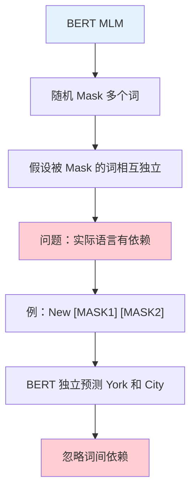
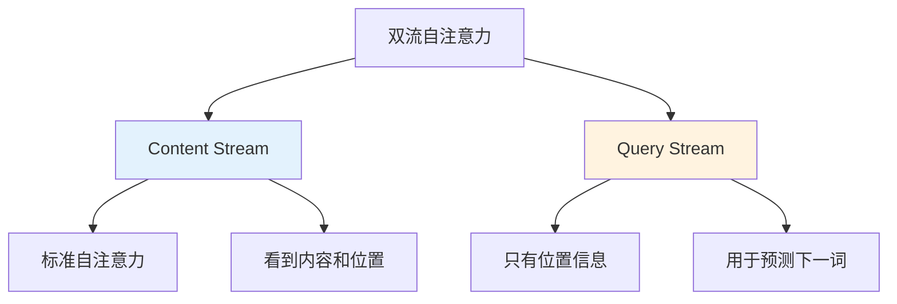
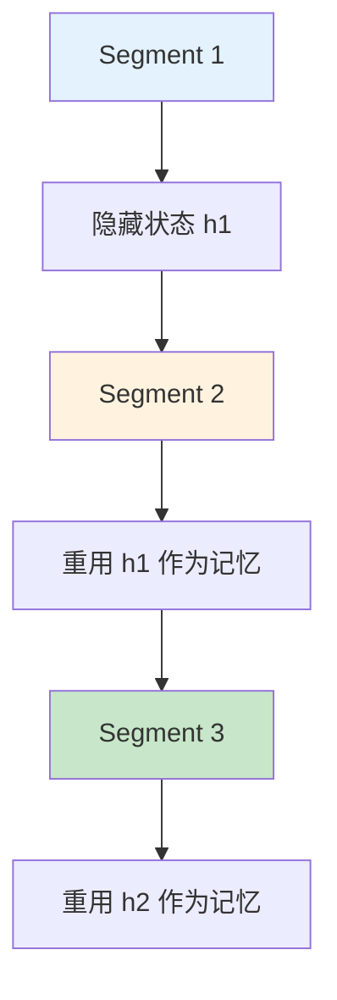
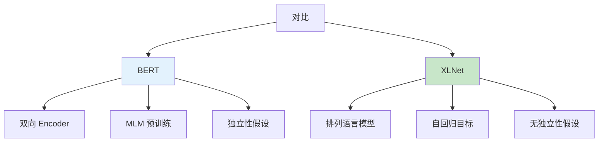

# XLNet

> **分类**: 自然语言处理 | **编号**: 010 | **更新时间**: 2026-03-30 | **难度**: ⭐⭐

`NLP` `Transformer` `Attention` `BERT` `微调`

**摘要**: XLNet 是由卡内基梅隆大学和 Google Brain 于 2019 年提出的预训练模型。

---
## 1. 概述

XLNet 是由卡内基梅隆大学和 Google Brain 于 2019 年提出的预训练模型。XLNet 通过结合自回归语言建模和自编码预训练的优点，克服了 BERT 的独立性假设和掩码 token 不一致性问题，在 20 多项任务上超越了 BERT。

XLNet 的核心创新：
1. **广义自回归预训练**：考虑所有可能的位置排列
2. **双流自注意力**：解决预训练 - 微调不一致问题
3. **Transformer-XL 架构**：捕捉长距离依赖

## 2. BERT 的局限性

### 2.1 独立性假设问题



```python
# BERT 的 MLM 问题示例
# 输入："New [MASK] [MASK] is a city"
# BERT 独立预测两个 [MASK]
# 无法捕捉 "York" 和 "City" 之间的依赖关系

# 实际概率：
# P(York, City | context) ≠ P(York | context) × P(City | context)
```

### 2.2 输入不一致问题

```python
# BERT 预训练使用 [MASK] token
# 但微调时没有 [MASK]
# 导致预训练 - 微调不一致

# 预训练："I [MASK] NLP"
# 微调："I love NLP"
# 模型在预训练时从未见过 "love" 在该位置
```

## 3. XLNet 的核心思想

### 3.1 排列语言模型


```python
# XLNet 的目标函数
# 最大化所有可能排列的对数似然期望

# 对于序列 [x1, x2, x3]
# 可能的排列有 3! = 6 种：
# [1,2,3]: P(x1)P(x2|x1)P(x3|x1,x2)
# [1,3,2]: P(x1)P(x3|x1)P(x2|x1,x3)
# [2,1,3]: P(x2)P(x1|x2)P(x3|x1,x2)
# [2,3,1]: P(x2)P(x3|x2)P(x1|x2,x3)
# [3,1,2]: P(x3)P(x1|x3)P(x2|x1,x3)
# [3,2,1]: P(x3)P(x2|x3)P(x1|x2,x3)

# XLNet 学习目标：
# max Σ_{z∈Z_T} Σ_{t=1}^T log P(x_{z_t} | x_{z_<t})
```

### 3.2 排列示例

```python
# 对于句子 "I love NLP"
# 可能的排列和预测：

# 排列 [2, 3, 1]:
# 1. 预测 "love"（无条件）
# 2. 预测 "NLP"（条件："love"）
# 3. 预测 "I"（条件："love", "NLP"）

# 排列 [3, 1, 2]:
# 1. 预测 "NLP"（无条件）
# 2. 预测 "I"（条件："NLP"）
# 3. 预测 "love"（条件："NLP", "I"）

# 通过随机采样排列，XLNet 可以：
# 1. 捕捉双向上下文
# 2. 建模 token 间依赖
# 3. 避免独立性假设
```

## 4. 双流自注意力

### 4.1 问题：位置信息泄露

```python
# 如果直接实现排列语言模型，会有位置信息泄露问题

# 示例：排列 [2, 3, 1]，预测 x1 时
# 模型知道 x1 是最后一个位置
# 这会泄露位置信息

# 解决方案：双流自注意力
```

### 4.2 内容流和查询流



```python
import torch
import torch.nn as nn

class TwoStreamSelfAttention(nn.Module):
    """XLNet 的双流自注意力"""
    
    def __init__(self, config):
        super().__init__()
        self.content_stream = nn.MultiheadAttention(
            embed_dim=config.d_model,
            num_heads=config.n_head
        )
        self.query_stream = nn.MultiheadAttention(
            embed_dim=config.d_model,
            num_heads=config.n_head
        )
        
        # 查询流的特殊参数（只有位置，没有内容）
        self.query_weight = nn.Parameter(torch.randn(config.d_model))
    
    def forward(self, content, query, attention_mask):
        """
        content: 内容流输入（包含词内容和位置）
        query: 查询流输入（只包含位置）
        attention_mask: 根据排列构建的因果掩码
        """
        # 内容流：标准自注意力
        content_out, _ = self.content_stream(
            content, content, content,
            attn_mask=attention_mask
        )
        
        # 查询流：只有位置信息
        query_expanded = self.query_weight.unsqueeze(0).unsqueeze(1)
        query_out, _ = self.query_stream(
            query_expanded, content, content,
            attn_mask=attention_mask
        )
        
        return content_out, query_out

# 训练时使用查询流预测下一个 token
# 微调时只使用内容流
```

### 4.3 注意力掩码构建

```python
def build_permutation_mask(seq_length, permutation, device='cpu'):
    """
    根据排列构建注意力掩码
    
    permutation: 排列顺序，如 [2, 0, 1]
    返回：attention_mask[i,j] = 1 表示位置 i 可以看到位置 j
    """
    mask = torch.zeros(seq_length, seq_length, device=device)
    
    for i, pos in enumerate(permutation):
        # 位置 i 可以看到之前的所有位置（根据排列顺序）
        for j in range(i + 1):
            mask[i, permutation[j]] = 1
    
    # 转换为 causal mask 格式（上三角为 -inf）
    mask = 1 - mask
    mask = mask.masked_fill(mask == 1, float('-inf'))
    
    return mask

# 示例：seq_length=3, permutation=[2, 0, 1]
# 位置 0（原位置 2）：只能看到自己
# 位置 1（原位置 0）：可以看到位置 2 和 0
# 位置 2（原位置 1）：可以看到所有位置
```

## 5. Transformer-XL 架构

### 5.1 片段级循环机制



```python
class TransformerXL(nn.Module):
    """Transformer-XL 的片段级循环"""
    
    def __init__(self, config):
        super().__init__()
        self.memory_length = config.memory_length  # 记忆长度
        self.layers = nn.ModuleList([...])
    
    def forward(self, input_ids, memory=None):
        """
        memory: 上一段的隐藏状态
        """
        # 拼接当前输入和记忆
        if memory is not None:
            input_with_memory = torch.cat([memory, input_ids], dim=1)
        else:
            input_with_memory = input_ids
        
        # 通过各层
        hidden = input_with_memory
        for layer in self.layers:
            hidden = layer(hidden)
        
        # 更新记忆（用于下一段）
        new_memory = hidden[:, -self.memory_length:, :]
        
        return hidden, new_memory

# 优势：
# 1. 捕捉长距离依赖（超过 512 token）
# 2. 避免重复计算
# 3. 训练更高效
```

### 5.2 相对位置编码

```python
class RelativePositionalEncoding(nn.Module):
    """Transformer-XL 的相对位置编码"""
    
    def __init__(self, dim, max_len=512):
        super().__init__()
        #  sinusoidal 位置编码
        pos = torch.arange(max_len).unsqueeze(1)
        div = torch.exp(torch.arange(0, dim, 2) * -(torch.log(torch.tensor(10000.0)) / dim))
        pe = torch.zeros(max_len, dim)
        pe[:, 0::2] = torch.sin(pos * div)
        pe[:, 1::2] = torch.cos(pos * div)
        self.register_buffer('pe', pe)
    
    def forward(self, query, key, positions):
        """
        计算相对位置注意力
        A_{i,j} = Softmax((E_i + U)W_q (E_j + R_{i-j})W_k^T)
        """
        # 内容向量：E_i
        # 位置向量：R_{i-j}
        # 可学习参数：U（内容偏置）, V（位置偏置）
        pass
```

## 6. XLNet 实现

### 6.1 模型架构

```python
from transformers import XLNetConfig, XLNetModel

# XLNet 配置
config = XLNetConfig(
    vocab_size=32000,
    d_model=768,
    n_layer=12,
    n_head=12,
    d_inner=3072,
    max_position_embeddings=512,
    mem_len=384,      # 记忆长度
    clamp_len=-1,     # 相对位置截断
)

model = XLNetModel(config)
print(f"XLNet-Large 参数：{sum(p.numel() for p in model.parameters()) / 1e6:.1f}M")
```

### 6.2 预训练目标

```python
def xlnet_pretraining_loss(model, input_ids, perm_mask, target_mapping):
    """
    XLNet 预训练损失
    
    perm_mask: 排列掩码 [batch, seq, seq]
    target_mapping: 目标位置映射 [batch, num_predict, seq]
    """
    outputs = model(
        input_ids=input_ids,
        perm_mask=perm_mask,
        target_mapping=target_mapping,
        return_dict=True
    )
    
    # 只计算被预测位置的损失
    prediction_scores = outputs.logits  # [batch, num_predict, vocab]
    
    # 交叉熵损失
    loss_fct = nn.CrossEntropyLoss()
    loss = loss_fct(prediction_scores.view(-1, config.vocab_size), labels.view(-1))
    
    return loss
```

## 7. XLNet vs BERT



| 特性 | BERT | XLNet |
|------|------|-------|
| 架构 | Encoder | Transformer-XL |
| 预训练目标 | MLM | 排列语言模型 |
| 上下文 | 双向（通过 Mask） | 双向（通过排列） |
| 独立性假设 | 是 | 否 |
| 预训练 - 微调 | 不一致 | 一致 |
| 长距离依赖 | 有限（512） | 更强（片段循环） |

## 8. XLNet 的应用

### 8.1 问答系统

```python
from transformers import XLNetForQuestionAnswering, XLNetTokenizer

tokenizer = XLNetTokenizer.from_pretrained('xlnet-large-cased')
model = XLNetForQuestionAnswering.from_pretrained('xlnet-large-cased')

question = "Who was the first president?"
context = "George Washington was the first president."

inputs = tokenizer(question, context, return_tensors='pt')
outputs = model(**inputs)

# 获取答案 span
start_logits = outputs.start_logits
end_logits = outputs.end_logits
```

### 8.2 文本分类

```python
from transformers import XLNetForSequenceClassification

model = XLNetForSequenceClassification.from_pretrained(
    'xlnet-base-cased',
    num_labels=2
)

# 使用 CLS token 进行分类
# XLNet 的 [CLS] token 在序列末尾
```

## 9. 总结

XLNet 通过排列语言模型和双流自注意力，克服了 BERT 的局限性：

1. **无独立性假设**：建模 token 间的依赖关系
2. **预训练 - 微调一致**：避免 [MASK] 不一致问题
3. **长距离依赖**：Transformer-XL 捕捉更长上下文
4. **性能优越**：在多项任务上超越 BERT

XLNet 代表了预训练模型的重要发展方向，其思想影响了后续模型设计。
