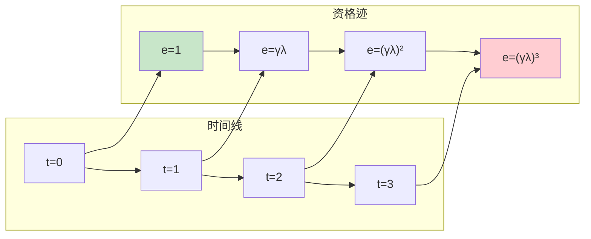
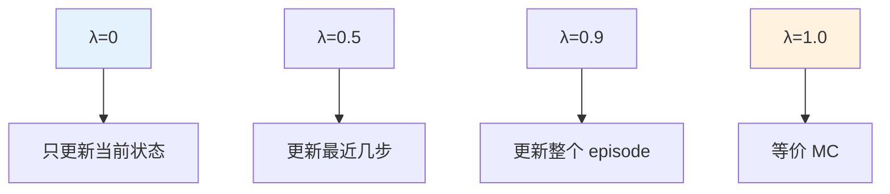

# Eligibility Traces

> **分类**: 强化学习 | **编号**: 008 | **更新时间**: 2026-03-30 | **难度**: ⭐⭐

`RL` `强化学习` `AI`

**摘要**: Eligibility Traces（资格迹）是强化学习中一种强大的技术，它通过记录状态（或状态 - 动作对）的"访问痕迹"，将 TD 学习扩展到多步，实现 Monte Carlo 和 TD 的统一。

---
## 1. 概述

Eligibility Traces（资格迹）是强化学习中一种强大的技术，它通过记录状态（或状态 - 动作对）的"访问痕迹"，将 TD 学习扩展到多步，实现 Monte Carlo 和 TD 的统一。

**核心思想**：当一个状态被访问时，留下一个"痕迹"，后续的 TD 误差可以回溯更新之前访问过的状态，而不仅仅是当前状态。

**关键贡献**：
- 统一 TD(0) 和 Monte Carlo
- 加速学习（更快传播奖励）
- 理论基础（TD(λ) 收敛）

### 1.1 直观理解

想象你在迷宫中行走：
- 传统 TD：只在当前位置更新
- 资格迹：走过的路径都留下痕迹，找到出口后，奖励沿路径回溯

### 1.2 应用场景

- 奖励稀疏的任务
- 长序列决策
- 需要快速传播奖励的场景
- TD(λ)、SARSA(λ)、Q(λ) 等算法

## 2. 算法原理

### 2.1 资格迹定义

**累积迹（Accumulating Trace）**：
```
e_t(s) = γλ e_{t-1}(s) + 1{S_t = s}
```

**替代迹（Replacing Trace）**：
```
e_t(s) = {
    1                    如果 S_t = s
    γλ e_{t-1}(s)       否则
}
```

其中：
- γ：折扣因子
- λ：迹衰减参数（0 ≤ λ ≤ 1）
- e_t(s)：状态 s 在时间 t 的资格迹

### 2.2 TD(λ) 算法

TD(λ) 使用资格迹进行多步更新：

```
TD 误差：δ_t = R_{t+1} + γ V(S_{t+1}) - V(S_t)
资格迹：e_t(s) = γλ e_{t-1}(s) + 1{S_t = s}
更新：V(s) ← V(s) + α δ_t e_t(s)  对所有 s
```

**λ的含义**：
- λ = 0：TD(0)，只更新当前状态
- λ = 1：类似 MC，所有访问过的状态都更新
- λ ∈ (0,1)：折中

### 2.3 n-step Return

资格迹等价于加权平均的 n-step 回报：

```
n-step 回报：G_{t:t+n} = R_{t+1} + γR_{t+2} + ... + γ^{n-1}R_{t+n} + γ^n V(S_{t+n})

TD(λ) 回报：G_t^λ = (1-λ) Σ_{n=1}^∞ λ^{n-1} G_{t:t+n}
```

权重分布：
```
n=1: (1-λ)
n=2: (1-λ)λ
n=3: (1-λ)λ²
...
```

### 2.4 前向 vs 后向视角

**前向视角（Forward View）**：
- 定义：用 n-step 回报的加权平均
- 理论分析用
- 需要知道未来（不可实现）

**后向视角（Backward View）**：
- 定义：用资格迹实现
- 实际算法用
- 可以在线计算

**关键定理**：前向和后向视角在期望下等价。

## 3. 算法流程

### 3.1 TD(λ) 算法流程

```mermaid
flowchart TD
    Start([开始]) --> Init[初始化 V(s)=0, e(s)=0]
    Init --> Reset[开始 episode, 获取 S₀]
    Reset --> Loop{对于每步 t}
    Loop --> Action[执行动作，观察 R, S']
    Action --> CalcTD[计算δ = R + γV(S') - V(S)]
    CalcTD --> UpdateE[e(s) ← γλe(s) + 1{S_t=s}]
    UpdateE --> UpdateV[对所有 s: V(s) ← V(s) + αδ·e(s)]
    UpdateV --> Next{S'终止？}
    Next -->|否 | S[S ← S']
    S --> Loop
    Next -->|是 | Check{收敛？}
    Check -->|否 | Reset
    Check -->|是 | End([输出 V])
    
    style Start fill:#c8e6c9
    style End fill:#ffcdd2
    style UpdateE fill:#fff9c4
```

### 3.2 SARSA(λ) 算法

```
初始化 Q(s,a), e(s,a)
对于每个 episode：
    初始化 S, A
    对于每步 t：
        执行 A，观察 R, S'
        选择 A'（从 S'）
        δ = R + γ Q(S',A') - Q(S,A)
        e(S,A) ← e(S,A) + 1
        对所有 (s,a)：
            Q(s,a) ← Q(s,a) + α δ e(s,a)
            e(s,a) ← γλ e(s,a)
        S ← S', A ← A'
```

## 4. 代码实现

```python
import numpy as np
from collections import defaultdict

class TDLambda:
    """TD(λ) 预测算法"""
    
    def __init__(self, gamma=0.99, lam=0.9, alpha=0.1):
        self.gamma = gamma
        self.lam = lam
        self.alpha = alpha
        self.V = defaultdict(float)
        self.e = defaultdict(float)  # 资格迹
    
    def reset_trace(self):
        """重置资格迹"""
        self.e = defaultdict(float)
    
    def update(self, state, reward, next_state, done):
        """
        TD(λ) 更新
        
        返回：TD 误差
        """
        # 计算 TD 误差
        if done:
            td_target = reward
        else:
            td_target = reward + self.gamma * self.V[next_state]
        
        td_error = td_target - self.V[state]
        
        # 更新当前状态的资格迹（累积迹）
        self.e[state] += 1
        
        # 更新所有访问过的状态
        # 实际实现中只更新 e(s) > 0 的状态
        states_to_update = [s for s in self.e if self.e[s] > 0]
        
        for s in states_to_update:
            self.V[s] += self.alpha * td_error * self.e[s]
            self.e[s] *= self.gamma * self.lam  # 衰减
        
        return td_error
    
    def train_episode(self, env):
        """训练一个 episode"""
        self.reset_trace()
        state = env.reset()
        
        while True:
            action = env.action_space.sample()  # 随机策略示例
            next_state, reward, done, _ = env.step(action)
            
            self.update(state, reward, next_state, done)
            
            if done:
                break
            
            state = next_state

class SarsaLambda:
    """SARSA(λ) 控制算法"""
    
    def __init__(self, n_actions, gamma=0.99, lam=0.9, alpha=0.1, epsilon=0.1):
        self.n_actions = n_actions
        self.gamma = gamma
        self.lam = lam
        self.alpha = alpha
        self.epsilon = epsilon
        self.Q = defaultdict(lambda: np.zeros(n_actions))
        self.e = defaultdict(lambda: np.zeros(n_actions))
    
    def get_action(self, state):
        """ε-贪婪策略"""
        if np.random.random() < self.epsilon:
            return np.random.randint(self.n_actions)
        return np.argmax(self.Q[state])
    
    def reset_trace(self):
        """重置资格迹"""
        self.e = defaultdict(lambda: np.zeros(self.n_actions))
    
    def update(self, state, action, reward, next_state, next_action, done):
        """SARSA(λ) 更新"""
        # TD 误差
        if done:
            td_target = reward
        else:
            td_target = reward + self.gamma * self.Q[next_state][next_action]
        
        td_error = td_target - self.Q[state][action]
        
        # 更新资格迹（替代迹）
        self.e[state][action] = 1  # 替代迹
        
        # 更新所有访问过的状态 - 动作对
        for s in list(self.e.keys()):
            for a in range(self.n_actions):
                if self.e[s][a] > 1e-6:  # 只更新有迹的
                    self.Q[s][a] += self.alpha * td_error * self.e[s][a]
                    self.e[s][a] *= self.gamma * self.lam
    
    def train(self, env, n_episodes):
        """训练循环"""
        for ep in range(n_episodes):
            self.reset_trace()
            state = env.reset()
            action = self.get_action(state)
            
            while True:
                next_state, reward, done, _ = env.step(action)
                next_action = self.get_action(next_state) if not done else None
                
                self.update(state, action, reward, next_state, next_action, done)
                
                if done:
                    break
                
                state = next_state
                action = next_action
            
            self.epsilon = max(0.01, self.epsilon * 0.995)

# 高效实现（只跟踪访问过的状态）
class EfficientTDLambda:
    """高效 TD(λ) 实现"""
    
    def __init__(self, gamma=0.99, lam=0.9, alpha=0.1):
        self.gamma = gamma
        self.lam = lam
        self.alpha = alpha
        self.V = {}
        self.e = {}  # 只存储非零迹
    
    def update(self, state, reward, next_state, done):
        # 初始化
        if state not in self.V:
            self.V[state] = 0
        if next_state not in self.V and not done:
            self.V[next_state] = 0
        
        # TD 误差
        td_target = reward if done else reward + self.gamma * self.V[next_state]
        td_error = td_target - self.V[state]
        
        # 更新资格迹
        self.e[state] = self.e.get(state, 0) + 1
        
        # 更新所有有迹的状态
        states_to_remove = []
        for s in self.e:
            self.V[s] = self.V.get(s, 0) + self.alpha * td_error * self.e[s]
            self.e[s] *= self.gamma * self.lam
            
            # 移除衰减到 0 的迹
            if self.e[s] < 1e-6:
                states_to_remove.append(s)
        
        for s in states_to_remove:
            del self.e[s]
        
        return td_error
```

## 5. 应用场景

### 5.1 奖励稀疏任务

如迷宫导航：
- 只有到达终点才有奖励
- 资格迹将奖励快速传播到路径上的状态

### 5.2 棋类游戏

- 只有终局才有输赢奖励
- 资格迹帮助学习哪些中间局面好

### 5.3 机器人控制

- 任务完成才有奖励
- 快速学习成功动作序列

## 6. λ参数选择

### 6.1 λ的影响

| λ值 | 行为 | 适用场景 |
|-----|------|----------|
| 0 | TD(0) | 在线学习，低方差 |
| 0.5 | 折中 | 一般场景 |
| 0.9 | 多步 | 奖励稀疏 |
| 1.0 | MC | 完整 episode |

### 6.2 自适应λ

```
λ_t = 1 - (1 - λ_0) / (1 + t/k)
```
- 初期λ大（快速传播）
- 后期λ小（精细调整）

## 7. 总结

资格迹是 RL 的重要技术：

1. **统一框架**：TD(λ) 统一 TD 和 MC
2. **加速学习**：快速传播奖励
3. **灵活控制**：λ参数调节多步程度
4. **理论基础**：收敛性保证
5. **广泛应用**：TD-Gammon 等成功案例

理解资格迹对于掌握高级 RL 算法至关重要。

## 附录：Mermaid 图表

### 资格迹衰减示意



### λ参数影响


