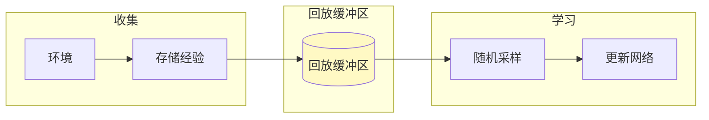

# 深度 Q 网络进阶

> **分类**: 强化学习 | **编号**: 010 | **更新时间**: 2026-03-30 | **难度**: ⭐⭐

`RL` `CNN` `强化学习` `神经网络` `损失函数`

**摘要**: 深度 Q 网络（Deep Q-Network, DQN）将 Q-Learning 与深度神经网络结合，实现了从原始像素到动作的端到端学习。

---
## 1. 概述

深度 Q 网络（Deep Q-Network, DQN）将 Q-Learning 与深度神经网络结合，实现了从原始像素到动作的端到端学习。DQN 及其进阶变体是深度强化学习的里程碑，开启了 RL 在复杂任务中的应用。

**DQN 的核心贡献**（Mnih et al., Nature 2015）：
- 用 CNN 处理高维视觉输入
- 经验回放（Experience Replay）
- 目标网络（Target Network）
- 在 Atari 游戏上超越人类

**进阶发展**：
- 稳定性改进（Double DQN, Dueling DQN）
- 效率改进（Prioritized Replay, N-step）
- 探索改进（Noisy Nets, Bootstrap）
- 分布学习（C51, QR-DQN）

## 2. 算法原理

### 2.1 标准 DQN

**Q-Learning 的函数近似**：
```
Q(s,a; θ) ≈ Q*(s,a)
```

**损失函数**：
```
L(θ) = E[(y - Q(s,a; θ))²]
```

其中目标：
```
y = r + γ max_{a'} Q(s',a'; θ^-)
```

**关键技术**：

**1. 经验回放（Experience Replay）**：
- 存储经验：(s, a, r, s', done)
- 随机采样打破相关性
- 提高样本效率

**2. 目标网络（Target Network）**：
- 独立的目标网络参数θ^-
- 定期从θ复制
- 稳定学习目标

### 2.2 改进技术

**N-step Returns**：
```
G_{t:t+n} = r_t + γr_{t+1} + ... + γ^{n-1}r_{t+n-1} + γ^n max_a Q(s_{t+n}, a)
```
- 减少 Bootstrap 偏差
- 加速奖励传播

**Distributional RL**：
- 学习回报分布 Z(s,a) 而非期望 Q(s,a)
- C51：51 个原子的分类分布
- 更丰富的学习信号

**Noisy Networks**：
- 参数化噪声：W = μ + σ ⊙ ε
- 自动探索，无需ε-贪婪
- 状态依赖的探索

### 2.3 损失函数演进

**标准 DQN**：
```
L = E[(r + γ max Q' - Q)²]
```

**Huber 损失**（更鲁棒）：
```
L_δ(x) = {
    0.5x²           如果 |x| < δ
    δ(|x| - 0.5δ)   否则
}
```

**Distributional 损失**：
```
L = D_KL(Φ_z^* || d_z)
```
其中Φ是投影分布，d 是预测分布。

## 3. 算法流程

### 3.1 DQN 训练流程

```mermaid
flowchart TD
    Start([开始]) --> Init[初始化 Q 和目标网络 Q']
    Init --> Env[获取状态 s]
    Env --> Select[ε-贪婪选择动作 a]
    Select --> Step[执行 a, 观察 r, s', done]
    Step --> Store[存储经验到回放缓冲区]
    Store --> Sample[随机采样 batch]
    Sample --> CalcTarget[y = r + γmax Q'(s',·)]
    CalcTarget --> Loss[计算损失 L = (y-Q)²]
    Loss --> Backprop[反向传播更新θ]
    Backprop --> Periodic{每 C 步？}
    Periodic -->|是 | Update[Q' ← Q]
    Update --> Next
    Periodic -->|否 | Next[状态 s ← s']
    Next --> Env
    
    style Start fill:#c8e6c9
    style Loss fill:#fff9c4
```

### 3.2 训练技巧

**1. 梯度裁剪**：
```
if ||∇L|| > clip_norm:
    ∇L = ∇L * clip_norm / ||∇L||
```

**2. 学习率调度**：
```
初期：高学习率快速学习
后期：低学习率精细调整
```

**3. 奖励缩放**：
```
r' = sign(r) * min(|r|, 1)
```
- 限制奖励范围
- 稳定训练

## 4. 代码实现

```python
import numpy as np
import torch
import torch.nn as nn
import torch.nn.functional as F
from collections import deque

class DQN(nn.Module):
    """标准 DQN 网络"""
    
    def __init__(self, state_dim, action_dim):
        super().__init__()
        self.net = nn.Sequential(
            nn.Linear(state_dim, 128),
            nn.ReLU(),
            nn.Linear(128, 128),
            nn.ReLU(),
            nn.Linear(128, action_dim)
        )
    
    def forward(self, x):
        return self.net(x)

class CNN_DQN(nn.Module):
    """CNN DQN（Atari）"""
    
    def __init__(self, action_dim):
        super().__init__()
        self.conv = nn.Sequential(
            nn.Conv2d(4, 32, 8, stride=4),
            nn.ReLU(),
            nn.Conv2d(32, 64, 4, stride=2),
            nn.ReLU(),
            nn.Conv2d(64, 64, 3, stride=1),
            nn.ReLU(),
            nn.Flatten(),
            nn.Linear(64 * 7 * 7, 512),
            nn.ReLU(),
            nn.Linear(512, action_dim)
        )
    
    def forward(self, x):
        return self.conv(x)

class ReplayBuffer:
    """经验回放缓冲区"""
    
    def __init__(self, capacity=100000):
        self.buffer = deque(maxlen=capacity)
    
    def push(self, state, action, reward, next_state, done):
        self.buffer.append((state, action, reward, next_state, done))
    
    def sample(self, batch_size):
        batch = np.random.choice(len(self.buffer), batch_size, replace=False)
        states, actions, rewards, next_states, dones = zip(
            *[self.buffer[i] for i in batch]
        )
        return (np.array(states), np.array(actions), np.array(rewards),
                np.array(next_states), np.array(dones))
    
    def __len__(self):
        return len(self.buffer)

class DQNAgent:
    """DQN 智能体"""
    
    def __init__(self, state_dim, action_dim, gamma=0.99, lr=1e-4, 
                 buffer_size=100000, batch_size=32, target_update=1000):
        self.gamma = gamma
        self.batch_size = batch_size
        self.target_update = target_update
        self.steps = 0
        
        # 网络
        self.q_net = DQN(state_dim, action_dim)
        self.q_target = DQN(state_dim, action_dim)
        self.q_target.load_state_dict(self.q_net.state_dict())
        
        # 优化器
        self.optimizer = torch.optim.Adam(self.q_net.parameters(), lr=lr)
        
        # 回放缓冲区
        self.buffer = ReplayBuffer(buffer_size)
    
    def select_action(self, state, epsilon=0.1):
        if np.random.random() < epsilon:
            return np.random.randint(self.q_net.net[-1].out_features)
        
        with torch.no_grad():
            state = torch.FloatTensor(state).unsqueeze(0)
            q_values = self.q_net(state)
            return torch.argmax(q_values).item()
    
    def store_transition(self, state, action, reward, next_state, done):
        self.buffer.push(state, action, reward, next_state, done)
    
    def update(self):
        if len(self.buffer) < self.batch_size:
            return None
        
        # 采样
        states, actions, rewards, next_states, dones = self.buffer.sample(self.batch_size)
        
        # 转换为 tensor
        states = torch.FloatTensor(states)
        actions = torch.LongTensor(actions).unsqueeze(1)
        rewards = torch.FloatTensor(rewards)
        next_states = torch.FloatTensor(next_states)
        dones = torch.FloatTensor(dones)
        
        # 计算目标
        with torch.no_grad():
            next_q = self.q_target(next_states).max(dim=1)[0]
            targets = rewards + self.gamma * next_q * (1 - dones)
        
        # 计算当前 Q
        current_q = self.q_net(states).gather(1, actions).squeeze()
        
        # 损失
        loss = F.mse_loss(current_q, targets)
        
        # 更新
        self.optimizer.zero_grad()
        loss.backward()
        nn.utils.clip_grad_norm_(self.q_net.parameters(), 10)
        self.optimizer.step()
        
        # 更新目标网络
        self.steps += 1
        if self.steps % self.target_update == 0:
            self.q_target.load_state_dict(self.q_net.state_dict())
        
        return loss.item()
    
    def train(self, env, n_episodes, epsilon_start=1.0, epsilon_end=0.01, 
              epsilon_decay=0.995):
        epsilon = epsilon_start
        
        for ep in range(n_episodes):
            state = env.reset()
            total_reward = 0
            
            while True:
                action = self.select_action(state, epsilon)
                next_state, reward, done, _ = env.step(action)
                
                self.store_transition(state, action, reward, next_state, done)
                loss = self.update()
                
                total_reward += reward
                state = next_state
                
                if done:
                    break
            
            # 衰减ε
            epsilon = max(epsilon_end, epsilon * epsilon_decay)
            
            if (ep + 1) % 10 == 0:
                print(f"Episode {ep+1}, 奖励：{total_reward:.1f}, ε={epsilon:.3f}")

# N-step DQN
class NStepDQN(DQNAgent):
    """N-step DQN"""
    
    def __init__(self, n_steps=3, **kwargs):
        super().__init__(**kwargs)
        self.n_steps = n_steps
    
    def compute_nstep_target(self, rewards, next_states, dones):
        """计算 N-step 目标"""
        n = len(rewards)
        targets = np.zeros(n)
        
        # 从后向前计算
        G = 0
        for t in reversed(range(n)):
            if dones[t]:
                G = rewards[t]
            else:
                G = rewards[t] + self.gamma * G
            
            # 存储从 t 开始的 n-step 回报
            if t + self.n_steps <= n:
                targets[t] = sum(self.gamma**i * rewards[t+i] 
                               for i in range(self.n_steps))
                if t + self.n_steps < n and not dones[t + self.n_steps]:
                    with torch.no_grad():
                        targets[t] += self.gamma**self.n_steps * \
                                     self.q_target(
                                         torch.FloatTensor(next_states[t + self.n_steps])
                                     ).max().item()
        
        return targets
```

## 5. 应用场景

### 5.1 Atari 游戏

- 原始像素输入（84x84x4）
- CNN 提取特征
- 50+ 游戏达到人类水平

### 5.2 机器人视觉控制

- 摄像头输入
- 端到端学习
- Sim-to-Real 迁移

### 5.3 自动驾驶

- 多摄像头融合
- 决策规划
- 安全约束

## 6. 训练技巧

### 6.1 超参数选择

| 参数 | 推荐值 | 说明 |
|------|--------|------|
| 学习率 | 1e-4 | Adam 优化器 |
| 折扣因子 | 0.99 | 标准值 |
| Batch Size | 32-64 | 平衡方差/效率 |
| 目标更新 | 1000 步 | 稳定学习 |
| 回放大小 | 100k-1M | 足够多样性 |

### 6.2 常见陷阱

**1. 灾难性遗忘**：
- 解决：大回放缓冲区

**2. Q 值发散**：
- 解决：目标网络、梯度裁剪

**3. 探索不足**：
- 解决：ε调度、Noisy Nets

**4. 过估计**：
- 解决：Double DQN

## 7. 总结

DQN 是深度 RL 的里程碑：

1. **端到端学习**：从像素到动作
2. **经验回放**：打破相关性
3. **目标网络**：稳定学习
4. **多种改进**：Double, Dueling, Prioritized
5. **广泛应用**：游戏、机器人、自动驾驶

理解 DQN 是掌握现代深度 RL 的基础。

## 附录：Mermaid 图表

### DQN 架构图

```mermaid
graph LR
    Input[状态 s] --> CNN[CNN 层]
    CNN --> FC1[全连接 512]
    FC1 --> FC2[全连接 |A|]
    FC2 --> Output[Q 值]
    
    style Input fill:#e3f2fd
    style Output fill:#c8e6c9
```

### 经验回放机制


