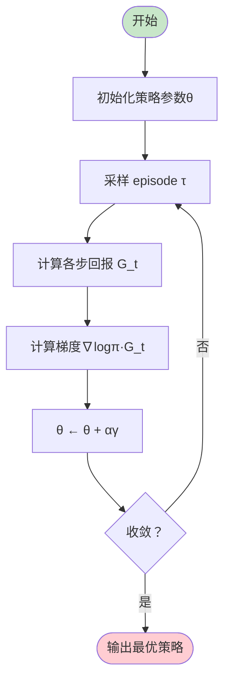

# 策略梯度定理

> **分类**: 强化学习 | **编号**: 011 | **更新时间**: 2026-03-30 | **难度**: ⭐⭐⭐

`RL` `强化学习` `AI`

**摘要**: 策略梯度定理（Policy Gradient Theorem）是强化学习的核心理论结果，它提供了目标函数 J(θ) 关于策略参数θ的梯度表达式，使得可以直接优化策略而无需通过价值函数。

---
## 1. 概述

策略梯度定理（Policy Gradient Theorem）是强化学习的核心理论结果，它提供了目标函数 J(θ) 关于策略参数θ的梯度表达式，使得可以直接优化策略而无需通过价值函数。

**核心贡献**（Sutton et al., 1999）：
- 证明策略梯度可以表示为期望形式
- 无需知道环境动力学
- 适用于连续动作空间

**意义**：
- 开启了基于策略的 RL 方法
- 是 Actor-Critic、PPO、TRPO 等算法的基础
- 解决了价值方法在连续空间的局限

## 2. 数学原理

### 2.1 策略优化目标

**目标函数**（期望回报）：
```
J(θ) = E_τ∼π_θ[R(τ)] = E_τ∼π_θ[Σ_t γ^t r_t]
```

**优化目标**：
```
θ* = argmax_θ J(θ)
```

### 2.2 策略梯度定理

**定理**：
```
∇_θ J(θ) = E_τ∼π_θ[Σ_t ∇_θ log π_θ(a_t|s_t) Q^π(s_t, a_t)]
```

**证明思路**：

1. **性能引理**：
   ```
   J(θ) = E_s∼ρ_0[V^π(s)]
   ```

2. **价值函数梯度**：
   ```
   ∇_θ V^π(s) = E_π[Σ_t ∇_θ log π(a_t|s_t) Q^π(s_t, a_t)]
   ```

3. **关键步骤**：
   ```
   ∇_θ J(θ) = ∇_θ E_π[G_0]
            = ∇_θ Σ_τ P(τ|θ) R(τ)
            = Σ_τ ∇_θ P(τ|θ) R(τ)
            = Σ_τ P(τ|θ) ∇_θ log P(τ|θ) R(τ)
            = E_τ[∇_θ log P(τ|θ) R(τ)]
   ```

4. **轨迹概率分解**：
   ```
   ∇_θ log P(τ|θ) = Σ_t ∇_θ log π_θ(a_t|s_t)
   ```

### 2.3 梯度估计

**Monte Carlo 估计**：
```
∇_θ J(θ) ≈ (1/N) Σ_{i=1}^N Σ_t ∇_θ log π_θ(a_t^i|s_t^i) G_t^i
```

**带基线的估计**：
```
∇_θ J(θ) ≈ (1/N) Σ_{i=1}^N Σ_t ∇_θ log π_θ(a_t^i|s_t^i) (G_t^i - b(s_t^i))
```

## 3. 算法流程

### 3.1 REINFORCE 算法



### 3.2 Actor-Critic 算法

```
初始化 Actor 参数θ，Critic 参数φ
对于每个 episode：
    获取 s_0
    对于每步 t：
        a_t ∼ π_θ(·|s_t)
        执行 a_t，观察 r_t, s_{t+1}
        δ_t = r_t + γ V_φ(s_{t+1}) - V_φ(s_t)
        存储 (s_t, a_t, δ_t)
    
    θ ← θ + α Σ_t ∇_θ log π_θ(a_t|s_t) δ_t
    φ ← φ + β Σ_t δ_t ∇_φ V_φ(s_t)
```

## 4. 代码实现

```python
import numpy as np
import torch
import torch.nn as nn
import torch.optim as optim
from torch.distributions import Categorical

class PolicyNetwork(nn.Module):
    """策略网络"""
    
    def __init__(self, state_dim, action_dim, hidden_dim=128):
        super().__init__()
        self.net = nn.Sequential(
            nn.Linear(state_dim, hidden_dim),
            nn.ReLU(),
            nn.Linear(hidden_dim, hidden_dim),
            nn.ReLU(),
            nn.Linear(hidden_dim, action_dim)
        )
    
    def forward(self, x):
        return self.net(x)
    
    def get_action(self, state):
        logits = self(torch.FloatTensor(state).unsqueeze(0))
        dist = Categorical(logits=logits)
        action = dist.sample()
        log_prob = dist.log_prob(action)
        return action.item(), log_prob, dist

class REINFORCE:
    """REINFORCE 算法"""
    
    def __init__(self, state_dim, action_dim, lr=1e-3, gamma=0.99):
        self.gamma = gamma
        self.policy = PolicyNetwork(state_dim, action_dim)
        self.optimizer = optim.Adam(self.policy.parameters(), lr=lr)
    
    def select_action(self, state):
        return self.policy.get_action(state)
    
    def update(self, log_probs, rewards):
        # 计算折扣回报
        returns = []
        G = 0
        for r in reversed(rewards):
            G = r + self.gamma * G
            returns.insert(0, G)
        
        returns = torch.FloatTensor(returns)
        
        # 标准化
        returns = (returns - returns.mean()) / (returns.std() + 1e-8)
        
        # 策略梯度损失
        policy_loss = -(torch.stack(log_probs) * returns).mean()
        
        # 更新
        self.optimizer.zero_grad()
        policy_loss.backward()
        self.optimizer.step()
        
        return policy_loss.item()

class ActorCritic(nn.Module):
    """Actor-Critic 网络"""
    
    def __init__(self, state_dim, action_dim, hidden_dim=128):
        super().__init__()
        self.shared = nn.Sequential(
            nn.Linear(state_dim, hidden_dim),
            nn.ReLU()
        )
        
        self.actor = nn.Sequential(
            nn.Linear(hidden_dim, hidden_dim),
            nn.ReLU(),
            nn.Linear(hidden_dim, action_dim)
        )
        
        self.critic = nn.Sequential(
            nn.Linear(hidden_dim, hidden_dim),
            nn.ReLU(),
            nn.Linear(hidden_dim, 1)
        )
    
    def forward(self, x):
        x = self.shared(x)
        return self.actor(x), self.critic(x)
    
    def get_action(self, state):
        logits, value = self(torch.FloatTensor(state).unsqueeze(0))
        dist = Categorical(logits=logits)
        action = dist.sample()
        return action.item(), dist.log_prob(action), value

class ActorCriticAgent:
    """Actor-Critic 智能体"""
    
    def __init__(self, state_dim, action_dim, lr=3e-4, gamma=0.99):
        self.gamma = gamma
        self.network = ActorCritic(state_dim, action_dim)
        self.optimizer = optim.Adam(self.network.parameters(), lr=lr)
    
    def select_action(self, state):
        return self.network.get_action(state)
    
    def update(self, states, actions, rewards, next_states, dones, log_probs):
        # 计算 TD 目标
        with torch.no_grad():
            _, next_values = self.network(torch.FloatTensor(next_states))
            targets = torch.FloatTensor(rewards) + \
                     self.gamma * next_values.squeeze() * (1 - torch.FloatTensor(dones))
        
        # Critic 损失
        _, values = self.network(torch.FloatTensor(states))
        critic_loss = nn.MSELoss()(values.squeeze(), targets)
        
        # 优势函数
        advantages = targets - values.squeeze().detach()
        
        # Actor 损失
        actor_loss = -(torch.stack(log_probs) * advantages).mean()
        
        # 联合更新
        loss = actor_loss + critic_loss
        self.optimizer.zero_grad()
        loss.backward()
        self.optimizer.step()
        
        return actor_loss.item(), critic_loss.item()
```

## 5. 应用场景

### 5.1 连续控制

- 机器人关节控制
- 无人机飞行
- 自动驾驶

### 5.2 复杂策略

- 随机策略（多模态）
- 分层策略
- 条件策略

### 5.3 多智能体

- 分布式策略学习
- 协作与竞争

## 6. 高级技术

### 6.1 基线选择

**常见基线**：
- 状态价值 V(s)
- 平均奖励
- 可学习基线

**最优基线**：
```
b* = E[∇logπ·G²] / E[∇logπ]
```

### 6.2 自然策略梯度

```
∇_natural J = F^{-1} ∇_θ J
```
其中 F 是 Fisher 信息矩阵。

### 6.3 信任域方法

约束策略更新幅度：
```
max_θ E[π_θ/π_old · A]
s.t. KL(π_old || π_θ) ≤ δ
```

## 7. 总结

策略梯度定理是策略优化方法的基础：

1. **直接优化策略**：适用于连续空间
2. **理论保证**：梯度表达式精确
3. **灵活扩展**：Actor-Critic、TRPO、PPO
4. **实践成功**：机器人、游戏等应用

理解策略梯度是掌握现代策略优化算法的关键。

## 附录：Mermaid 图表

### 策略梯度定理示意

```mermaid
graph LR
    A[目标 J(θ)] --> B[梯度∇J]
    B --> C[E[∇logπ·Q]]
    C --> D[采样估计]
    D --> E[更新θ]
    
    style A fill:#e3f2fd
    style E fill:#c8e6c9
```

### Actor-Critic 架构

```mermaid
flowchart TB
    S[状态 s] --> Actor[Actor π(a|s)]
    S --> Critic[Critic V(s)]
    Actor --> A[动作 a]
    Critic --> δ[TD 误差δ]
    δ --> UpdateActor[更新 Actor]
    δ --> UpdateCritic[更新 Critic]
    
    style Actor fill:#c8e6c9
    style Critic fill:#ffcdd2
```
