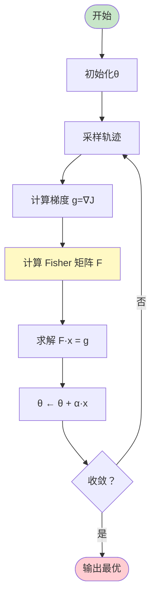
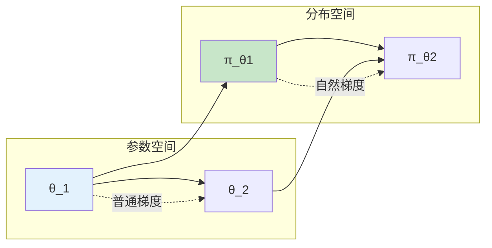
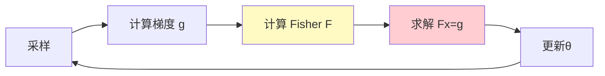

# 自然策略梯度

> **分类**: 强化学习 | **编号**: 012 | **更新时间**: 2026-03-30 | **难度**: ⭐⭐

`RL` `AI` `面试`

**摘要**: 自然策略梯度（Natural Policy Gradient, NPG）是策略优化方法的重要改进，它考虑了策略空间的几何结构，使用 Fisher 信息矩阵对梯度进行预处理，使得更新方向更加合理。

---
## 1. 概述

自然策略梯度（Natural Policy Gradient, NPG）是策略优化方法的重要改进，它考虑了策略空间的几何结构，使用 Fisher 信息矩阵对梯度进行预处理，使得更新方向更加合理。

**核心思想**：在策略分布空间而非参数空间中进行最速下降，考虑概率分布的内在几何结构。

**关键贡献**（Kakade, 2001）：
- 引入 Fisher 信息矩阵
- 定义自然梯度方向
- 为 TRPO 奠定基础

## 2. 数学原理

### 2.1 普通梯度的问题

**问题**：普通梯度在参数空间中最陡，但在分布空间中不一定。

**示例**：
```
高斯策略 N(μ, σ²)
参数θ = (μ, σ)

普通梯度：∇_θ J
问题：同样的|Δθ|在不同位置导致不同的分布变化
```

### 2.2 Fisher 信息矩阵

**定义**：
```
F(θ) = E_x∼p(x|θ)[∇_θ log p(x|θ) ∇_θ log p(x|θ)^T]
```

**性质**：
- 半正定矩阵
- 度量参数空间的局部曲率
- KL 散度的二阶近似

### 2.3 自然梯度

**定义**：
```
∇_natural J(θ) = F(θ)^{-1} ∇_θ J(θ)
```

**直观理解**：
- 普通梯度：参数空间的最陡方向
- 自然梯度：分布空间的最陡方向
- 考虑了参数变化的"实际效果"

### 2.4 更新规则

**普通策略梯度**：
```
θ ← θ + α ∇_θ J(θ)
```

**自然策略梯度**：
```
θ ← θ + α F(θ)^{-1} ∇_θ J(θ)
```

**等价约束优化**：
```
max_θ ∇_θ J(θ)^T Δθ
s.t. KL(π_θ || π_{θ+Δθ}) ≤ δ
```

解为：
```
Δθ = α F(θ)^{-1} ∇_θ J(θ)
```

## 3. 算法流程

### 3.1 NPG 算法



### 3.2 共轭梯度法

直接求逆 F^{-1} 成本高，用共轭梯度法：

```
求解：F · x = g

迭代:
    r_0 = g - F · x_0
    p_0 = r_0
    对于 k=0,1,...:
        α_k = (r_k^T r_k) / (p_k^T F p_k)
        x_{k+1} = x_k + α_k p_k
        r_{k+1} = r_k - α_k F p_k
        β_k = (r_{k+1}^T r_{k+1}) / (r_k^T r_k)
        p_{k+1} = r_{k+1} + β_k p_k
```

## 4. 代码实现

```python
import numpy as np
import torch
import torch.nn as nn
import torch.optim as optim

def compute_fisher_vector_product(model, states, actions, damping=0.1):
    """
    计算 Fisher 信息矩阵的向量乘积
    使用自动微分避免显式构造 F
    """
    # 获取对数概率
    logits = model(states)
    dist = torch.distributions.Categorical(logits=logits)
    log_probs = dist.log_prob(actions)
    
    # 梯度
    grad = torch.autograd.grad(log_probs.sum(), 
                               model.parameters(),
                               create_graph=True)[0]
    
    def fisher_vector_product(v):
        """F · v"""
        # 展平 v
        v_flat = torch.cat([v_i.flatten() for v_i in v])
        
        # F · v = E[∇logp (∇logp^T · v)]
        grad_v = (grad * v_flat).sum()
        Fv = torch.autograd.grad(grad_v, model.parameters())
        
        # 展平并添加阻尼
        Fv_flat = torch.cat([Fv_i.flatten() for Fv_i in Fv])
        Fv_damped = Fv_flat + damping * v_flat
        
        return Fv_damped
    
    return fisher_vector_product

def conjugate_gradient(A, b, n_steps=10):
    """
    共轭梯度法求解 Ax = b
    """
    x = torch.zeros_like(b)
    r = b - A(x)
    p = r.clone()
    
    for _ in range(n_steps):
        Ap = A(p)
        alpha = torch.dot(r, r) / torch.dot(p, Ap)
        x = x + alpha * p
        r_new = r - alpha * Ap
        beta = torch.dot(r_new, r_new) / torch.dot(r, r)
        p = r_new + beta * p
        r = r_new
    
    return x

class NaturalPolicyGradient:
    """自然策略梯度实现"""
    
    def __init__(self, state_dim, action_dim, lr=0.1, damping=0.1):
        self.lr = lr
        self.damping = damping
        self.policy = PolicyNetwork(state_dim, action_dim)
    
    def select_action(self, state):
        logits = self.policy(torch.FloatTensor(state).unsqueeze(0))
        dist = torch.distributions.Categorical(logits=logits)
        action = dist.sample()
        return action.item(), dist.log_prob(action)
    
    def update(self, states, actions, advantages):
        """NPG 更新"""
        # 计算策略梯度
        logits = self.policy(torch.FloatTensor(states))
        dist = torch.distributions.Categorical(logits=logits)
        log_probs = dist.log_prob(torch.LongTensor(actions))
        
        # 梯度：g = E[∇logπ · A]
        policy_loss = -(log_probs * torch.FloatTensor(advantages)).mean()
        gradient = torch.autograd.grad(policy_loss, self.policy.parameters())
        
        # 展平梯度
        g = torch.cat([grad.flatten() for grad in gradient])
        
        # Fisher 向量乘积函数
        fvp = compute_fisher_vector_product(self.policy, 
                                           torch.FloatTensor(states),
                                           torch.LongTensor(actions),
                                           self.damping)
        
        # 共轭梯度求解 F · x = g
        x = conjugate_gradient(fvp, g, n_steps=10)
        
        # 更新参数
        params = list(self.policy.parameters())
        idx = 0
        for param in params:
            param_size = param.numel()
            param.data -= self.lr * x[idx:idx+param_size].reshape(param.shape)
            idx += param_size
        
        return policy_loss.item()

class PolicyNetwork(nn.Module):
    def __init__(self, state_dim, action_dim, hidden_dim=64):
        super().__init__()
        self.net = nn.Sequential(
            nn.Linear(state_dim, hidden_dim),
            nn.Tanh(),
            nn.Linear(hidden_dim, hidden_dim),
            nn.Tanh(),
            nn.Linear(hidden_dim, action_dim)
        )
    
    def forward(self, x):
        return self.net(x)
```

## 5. 应用场景

### 5.1 稳定策略优化

- 保证单调改进
- 避免过大更新
- 适合精细调整

### 5.2 连续控制

- 机器人控制
- 需要稳定学习
- 高斯策略

### 5.3 理论基础

- TRPO 的理论基础
- 理解策略空间几何
- 指导算法设计

## 6. 优缺点

**优点**：
1. **考虑几何结构**：更新方向更合理
2. **步长自适应**：自动调整更新幅度
3. **稳定收敛**：避免震荡
4. **理论基础**：信息几何

**缺点**：
1. **计算成本高**：需要 Fisher 矩阵
2. **实现复杂**：共轭梯度法
3. **超参数敏感**：阻尼系数、CG 步数
4. **大规模问题**：高维参数困难

## 7. 总结

自然策略梯度是策略优化的重要改进：

1. **几何视角**：考虑分布空间结构
2. **Fisher 矩阵**：度量局部曲率
3. **自然梯度**：更合理的更新方向
4. **TRPO 基础**：启发后续算法

理解 NPG 对于掌握 TRPO、PPO 等现代算法至关重要。

## 附录：Mermaid 图表

### 普通梯度 vs 自然梯度



### NPG 算法流程


